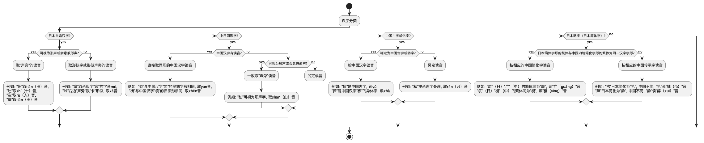
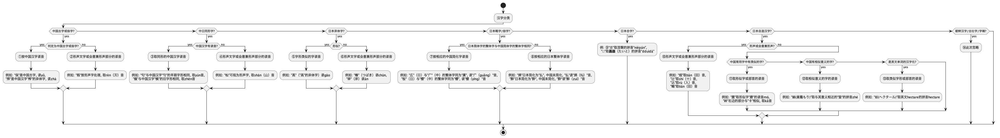

# About the Kokuji
Kokuji, also known as “Japanese kanji characters created in Japan,” are kanji characters that were invented in Japan rather than being imported from China.   
These characters were developed to express concepts, objects, or ideas that were unique to Japanese culture and society. Unlike most kanji, which have their origins in Chinese characters, kokuji were specifically created to meet the linguistic needs of the Japanese language.   
Examples of kokuji include characters such as “峠” (mountain pass), “働” (to work), and “畑” (field). These characters often combine existing kanji components in new ways to create meanings that did not exist in Chinese.

Sources:
- [Kokuji - Wikipedia](https://en.wikipedia.org/wiki/Kokuji)
- [Kokuji: “Made In Japan,” Kanji Edition](https://howto-learn-japanese.blogspot.com/2012/09/kokuji-made-in-japan-kanji-edition.html)
- [Kokuji – Kanji That’s Made In Japan](https://www.lingualift.com/blog/kanji-made-in-japan/)

## How to Determine the Pinyin for Kokuji
The document “日本汉字的汉语读音规范” (i.e. Standard for Chinese Pronunciation of Japanese Kanji) provides guidelines for how to pronounce Japanese kanji in Chinese. 
It categorizes kanji and suggests using Chinese pronunciations where possible, adopting readings from phonetic or semantic components if necessary, and using similar characters when direct readings are not available. 
The following is a flowchart interpreting the 'Standard for Chinese Pronunciation of Japanese Kanji'.

Since there are patterns that do not fit within the ‘Standard for Chinese Pronunciation of Japanese Kanji,’ I expanded the interpretation. The following flowchart was used to determine the pinyin.

# Organized Table of Kokuji
The sources for this table are [字源.net-国字](https://jigen.net/data/%E5%9B%BD%E5%AD%97), [和製漢字の辞典](https://glyphwiki.org/wiki/Group:%e5%92%8c%e8%a3%bd%e6%bc%a2%e5%ad%97%e3%81%ae%e8%be%9e%e5%85%b8) and [国字の字典](https://glyphwiki.org/wiki/Group:%E5%9B%BD%E5%AD%97%E3%81%AE%E5%AD%97%E5%85%B8).  
This table is a transcription of [国字まとめ.xlsx](./国字まとめ.xlsx).

| No   | character  | 読み                              | 拼音                  | 分類          | 構造                   | 字典                                                                     | 字義                                       | 備考                                                                                                                                                                                                                                                      | 字統网                                                                  | 汉辞宝                                                                    | その他1                                                                                                                                                                                                           | その他2                                                          |
| ---- | ---------- | ------------------------------- | -------------------- | ----------- | -------------------- | ---------------------------------------------------------------------- | ---------------------------------------- | ------------------------------------------------------------------------------------------------------------------------------------------------------------------------------------------------------------------------------------------------------- | -------------------------------------------------------------------- | ---------------------------------------------------------------------- | -------------------------------------------------------------------------------------------------------------------------------------------------------------------------------------------------------------- | ------------------------------------------------------------- |
| 1    | 㑨 U+3468   | また                              | yǔ                   | 日本異体字       | ⿰亻⿱口矢                |                                                                        | (1)同「侯」 (異)「俣」的異體字                    | 俣は同じ意味                                                                                                                                                                                                                                                  | [https://zi.tools/zi/%E3%91%A8](https://zi.tools/zi/%E3%91%A8)       | https://www.hancibao.com/zi/3468                                       |                                                                                                                                                                                                                |                                                               |
| 2    | 㒲 U+34B2   | くれる                             | cái                  | 中国古字或俗字     | ⿱入日                  | 康熙字典                                                                   | (2)同「財」                                  |                                                                                                                                                                                                                                                         | [https://zi.tools/zi/%E3%92%B2](https://zi.tools/zi/%E3%92%B2)       | https://www.hancibao.com/zi/34b2                                       |                                                                                                                                                                                                                |                                                               |
| 3    | 㛺 U+36FA   | むかいめ                            | ān                   | 中国古字或俗字     | ⿰女音                  | 康熙字典                                                                   |                                          |                                                                                                                                                                                                                                                         | [https://zi.tools/zi/%E3%9B%BA](https://zi.tools/zi/%E3%9B%BA)       | https://www.hancibao.com/zi/36fa                                       |                                                                                                                                                                                                                |                                                               |
| 4    | 㟢 U+37E2   | さき                              | qí                   | 日本略字（日本简体字） | ⿱山奇                  |                                                                        | (和)同「崎」                                  |                                                                                                                                                                                                                                                         | [https://zi.tools/zi/%E3%9F%A2](https://zi.tools/zi/%E3%9F%A2)       | https://www.hancibao.com/zi/37e2                                       | [https://ctext.org/dictionary.pl?if=en&char=%E3%9F%A2](https://ctext.org/dictionary.pl?if=en&char=%E3%9F%A2)                                                                                                   |                                                               |
| 5    | 㧅 U+39C5   | なた                              | mù,dāo               | 中日同形字       | ⿰扌刀                  | 康熙字典                                                                   | (1)「朷」的讹字 (異)「扐」的異體字                  | 意味が違う。 「朷」は 古书上说的一种树。 「扐」は古代数蓍草占卜，将零数夹在手指中间称“扐”。                                                                                                                                                                                                  | [https://zi.tools/zi/%E3%A7%85](https://zi.tools/zi/%E3%A7%85)       | https://www.hancibao.com/zi/39c5                                       |                                                                                                                                                                                                                |                                                               |
| 6    | 㬺 U+3B3A   | つるぶくろ                           | téng                 | 中国古字或俗字     | ⿰月帣                  | 集篆古文韻海, 增韻                                                             | (K3)「幐」的同形重複字                            |                                                                                                                                                                                                                                                         | [https://zi.tools/zi/%E3%AC%BA](https://zi.tools/zi/%E3%AC%BA)       | https://www.hancibao.com/zi/3b3a                                       |                                                                                                                                                                                                                |                                                               |
| 7    | 㭳 U+3B73   | かけ                              | xiào                 | 日本自造汉字      | ⿰木孝                  |                                                                        |                                          | 難読奇姓辞典。玉㭳(たまかけ)                                                                                                                                                                                                                                         | [https://zi.tools/zi/%E3%AD%B3](https://zi.tools/zi/%E3%AD%B3)       | https://www.hancibao.com/zi/3b73                                       |                                                                                                                                                                                                                |                                                               |
| 8    | 㭷 U+3B77   | おうこ                             | nán                  | 日本自造汉字      | ⿰木男                  |                                                                        |                                          |                                                                                                                                                                                                                                                         | [https://zi.tools/zi/%E3%AD%B7](https://zi.tools/zi/%E3%AD%B7)       | https://www.hancibao.com/zi/3b77                                       |                                                                                                                                                                                                                |                                                               |
| 9    | 㮸 U+3BB8   | くさび                             | sòng                 | 中日同形字       | ⿰木送                  | 康熙字典                                                                   | (1)「𠌡」的讹字                               | 𠌡は送と同一なので意味的に違う。 ただ、すでに中国に漢字があるので、その読みを使用する                                                                                                                                                                                                         | [https://zi.tools/zi/%E3%AE%B8](https://zi.tools/zi/%E3%AE%B8)       | https://www.hancibao.com/zi/3bb8                                       |                                                                                                                                                                                                                |                                                               |
| 10   | 㶱 U+3DB1   | ほ                               | běn                  | 日本自造汉字      | ⿰火本                  |                                                                        |                                          | 難読奇姓辞典。答㶱(たほ)                                                                                                                                                                                                                                           | [https://zi.tools/zi/%E3%B6%B1](https://zi.tools/zi/%E3%B6%B1)       | https://www.hancibao.com/zi/3db1                                       |                                                                                                                                                                                                                |                                                               |
| 11   | 㽗 U+3F57   | うね                              | mǔ                   | 日本異体字       | ⿰田人                  |                                                                        | (異)「畝」的異體字                               |                                                                                                                                                                                                                                                         | [https://zi.tools/zi/%E3%BD%97](https://zi.tools/zi/%E3%BD%97)       | https://www.hancibao.com/zi/3f57                                       |                                                                                                                                                                                                                |                                                               |
| 12   | 䅋 U+414B   | はん                              | wǎn                  | 中国古字或俗字     | ⿰禾免                  | 康熙字典                                                                   |                                          |                                                                                                                                                                                                                                                         | [https://zi.tools/zi/%E4%85%8B](https://zi.tools/zi/%E4%85%8B)       | https://www.hancibao.com/zi/414b                                       |                                                                                                                                                                                                                |                                                               |
| 13   | 䆠 U+41A0   | みやずかい                           | huàn                 | 中国古字或俗字     | ⿱穴臣                  | 康熙字典                                                                   | (1)同「宦」                                  | 日中で同じ意味。 日本語の意味は、「宮仕（みやずかい）」と同じ。                                                                                                                                                                                                                     | [https://zi.tools/zi/%E4%86%A0](https://zi.tools/zi/%E4%86%A0)       | https://www.hancibao.com/zi/41a0                                       |                                                                                                                                                                                                                |                                                               |
| 14   | 䋆 U+42C6   | かせ                              | lú                   | 日本略字（日本简体字） | ⿰糸户                  |                                                                        | (JA4)「纑」的簡化字                             |                                                                                                                                                                                                                                                         | [https://zi.tools/zi/%E4%8B%86](https://zi.tools/zi/%E4%8B%86)       | https://www.hancibao.com/zi/42c6                                       |                                                                                                                                                                                                                |                                                               |
| 15   | 䌂 U+4302   | ゆる                              | òu                   | 中日同形字       | ⿰糸屋                  | 集篆古文韻海, 康熙字典                                                           | (1)同「握」                                  | 日本姓氏大辞典。䌂見(ゆるみ) 意味が同じか不明だが康熙字典にあるので同形字とする。                                                                                                                                                                                                           | [https://zi.tools/zi/%E4%8C%82](https://zi.tools/zi/%E4%8C%82)       | https://www.hancibao.com/zi/4302                                       |                                                                                                                                                                                                                |                                                               |
| 16   | 䓔 U+44D4   | こも                              | xiào                 | 日本自造汉字      | ⿱艹孝                  |                                                                        |                                          |                                                                                                                                                                                                                                                         | [https://zi.tools/zi/%E4%93%94](https://zi.tools/zi/%E4%93%94)       | https://www.hancibao.com/zi/44d4                                       |                                                                                                                                                                                                                |                                                               |
| 17   | 䓪 U+44EA   | さきくさ                            | yì                   | 日本自造汉字      | ⿱艹易                  |                                                                        |                                          |                                                                                                                                                                                                                                                         | https://zi.tools/zi/%E4%93%AA                                        | https://www.hancibao.com/zi/44ea                                       |                                                                                                                                                                                                                |                                                               |
| 18   | 䓯 U+44EF   | トク                              | dú                   | 中日同形字       | ⿱艹毒                  | 集篆古文韻海, 康熙字典                                                           | (1)同「𦺇」                                 | 意味が同じか不明だが康熙字典にあるので同形字とする。 国字の辞典に記載なし。                                                                                                                                                                                                               | [https://zi.tools/zi/%E4%93%AF](https://zi.tools/zi/%E4%93%AF)       | https://www.hancibao.com/zi/44ef                                       |                                                                                                                                                                                                                |                                                               |
| 19   | 䔒 U+4512   | つぼな                             | bèi                  | 中日同形字       | ⿱艹陪                  | 康熙字典                                                                   | (異)「菩」的異體字                               | 意味的に違うがすでに中国に漢字があるので、その読みを使用する 日本での意味は「茅花（つぼな）」のこと。茅(ちがや)のこと。 中国での意味は菩提樹のこと。                                                                                                                                                                      | https://zi.tools/zi/%E4%94%92                                        | https://www.hancibao.com/zi/4512                                       |                                                                                                                                                                                                                |                                                               |
| 20   | 䔧 U+4527   | ムクラ,むぐら,むくら                     | lí                   | 中日同形字       | ⿱艹梨                  |                                                                        | (異)「䔣」的異體字                               | 意味的に違うがすでに中国に異体字として扱われているので、その読みを使用する 日本語の意味は、「葎（むぐら）」と同じ。 中国語の䔣は意味は、[新䔣]古部族名                                                                                                                                                                     | https://zi.tools/zi/%E4%94%A7                                        | https://www.hancibao.com/zi/4527                                       |                                                                                                                                                                                                                |                                                               |
| 21   | 䕷 U+4577   | こやおぎ,おぎ                         | mí                   | 日本自造汉字      | ⿱艹縻                  |                                                                        |                                          | 意味が同じ 日本語では「頭巾薔薇（ときんいばら）」-和漢三才図会。 中国語では荼䕷                                                                                                                                                                                                         | https://zi.tools/zi/%E4%95%B7                                        | https://www.hancibao.com/zi/4577                                       | https://ctext.org/dictionary.pl?if=en&char=%E4%95%B7                                                                                                                                                           |                                                               |
| 22   | 䗎 U+45CE   | まてがい                            | yān                  | 中日同形字       | ⿰虫垔                  | 康熙字典                                                                   |                                          | 意味的に違うがすでに中国に漢字があるので、その読みを使用する。 中国側では一种虫としか書いてない。                                                                                                                                                                                                    | [https://zi.tools/zi/%E4%97%8E](https://zi.tools/zi/%E4%97%8E)       | https://www.hancibao.com/zi/45ce                                       |                                                                                                                                                                                                                |                                                               |
| 23   | 䗳 U+45F3   | ひおむし                            | dēng,dé              | 日本自造汉字      | ⿰虫登                  |                                                                        |                                          |                                                                                                                                                                                                                                                         | https://zi.tools/zi/%E4%97%B3                                        | https://www.hancibao.com/zi/45f3                                       |                                                                                                                                                                                                                |                                                               |
| 24   | 䢽 U+48BD   | むら                              | xiàng                | 中国古字或俗字     | ⿱共邑                  | 古文四聲韻,康熙字典                                                             | (1)同「巷」                                  | 日本的な意味としては邑だが、意味としては近い。康熙字典にある。                                                                                                                                                                                                                         | https://zi.tools/zi/%E4%A2%BD                                        | https://www.hancibao.com/zi/48bd                                       |                                                                                                                                                                                                                |                                                               |
| 25   | 䤠 U+4920   | もちきり                            | zhǐ                  | 日本自造汉字      | ⿰金止                  |                                                                        | (1)化学元素「鍺」的旧译                            | 化学元素「鍺」的旧译って書いてあるが、中国側の文献に見つけられず自造字とする                                                                                                                                                                                                                  | https://zi.tools/zi/%E4%A4%A0                                        | https://www.hancibao.com/zi/4920                                       |                                                                                                                                                                                                                |                                                               |
| 26   | 䤲 U+4932   | さび                              | chì                  | 日本自造汉字      | ⿰金赤                  |                                                                        | (1)化学元素「鍶」的旧译                            | 化学元素「鍶」的旧译って書いてあるが、中国側の文献に見つけられず自造字とする                                                                                                                                                                                                                  | https://zi.tools/zi/%E4%A4%B2                                        | https://www.hancibao.com/zi/4932                                       | https://adeac.jp/tako-town/texthtml/d100010/mp000010-100010/ht300070                                                                                                                                           |                                                               |
| 27   | 䦎 U+498E   | コウ,カン                           | guǎn,kàng            | 中日同形字       | ⿵門元                  | 康熙字典                                                                   | (1)同「𨵄」 (異)「閌」的異體字                   | 意味が同じか不明だが康熙字典にあるので同形字とする。 国字の辞典に記載なし。                                                                                                                                                                                                               | https://zi.tools/zi/%E4%A6%8E                                        | https://www.hancibao.com/zi/498e                                       |                                                                                                                                                                                                                |                                                               |
| 28   | 䭮 U+4B6E   | ぬかかみ                            | fú                   | 中日同形字       | ⿱髟首                  | 廣韻, 康熙字典                                                               |                                          | 意味は違うが、中国側に漢字があるので同形字とする。 日本側の意味は「額髪（ぬかかみ）」と同じ-倭玉篇。 中国側の意味は妇女的首饰                                                                                                                                                                                  | https://zi.tools/zi/%E4%AD%AE                                        | [https://www.hancibao.com/zi/4b6e](https://www.hancibao.com/zi/4b6e)   |                                                                                                                                                                                                                |                                                               |
| 29   | 䰳 U+4C33   | じょう                             | dīng,zhēng           | 日本自造汉字      | ⿰魚丁                  |                                                                        |                                          |                                                                                                                                                                                                                                                         | https://zi.tools/zi/%E4%B0%B3                                        | https://www.hancibao.com/zi/4c33                                       |                                                                                                                                                                                                                |                                                               |
| 30   | 䱩 U+4C69   | ゴンズイ,はっきりしない,カジカ,ゴリ,からかこ,ギギ     | wǎng                 | 日本自造汉字      | ⿰魚罔                  |                                                                        |                                          |                                                                                                                                                                                                                                                         | https://zi.tools/zi/%E4%B1%A9                                        | https://www.hancibao.com/zi/4c69                                       |                                                                                                                                                                                                                |                                                               |
| 31   | 䲈 U+4C88   | はも                              | má                   | 日本自造汉字      | ⿰魚麻                  |                                                                        | (汉字海)同「蟆」                                |                                                                                                                                                                                                                                                         | https://zi.tools/zi/%E4%B2%88                                        | https://www.hancibao.com/zi/4c88                                       |                                                                                                                                                                                                                |                                                               |
| 32   | 丼 U+4E3C   | どんぶり                            | jǐng,dǎn             | 日本自造汉字      | ⿴井丶                  | 廣韻, 康熙字典                                                               | (1)同「井」                                  |                                                                                                                                                                                                                                                         | https://zi.tools/zi/%E4%B8%BC                                        | https://www.hancibao.com/zi/4e3c                                       |                                                                                                                                                                                                                |                                                               |
| 33   | 乄 U+4E44   | しめ                              | wǔ                   | 日本自造汉字      | ⿻㇢丶                  |                                                                        |                                          |                                                                                                                                                                                                                                                         | https://zi.tools/zi/%E4%B9%84                                        | https://www.hancibao.com/zi/4e44                                       |                                                                                                                                                                                                                |                                                               |
| 34   | 乢 U+4E62   | たわ                              | gài                  | 中日同形字       | ⿰山乚                  | 康熙字典                                                                   | (異)「蓋」的異體字 (異)「蓋」的異體字                 | 意味は違うが、中国側に漢字があるので同形字とする。 「乢（たわ）」とは峠のこと。鳥取県岩美郡岩美町高住字乢（たわ）。岡山県英田郡作東町大字白水字宮ノ乢（みやのたわ）。                                                                                                                                                                  | https://zi.tools/zi/%E4%B9%A2                                        | https://www.hancibao.com/zi/4e62                                       |                                                                                                                                                                                                                |                                                               |
| 35   | 仐 U+4ED0   | さん                              | sǎn                  | 日本自造汉字      | ⿱人十                  |                                                                        | (汉字海)同「傘」 (汉字海)同「今」                   | 国字の辞典には未記載。                                                                                                                                                                                                                                             | https://zi.tools/zi/%E4%BB%90                                        | https://www.hancibao.com/zi/4ed0                                       |                                                                                                                                                                                                                |                                                               |
| 36   | 伕 U+4F15   | せ                               | fū                   | 中国古字或俗字     | ⿰亻夫                  | 康熙字典                                                                   | (1)同「夫」                                  | 「せ、つま、おっと」とあるので夫と同じっぽい。康熙字典にある。                                                                                                                                                                                                                         | https://zi.tools/zi/%E4%BC%95                                        | https://www.hancibao.com/zi/4f15                                       |                                                                                                                                                                                                                |                                                               |
| 37   | 佦 U+4F66   | かどいし                            | shī                  | 中日同形字       | ⿰亻石                  |                                                                        | (汉字海)同「佑」                                | 意味的に違うがすでに中国に異体字として扱われているので、その読みを使用する 国字の辞典には未記載。 日本語の意味は、石の名前。                                                                                                                                                                                   | https://zi.tools/zi/%E4%BD%A6                                        | https://www.hancibao.com/zi/4f66                                       |                                                                                                                                                                                                                |                                                               |
| 38   | 価 U+4FA1   | あたい                             | sì,jià               | 日本略字（日本简体字） | ⿰亻覀                  |                                                                        | (異)「似」的異體字 (異)「價」的異體字                 |                                                                                                                                                                                                                                                         | https://zi.tools/zi/%E4%BE%A1                                        | https://www.hancibao.com/zi/4fa1                                       |                                                                                                                                                                                                                |                                                               |
| 39   | 侤 U+4FA4   | はたらく                            | ta,kǎo               | 日本自造汉字      | ⿰亻考                  |                                                                        |                                          | 國語辭典に(ta ㄊㄚ)、kǎo の記述あり                                                                                                                                                                                                                                  | https://zi.tools/zi/%E4%BE%A4                                        | https://www.hancibao.com/zi/4fa4                                       |                                                                                                                                                                                                                |                                                               |
| 40   | 俣 U+4FE3   | また                              | yǔ                   | 中国古字或俗字     | ⿰亻吴                  | 廣韻,增韻,洪武正韻,康熙字典                                                        |                                          |                                                                                                                                                                                                                                                         | https://zi.tools/zi/%E4%BF%A3                                        | https://www.hancibao.com/zi/4fe3                                       |                                                                                                                                                                                                                |                                                               |
| 41   | 俤 U+4FE4   | おもかげ                            | dì                   | 中日同形字       | ⿰亻弟                  | 包山, 九店, 上博                                                             | (統)楚簡隸定字，同「悌」                            | 意味的に違うがすでに中国に漢字があるので、その読みを使用する 悌の意味は敬爱哥哥                                                                                                                                                                                                             | https://zi.tools/zi/%E4%BF%A4                                        | https://www.hancibao.com/zi/4fe4                                       |                                                                                                                                                                                                                |                                                               |
| 42   | 俥 U+4FE5   | くるま                             | chē,jū               | 日本自造汉字      | ⿰亻車                  |                                                                        |                                          |                                                                                                                                                                                                                                                         | https://zi.tools/zi/%E4%BF%A5                                        | https://www.hancibao.com/zi/4fe5                                       | https://moji.or.jp/mojikibansearch/info?MJ%E6%96%87%E5%AD%97%E5%9B%B3%E5%BD%A2%E5%90%8D=MJ006792                                                                                                               |                                                               |
| 43   | 俧 U+4FE7   | たしなみ                            | zhì                  | 日本自造汉字      | ⿰亻志                  |                                                                        |                                          |                                                                                                                                                                                                                                                         | https://zi.tools/zi/%E4%BF%A7                                        | https://www.hancibao.com/zi/4fe7                                       |                                                                                                                                                                                                                |                                                               |
| 44   | 偑 U+5051   | あだ                              | fēng                 | 中国古字或俗字     | ⿰亻風                  | 張家山, 廣韻, 康熙字典                                                          |                                          |                                                                                                                                                                                                                                                         | https://zi.tools/zi/%E5%81%91                                        | https://www.hancibao.com/zi/5051                                       |                                                                                                                                                                                                                |                                                               |
| 45   | 働 U+50CD   | はたらく,はたらき                       | dòng                 | 日本自造汉字      | ⿰亻動                  |                                                                        |                                          |                                                                                                                                                                                                                                                         | https://zi.tools/zi/%E5%83%8D                                        | https://www.hancibao.com/zi/50cd                                       |                                                                                                                                                                                                                |                                                               |
| 46   | 凧 U+51E7   | たこ                              | zhēng                | 日本自造汉字      | ⿵几巾                  |                                                                        |                                          | たぶん风筝から音を取ってる                                                                                                                                                                                                                                           | https://zi.tools/zi/%E5%87%A7                                        | https://www.hancibao.com/zi/51e7                                       | https://cjjc.weblio.jp/content/%E9%A3%8E%E7%AD%9D                                                                                                                                                              |                                                               |
| 47   | 凩 U+51E9   | こがらし                            | mù                   | 日本自造汉字      | ⿵几木                  |                                                                        |                                          |                                                                                                                                                                                                                                                         | https://zi.tools/zi/%E5%87%A9                                        | https://www.hancibao.com/zi/51e9                                       |                                                                                                                                                                                                                |                                                               |
| 48   | 凪 U+51EA   | なぎ,なぐ                           | zhǐ                  | 日本自造汉字      | ⿵几止                  |                                                                        |                                          |                                                                                                                                                                                                                                                         | https://zi.tools/zi/%E5%87%AA                                        | https://www.hancibao.com/zi/51ea                                       |                                                                                                                                                                                                                |                                                               |
| 49   | 凮 U+51EE   | フウ                              | fēng                 | 日本異体字       | ⿵几百                  |                                                                        | (1)同「風」                                  |                                                                                                                                                                                                                                                         | https://zi.tools/zi/%E5%87%AE                                        | https://www.hancibao.com/zi/51ee                                       |                                                                                                                                                                                                                |                                                               |
| 50   | 勊 U+52CA   | かつ                              | kè                   | 日本異体字       | ⿺克力                  |                                                                        | (異)「剋」的異體字                               | 「剋（かつ）」と同じ。大字典・国字                                                                                                                                                                                                                                       | https://zi.tools/zi/%E5%8B%8A                                        | https://www.hancibao.com/zi/52ca                                       |                                                                                                                                                                                                                |                                                               |
| 51   | 匁 U+5301   | もんめ                             | qián                 | 日本自造汉字      | ⿻⿹勹丿乀                |                                                                        |                                          |                                                                                                                                                                                                                                                         | https://zi.tools/zi/%E5%8C%81                                        | https://www.hancibao.com/zi/5301                                       | https://note.com/qvarie/n/n06d81a986054                                                                                                                                                                        |                                                               |
| 52   | 匂 U+5302   | におう,にほう,におい                     | xiōng,yún            | 日本自造汉字      | ⿹勹匕                  |                                                                        |                                          |                                                                                                                                                                                                                                                         | https://zi.tools/zi/%E5%8C%82                                        | https://www.hancibao.com/zi/5302                                       | https://zh.wikisource.org/wiki/%E6%97%A5%E6%9C%AC%E6%B1%89%E5%AD%97%E7%9A%84%E6%B1%89%E8%AF%AD%E8%AF%BB%E9%9F%B3%E8%A7%84%E8%8C%83%EF%BC%88%E8%8D%89%E6%A1%88%EF%BC%89                                         |                                                               |
| 53   | 匇 U+5307   | あわてる,いそがしい                      | cōng                 | 日本異体字       | ⿹勹夕                  |                                                                        | (1)同「匆」                                  |                                                                                                                                                                                                                                                         | https://zi.tools/zi/%E5%8C%87                                        | https://www.hancibao.com/zi/5307                                       |                                                                                                                                                                                                                |                                                               |
| 54   | 厶 U+53B6   | ござる                             | sī,mǒu               | 中日同形字       | ⿸𠃋丶;⿸𠄌丶            | 戰國中期或晚期金文, 戰國晚期金文, 戰國金文, 望山, 包山, 郭店, 上博, 汗簡,古文四聲韻,三體陰符經,集篆古文韻海,廣韻,康熙字典 | (1)同「私」 (2)同「某」                       | 意味的に違うがすでに中国に漢字があるので、その読みを使用する “私”的古字。                                                                                                                                                                                                               | https://zi.tools/zi/%E5%8E%B6                                        | https://www.hancibao.com/zi/53b6                                       |                                                                                                                                                                                                                |                                                               |
| 55   | 叺 U+53FA   | セキ,かます                          | chǐ                  | 中日同形字       | ⿰口入                  | 康熙字典                                                                   |                                          | 意味的に違うがすでに中国に漢字があるので、その読みを使用する 日本語では穀物や塩、石炭などをいれる藁むしろのこと。「かまけ」のこと。-漢字の研究・和作 中国語では 口气语，无定义。なので意味はない。                                                                                                                                               | https://zi.tools/zi/%E5%8F%BA                                        | https://www.hancibao.com/zi/53fa                                       |                                                                                                                                                                                                                |                                                               |
| 56   | 吋 U+540B   | インチ                             | cùn,dòu, yīngcùn     | 中国古字或俗字     | ⿰口寸                  | 康熙字典                                                                   | (1)叱                                     | 「叱」と同一。ただ、インチという意味もある。                                                                                                                                                                                                                                  | https://zi.tools/zi/%E5%90%8B                                        | https://www.hancibao.com/zi/540b                                       |                                                                                                                                                                                                                |                                                               |
| 57   | 听 U+542C   | ポンド                             | tīng,yǐn,yí          | 中国古字或俗字     | ⿰口斤                  | 廣韻,增韻,洪武正韻,康熙字典                                                        | (6)同「聽」                                  | 「 聽」の略字                                                                                                                                                                                                                                                 | https://zi.tools/zi/%E5%90%AC                                        | https://www.hancibao.com/zi/542c                                       |                                                                                                                                                                                                                |                                                               |
| 58   | 呎 U+544E   | セキ,フィート                         | chǐ                  | 日本自造汉字      | ⿰口尺                  |                                                                        |                                          |                                                                                                                                                                                                                                                         | https://zi.tools/zi/%E5%91%8E                                        | https://www.hancibao.com/zi/544e                                       |                                                                                                                                                                                                                |                                                               |
| 59   | 呏 U+544F   | ショウ,ガロン                         | shēng                | 日本自造汉字      | ⿰口升                  |                                                                        |                                          |                                                                                                                                                                                                                                                         | https://zi.tools/zi/%E5%91%8F                                        | https://www.hancibao.com/zi/544f                                       |                                                                                                                                                                                                                |                                                               |
| 60   | 咑 U+5491   | ダース                             | dā                   | 中日同形字       | ⿰口打                  | 康熙字典                                                                   |                                          | 意味的に違うがすでに中国に漢字があるので、その読みを使用する 中国語の意味は、吆喝牲口前进的声音，也称“驾”！                                                                                                                                                                                              | https://zi.tools/zi/%E5%92%91                                        | https://www.hancibao.com/zi/5491                                       |                                                                                                                                                                                                                |                                                               |
| 61   | 咜 U+549C   | た,しかる                           | ta                   | 日本自造汉字      | ⿰口它                  |                                                                        |                                          |                                                                                                                                                                                                                                                         | https://zi.tools/zi/%E5%92%9C                                        | https://www.hancibao.com/zi/549c                                       |                                                                                                                                                                                                                |                                                               |
| 62   | 哘 U+54D8   | さそ,さそう                          | xíng                 | 日本自造汉字      | ⿰口行                  |                                                                        |                                          | 古壮字でもあるかも                                                                                                                                                                                                                                               | https://zi.tools/zi/%E5%93%98                                        | https://www.hancibao.com/zi/54d8                                       |                                                                                                                                                                                                                |                                                               |
| 63   | 哩 U+54E9   | マイル                             | lī,li,lì,lǐ,mái,yīng | 中日同形字       | ⿰口里                  | 康熙字典                                                                   |                                          | 意味的に違うがすでに中国に漢字があるので、その読みを使用する 中国語の意味は、助词，义同“呢”,“啦”。                                                                                                                                                                                                 | https://zi.tools/zi/%E5%93%A9                                        | https://www.hancibao.com/zi/54e9                                       |                                                                                                                                                                                                                |                                                               |
| 64   | 唀 U+5500   | さばき                             | yòu                  | 中日同形字       | ⿰口秀                  | 康熙字典                                                                   | 《新华字典》, 《中华字海》 , 《汉语大字典》古同“诱”。           | 意味的に違うがすでに中国に漢字があるので、その読みを使用する 国字の辞典には未記載                                                                                                                                                                                                            | https://zi.tools/zi/%E5%94%80                                        | https://www.hancibao.com/zi/5500                                       |                                                                                                                                                                                                                |                                                               |
| 65   | 唣 U+5523   | わ                               | zào                  | 日本異体字       | ⿰口皂                  |                                                                        |                                          | 囉唣（さわ）ぐ。日中で意味が同じ                                                                                                                                                                                                                                        | https://zi.tools/zi/%E5%94%A3                                        | https://www.hancibao.com/zi/5523                                       |                                                                                                                                                                                                                |                                                               |
| 66   | 啢 U+5562   | オンス                             | liǎng,yīng           | 日本自造汉字      | ⿰口兩                  |                                                                        |                                          |                                                                                                                                                                                                                                                         | https://zi.tools/zi/%E5%95%A2                                        | https://www.hancibao.com/zi/5562                                       | https://moji.or.jp/mojikibansearch/info?MJ%E6%96%87%E5%AD%97%E5%9B%B3%E5%BD%A2%E5%90%8D=MJ008410                                                                                                               |                                                               |
| 67   | 喰 U+55B0   | くらう                             | cān,sūn,qī           | 中国古字或俗字     | ⿰口食                  | 康熙字典                                                                   | (1)同「餐」 (2)同「飧」                       | 古同“餐”、古同“飧”                                                                                                                                                                                                                                             | https://zi.tools/zi/%E5%96%B0                                        | https://www.hancibao.com/zi/55b0                                       |                                                                                                                                                                                                                |                                                               |
| 68   | 喼 U+55BC   | きゅう                             | jiē                  | 日本自造汉字      | ⿰口急                  |                                                                        |                                          |                                                                                                                                                                                                                                                         | https://zi.tools/zi/%E5%96%BC                                        | https://www.hancibao.com/zi/55bc                                       |                                                                                                                                                                                                                |                                                               |
| 69   | 嘇 U+5607   | ものまう                            | shān,càn,shěn        | 中日同形字       | ⿰口參                  | 康熙字典                                                                   |                                          | 意味的に違うがすでに中国に漢字があるので、その読みを使用する 国字の辞典には未記載。 日本語の意味としては、他人の家を訪問して案内をこうときにいう語。「もの－まう (物申)」。 中国語の意味は、噤嘇，意思是瑟缩寒战貌                                                                                                                                   | https://zi.tools/zi/%E5%98%87                                        | https://www.hancibao.com/zi/5607                                       |                                                                                                                                                                                                                |                                                               |
| 70   | 噸 U+5678   | トン,とん                           | dūn                  | 日本自造汉字      | ⿰口頓                  |                                                                        |                                          |                                                                                                                                                                                                                                                         | https://zi.tools/zi/%E5%99%B8                                        | https://www.hancibao.com/zi/5678                                       |                                                                                                                                                                                                                |                                                               |
| 71   | 噺 U+567A   | はなし                             | xīn                  | 日本自造汉字      | ⿰口新                  |                                                                        |                                          |                                                                                                                                                                                                                                                         | https://zi.tools/zi/%E5%99%BA                                        | https://www.hancibao.com/zi/567a                                       |                                                                                                                                                                                                                |                                                               |
| 72   | 囎 U+56CE   | そ                               | zèng                 | 日本自造汉字      | ⿰口贈                  |                                                                        |                                          |                                                                                                                                                                                                                                                         | https://zi.tools/zi/%E5%9B%8E                                        | https://www.hancibao.com/zi/56ce                                       |                                                                                                                                                                                                                |                                                               |
| 73   | 国 U+56FD   | くに                              | guó                  | 中国古字或俗字     | ⿴囗玉                  | 康熙字典                                                                   |                                          |                                                                                                                                                                                                                                                         | https://zi.tools/zi/%E5%9B%BD                                        | https://www.hancibao.com/zi/56fd                                       |                                                                                                                                                                                                                |                                                               |
| 74   | 圦 U+5726   | いり                              | kuài                 | 日本自造汉字      | ⿰土入                  |                                                                        | 《國語辭典》同“塊”                               |                                                                                                                                                                                                                                                         | https://zi.tools/zi/%E5%9C%A6                                        | https://www.hancibao.com/zi/5726                                       |                                                                                                                                                                                                                |                                                               |
| 75   | 圷 U+5737   | あくつ                             | xià                  | 日本自造汉字      | ⿰土下                  |                                                                        |                                          |                                                                                                                                                                                                                                                         | https://zi.tools/zi/%E5%9C%B7                                        | https://www.hancibao.com/zi/5737                                       |                                                                                                                                                                                                                |                                                               |
| 76   | 圸 U+5738   | まま                              | shān                 | 日本自造汉字      | ⿰土山                  |                                                                        |                                          |                                                                                                                                                                                                                                                         | https://zi.tools/zi/%E5%9C%B8                                        | https://www.hancibao.com/zi/5738                                       |                                                                                                                                                                                                                |                                                               |
| 77   | 垈 U+5788   | ぬた                              | dài                  | 日本自造汉字      | ⿱代土                  |                                                                        |                                          |                                                                                                                                                                                                                                                         | https://zi.tools/zi/%E5%9E%88                                        | https://www.hancibao.com/zi/5788                                       |                                                                                                                                                                                                                |                                                               |
| 78   | 垉 U+5789   | くずる                             | páo,bāo              | 日本自造汉字      | ⿰土包                  |                                                                        |                                          | 國語辭典に(páo ㄆㄠˊ)、bāo の記述あり                                                                                                                                                                                                                                | https://zi.tools/zi/%E5%9E%89                                        | https://www.hancibao.com/zi/5789                                       |                                                                                                                                                                                                                |                                                               |
| 79   | 垪 U+57AA   | は                               | bìng                 | 中国古字或俗字     | ⿰土并                  | 信陽                                                                     | (1)同「墻」                                  |                                                                                                                                                                                                                                                         | https://zi.tools/zi/%E5%9E%AA                                        | https://www.hancibao.com/zi/57aa                                       |                                                                                                                                                                                                                |                                                               |
| 80   | 垬 U+57AC   | ぬかり                             | hóng                 | 日本自造汉字      | ⿰土共                  |                                                                        |                                          | 國語辭典に(hóng ㄏㄨㄥˊ) の記述あり                                                                                                                                                                                                                                  | https://zi.tools/zi/%E5%9E%AC                                        | https://www.hancibao.com/zi/57ac                                       |                                                                                                                                                                                                                |                                                               |
| 81   | 垰 U+57B0   | たお                              | kǎ                   | 日本自造汉字      | ⿰土𠧗                 |                                                                        |                                          |                                                                                                                                                                                                                                                         | https://zi.tools/zi/%E5%9E%B0                                        | https://www.hancibao.com/zi/57b0                                       |                                                                                                                                                                                                                |                                                               |
| 82   | 垳 U+57B3   | がけ                              | háng                 | 日本自造汉字      | ⿰土行                  |                                                                        |                                          | 國語辭典に(háng ㄏㄤˊ)の記述あり                                                                                                                                                                                                                                    | https://zi.tools/zi/%E5%9E%B3                                        | https://www.hancibao.com/zi/57b3                                       |                                                                                                                                                                                                                |                                                               |
| 83   | 埖 U+57D6   | ごみ                              | huā                  | 日本自造汉字      | ⿰土花                  |                                                                        |                                          |                                                                                                                                                                                                                                                         | https://zi.tools/zi/%E5%9F%96                                        | https://www.hancibao.com/zi/57d6                                       |                                                                                                                                                                                                                |                                                               |
| 84   | 堓 U+5813   | くま                              | àn                   | 日本異体字       | ⿰土岸                  |                                                                        | (1)同「岸」                                  |                                                                                                                                                                                                                                                         | https://zi.tools/zi/%E5%A0%93                                        | https://www.hancibao.com/zi/5813                                       |                                                                                                                                                                                                                |                                                               |
| 85   | 塀 U+5840   | へい,ヘイ                           | píng                 | 日本自造汉字      | ⿰土屏                  |                                                                        |                                          |                                                                                                                                                                                                                                                         | https://zi.tools/zi/%E5%A1%80                                        | https://www.hancibao.com/zi/5840                                       |                                                                                                                                                                                                                |                                                               |
| 86   | 塰 U+5870   | あま                              | hǎi                  | 日本自造汉字      | ⿱海土                  |                                                                        |                                          |                                                                                                                                                                                                                                                         | https://zi.tools/zi/%E5%A1%B0                                        | https://www.hancibao.com/zi/5870                                       |                                                                                                                                                                                                                |                                                               |
| 87   | 墋 U+588B   | ほこり                             | chěn                 | 中日同形字       | ⿰土參                  | 廣韻, 增韻, 洪武正韻, 康熙字典                                                     |                                          | 意味的に違うがすでに中国に漢字があるので、その読みを使用する。 ホコリと土なので意味的には近い。 《玉篇•土部》：“墋，土也。”                                                                                                                                                                                  | https://zi.tools/zi/%E5%A2%8B                                        | https://www.hancibao.com/zi/588b                                       |                                                                                                                                                                                                                |                                                               |
| 88   | 墸 U+58B8   | ふむ,チョ,ト                         | zhù                  | 日本自造汉字      | ⿰土著                  |                                                                        | (1)同「躇」                                  |                                                                                                                                                                                                                                                         | https://zi.tools/zi/%E5%A2%B8                                        | https://www.hancibao.com/zi/58b8                                       |                                                                                                                                                                                                                |                                                               |
| 89   | 墹 U+58B9   | きたの,まま                          | jiàn                 | 日本自造汉字      | ⿰土間                  |                                                                        |                                          | 國語辭典に(jiàn ㄐㄧㄢˋ)の記述あり                                                                                                                                                                                                                                   | https://zi.tools/zi/%E5%A2%B9                                        | https://www.hancibao.com/zi/58b9                                       |                                                                                                                                                                                                                |                                                               |
| 90   | 壗 U+58D7   | まま                              | jìn                  | 中日同形字       | ⿰土盡                  | 廣韻                                                                     |                                          | 意味が違うが中国の漢字があるので、同形字とする。 日本語の意味は、傾斜のある土地。地名に用いられる字。「壗下（まました）」は神奈川県の地名。 中国語の意味は、义未详                                                                                                                                                                | https://zi.tools/zi/%E5%A3%97                                        | https://www.hancibao.com/zi/58d7                                       |                                                                                                                                                                                                                |                                                               |
| 91   | 奀 U+5940   | ひよわし                            | ēn                   | 中日同形字       | ⿱不大                  | 康熙字典                                                                   |                                          | 意味が同じか不明だが康熙字典にあるので同形字とする。 国字の辞典に記載なし。                                                                                                                                                                                                               | https://zi.tools/zi/%E5%A5%80                                        | https://www.hancibao.com/zi/5940                                       |                                                                                                                                                                                                                |                                                               |
| 92   | 妋 U+598B   | せ                               | fū,yōu               | 中日同形字       | ⿰女夫                  | 廣韻, 康熙字典                                                               |                                          | 意味的に違うがすでに中国に漢字があるので、その読みを使用する 日本語の意味は女から兄弟・恋人・夫などの男を親しんで呼ぶ語-国字考・国字 中国語の意味は《玉篇》：妋，贪貌。                                                                                                                                                             | https://zi.tools/zi/%E5%A6%8B                                        | https://www.hancibao.com/zi/598b                                       |                                                                                                                                                                                                                |                                                               |
| 93   | 妛 U+599B   | シ                               | chī                  | 中国古字或俗字     | ⿱㞢女                  | 廣韻, 增韻, 洪武正韻, 康熙字典                                                     | (1)同「媸」                                  | 古同“媸。𡚴の誤字                                                                                                                                                                                                                                              | https://zi.tools/zi/%E5%A6%9B                                        | https://www.hancibao.com/zi/599b                                       | https://ja.wiktionary.org/wiki/%E5%A6%9B                                                                                                                                                                       |                                                               |
| 94   | 娚 U+5A1A   | ナン,ノウ,ドウ                        | nán                  | 中日同形字       | ⿰女男                  | 康熙字典                                                                   |                                          | 意味が同じか不明だが康熙字典にあるので同形字とする。 国字の辞典に記載なし。                                                                                                                                                                                                               | https://zi.tools/zi/%E5%A8%9A                                        | https://www.hancibao.com/zi/5a1a                                       |                                                                                                                                                                                                                |                                                               |
| 95   | 婇 U+5A47   | サイ,うねめ,ウネメ,ウネベ                  | cǎi                  | 中国古字或俗字     | ⿰女采                  | 康熙字典                                                                   |                                          | 康熙字典にある。意味もほぼ同じ。                                                                                                                                                                                                                                        | https://zi.tools/zi/%E5%A9%87                                        | https://www.hancibao.com/zi/5a47                                       |                                                                                                                                                                                                                |                                                               |
| 96   | 婲 U+5A72   | だて                              | huā                  | 日本自造汉字      | ⿰女花                  |                                                                        |                                          |                                                                                                                                                                                                                                                         | https://zi.tools/zi/%E5%A9%B2                                        | https://www.hancibao.com/zi/5a72                                       |                                                                                                                                                                                                                |                                                               |
| 97   | 嫏 U+5ACF   | むすめ                             | láng                 | 中日同形字       | ⿰女郎                  | 康熙字典                                                                   |                                          | 意味的に違うがすでに中国に漢字があるので、その読みを使用する 中国語の意味は 〔～嬛〕神话中天帝藏书的地方。                                                                                                                                                                                               | https://zi.tools/zi/%E5%AB%8F                                        | https://www.hancibao.com/zi/5acf                                       |                                                                                                                                                                                                                |                                                               |
| 98   | 嬶 U+5B36   | かか,かかあ                          | bí                   | 日本自造汉字      | ⿰女鼻                  |                                                                        |                                          |                                                                                                                                                                                                                                                         | https://zi.tools/zi/%E5%AC%B6                                        | https://www.hancibao.com/zi/5b36                                       |                                                                                                                                                                                                                |                                                               |
| 99   | 屶 U+5C76   | なた                              | huì,dāo              | 中国古字或俗字     | ⿱山刀                  |                                                                        | 《國語辭典》同“会”                               | 会の古字とされているらしい                                                                                                                                                                                                                                           | https://zi.tools/zi/%E5%B1%B6                                        | https://www.hancibao.com/zi/5c76                                       | https://www.cns11643.gov.tw/wordView.jsp?ID=937077                                                                                                                                                             |                                                               |
| 100  | 岌 U+5C8C   | けだかい                            | jí                   | 中国古字或俗字     | ⿱山及                  | 集篆古文韻海,開成石經,廣韻,增韻,洪武正韻,康熙字典                                            |                                          | 意味的にほぼ同じ 日本語の意味は「気高い」-譬喩尽 中国語の意味は山高;高耸                                                                                                                                                                                                            | https://zi.tools/zi/%E5%B2%8C                                        | https://www.hancibao.com/zi/5c8c                                       |                                                                                                                                                                                                                |                                                               |
| 101  | 岼 U+5CBC   | ゆり                              | píng                 | 日本自造汉字      | ⿰山平                  |                                                                        |                                          |                                                                                                                                                                                                                                                         | https://zi.tools/zi/%E5%B2%BC                                        | https://www.hancibao.com/zi/5cbc                                       |                                                                                                                                                                                                                |                                                               |
| 102  | 岾 U+5CBE   | やま                              | zhān                 | 日本自造汉字      | ⿰山占                  |                                                                        |                                          | 國語辭典に(zhān ㄓㄢ)の記述あり                                                                                                                                                                                                                                     | https://zi.tools/zi/%E5%B2%BE                                        | https://www.hancibao.com/zi/5cbe                                       |                                                                                                                                                                                                                |                                                               |
| 103  | 峅 U+5CC5   | クラ,くら                           | biàn                 | 日本自造汉字      | ⿰山弁                  |                                                                        |                                          |                                                                                                                                                                                                                                                         | https://zi.tools/zi/%E5%B3%85                                        | https://www.hancibao.com/zi/5cc5                                       |                                                                                                                                                                                                                |                                                               |
| 104  | 峠 U+5CE0   | とうげ                             | qiǎ,kǎ               | 日本自造汉字      | ⿰山𠧗                 |                                                                        |                                          |                                                                                                                                                                                                                                                         | https://zi.tools/zi/%E5%B3%A0                                        | https://www.hancibao.com/zi/5ce0                                       |                                                                                                                                                                                                                |                                                               |
| 105  | 嵙 U+5D59   | やましな                            | kē                   | 日本自造汉字      | ⿱山科                  |                                                                        |                                          |                                                                                                                                                                                                                                                         | https://zi.tools/zi/%E5%B5%99                                        | https://www.hancibao.com/zi/5d59                                       |                                                                                                                                                                                                                |                                                               |
| 106  | 嵡 U+5D61   | ところ                             | wěng                 | 中国古字或俗字     | ⿱山翁                  | 康熙字典                                                                   |                                          | 康熙字典にある                                                                                                                                                                                                                                                 | https://zi.tools/zi/%E5%B5%A1                                        | https://www.hancibao.com/zi/5d61                                       |                                                                                                                                                                                                                |                                                               |
| 107  | 嵶 U+5D76   | たお                              | ruò                  | 日本自造汉字      | ⿰山弱                  |                                                                        |                                          |                                                                                                                                                                                                                                                         | https://zi.tools/zi/%E5%B5%B6                                        | https://www.hancibao.com/zi/5d76                                       |                                                                                                                                                                                                                |                                                               |
| 108  | 开 U+5F00   | その                              | kāi                  | 日本異体字       | ⿱一廾                  |                                                                        |                                          |                                                                                                                                                                                                                                                         | https://zi.tools/zi/%E5%BC%80                                        | https://www.hancibao.com/zi/5f00                                       |                                                                                                                                                                                                                |                                                               |
| 109  | 弖 U+5F16   | て                               | hù                   | 中国古字或俗字     | ⿱弓一                  | 康熙字典                                                                   | (1)同「互」                                  |                                                                                                                                                                                                                                                         | https://zi.tools/zi/%E5%BC%96                                        | https://www.hancibao.com/zi/5f16                                       |                                                                                                                                                                                                                |                                                               |
| 110  | 彁 U+5F41   | カ,セイ                            | gē                   | 日本自造汉字      | ⿰弓哥                  |                                                                        |                                          |                                                                                                                                                                                                                                                         | https://zi.tools/zi/%E5%BD%81                                        | https://www.hancibao.com/zi/5f41                                       | [http://www.asahi.com/special/kotoba/archive2015/moji/2011081800015.html#:~:text=この資料でも、「彁」,弓へんのところです。](http://www.asahi.com/special/kotoba/archive2015/moji/2011081800015.html#:~:text=この資料でも、「彁」,弓へんのところです。) |                                                               |
| 111  | 彅 U+5F45   | なぎ                              | jiǎn                 | 日本自造汉字      | ⿰弓剪                  |                                                                        |                                          |                                                                                                                                                                                                                                                         | https://zi.tools/zi/%E5%BD%85                                        | https://www.hancibao.com/zi/5f45                                       |                                                                                                                                                                                                                |                                                               |
| 112  | 怺 U+603A   | こらゆる,こらえる,おもしろし                 | yǒng                 | 日本自造汉字      | ⿰忄永                  |                                                                        |                                          |                                                                                                                                                                                                                                                         | https://zi.tools/zi/%E6%80%BA                                        | https://www.hancibao.com/zi/603a                                       |                                                                                                                                                                                                                |                                                               |
| 113  | 恷 U+6077   | よし                              | qiū                  | 中日同形字       | ⿱休心                  | 春秋晚期金文, 包山                                                             | (1)同「恘」                                  | 意味は同じが不明だがすでに中国に漢字があるので、「恘」の読みを使用する 国字の辞典には未記載。 中国語の意味は、恘だと戾。罪、とが、凶暴である、ひねくれているなどを意味します。                                                                                                                                                          | https://zi.tools/zi/%E6%81%B7                                        | https://www.hancibao.com/zi/6077                                       |                                                                                                                                                                                                                |                                                               |
| 114  | 扖 U+6256   | はめる,しぼる,さがす                     | rù                   | 日本自造汉字      | ⿰扌入                  |                                                                        |                                          |                                                                                                                                                                                                                                                         | https://zi.tools/zi/%E6%89%96                                        | https://www.hancibao.com/zi/6256                                       |                                                                                                                                                                                                                |                                                               |
| 115  | 扨 U+6268   | さて                              | rèn                  | 中日同形字       | ⿰扌刃                  | 康熙字典                                                                   | 疑是「杒」字异写                                 | 意味が違うが中国の漢字があるので、同形字とする。 日本語の意味は、「偖（さて）」と同じ。 中国語の杒は、木名                                                                                                                                                                                            | https://zi.tools/zi/%E6%89%A8                                        | https://www.hancibao.com/zi/6268                                       |                                                                                                                                                                                                                |                                                               |
| 116  | 挊 U+630A   | かせぐ                             | nòng                 | 中国古字或俗字     | ⿰扌𠧗                 | 康熙字典                                                                   | (1)同「挵」(弄)                               |                                                                                                                                                                                                                                                         | https://zi.tools/zi/%E6%8C%8A                                        | https://www.hancibao.com/zi/630a                                       |                                                                                                                                                                                                                |                                                               |
| 117  | 挘 U+6318   | むしる                             | liě, liè             | 日本自造汉字      | ⿰扌劣                  |                                                                        | (J13)同「毟」                                | 韩国汉字だと「裂」と同一なので、liěとしているらしい。 國語辭典には liè と記述あり                                                                                                                                                                                                        | https://zi.tools/zi/%E6%8C%98                                        | https://www.hancibao.com/zi/6318                                       |                                                                                                                                                                                                                |                                                               |
| 118  | 挧 U+6327   | とち                              | yǔ                   | 日本自造汉字      | ⿰扌羽                  |                                                                        |                                          |                                                                                                                                                                                                                                                         | https://zi.tools/zi/%E6%8C%A7                                        | https://www.hancibao.com/zi/6327                                       |                                                                                                                                                                                                                |                                                               |
| 119  | 捤 U+6364   | かじ                              | wěi                  | 日本自造汉字      | ⿰扌尾                  |                                                                        |                                          |                                                                                                                                                                                                                                                         | https://zi.tools/zi/%E6%8D%A4                                        | https://www.hancibao.com/zi/6364                                       |                                                                                                                                                                                                                |                                                               |
| 120  | 掵 U+63B5   | はば                              | mìng                 | 日本自造汉字      | ⿰扌命                  |                                                                        |                                          |                                                                                                                                                                                                                                                         | https://zi.tools/zi/%E6%8E%B5                                        | https://www.hancibao.com/zi/63b5                                       |                                                                                                                                                                                                                |                                                               |
| 121  | 搾 U+643E   | さく,しぼる                          | zhà                  | 日本自造汉字      | ⿰扌窄                  |                                                                        | 《國語辭典》同“榨”                               |                                                                                                                                                                                                                                                         | https://zi.tools/zi/%E6%90%BE                                        | https://www.hancibao.com/zi/643e                                       |                                                                                                                                                                                                                |                                                               |
| 122  | 暃 U+6683   | ヒ                               | fēi                  | 日本自造汉字      | ⿱日非                  |                                                                        |                                          |                                                                                                                                                                                                                                                         | https://zi.tools/zi/%E6%9A%83                                        | https://www.hancibao.com/zi/6683                                       | https://kanjibunka.com/kanji-faq/history/q0349/                                                                                                                                                                |                                                               |
| 123  | 曻 U+66FB   | のぼる                             | shēng                | 日本異体字       | ⿱日舛                  |                                                                        | (1)同「昇」                                  |                                                                                                                                                                                                                                                         | https://zi.tools/zi/%E6%9B%BB                                        | https://www.hancibao.com/zi/66fb                                       |                                                                                                                                                                                                                |                                                               |
| 124  | 朸 U+6738   | おうご                             | lì                   | 中日同形字       | ⿰木力                  | 廣韻,康熙字典                                                                |                                          | 意味的に違うがすでに中国に漢字があるので、その読みを使用する 日本語の意味は、 物を担(にな)うのに用いる棒。-漢字の研究・和作 中国語の意味は、 1 木的纹理。 2 棱角。 3 古地名，约在今中国山东省商河县东北。                                                                                                                             | https://zi.tools/zi/%E6%9C%B8                                        | https://www.hancibao.com/zi/6738                                       |                                                                                                                                                                                                                |                                                               |
| 125  | 杁 U+6741   | いり                              | rù                   | 日本自造汉字      | ⿰木入                  |                                                                        |                                          |                                                                                                                                                                                                                                                         | https://zi.tools/zi/%E6%9D%81                                        | https://www.hancibao.com/zi/6741                                       |                                                                                                                                                                                                                |                                                               |
| 126  | 杒 U+6752   | さて                              | rèn,ér               | 中日同形字       | ⿰木刃                  | 信陽, 上博, 廣韻,康熙字典                                                        |                                          | 意味は同じが不明だがすでに中国に漢字があるので、その読みを使用する 国字の辞典には未記載。 扨と間違えているっぽい？                                                                                                                                                                                        | https://zi.tools/zi/%E6%9D%92                                        | https://www.hancibao.com/zi/6752                                       |                                                                                                                                                                                                                |                                                               |
| 127  | 杢 U+6762   | もく                              | jié,gōng             | 日本自造汉字      | ⿱木工                  |                                                                        |                                          | 國語辭典に(jié ㄐㄧㄝˊ)と記述あり                                                                                                                                                                                                                                    | https://zi.tools/zi/%E6%9D%A2                                        | https://www.hancibao.com/zi/6762                                       |                                                                                                                                                                                                                |                                                               |
| 128  | 杣 U+6763   | そま                              | mián,shān            | 日本自造汉字      | ⿰木山                  |                                                                        |                                          | 國語辭典に(mián ㄇㄧㄢˊ)と記述あり                                                                                                                                                                                                                                   | https://zi.tools/zi/%E6%9D%A3                                        | https://www.hancibao.com/zi/6763                                       |                                                                                                                                                                                                                |                                                               |
| 129  | 杤 U+6764   | とち                              | wàn                  | 日本自造汉字      | ⿰木万                  |                                                                        |                                          |                                                                                                                                                                                                                                                         | https://zi.tools/zi/%E6%9D%A4                                        | https://www.hancibao.com/zi/6764                                       |                                                                                                                                                                                                                |                                                               |
| 130  | 枌 U+678C   | そぎ                              | fén                  | 中国古字或俗字     | ⿰木分                  | 上博, 開成石經,廣韻,增韻,洪武正韻,康熙字典                                               |                                          | 日中ともに楡のことを指す                                                                                                                                                                                                                                            | https://zi.tools/zi/%E6%9E%8C                                        | https://www.hancibao.com/zi/678c                                       |                                                                                                                                                                                                                |                                                               |
| 131  | 枠 U+67A0   | わく                              | huà, zú              | 日本自造汉字      | ⿰木卆                  |                                                                        |                                          | 國語辭典にhuà と記述あり                                                                                                                                                                                                                                          | https://zi.tools/zi/%E6%9E%A0                                        | https://www.hancibao.com/zi/67a0                                       |                                                                                                                                                                                                                |                                                               |
| 132  | 枡 U+67A1   | ます                              | shēng                | 日本自造汉字      | ⿰木升                  |                                                                        |                                          |                                                                                                                                                                                                                                                         | https://zi.tools/zi/%E6%9E%A1                                        | https://www.hancibao.com/zi/67a1                                       |                                                                                                                                                                                                                |                                                               |
| 133  | 枬 U+67AC   | もみじ                             | zhān                 | 日本自造汉字      | ⿰木丹                  |                                                                        | 《國語辭典》古同“栴”                              | 國語辭典に(zhān ㄓㄢˉ)と記述あり                                                                                                                                                                                                                                    | https://zi.tools/zi/%E6%9E%AC                                        | https://www.hancibao.com/zi/67ac                                       |                                                                                                                                                                                                                |                                                               |
| 134  | 柕 U+67D5   | わき                              | mào                  | 中日同形字       | ⿰木矛                  | 康熙字典                                                                   | (1)同「楙」                                  | 意味は同じが不明だがすでに中国に漢字があるので、その読みを使用する 日本語の意味は、神柕石（みつわきし）-難読奇姓辞典 中国語の意味は、楙だとボケの木。                                                                                                                                                                      | https://zi.tools/zi/%E6%9F%95                                        | https://www.hancibao.com/zi/67d5                                       |                                                                                                                                                                                                                |                                                               |
| 135  | 柾 U+67FE   | まさ                              | jiù                  | 中日同形字       | ⿰木正                  | 無名組, 康熙字典                                                              | (1)同「柩」                                  | 意味的に違うがすでに中国に漢字があるので、その読みを使用する 日本語の意味は、大字典に「木理の正しく通りしマサメのこと。故に木と正を合す」とある。人名に使用される。 中国語の柩の意味は、装有尸体的棺材。柩は日本と同じ意味。                                                                                                                                   | https://zi.tools/zi/%E6%9F%BE                                        | https://www.hancibao.com/zi/67fe                                       |                                                                                                                                                                                                                |                                                               |
| 136  | 栁 U+6801   | りゅう                             | liǔ                  | 日本異体字       | ⿰木夘                  |                                                                        | (1)同「柳」                                  |                                                                                                                                                                                                                                                         | https://zi.tools/zi/%E6%A0%81                                        | https://www.hancibao.com/zi/6801                                       |                                                                                                                                                                                                                |                                                               |
| 137  | 栂 U+6802   | とが,つが                           | méi                  | 中日同形字       | ⿰木母                  |                                                                        | (1)同「梅」                                  | 意味的に違うがすでに中国に漢字があるので、その読みを使用する                                                                                                                                                                                                                          | https://zi.tools/zi/%E6%A0%82                                        | https://www.hancibao.com/zi/6802                                       |                                                                                                                                                                                                                |                                                               |
| 138  | 栃 U+6803   | とち                              | lì                   | 日本自造汉字      | ⿰木⿸𠂆万               |                                                                        | 「櫔」的类推简化字                                | 國語辭典に(lì ㄌㄧˋ)と記述あり                                                                                                                                                                                                                                      | https://zi.tools/zi/%E6%A0%83                                        | https://www.hancibao.com/zi/6803                                       |                                                                                                                                                                                                                |                                                               |
| 139  | 栍 U+680D   |                                 |                      | 韩国汉字        | ⿰木生                  |                                                                        |                                          | 国字の事典には未載。 韩国汉字？                                                                                                                                                                                                                                     | [https://zi.tools/zi/%E6%A0%8D](https://zi.tools/zi/%E6%A0%8D)       | https://www.hancibao.com/zi/680d                                       |                                                                                                                                                                                                                |                                                               |
| 140  | 栕 U+6815   | おみ                              | zhēn                 | 中日同形字       | ⿰木臣                  | 𠂤組, 賓組, 集篆古文韻海, 康熙字典                                                  | (1)同「桭」 (異)「棺」的異體字                    | 意味的に違うがすでに中国に漢字があるので、その読みを使用する 日本語の意味は、栕本（おみもと）という人名で使われる。「臣（おみ）の木」は「樅（もみ）」の古名。 中国語で桭は、屋檐(ひさし)や两柱间の意味。                                                                                                                                            | https://zi.tools/zi/%E6%A0%95                                        | https://www.hancibao.com/zi/6815                                       |                                                                                                                                                                                                                |                                                               |
| 141  | 栬 U+682C   | もみじ                             | zuì                  | 中日同形字       | ⿰木色                  | 康熙字典                                                                   |                                          | 意味的に違うがすでに中国に漢字があるので、その読みを使用する 中国語の意味は、小木桩(小さな丸太)のこと。                                                                                                                                                                                                | https://zi.tools/zi/%E6%A0%AC                                        | https://www.hancibao.com/zi/682c                                       |                                                                                                                                                                                                                |                                                               |
| 142  | 桛 U+685B   | かせひ,かせ                          | kǎ                   | 日本自造汉字      | ⿰木𠧗                 |                                                                        |                                          | 「卡」が似ているので、こちらの読みを使う                                                                                                                                                                                                                                    | https://zi.tools/zi/%E6%A1%9B                                        | https://www.hancibao.com/zi/685b                                       |                                                                                                                                                                                                                |                                                               |
| 143  | 桝 U+685D   | ます                              | jié, chuǎn           | 日本自造汉字      | ⿰木舛                  |                                                                        |                                          | 國語辭典に(jié ㄐㄧㄝˊ)の記述あり。 「舛」の読みも追加しておく。                                                                                                                                                                                                                 | https://zi.tools/zi/%E6%A1%9D                                        | https://www.hancibao.com/zi/685d                                       |                                                                                                                                                                                                                |                                                               |
| 144  | 梠 U+68A0   | ころ                              | lǚ                   | 中国古字或俗字     | ⿰木吕                  | 春秋,新蔡葛陵,廣韻,廣韻,洪武正韻,康熙字典                                                |                                          | 「屋檐」と「ひさし」など日中で意味が同じ                                                                                                                                                                                                                                    | https://zi.tools/zi/%E6%A2%A0                                        | https://www.hancibao.com/zi/68a0                                       |                                                                                                                                                                                                                |                                                               |
| 145  | 梺 U+68BA   | ふもと                             | xià                  | 日本自造汉字      | ⿱林下                  |                                                                        |                                          |                                                                                                                                                                                                                                                         | https://zi.tools/zi/%E6%A2%BA                                        | https://www.hancibao.com/zi/68ba                                       |                                                                                                                                                                                                                |                                                               |
| 146  | 梻 U+68BB   | しきみ                             | fú                   | 日本自造汉字      | ⿰木佛                  |                                                                        |                                          | 國語辭典には fó の記述なし。                                                                                                                                                                                                                                        | https://zi.tools/zi/%E6%A2%BB                                        | https://www.hancibao.com/zi/68bb                                       |                                                                                                                                                                                                                |                                                               |
| 147  | 棰 U+68F0   | たる                              | chuí,duǒ             | 中日同形字       | ⿰木垂                  | 集篆古文韻海, 增韻, 洪武正韻, 康熙字典                                                 | (1)同「捶」 (2)同「箠」                       | 意味的に違うがすでに中国に漢字があるので、その読みを使用する 日本語の意味は、「樽」と同じ-国字考・国字 中国語の意味は、棒打すること                                                                                                                                                                               | https://zi.tools/zi/%E6%A3%B0                                        | https://www.hancibao.com/zi/68f0                                       |                                                                                                                                                                                                                |                                                               |
| 148  | 椗 U+6917   | さかき                             | dìng                 | 中日同形字       | ⿰木定                  |                                                                        | (1)同「碇」                                  | 意味的に違うがすでに中国に異体字として扱われているので、その読みを使用する 日本語の意味は、「賢木（さかき）」と同じ。新撰字鏡・和字。 中国語の碇の意味は、停船时沉入水底用以稳定船身的石块。日本語と同じ。                                                                                                                                            | https://zi.tools/zi/%E6%A4%97                                        | https://www.hancibao.com/zi/6917                                       |                                                                                                                                                                                                                |                                                               |
| 149  | 椙 U+6919   | すぎ                              | chāng,shān           | 日本自造汉字      | ⿰木昌                  |                                                                        |                                          | 「晶」と「杉」の読みを使用する                                                                                                                                                                                                                                         | https://zi.tools/zi/%E6%A4%99                                        | https://www.hancibao.com/zi/6919                                       |                                                                                                                                                                                                                |                                                               |
| 150  | 椚 U+691A   | くのぎ,くぬぎ                         | mēn                  | 日本自造汉字      | ⿰木門                  |                                                                        |                                          | 國語辭典には(mēn ㄇㄣ)の記述あり                                                                                                                                                                                                                                     | https://zi.tools/zi/%E6%A4%9A                                        | https://www.hancibao.com/zi/691a                                       |                                                                                                                                                                                                                |                                                               |
| 151  | 椛 U+691B   | もみじ,なぐさ,かば                      | huā                  | 日本自造汉字      | ⿰木花                  |                                                                        |                                          |                                                                                                                                                                                                                                                         | https://zi.tools/zi/%E6%A4%9B                                        | https://www.hancibao.com/zi/691b                                       |                                                                                                                                                                                                                |                                                               |
| 152  | 椡 U+6921   | くぬぎ                             | dào                  | 日本自造汉字      | ⿰木到                  |                                                                        |                                          |                                                                                                                                                                                                                                                         | https://zi.tools/zi/%E6%A4%A1                                        | https://www.hancibao.com/zi/6921                                       |                                                                                                                                                                                                                |                                                               |
| 153  | 椣 U+6923   | しで                              | diǎn                 | 日本自造汉字      | ⿰木典                  |                                                                        |                                          |                                                                                                                                                                                                                                                         | https://zi.tools/zi/%E6%A4%A3                                        | https://www.hancibao.com/zi/6923                                       |                                                                                                                                                                                                                |                                                               |
| 154  | 椥 U+6925   | なぎ                              | zhī                  | 日本自造汉字      | ⿰木知                  |                                                                        |                                          |                                                                                                                                                                                                                                                         | https://zi.tools/zi/%E6%A4%A5                                        | https://www.hancibao.com/zi/6925                                       |                                                                                                                                                                                                                |                                                               |
| 155  | 椦 U+6926   | ぬで                              | quān,juàn,quán       | 日本自造汉字      | ⿰木劵                  |                                                                        | (異)「棬」的異體字                               | 意味的に違う。 日本語の意味は、群馬県前橋市椦島町（ぬでしまちょう）と地名として使われる-新字源・国字。「ぬで」は「白膠木（ぬるで）」の略称。 中国語の棬の意味は、一种制茶的器具のこと。                                                                                                                                                     | https://zi.tools/zi/%E6%A4%A6                                        | https://www.hancibao.com/zi/6926                                       |                                                                                                                                                                                                                |                                                               |
| 156  | 椧 U+6927   | はば                              | mìng                 | 日本自造汉字      | ⿰木命                  |                                                                        |                                          |                                                                                                                                                                                                                                                         | https://zi.tools/zi/%E6%A4%A7                                        | https://www.hancibao.com/zi/6927                                       |                                                                                                                                                                                                                |                                                               |
| 157  | 椨 U+6928   | たぶ                              | fǔ                   | 日本自造汉字      | ⿰木府                  |                                                                        |                                          |                                                                                                                                                                                                                                                         | https://zi.tools/zi/%E6%A4%A8                                        | https://www.hancibao.com/zi/6928                                       |                                                                                                                                                                                                                |                                                               |
| 158  | 椪 U+692A   | ポン                              | pèng                 | 日本自造汉字      | ⿰木並                  |                                                                        |                                          | 國語辭典には(pèng ㄆㄥˋ)の記述あり 「椪柑(ぽんかん)」の音を使用しているみたい。                                                                                                                                                                                                        | https://zi.tools/zi/%E6%A4%AA                                        | https://www.hancibao.com/zi/692a                                       |                                                                                                                                                                                                                |                                                               |
| 159  | 椿 U+693F   | つばき                             | chūn                 | 中日同形字       | ⿰木春                  | 集篆古文韻海, 廣韻, 增韻, 洪武正韻, 康熙字典                                             |                                          | 意味的に違うがすでに中国に漢字があるので、その読みを使用する 日本語の意味は、椿のこと。 中国語で椿とは、香椿のことで日本のものとは別物。                                                                                                                                                                             | https://zi.tools/zi/%E6%A4%BF                                        | https://www.hancibao.com/zi/693f                                       | https://ja.wikipedia.org/wiki/%E3%83%81%E3%83%A3%E3%83%B3%E3%83%81%E3%83%B3                                                                                                                                    |                                                               |
| 160  | 楾 U+697E   | はんぞう                            | quán                 | 日本自造汉字      | ⿰木泉                  |                                                                        |                                          |                                                                                                                                                                                                                                                         | https://zi.tools/zi/%E6%A5%BE                                        | https://www.hancibao.com/zi/697e                                       |                                                                                                                                                                                                                |                                                               |
| 161  | 楿 U+697F   | かつら                             | xiāng                | 日本自造汉字      | ⿰木香                  |                                                                        |                                          |                                                                                                                                                                                                                                                         | https://zi.tools/zi/%E6%A5%BF                                        | https://www.hancibao.com/zi/697f                                       |                                                                                                                                                                                                                |                                                               |
| 162  | 榀 U+6980   | こまい                             | pǐn                  | 日本自造汉字      | ⿰木品                  |                                                                        |                                          |                                                                                                                                                                                                                                                         | https://zi.tools/zi/%E6%A6%80                                        | https://www.hancibao.com/zi/6980                                       |                                                                                                                                                                                                                |                                                               |
| 163  | 榁 U+6981   | むろ                              | shì                  | 日本自造汉字      | ⿰木室                  |                                                                        |                                          | 國語辭典には shì と記述あり                                                                                                                                                                                                                                        | https://zi.tools/zi/%E6%A6%81                                        | https://www.hancibao.com/zi/6981                                       |                                                                                                                                                                                                                |                                                               |
| 164  | 榊 U+698A   | さかき                             | shén                 | 日本自造汉字      | ⿰木神                  |                                                                        |                                          |                                                                                                                                                                                                                                                         | https://zi.tools/zi/%E6%A6%8A                                        | https://www.hancibao.com/zi/698a                                       |                                                                                                                                                                                                                |                                                               |
| 165  | 榏 U+698F   | つばき                             | yì                   | 中日同形字       | ⿰木益                  | 康熙字典                                                                   | (1)同「艗」                                  | 意味的に違うがすでに中国に漢字があるので、その読みを使用する 中国語の艗の意味は、船头のこと                                                                                                                                                                                                       | https://zi.tools/zi/%E6%A6%8F                                        | https://www.hancibao.com/zi/698f                                       |                                                                                                                                                                                                                |                                                               |
| 166  | 槙 U+69D9   | まき                              | diān,zhěn,zhēn       | 中国古字或俗字     | ⿰木真                  | 汗簡,古文四聲韻,廣韻,康熙字典                                                       |                                          | 罗汉松と日本の槇は同じもの                                                                                                                                                                                                                                           | https://zi.tools/zi/%E6%A7%99                                        | https://www.hancibao.com/zi/69d9                                       |                                                                                                                                                                                                                |                                                               |
| 167  | 槝 U+69DD   | かし                              | dǎo                  | 日本自造汉字      | ⿰木島                  |                                                                        |                                          |                                                                                                                                                                                                                                                         | https://zi.tools/zi/%E6%A7%9D                                        | https://www.hancibao.com/zi/69dd                                       |                                                                                                                                                                                                                |                                                               |
| 168  | 樢 U+6A22   | かし                              | niǎo,mù              | 中日同形字       | ⿰木鳥                  | 集篆古文韻海,康熙字典                                                            | (1)同「蔦」                                  | 意味的に違うがすでに中国に漢字があるので、その読みを使用する 日本語では、鹧鸪のこと。国字の辞典には未記載。 中国語の意味は、茑は一种小树で日本と同じ意味。                                                                                                                                                                    | https://zi.tools/zi/%E6%A8%A2                                        | https://www.hancibao.com/zi/6a22                                       |                                                                                                                                                                                                                |                                                               |
| 169  | 樫 U+6A2B   | かし                              | jiān                 | 日本自造汉字      | ⿰木堅                  |                                                                        |                                          |                                                                                                                                                                                                                                                         | https://zi.tools/zi/%E6%A8%AB                                        | https://www.hancibao.com/zi/6a2b                                       |                                                                                                                                                                                                                |                                                               |
| 170  | 樮 U+6A2E   | ほくそ                             | yān                  | 日本自造汉字      | ⿰木䙳                  |                                                                        |                                          | 國語辭典には(yān ㄧㄢ)の記述あり 和歌山県日高郡印南町“樮川(ほくそがわ)”                                                                                                                                                                                                            | https://zi.tools/zi/%E6%A8%AE                                        | https://www.hancibao.com/zi/6a2e                                       |                                                                                                                                                                                                                |                                                               |
| 171  | 樰 U+6A30   | たら                              | xuě                  | 日本自造汉字      | ⿰木雪                  |                                                                        |                                          |                                                                                                                                                                                                                                                         | https://zi.tools/zi/%E6%A8%B0                                        | https://www.hancibao.com/zi/6a30                                       |                                                                                                                                                                                                                |                                                               |
| 172  | 橞 U+6A5E   | くすのき                            | huì                  | 中日同形字       | ⿰木惠                  | 廣韻,康熙字典                                                                |                                          | 意味は同じが不明だがすでに中国に漢字があるので、その読みを使用する 中国語の意味は、古书上说的一种树。                                                                                                                                                                                                  | https://zi.tools/zi/%E6%A9%9E                                        | https://www.hancibao.com/zi/6a5e                                       |                                                                                                                                                                                                                |                                                               |
| 173  | 橧 U+6A67   | きそう                             | zēng,céng            | 中国古字或俗字     | ⿰木曾                  | 集篆古文韻海, 廣韻, 增韻, 洪武正韻, 康熙字典                                             |                                          |                                                                                                                                                                                                                                                         | https://zi.tools/zi/%E6%A9%A7                                        | https://www.hancibao.com/zi/6a67                                       | https://kanji.jitenon.jp/kanjiy/12244.html https://zi.tools/zi/%E6%A9%A7                                                                                                                                    |                                                               |
| 174  | 橲 U+6A72   | つさ,ずさ                           | xǐ                   | 日本自造汉字      | ⿰木喜                  |                                                                        |                                          |                                                                                                                                                                                                                                                         | https://zi.tools/zi/%E6%A9%B2                                        | https://www.hancibao.com/zi/6a72                                       |                                                                                                                                                                                                                |                                                               |
| 175  | 橳 U+6A73   | ぬで                              | shèng                | 日本自造汉字      | ⿰木勝                  |                                                                        |                                          |                                                                                                                                                                                                                                                         | https://zi.tools/zi/%E6%A9%B3                                        | https://www.hancibao.com/zi/6a73                                       |                                                                                                                                                                                                                |                                                               |
| 176  | 橸 U+6A78   | まさ,たる                           | jīng                 | 日本自造汉字      | ⿰木晶                  |                                                                        |                                          |                                                                                                                                                                                                                                                         | https://zi.tools/zi/%E6%A9%B8                                        | https://www.hancibao.com/zi/6a78                                       |                                                                                                                                                                                                                |                                                               |
| 177  | 檰 U+6AB0   | もめん                             | mián                 | 中日同形字       | ⿰木綿                  | 康熙字典                                                                   |                                          | 意味的に違うがすでに中国に漢字があるので、その読みを使用する 日本語の意味は、「木綿」と同じ-西鶴・好色五人女 中国語の意味は、一种树，即杜仲。                                                                                                                                                                          | https://zi.tools/zi/%E6%AA%B0                                        | https://www.hancibao.com/zi/6ab0                                       |                                                                                                                                                                                                                |                                                               |
| 178  | 櫤 U+6AE4   | たも                              | jiàng                | 日本自造汉字      | ⿰木箭                  |                                                                        |                                          | 國語辭典には(jiàng ㄐㄧㄤˋ)の記述あり                                                                                                                                                                                                                                 | https://zi.tools/zi/%E6%AB%A4                                        | https://www.hancibao.com/zi/6ae4                                       |                                                                                                                                                                                                                |                                                               |
| 179  | 欟 U+6B1F   | つき                              | guàn                 | 中日同形字       | ⿰木觀                  |                                                                        | (1)同「罐」                                  | 意味的に違うがすでに中国に異体字として扱われているので、その読みを使用する 日本語の意味は、「つき／けやきの古称」。 中国語の罐の意味は、「陶或金属制造的盛物」                                                                                                                                                                  | https://zi.tools/zi/%E6%AC%9F                                        | https://www.hancibao.com/zi/6b1f                                       |                                                                                                                                                                                                                |                                                               |
| 180  | 毟 U+6BDF   | むしる                             | liě                  | 日本自造汉字      | ⿱少毛                  |                                                                        |                                          | 韩国汉字だと「挘」が「裂」と同一なので、liěとしている辞書が多い。 https://www.hancibao.com/zi/6bdf                                                                                                                                                                                  | https://zi.tools/zi/%E6%AF%9F                                        | https://www.hancibao.com/zi/6bdf                                       |                                                                                                                                                                                                                |                                                               |
| 181  | 毮 U+6BEE   | むしる                             | shā                  | 日本自造汉字      | ⿰扌毟                  |                                                                        | (J14)同「毟」                                | 同“裟”となっているが、構成する漢字の「毟」が自造なので自造だと思う。康熙字典にも無い。                                                                                                                                                                                                            | https://zi.tools/zi/%E6%AF%AE                                        | https://www.hancibao.com/zi/6bee                                       |                                                                                                                                                                                                                |                                                               |
| 182  | 汢 U+6C62   | ぬた                              | tu                   | 日本自造汉字      | ⿰氵土                  |                                                                        |                                          |                                                                                                                                                                                                                                                         | https://zi.tools/zi/%E6%B1%A2                                        | https://www.hancibao.com/zi/6c62                                       |                                                                                                                                                                                                                |                                                               |
| 183  | 浬 U+6D6C   | かいり                             | lǐ,hǎi               | 中日同形字       | ⿰氵里                  | 康熙字典                                                                   |                                          | 意味的に違うがすでに中国に漢字があるので、その読みを使用する 泥浬：古波斯人名。《集韵·平声·之韵》                                                                                                                                                                                                   | https://zi.tools/zi/%E6%B5%AC                                        | https://www.hancibao.com/zi/6d6c                                       |                                                                                                                                                                                                                |                                                               |
| 184  | 淴 U+6DF4   | そぞろか                            | hū                   | 中日同形字       | ⿰氵忽                  | 廣韻, 康熙字典                                                               |                                          | 意味的に違うがすでに中国に漢字があるので、その読みを使用する 日本語の意味は漫ろか(そぞろか)-新撰字鏡 中国語の意味は、 1 〔～泱（yāng）〕（水流）疾速。 2 〔～浴〕方言，洗澡。                                                                                                                                              | https://zi.tools/zi/%E6%B7%B4                                        | https://www.hancibao.com/zi/6df4                                       |                                                                                                                                                                                                                |                                                               |
| 185  | 溂 U+6E82   | らつ                              | là                   | 日本自造汉字      | ⿰氵剌                  |                                                                        |                                          |                                                                                                                                                                                                                                                         | https://zi.tools/zi/%E6%BA%82                                        | https://www.hancibao.com/zi/6e82                                       | https://www.cns11643.gov.tw/wordView.jsp?ID=998471                                                                                                                                                             |                                                               |
| 186  | 潗 U+6F57   | みなかみ                            | jí                   | 中日同形字       | ⿰氵集                  | 廣韻, 增韻, 洪武正韻, 康熙字典                                                     |                                          | 意味的に違うがすでに中国に漢字があるので、その読みを使用する 日本語の意味は、みなかみ-難読奇姓辞典 中国語の意味は、〔～㵫〕水沸腾声。                                                                                                                                                                              | https://zi.tools/zi/%E6%BD%97                                        | https://www.hancibao.com/zi/6f57                                       |                                                                                                                                                                                                                |                                                               |
| 187  | 潶 U+6F76   | はぐろめ                            | hēi                  | 中日同形字       | ⿰氵黑                  | 廣韻, 康熙字典                                                               |                                          | 意味的に違うがすでに中国に漢字があるので、その読みを使用する 日本語の意味は、「歯黒（はぐろめ）」お歯黒のこと-国字考・国字 中国語の意味は、〔～水〕同“黑水”，古河名，在古雍州境内。                                                                                                                                                      | https://zi.tools/zi/%E6%BD%B6                                        | https://www.hancibao.com/zi/6f76                                       |                                                                                                                                                                                                                |                                                               |
| 188  | 濹 U+6FF9   | ボク,ぼく                           | mè                   | 日本自造汉字      | ⿰氵墨                  |                                                                        |                                          | 國語辭典には(mè ㄇㄜˋ) の記述あり                                                                                                                                                                                                                                    | https://zi.tools/zi/%E6%BF%B9                                        | https://www.hancibao.com/zi/6ff9                                       | https://www.cns11643.gov.tw/wordView.jsp?ID=944712                                                                                                                                                             |                                                               |
| 189  | 炻 U+70BB   | セツ                              | shí                  | 中日同形字       | ⿰火石                  |                                                                        |                                          | 意味は同じが不明だがすでに中国に漢字があるので、その読みを使用する 中国語の意味は、〔～器〕介于陶器和瓷器之间的一种陶瓷制品。 国字の辞典には未記載。                                                                                                                                                                       | https://zi.tools/zi/%E7%82%BB                                        | https://www.hancibao.com/zi/70bb                                       |                                                                                                                                                                                                                |                                                               |
| 190  | 煄 U+7144   | やきは                             | zhǒng                | 中国古字或俗字     | ⿰火重                  | 康熙字典                                                                   |                                          |                                                                                                                                                                                                                                                         | https://zi.tools/zi/%E7%85%84                                        | https://www.hancibao.com/zi/7144                                       |                                                                                                                                                                                                                |                                                               |
| 191  | 煳 U+7173   | やく                              | hú                   | 中日同形字       | ⿰火胡                  |                                                                        |                                          | 意味的に違うがすでに中国に漢字があるので、その読みを使用する 日本語の意味は、「焼く」と同じ-大字典・国字 中国語の意味は、烧得焦黑                                                                                                                                                                                | https://zi.tools/zi/%E7%85%B3                                        | https://www.hancibao.com/zi/7173                                       |                                                                                                                                                                                                                |                                                               |
| 192  | 熔 U+7194   | とける,ヨウ                          | róng                 | 日本自造汉字      | ⿰火容                  |                                                                        |                                          | すでに中国語として使われているので、そちらの読みを使用する                                                                                                                                                                                                                           | https://zi.tools/zi/%E7%86%94                                        | https://www.hancibao.com/zi/7194                                       |                                                                                                                                                                                                                |                                                               |
| 193  | 熕 U+7195   | コウ,こう                           | gòng                 | 中日同形字       | ⿰火貢                  |                                                                        |                                          | 意味的に違うがすでに中国に漢字があるので、その読みを使用する。 日本語の意味は、砲熕（たいこう）。大砲のこと。-字源・国字 中国語の意味は、〔～船〕船名。“朱成功令林顺等以大～船十四只驻围头上风以待。”                                                                                                                                             | https://zi.tools/zi/%E7%86%95                                        | [https://www.hancibao.com/zi/7195](https://www.hancibao.com/zi/7195)   |                                                                                                                                                                                                                |                                                               |
| 194  | 燕 U+71D5   | つばくらめ                           | yàn,yān              | 中国古字或俗字     | ⿳廿⿴北口灬               | 𠂤賓間, 賓組, 何組, 張家山, 漢, 說文小篆, 汗簡, 古文四聲韻, 集篆古文韻海, 廣韻, 增韻, 洪武正韻, 康熙字典      |                                          |                                                                                                                                                                                                                                                         | https://zi.tools/zi/%E7%87%95                                        | https://www.hancibao.com/zi/71d5                                       |                                                                                                                                                                                                                |                                                               |
| 195  | 燵 U+71F5   | タツ,たつ                           | dá                   | 日本自造汉字      | ⿰火達                  |                                                                        |                                          |                                                                                                                                                                                                                                                         | https://zi.tools/zi/%E7%87%B5                                        | https://www.hancibao.com/zi/71f5                                       |                                                                                                                                                                                                                |                                                               |
| 196  | 狆 U+72C6   | ちん,チュウ                          | zhòng                | 中日同形字       | ⿰犭中                  | 康熙字典                                                                   |                                          | 意味的に違うがすでに中国に漢字があるので、その読みを使用する 日本語の意味は、犬種の一品種。中国原産とのこと。広辞苑、国字考・国字 中国語の意味は、中国西南地区布依族（包括云南省境内壮族）的旧称。亦作“仲”，称“仲家”。                                                                                                                                    | https://zi.tools/zi/%E7%8B%86                                        | [https://www.hancibao.com/zi/72c6](https://www.hancibao.com/zi/72c6)   |                                                                                                                                                                                                                |                                                               |
| 197  | 狎 U+72CE   | なれる、したしむ                        | xiá                  | 中国古字或俗字     | ⿰犭甲                  | 開成石經,廣韻,增韻,洪武正韻,康熙字典                                                   |                                          | 意味が同じ。 国字の辞典には未記載。                                                                                                                                                                                                                                   | https://zi.tools/zi/%E7%8B%8E                                        | https://www.hancibao.com/zi/72ce                                       |                                                                                                                                                                                                                |                                                               |
| 198  | 獤 U+7364   | ふるき                             | dūn                  | 日本自造汉字      | ⿰犭敦                  |                                                                        |                                          |                                                                                                                                                                                                                                                         | https://zi.tools/zi/%E7%8D%A4                                        | https://www.hancibao.com/zi/7364                                       |                                                                                                                                                                                                                |                                                               |
| 199  | 玍 U+738D   | きりよ                             | gǎ                   | 日本自造汉字      | ⿱𠂉土                 |                                                                        |                                          | 國語辭典には(gǎ ㄍㄚˇ)の記述あり                                                                                                                                                                                                                                     | https://zi.tools/zi/%E7%8E%8D                                        | https://www.hancibao.com/zi/738d                                       |                                                                                                                                                                                                                |                                                               |
| 200  | 琑 U+7411   | サ                               | suǒ                  | 中日同形字       | ⿰王肖                  |                                                                        |                                          | 意味は同じが不明だがすでに中国に漢字があるので、その読みを使用する 中国側に漢字がある 国字の辞典には未記載。                                                                                                                                                                                           | https://zi.tools/zi/%E7%90%91                                        | https://www.hancibao.com/zi/7411                                       | https://ctext.org/dictionary.pl?if=en&char=%E7%90%91                                                                                                                                                           |                                                               |
| 201  | 瑃 U+7443   | たま                              | chūn                 | 中日同形字       | ⿰王春                  | 集篆古文韻海, 廣韻, 康熙字典                                                       |                                          | 意味は同じが不明だがすでに中国に漢字があるので、その読みを使用する 日本語の意味は、「新玉（あらたま）」のことか-古俳諧・雀子集 まだ磨いていない玉や新年の意味。 中国語の意味は、玉名。                                                                                                                                                  | https://zi.tools/zi/%E7%91%83                                        | https://www.hancibao.com/zi/7443                                       |                                                                                                                                                                                                                |                                                               |
| 202  | 瓧 U+74E7   | デカグラム                           | shíwǎ                | 日本自造汉字      | ⿺瓦十                  |                                                                        |                                          | 「瓦十」の合字として扱う                                                                                                                                                                                                                                            | https://zi.tools/zi/%E7%93%A7                                        | https://www.hancibao.com/zi/74e7                                       |                                                                                                                                                                                                                |                                                               |
| 203  | 瓩 U+74E9   | キログラム                           | qiānwǎ               | 日本自造汉字      | ⿺瓦千                  |                                                                        |                                          | 「瓦千」の合字として扱う                                                                                                                                                                                                                                            | https://zi.tools/zi/%E7%93%A9                                        | https://www.hancibao.com/zi/74e9                                       |                                                                                                                                                                                                                |                                                               |
| 204  | 瓪 U+74EA   | まり                              | bǎn                  | 中日同形字       | ⿺瓦反                  | 廣韻,康熙字典                                                                |                                          | 意味的に違うがすでに中国に漢字があるので、その読みを使用する 日本語の意味は、「椀（まり）」昔、水や酒などを盛った器。-新撰字鏡  中国語の意味は、〔～瓦〕同“板瓦”，弯曲程度较小的瓦。                                                                                                                                                     | https://zi.tools/zi/%E7%93%AA                                        | https://www.hancibao.com/zi/74ea                                       |                                                                                                                                                                                                                |                                                               |
| 205  | 瓰 U+74F0   | デシグラム                           | fēnwǎ                | 日本自造汉字      | ⿺瓦分                  |                                                                        |                                          | 「瓦分」の合字として扱う                                                                                                                                                                                                                                            | https://zi.tools/zi/%E7%93%B0                                        | https://www.hancibao.com/zi/74f0                                       |                                                                                                                                                                                                                |                                                               |
| 206  | 瓱 U+74F1   | ミリグラム                           | máowǎ                | 日本自造汉字      | ⿺瓦毛                  |                                                                        |                                          | 「瓦毛」の合字として扱う                                                                                                                                                                                                                                            | https://zi.tools/zi/%E7%93%B1                                        | https://www.hancibao.com/zi/74f1                                       |                                                                                                                                                                                                                |                                                               |
| 207  | 瓲 U+74F2   | トン                              | túnwǎ                | 日本自造汉字      | ⿺瓦屯                  |                                                                        |                                          | 「瓦屯」の合字として扱う                                                                                                                                                                                                                                            | https://zi.tools/zi/%E7%93%B2                                        | https://www.hancibao.com/zi/74f2                                       |                                                                                                                                                                                                                |                                                               |
| 208  | 瓸 U+74F8   | ヘクトグラム                          | bǎiwǎ                | 日本自造汉字      | ⿺瓦百                  |                                                                        |                                          | 「瓦百」の合字として扱う                                                                                                                                                                                                                                            | https://zi.tools/zi/%E7%93%B8                                        | https://www.hancibao.com/zi/74f8                                       |                                                                                                                                                                                                                |                                                               |
| 209  | 瓼 U+74FC   | さらけ                             | lǐwǎ                 | 日本自造汉字      | ⿺瓦里                  |                                                                        |                                          | 「瓦里」の合字として扱う                                                                                                                                                                                                                                            | https://zi.tools/zi/%E7%93%BC                                        | https://www.hancibao.com/zi/74fc                                       |                                                                                                                                                                                                                |                                                               |
| 210  | 甅 U+7505   | センチグラム                          | chánwǎ               | 日本自造汉字      | ⿺瓦厘                  |                                                                        |                                          | 「瓦厘」の合字として扱う                                                                                                                                                                                                                                            | https://zi.tools/zi/%E7%94%85                                        | https://www.hancibao.com/zi/7505                                       |                                                                                                                                                                                                                |                                                               |
| 211  | 畑 U+7551   | はた,はたけ                          | tián                 | 日本自造汉字      | ⿰火田                  |                                                                        |                                          |                                                                                                                                                                                                                                                         | https://zi.tools/zi/%E7%95%91                                        | https://www.hancibao.com/zi/7551                                       |                                                                                                                                                                                                                |                                                               |
| 212  | 畠 U+7560   | はた,はたけ                          | tián                 | 日本自造汉字      | ⿱白田                  |                                                                        |                                          |                                                                                                                                                                                                                                                         | https://zi.tools/zi/%E7%95%A0                                        | https://www.hancibao.com/zi/7560                                       |                                                                                                                                                                                                                |                                                               |
| 213  | 畩 U+7569   | げさ,けさ                           | yī                   | 日本自造汉字      | ⿰田衣                  |                                                                        |                                          |                                                                                                                                                                                                                                                         | https://zi.tools/zi/%E7%95%A9                                        | https://www.hancibao.com/zi/7569                                       |                                                                                                                                                                                                                |                                                               |
| 214  | 症 U+75C7   | しょう                             | zhèng,zhēng          | 日本略字（日本简体字） | ⿸疒正                  |                                                                        | (2)「癥」的简化字                               |                                                                                                                                                                                                                                                         | https://zi.tools/zi/%E7%97%87                                        | https://www.hancibao.com/zi/75c7                                       |                                                                                                                                                                                                                |                                                               |
| 215  | 痐 U+75D0   | くせ                              | huí                  | 中日同形字       | ⿸疒回                  | 康熙字典                                                                   | 《國語辭典》古同“蛔”。                             | 意味的に違うがすでに中国に漢字があるので、その読みを使用する 日本語の意味は、「癖」と同じ。新字源・国字 中国語の意味は、回虫のこと。                                                                                                                                                                               | https://zi.tools/zi/%E7%97%90                                        | https://www.hancibao.com/zi/75d0                                       |                                                                                                                                                                                                                |                                                               |
| 216  | 癌 U+764C   | がん                              | ái,yán               | 日本自造汉字      | ⿸疒嵒                  |                                                                        |                                          | すでに中国語として使われているので、そちらの読みを使用する                                                                                                                                                                                                                           | https://zi.tools/zi/%E7%99%8C                                        | https://www.hancibao.com/zi/764c                                       |                                                                                                                                                                                                                |                                                               |
| 217  | 癪 U+766A   | しゃく                             | jī                   | 日本自造汉字      | ⿸疒積                  |                                                                        |                                          |                                                                                                                                                                                                                                                         | https://zi.tools/zi/%E7%99%AA                                        | https://www.hancibao.com/zi/766a                                       |                                                                                                                                                                                                                |                                                               |
| 218  | 砙 U+7819   | ごう                              | wǎ                   | 中日同形字       | ⿰石瓦                  |                                                                        | (1)「瓳」的讹字                                | 意味は同じが不明だがすでに中国に漢字があるので、その読みを使用する 日本語の意味は、香川県仲多度郡琴南町大字勝浦砙礫（ごうろ） 中国語の意味は、〔𥕿～〕大砖。レンガのこと。                                                                                                                                                           | https://zi.tools/zi/%E7%A0%99                                        | https://www.hancibao.com/zi/7819                                       |                                                                                                                                                                                                                |                                                               |
| 219  | 硲 U+7872   | はざま                             | yù                   | 日本異体字       | ⿰石谷                  |                                                                        | (1)同「峪」                                  | 日中で同じ意味。                                                                                                                                                                                                                                                | https://zi.tools/zi/%E7%A1%B2                                        | https://www.hancibao.com/zi/7872                                       |                                                                                                                                                                                                                |                                                               |
| 220  | 硴 U+7874   | かき                              | huā                  | 日本自造汉字      | ⿰石花                  |                                                                        |                                          |                                                                                                                                                                                                                                                         | https://zi.tools/zi/%E7%A1%B4                                        | https://www.hancibao.com/zi/7874                                       |                                                                                                                                                                                                                |                                                               |
| 221  | 碗 U+7897   | わん                              | wǎn                  | 日本自造汉字      | ⿰石宛                  |                                                                        |                                          | 日中ともに同じ意味。                                                                                                                                                                                                                                              | https://zi.tools/zi/%E7%A2%97                                        | https://www.hancibao.com/zi/7897                                       |                                                                                                                                                                                                                |                                                               |
| 222  | 碰 U+78B0   | はえ                              | pèng                 | 中日同形字       | ⿰石並                  |                                                                        |                                          | 意味は同じが不明だがすでに中国に漢字があるので、その読みを使用する 日本語の意味は、平碰（ひらばえ）-日本姓氏大辞典。 中国語の意味は、撞击：～击。～撞。～壁（喻事情办不成）。～～车。～钉子。                                                                                                                                                  | https://zi.tools/zi/%E7%A2%B0                                        | https://www.hancibao.com/zi/78b0                                       |                                                                                                                                                                                                                |                                                               |
| 223  | 礵 U+7935   | ひそ                              | shuāng               | 日本自造汉字      | ⿰石霜                  |                                                                        |                                          | 意味は同じ。砒素のこと。大字典・国字                                                                                                                                                                                                                                      | https://zi.tools/zi/%E7%A4%B5                                        | [https://www.hancibao.com/zi/7935](https://www.hancibao.com/zi/7935)   |                                                                                                                                                                                                                |                                                               |
| 224  | 穃 U+7A43   | ヨウ                              | ròng                 | 日本自造汉字      | ⿰禾容                  |                                                                        | 《國語辭典》同“榕”                               | 國語辭典には(ròng ㄖㄨㄥˋ)の記述あり                                                                                                                                                                                                                                  | https://zi.tools/zi/%E7%A9%83                                        | https://www.hancibao.com/zi/7a43                                       |                                                                                                                                                                                                                |                                                               |
| 225  | 穝 U+7A5D   | さい                              | zuō,zuì              | 日本自造汉字      | ⿰禾最                  |                                                                        |                                          | 國語辭典には(zuō ㄗㄨㄛˉ)の記述あり                                                                                                                                                                                                                                   | https://zi.tools/zi/%E7%A9%9D                                        | https://www.hancibao.com/zi/7a5d                                       |                                                                                                                                                                                                                |                                                               |
| 226  | 竍 U+7ACD   | デカリットル                          | shí                  | 日本自造汉字      | ⿰立十                  |                                                                        |                                          |                                                                                                                                                                                                                                                         | https://zi.tools/zi/%E7%AB%8D                                        | https://www.hancibao.com/zi/7acd                                       |                                                                                                                                                                                                                |                                                               |
| 227  | 竏 U+7ACF   | キロリットル                          | qiān                 | 日本自造汉字      | ⿰立千                  |                                                                        |                                          |                                                                                                                                                                                                                                                         | https://zi.tools/zi/%E7%AB%8F                                        | https://www.hancibao.com/zi/7acf                                       |                                                                                                                                                                                                                |                                                               |
| 228  | 竓 U+7AD3   | ミリリットル                          | háo,máo              | 日本自造汉字      | ⿰立毛                  |                                                                        |                                          | 國語辭典には(háo ㄏㄠˊ)の記述あり                                                                                                                                                                                                                                    | https://zi.tools/zi/%E7%AB%93                                        | https://www.hancibao.com/zi/7ad3                                       |                                                                                                                                                                                                                |                                                               |
| 229  | 竔 U+7AD4   | リットル                            | shēng                | 日本自造汉字      | ⿰立升                  |                                                                        |                                          |                                                                                                                                                                                                                                                         | https://zi.tools/zi/%E7%AB%94                                        | https://www.hancibao.com/zi/7ad4                                       |                                                                                                                                                                                                                |                                                               |
| 230  | 竕 U+7AD5   | デシリットル                          | fēn                  | 日本自造汉字      | ⿰立分                  |                                                                        |                                          |                                                                                                                                                                                                                                                         | https://zi.tools/zi/%E7%AB%95                                        | https://www.hancibao.com/zi/7ad5                                       |                                                                                                                                                                                                                |                                                               |
| 231  | 竡 U+7AE1   | ヘクトリットル                         | bǎi                  | 日本自造汉字      | ⿰立百                  |                                                                        |                                          |                                                                                                                                                                                                                                                         | https://zi.tools/zi/%E7%AB%A1                                        | https://www.hancibao.com/zi/7ae1                                       |                                                                                                                                                                                                                |                                                               |
| 232  | 竰 U+7AF0   | センチリットル                         | lí                   | 日本自造汉字      | ⿰立厘                  |                                                                        |                                          |                                                                                                                                                                                                                                                         | https://zi.tools/zi/%E7%AB%B0                                        | https://www.hancibao.com/zi/7af0                                       |                                                                                                                                                                                                                |                                                               |
| 233  | 笂 U+7B02   | うつぼ                             | wán                  | 日本自造汉字      | ⿱𥫗丸                 |                                                                        |                                          |                                                                                                                                                                                                                                                         | https://zi.tools/zi/%E7%AC%82                                        | https://www.hancibao.com/zi/7b02                                       |                                                                                                                                                                                                                |                                                               |
| 234  | 笹 U+7B39   | ささ                              | shì                  | 日本自造汉字      | ⿱𥫗世                 | 賓組甲骨文, 西周早期金文                                                          | (金)同「䈎」                                  | 金文で文字が同じか判断つかない                                                                                                                                                                                                                                         | https://zi.tools/zi/%E7%AC%B9                                        | https://www.hancibao.com/zi/7b39                                       | http://www.karak.jp/chinese/sasa.html                                                                                                                                                                          |                                                               |
| 235  | 笽 U+7B3D   | そうけ                             | mǐn                  | 日本自造汉字      | ⿱𥫗皿                 |                                                                        |                                          |                                                                                                                                                                                                                                                         | https://zi.tools/zi/%E7%AC%BD                                        | https://www.hancibao.com/zi/7b3d                                       |                                                                                                                                                                                                                |                                                               |
| 236  | 簓 U+7C13   | ささら,セン                          | diāo                 | 日本自造汉字      | ⿱𥫗彫                 |                                                                        |                                          |                                                                                                                                                                                                                                                         | https://zi.tools/zi/%E7%B0%93                                        | https://www.hancibao.com/zi/7c13                                       |                                                                                                                                                                                                                |                                                               |
| 237  | 簗 U+7C17   | やな,ヤナセ                          | zhù,liāng            | 日本自造汉字      | ⿱𥫗梁                 |                                                                        | (1)「築」的讹字                                | 国字の辞典には未記載。 國語辭典には(zhù ㄓㄨˋ)の記述あり                                                                                                                                                                                                                     | https://zi.tools/zi/%E7%B0%97                                        | https://www.hancibao.com/zi/7c17                                       |                                                                                                                                                                                                                |                                                               |
| 238  | 簱 U+7C31   | はた                              | qí                   | 日本自造汉字      | ⿱𥫗𣄃                |                                                                        | 《國語辭典》同“籏”                               | 國語辭典には(qí ㄑㄧˊ)の記述あり                                                                                                                                                                                                                                     | https://zi.tools/zi/%E7%B0%B1                                        | https://www.hancibao.com/zi/7c31                                       |                                                                                                                                                                                                                |                                                               |
| 239  | 籏 U+7C4F   | はた,ばた                           | qí                   | 日本自造汉字      | ⿱𥫗旗                 |                                                                        |                                          |                                                                                                                                                                                                                                                         | https://zi.tools/zi/%E7%B1%8F                                        | https://www.hancibao.com/zi/7c4f                                       |                                                                                                                                                                                                                |                                                               |
| 240  | 籡 U+7C61   | しいし,しんし                         | qiè                  | 日本自造汉字      | ⿱𥫗撿                 |                                                                        |                                          | 國語辭典にはqiè の記述あり                                                                                                                                                                                                                                         | https://zi.tools/zi/%E7%B1%A1                                        | https://www.hancibao.com/zi/7c61                                       |                                                                                                                                                                                                                |                                                               |
| 241  | 籵 U+7C75   | デカメートル,ハン                       | fán                  | 中日同形字       | ⿰米十                  | 康熙字典                                                                   | (1)同「蹯」                                  | 意味的に違うがすでに中国に漢字があるので、その読みを使用する 中国語の意味は、蹯だと野兽的足掌                                                                                                                                                                                                      | https://zi.tools/zi/%E7%B1%B5                                        | https://www.hancibao.com/zi/7c75                                       |                                                                                                                                                                                                                |                                                               |
| 242  | 籾 U+7C7E   | もみ                              | ní                   | 中国古字或俗字     | ⿰米刃                  | 康熙字典                                                                   |                                          |                                                                                                                                                                                                                                                         | https://zi.tools/zi/%E7%B1%BE                                        | https://www.hancibao.com/zi/7c7e                                       |                                                                                                                                                                                                                |                                                               |
| 243  | 粁 U+7C81   | キロメートル                          | qiān                 | 日本自造汉字      | ⿰米千                  |                                                                        |                                          |                                                                                                                                                                                                                                                         | https://zi.tools/zi/%E7%B2%81                                        | https://www.hancibao.com/zi/7c81                                       |                                                                                                                                                                                                                |                                                               |
| 244  | 粂 U+7C82   | くめ                              | zhāi                 | 中日同形字       | ⿱久米                  |                                                                        | (1)同「齋」                                  | 意味的に違うがすでに中国に漢字があるので、その読みを使用する                                                                                                                                                                                                                          | https://zi.tools/zi/%E7%B2%82                                        | https://www.hancibao.com/zi/7c82                                       |                                                                                                                                                                                                                |                                                               |
| 245  | 粉 U+7C89   | デシメートル                          | fěn                  | 中日同形字       | ⿰米分                  | 包山, 關沮, 開成石經,廣韻,增韻,增韻,康熙字典                                             |                                          | 粉のこと。すでに中国に漢字があるので、その読みを使用する                                                                                                                                                                                                                            | https://zi.tools/zi/%E7%B2%89                                        | https://www.hancibao.com/zi/7c89                                       |                                                                                                                                                                                                                |                                                               |
| 246  | 粍 U+7C8D   | ミリメートル,ミリ                       | zhé                  | 日本自造汉字      | ⿰米毛                  |                                                                        | (1)……按：……当是「籷」的讹字                        | 籷は意味的に違う。 中国語の意味は、籷だと软熟相粘的饭做成的饼。                                                                                                                                                                                                                     | https://zi.tools/zi/%E7%B2%8D                                        | https://www.hancibao.com/zi/7c8d                                       |                                                                                                                                                                                                                |                                                               |
| 247  | 粏 U+7C8F   | た,ぬかみそ                          | tài,tā               | 日本自造汉字      | ⿰米太                  |                                                                        |                                          |                                                                                                                                                                                                                                                         | https://zi.tools/zi/%E7%B2%8F                                        | https://www.hancibao.com/zi/7c8f                                       |                                                                                                                                                                                                                |                                                               |
| 248  | 粐 U+7C90   | ぬか                              | hù                   | 日本自造汉字      | ⿰米户                  |                                                                        |                                          |                                                                                                                                                                                                                                                         | https://zi.tools/zi/%E7%B2%90                                        | https://www.hancibao.com/zi/7c90                                       |                                                                                                                                                                                                                |                                                               |
| 249  | 粨 U+7CA8   | ヘクトメートル                         | bǎi                  | 日本自造汉字      | ⿰米百                  |                                                                        |                                          |                                                                                                                                                                                                                                                         | https://zi.tools/zi/%E7%B2%A8                                        | https://www.hancibao.com/zi/7ca8                                       |                                                                                                                                                                                                                |                                                               |
| 250  | 粫 U+7CAB   | うるち                             | nuò, ér              | 日本略字（日本简体字） | ⿰米而                  |                                                                        | (1)同「糯」                                  |                                                                                                                                                                                                                                                         | https://zi.tools/zi/%E7%B2%AB                                        | https://www.hancibao.com/zi/7cab                                       |                                                                                                                                                                                                                |                                                               |
| 251  | 粭 U+7CAD   | すくも                             | hé                   | 日本自造汉字      | ⿰米合                  |                                                                        |                                          |                                                                                                                                                                                                                                                         | https://zi.tools/zi/%E7%B2%AD                                        | https://www.hancibao.com/zi/7cad                                       |                                                                                                                                                                                                                |                                                               |
| 252  | 糀 U+7CC0   | こうじ                             | huā                  | 日本自造汉字      | ⿰米花                  |                                                                        |                                          |                                                                                                                                                                                                                                                         | https://zi.tools/zi/%E7%B3%80                                        | https://www.hancibao.com/zi/7cc0                                       |                                                                                                                                                                                                                |                                                               |
| 253  | 糎 U+7CCE   | センチ,センチメートル                     | lí                   | 日本自造汉字      | ⿰米厘                  |                                                                        |                                          |                                                                                                                                                                                                                                                         | https://zi.tools/zi/%E7%B3%8E                                        | https://www.hancibao.com/zi/7cce                                       |                                                                                                                                                                                                                |                                                               |
| 254  | 糘 U+7CD8   | すくも                             | jiā                  | 日本自造汉字      | ⿰米家                  |                                                                        |                                          |                                                                                                                                                                                                                                                         | https://zi.tools/zi/%E7%B3%98                                        | https://www.hancibao.com/zi/7cd8                                       |                                                                                                                                                                                                                |                                                               |
| 255  | 紦 U+7D26   | ハ                               | bā                   | 日本自造汉字      | ⿰糸巴                  |                                                                        |                                          |                                                                                                                                                                                                                                                         | https://zi.tools/zi/%E7%B4%A6                                        | https://www.hancibao.com/zi/7d26                                       |                                                                                                                                                                                                                |                                                               |
| 256  | 綛 U+7D9B   | かすり,ししら,かせ,しじら                  | rěn                  | 日本自造汉字      | ⿰糸忍                  |                                                                        |                                          |                                                                                                                                                                                                                                                         | https://zi.tools/zi/%E7%B6%9B                                        | https://www.hancibao.com/zi/7d9b                                       |                                                                                                                                                                                                                |                                                               |
| 257  | 縅 U+7E05   | おどす,おどし                         | wēi                  | 日本自造汉字      | ⿰糸威                  |                                                                        |                                          |                                                                                                                                                                                                                                                         | https://zi.tools/zi/%E7%B8%85                                        | https://www.hancibao.com/zi/7e05                                       |                                                                                                                                                                                                                |                                                               |
| 258  | 縠 U+7E20   | となみ                             | hú                   | 中日同形字       | ⿹𣪊糸                 | 古文四聲韻,集篆古文韻海,隸釋 隸續,開成石經,廣韻,增韻,增韻,康熙字典                                  |                                          | 意味的に違うがすでに中国に漢字があるので、その読みを使用する 日本語の意味は、「鳥網（となみ）」と同じ。万葉集全講。 中国語の意味は、皱纱 (【英】：crepe)。用细纱织成的皱状丝织物。                                                                                                                                                    | https://zi.tools/zi/%E7%B8%A0                                        | https://www.hancibao.com/zi/7e20                                       |                                                                                                                                                                                                                |                                                               |
| 259  | 縧 U+7E27   | しらべ                             | tāo                  | 中日同形字       | ⿰糸條                  |                                                                        | (1)同「絛」                                  | 絛だと意味的に違うがすでに中国に異体字として扱われているので、その読みを使用する 日本語の意味は、「紅縧面音旅（べにしらべはつねのたび）」-富本節・天保四年五月初演。「調（しらべ）」の意味か。 中国語の意味は、皱纱 (【英】：crepe)。用细纱织成的皱状丝织物。                                                                                                              | https://zi.tools/zi/%E7%B8%A7                                        | https://www.hancibao.com/zi/7e27                                       |                                                                                                                                                                                                                |                                                               |
| 260  | 縨 U+7E28   | ほろ                              | huǎng                | 日本自造汉字      | ⿰糸晃                  |                                                                        |                                          |                                                                                                                                                                                                                                                         | https://zi.tools/zi/%E7%B8%A8                                        | https://www.hancibao.com/zi/7e28                                       |                                                                                                                                                                                                                |                                                               |
| 261  | 繧 U+7E67   | うん                              | wén,yún              | 日本自造汉字      | ⿰糸雲                  |                                                                        |                                          | 國語辭典には(wén ㄨㄣˊ)と記述あり                                                                                                                                                                                                                                    | https://zi.tools/zi/%E7%B9%A7                                        | https://www.hancibao.com/zi/7e67                                       |                                                                                                                                                                                                                |                                                               |
| 262  | 纃 U+7E83   | かすり                             | qí                   | 日本異体字       | ⿰糸齊                  |                                                                        | [纃縗]即“「齊」縗”                              | ほぼ似たような意味。 日本語の意味は、「絣（かすり）」と同じ。 中国語の意味は、古代用粗麻布做的丧服。                                                                                                                                                                                               | https://zi.tools/zi/%E7%BA%83                                        | https://www.hancibao.com/zi/7e83                                       | https://www.kanjipedia.jp/kanji/0000953700                                                                                                                                                                     |                                                               |
| 263  | 纐 U+7E90   | コウ,こう                           | jiāo, qiāo           | 日本自造汉字      | ⿰糸頝                  |                                                                        |                                          | jiǎoはどこから？ 交（jiāo）、頝（qiāo）であり、國語辭典には記述なし。                                                                                                                                                                                                            | https://zi.tools/zi/%E7%BA%90                                        | https://www.hancibao.com/zi/7e90                                       |                                                                                                                                                                                                                |                                                               |
| 264  | 羪 U+7FAA   | かい,ヨウ,やしなう                      | yǎng, yōu            | 日本異体字       | ⿰羊良                  |                                                                        | (1)同「養」                                  | 養と同じ意味。                                                                                                                                                                                                                                                 | https://zi.tools/zi/%E7%BE%AA                                        | https://www.hancibao.com/zi/7faa                                       | https://www.hancibao.com/guoyu/7faa                                                                                                                                                                            |                                                               |
| 265  | 聢 U+8062   | テイ,しかと                          | dìng                 | 日本自造汉字      | ⿰耳定                  |                                                                        |                                          |                                                                                                                                                                                                                                                         | https://zi.tools/zi/%E8%81%A2                                        | https://www.hancibao.com/zi/8062                                       |                                                                                                                                                                                                                |                                                               |
| 266  | 胱 U+80F1   | コウ,ひかり                          | guāng                | 中日同形字       | ⿰月光                  | 廣韻, 洪武正韻, 康熙字典                                                         |                                          | 意味的に違うがすでに中国に漢字があるので、その読みを使用する 日本語の意味は、胱（ひかり）-日本姓氏大辞典。月と光の合字である。膀胱の胱は肉月で別字。                                                                                                                                                                          | https://zi.tools/zi/%E8%83%B1                                        | https://www.hancibao.com/zi/80f1                                       |                                                                                                                                                                                                                |                                                               |
| 267  | 脵 U+8135   | また                              | gǔ                   | 日本自造汉字      | ⿰月吴                  |                                                                        |                                          | 國語辭典には(gǔ ㄍㄨˇ) の記述あり                                                                                                                                                                                                                                    | https://zi.tools/zi/%E8%84%B5                                        | https://www.hancibao.com/zi/8135                                       |                                                                                                                                                                                                                |                                                               |
| 268  | 腺 U+817A   | セン,せん                           | xiàn                 | 日本自造汉字      | ⿰月泉                  |                                                                        |                                          | すでに中国で普及している読みがあるので、そちらを採用する                                                                                                                                                                                                                            | https://zi.tools/zi/%E8%85%BA                                        | https://www.hancibao.com/zi/817a                                       |                                                                                                                                                                                                                |                                                               |
| 269  | 膣 U+81A3   | ちつ                              | zhì                  | 中国古字或俗字     | ⿰月窒                  | 康熙字典                                                                   |                                          |                                                                                                                                                                                                                                                         | https://zi.tools/zi/%E8%86%A3                                        | https://www.hancibao.com/zi/81a3                                       |                                                                                                                                                                                                                |                                                               |
| 270  | 膤 U+81A4   | ゆき                              | xuě                  | 日本自造汉字      | ⿰月雪                  |                                                                        |                                          |                                                                                                                                                                                                                                                         | https://zi.tools/zi/%E8%86%A4                                        | https://www.hancibao.com/zi/81a4                                       |                                                                                                                                                                                                                |                                                               |
| 271  | 膵 U+81B5   | すい                              | cuì                  | 日本自造汉字      | ⿰月萃                  |                                                                        |                                          |                                                                                                                                                                                                                                                         | https://zi.tools/zi/%E8%86%B5                                        | https://www.hancibao.com/zi/81b5                                       |                                                                                                                                                                                                                |                                                               |
| 272  | 艉 U+8249   | ビ,とも                            | wěi                  | 日本自造汉字      | ⿰舟尾                  |                                                                        |                                          |                                                                                                                                                                                                                                                         | https://zi.tools/zi/%E8%89%89                                        | https://www.hancibao.com/zi/8249                                       |                                                                                                                                                                                                                |                                                               |
| 273  | 艝 U+825D   | そり                              | xuě                  | 日本自造汉字      | ⿰舟雪                  |                                                                        |                                          |                                                                                                                                                                                                                                                         | https://zi.tools/zi/%E8%89%9D                                        | https://www.hancibao.com/zi/825d                                       |                                                                                                                                                                                                                |                                                               |
| 274  | 艠 U+8260   | いかだ,よふね                         | dēng                 | 日本自造汉字      | ⿰舟登                  |                                                                        | (1)同「筏」                                  |                                                                                                                                                                                                                                                         | https://zi.tools/zi/%E8%89%A0                                        | https://www.hancibao.com/zi/8260                                       |                                                                                                                                                                                                                |                                                               |
| 275  | 苆 U+82C6   | すさ                              | qiē                  | 日本自造汉字      | ⿱艹切                  |                                                                        |                                          |                                                                                                                                                                                                                                                         | https://zi.tools/zi/%E8%8B%86                                        | https://www.hancibao.com/zi/82c6                                       |                                                                                                                                                                                                                |                                                               |
| 276  | 荎 U+834E   | かだい                             | chí                  | 中日同形字       | ⿱艹至                  | 集篆古文韻海,開成石經,廣韻,康熙字典                                                    |                                          | 意味的に違うがすでに中国に漢字があるので、その読みを使用する。 日本語の意味は、華臺（かだい）の省画合字。 中国語の意味は、荎藸（果実は五味子）という植物のこと。                                                                                                                                                                 | https://zi.tools/zi/%E8%8D%8E                                        | https://www.hancibao.com/zi/834e                                       |                                                                                                                                                                                                                |                                                               |
| 277  | 荢 U+8362   | う                               | zì                   | 日本自造汉字      | ⿱艹宇                  |                                                                        | 《國語辭典》古同“茡”                              | 國語辭典には(zì ㄗˋ)の記述あり                                                                                                                                                                                                                                      | https://zi.tools/zi/%E8%8D%A2                                        | https://www.hancibao.com/zi/8362                                       |                                                                                                                                                                                                                |                                                               |
| 278  | 萙 U+8419   | くたびれ                            | zhěn                 | 日本自造汉字      | ⿱艹枕                  |                                                                        |                                          |                                                                                                                                                                                                                                                         | https://zi.tools/zi/%E8%90%99                                        | https://www.hancibao.com/zi/8419                                       |                                                                                                                                                                                                                |                                                               |
| 279  | 萡 U+8421   | はく                              | bó                   | 日本自造汉字      | ⿱艹泊                  |                                                                        | (1)同「箔」                                  |                                                                                                                                                                                                                                                         | https://zi.tools/zi/%E8%90%A1                                        | https://www.hancibao.com/zi/8421                                       |                                                                                                                                                                                                                |                                                               |
| 280  | 萢 U+8422   | ヤチ,やち,ヤツ                        | pāo                  | 日本自造汉字      | ⿱艹泡                  |                                                                        |                                          |                                                                                                                                                                                                                                                         | https://zi.tools/zi/%E8%90%A2                                        | https://www.hancibao.com/zi/8422                                       |                                                                                                                                                                                                                |                                                               |
| 281  | 萩 U+8429   | はぎ                              | qiū,jiāo             | 中日同形字       | ⿱艹秋                  | 開成石經, 廣韻, 增韻, 洪武正韻, 康熙字典                                               | (異)「荻」的異體字                               | 意味的に違うがすでに中国に漢字があるので、その読みを使用する。 日本語の意味は、マメ科ハギ属の総称。ちなみに荻はススキに似たイネ科の多年草こと 中国語の意味は、楸（キサゲ）のこと。                                                                                                                                                        | https://zi.tools/zi/%E8%90%A9                                        | https://www.hancibao.com/zi/8429                                       | https://shinyusha.or.jp/column/2021-11-19/                                                                                                                                                                     |                                                               |
| 282  | 蒅 U+8485   | すくも                             | rǎn                  | 日本自造汉字      | ⿱艹染                  |                                                                        |                                          |                                                                                                                                                                                                                                                         | https://zi.tools/zi/%E8%92%85                                        | https://www.hancibao.com/zi/8485                                       |                                                                                                                                                                                                                |                                                               |
| 283  | 蒦 U+84A6   | いら                              | huò,wò               | 中国古字或俗字     | ⿱艹隻                  | 西周早期金文, 戰國晚期金文, 集篆古文韻海,增韻,洪武正韻,康熙字典                                    |                                          |                                                                                                                                                                                                                                                         | https://zi.tools/zi/%E8%92%A6                                        | https://www.hancibao.com/zi/84a6                                       |                                                                                                                                                                                                                |                                                               |
| 284  | 蓙 U+84D9   | こざ,ござ                           | zuò                  | 日本自造汉字      | ⿱艹座                  |                                                                        |                                          |                                                                                                                                                                                                                                                         | https://zi.tools/zi/%E8%93%99                                        | https://www.hancibao.com/zi/84d9                                       |                                                                                                                                                                                                                |                                                               |
| 285  | 蓜 U+84DC   | はい                              | pèi                  | 日本自造汉字      | ⿱艹配                  |                                                                        |                                          |                                                                                                                                                                                                                                                         | https://zi.tools/zi/%E8%93%9C                                        | https://www.hancibao.com/zi/84dc                                       |                                                                                                                                                                                                                |                                                               |
| 286  | 蔶 U+8536   | すのこ                             | zé                   | 日本自造汉字      | ⿱艹責                  |                                                                        | (1)同「簀」                                  | 意味はほぼ同じ。簀は用竹子或木条编成的床垫。                                                                                                                                                                                                                                  | https://zi.tools/zi/%E8%94%B6                                        | https://www.hancibao.com/zi/8536                                       |                                                                                                                                                                                                                |                                                               |
| 287  | 蕐 U+8550   | はな                              | huá                  | 中国古字或俗字     | ⿱艹⿻丅⿱𠈌二             | 增韻, 洪武正韻, 康熙字典                                                         |                                          |                                                                                                                                                                                                                                                         | https://zi.tools/zi/%E8%95%90                                        | https://www.hancibao.com/zi/8550                                       |                                                                                                                                                                                                                |                                                               |
| 288  | 薭 U+85AD   | ひ                               | bài                  | 日本自造汉字      | ⿱艹稗                  |                                                                        |                                          |                                                                                                                                                                                                                                                         | https://zi.tools/zi/%E8%96%AD                                        | https://www.hancibao.com/zi/85ad                                       |                                                                                                                                                                                                                |                                                               |
| 289  | 蘒 U+8612   | はぎ                              | qiū                  | 日本自造汉字      | ⿱艹穐                  |                                                                        |                                          |                                                                                                                                                                                                                                                         | https://zi.tools/zi/%E8%98%92                                        | https://www.hancibao.com/zi/8612                                       |                                                                                                                                                                                                                |                                                               |
| 290  | 蘰 U+8630   | かずら,かつら                         | màn                  | 日本自造汉字      | ⿱艹縵                  |                                                                        |                                          |                                                                                                                                                                                                                                                         | https://zi.tools/zi/%E8%98%B0                                        | https://www.hancibao.com/zi/8630                                       |                                                                                                                                                                                                                |                                                               |
| 291  | 虅 U+8645   | むかはぎ,むかばき                       | téng                 | 日本自造汉字      | ⿱艹騰                  |                                                                        |                                          |                                                                                                                                                                                                                                                         | https://zi.tools/zi/%E8%99%85                                        | https://www.hancibao.com/zi/8645                                       |                                                                                                                                                                                                                |                                                               |
| 292  | 虲 U+8672   |                                 | xiā                  | 中国古字或俗字     | ⿰虫卜                  |                                                                        | (1)同「蝦」                                  |                                                                                                                                                                                                                                                         | https://zi.tools/zi/%E8%99%B2                                        | https://www.hancibao.com/zi/8672                                       |                                                                                                                                                                                                                |                                                               |
| 293  | 蚫 U+86AB   | ほう,あわび                          | bào,páo              | 中国古字或俗字     | ⿰虫包                  | 康熙字典                                                                   | (1)同「鮑」 鳆的俗名                             |                                                                                                                                                                                                                                                         | https://zi.tools/zi/%E8%9A%AB                                        | https://www.hancibao.com/zi/86ab                                       |                                                                                                                                                                                                                |                                                               |
| 294  | 蛌 U+86CC   | たこ                              | gǔ,tún               | 日本自造汉字      | ⿰虫瓜                  |                                                                        | (1)“蛄”的讹字 (2)「㼊」的讹字                   | 國語辭典にはtúnの記述あり 意味は同じが不明だがすでに中国に漢字があるので、その読みを使用する。 中国語の意味は、蛄も蛌もオケラのこと。 国字の辞典には未記載。 日本語読みは「たこ」じゃないと思う。。                                                                                                                                       | https://zi.tools/zi/%E8%9B%8C                                        | https://www.hancibao.com/zi/86cc                                       |                                                                                                                                                                                                                |                                                               |
| 295  | 蛯 U+86EF   | えび                              | lǎo                  | 日本自造汉字      | ⿰虫老                  |                                                                        |                                          |                                                                                                                                                                                                                                                         | https://zi.tools/zi/%E8%9B%AF                                        | https://www.hancibao.com/zi/86ef                                       |                                                                                                                                                                                                                |                                                               |
| 296  | 蜊 U+870A   | あさり                             | lì                   | 中日同形字       | ⿰虫利                  | 廣韻, 康熙字典                                                               |                                          | 意味が違うがすでに中国に漢字があるので、その読みを使用する。 中国語では「蛤蜊（ハマグリ）」を指す                                                                                                                                                                                                    | https://zi.tools/zi/%E8%9C%8A                                        | https://www.hancibao.com/zi/870a                                       |                                                                                                                                                                                                                |                                                               |
| 297  | 螧 U+87A7   | えび                              | qí                   | 日本自造汉字      | ⿰虫耆                  |                                                                        | (1)同「蝦」                                  |                                                                                                                                                                                                                                                         | https://zi.tools/zi/%E8%9E%A7                                        | https://www.hancibao.com/zi/87a7                                       |                                                                                                                                                                                                                |                                                               |
| 298  | 螩 U+87A9   | さなだむし                           | dāo,tiáo             | 日本自造汉字      | ⿰虫條                  |                                                                        |                                          | (汉字海)dao1                                                                                                                                                                                                                                               | https://zi.tools/zi/%E8%9E%A9                                        | https://www.hancibao.com/zi/87a9                                       |                                                                                                                                                                                                                |                                                               |
| 299  | 蟎 U+87CE   | ダニ,だに                           | mǎn                  | 日本自造汉字      | ⿰虫㒼                  |                                                                        |                                          |                                                                                                                                                                                                                                                         | https://zi.tools/zi/%E8%9F%8E                                        | https://www.hancibao.com/zi/87ce                                       |                                                                                                                                                                                                                |                                                               |
| 300  | 蟐 U+87D0   | もむ                              | chán, cháng          | 日本自造汉字      | ⿰虫常                  |                                                                        |                                          | 國語辭典には(cháng ㄔㄤˊ), chán の記述あり                                                                                                                                                                                                                           | https://zi.tools/zi/%E8%9F%90                                        | https://www.hancibao.com/zi/87d0                                       |                                                                                                                                                                                                                |                                                               |
| 301  | 蟵 U+87F5   | かや                              | chú                  | 日本自造汉字      | ⿰虫厨                  |                                                                        |                                          |                                                                                                                                                                                                                                                         | https://zi.tools/zi/%E8%9F%B5                                        | https://www.hancibao.com/zi/87f5                                       |                                                                                                                                                                                                                |                                                               |
| 302  | 袰 U+88B0   | ほろ                              | bō                   | 日本自造汉字      | ⿱母衣                  |                                                                        |                                          | 國語辭典には(bō ㄅㄛ)の記述あり                                                                                                                                                                                                                                      | https://zi.tools/zi/%E8%A2%B0                                        | https://www.hancibao.com/zi/88b0                                       |                                                                                                                                                                                                                |                                                               |
| 303  | 裃 U+88C3   | かみしも                            | kǎ                   | 日本自造汉字      | ⿰衤𠧗                 |                                                                        |                                          |                                                                                                                                                                                                                                                         | https://zi.tools/zi/%E8%A3%83                                        | https://www.hancibao.com/zi/88c3                                       |                                                                                                                                                                                                                |                                                               |
| 304  | 裄 U+88C4   | ゆき                              | háng                 | 日本自造汉字      | ⿰衤行                  |                                                                        | 《國語辭典》古同“绗”                              | 國語辭典には(háng ㄏㄤˊ) の記述あり                                                                                                                                                                                                                                  | https://zi.tools/zi/%E8%A3%84                                        | https://www.hancibao.com/zi/88c4                                       |                                                                                                                                                                                                                |                                                               |
| 305  | 褄 U+8904   | つま                              | qī                   | 日本自造汉字      | ⿰衤妻                  |                                                                        |                                          |                                                                                                                                                                                                                                                         | https://zi.tools/zi/%E8%A4%84                                        | https://www.hancibao.com/zi/8904                                       |                                                                                                                                                                                                                |                                                               |
| 306  | 褜 U+891C   | えな                              | páo                  | 日本自造汉字      | ⿱胞衣                  |                                                                        |                                          | 國語辭典には(páo ㄆㄠˊ)の記述あり                                                                                                                                                                                                                                    | https://zi.tools/zi/%E8%A4%9C                                        | https://www.hancibao.com/zi/891c                                       |                                                                                                                                                                                                                |                                                               |
| 307  | 襅 U+8945   | ちはや                             | bì                   | 日本自造汉字      | ⿰衤畢                  |                                                                        |                                          |                                                                                                                                                                                                                                                         | https://zi.tools/zi/%E8%A5%85                                        | https://www.hancibao.com/zi/8945                                       |                                                                                                                                                                                                                |                                                               |
| 308  | 襷 U+8977   | たすき                             | jǔ                   | 日本自造汉字      | ⿰衤擧                  |                                                                        |                                          |                                                                                                                                                                                                                                                         | https://zi.tools/zi/%E8%A5%B7                                        | https://www.hancibao.com/zi/8977                                       |                                                                                                                                                                                                                |                                                               |
| 309  | 誮 U+8AAE   | やさい,やさしい                        | huā                  | 日本自造汉字      | ⿰言花                  |                                                                        |                                          |                                                                                                                                                                                                                                                         | https://zi.tools/zi/%E8%AA%AE                                        | https://www.hancibao.com/zi/8aae                                       |                                                                                                                                                                                                                |                                                               |
| 310  | 諚 U+8ADA   | じょう                             | biàn                 | 中日同形字       | ⿰言定                  | 康熙字典                                                                   |                                          | 意味は同じが不明だがすでに中国に漢字があるので、その読みを使用する。 日本語の意味は、大字典に「貴人又上官の命令、変更し得ざる言の義にて定と言を合す」とある。 中国語の意味は、康熙字典では意味が不明と書かれている。                                                                                                                                       | https://zi.tools/zi/%E8%AB%9A                                        | https://www.hancibao.com/zi/8ada                                       |                                                                                                                                                                                                                |                                                               |
| 311  | 賬 U+8CEC   | かんじょう                           | zhàng                | 日本自造汉字      | ⿰貝長                  |                                                                        |                                          | 國語辭典には(zhàng ㄓㄤˋ)の記述あり 意味はほぼ同じ。 日本語の意味は、大辞典・国字に「勘定（かんじょう）の義」とある。 中国語の意味は、银钱货物出入的记载 也作「帳」                                                                                                                                                       | https://zi.tools/zi/%E8%B3%AC                                        | https://www.hancibao.com/zi/8cec                                       |                                                                                                                                                                                                                |                                                               |
| 312  | 跴 U+8DF4   | ふむ                              | cǎi                  | 日本異体字       | ⿰𧾷西                 |                                                                        | (2)同「踩」                                  | ほぼ同じ意味。 日本語の意味は、大字典・国字に「踏む」とある。 中国語の踩は跳の意味。                                                                                                                                                                                                       | https://zi.tools/zi/%E8%B7%B4                                        | https://www.hancibao.com/zi/8df4                                       |                                                                                                                                                                                                                |                                                               |
| 313  | 躮 U+8EAE   | せがれ                             | fēn                  | 日本自造汉字      | ⿰身分                  |                                                                        |                                          |                                                                                                                                                                                                                                                         | https://zi.tools/zi/%E8%BA%AE                                        | https://www.hancibao.com/zi/8eae                                       |                                                                                                                                                                                                                |                                                               |
| 314  | 躵 U+8EB5   | ねらう,ねらふ                         | rěn                  | 日本自造汉字      | ⿰身忍                  |                                                                        |                                          |                                                                                                                                                                                                                                                         | https://zi.tools/zi/%E8%BA%B5                                        | https://www.hancibao.com/zi/8eb5                                       |                                                                                                                                                                                                                |                                                               |
| 315  | 躻 U+8EBB   | うつけ,うけつ                         | kōng                 | 日本自造汉字      | ⿰身空                  |                                                                        |                                          |                                                                                                                                                                                                                                                         | https://zi.tools/zi/%E8%BA%BB                                        | https://www.hancibao.com/zi/8ebb                                       |                                                                                                                                                                                                                |                                                               |
| 316  | 躾 U+8EBE   | しつけ                             | měi                  | 日本自造汉字      | ⿰身美                  |                                                                        |                                          |                                                                                                                                                                                                                                                         | https://zi.tools/zi/%E8%BA%BE                                        | https://www.hancibao.com/zi/8ebe                                       |                                                                                                                                                                                                                |                                                               |
| 317  | 軈 U+8EC8   | やがて                             | yīng                 | 日本自造汉字      | ⿰身應                  |                                                                        |                                          |                                                                                                                                                                                                                                                         | https://zi.tools/zi/%E8%BB%88                                        | https://www.hancibao.com/zi/8ec8                                       |                                                                                                                                                                                                                |                                                               |
| 318  | 轌 U+8F4C   | そり                              | xuě                  | 日本自造汉字      | ⿰車雪                  |                                                                        |                                          |                                                                                                                                                                                                                                                         | https://zi.tools/zi/%E8%BD%8C                                        | https://www.hancibao.com/zi/8f4c                                       |                                                                                                                                                                                                                |                                                               |
| 319  | 辷 U+8FB7   | すべる                             | yī                   | 日本自造汉字      | ⿺辶一                  |                                                                        |                                          |                                                                                                                                                                                                                                                         | https://zi.tools/zi/%E8%BE%B7                                        | https://www.hancibao.com/zi/8fb7                                       |                                                                                                                                                                                                                |                                                               |
| 320  | 辻 U+8FBB   | つじ                              | shí                  | 日本自造汉字      | ⿺辶十                  |                                                                        |                                          |                                                                                                                                                                                                                                                         | https://zi.tools/zi/%E8%BE%BB                                        | https://www.hancibao.com/zi/8fbb                                       |                                                                                                                                                                                                                |                                                               |
| 321  | 込 U+8FBC   | こむ,こめる                          | rù                   | 日本自造汉字      | ⿺辶入;⿺辶人              |                                                                        | (異)「迂」的異體字                               |                                                                                                                                                                                                                                                         | https://zi.tools/zi/%E8%BE%BC                                        | https://www.hancibao.com/zi/8fbc                                       |                                                                                                                                                                                                                |                                                               |
| 322  | 迚 U+8FDA   | とても                             | dá                   | 日本自造汉字      | ⿺辶中                  |                                                                        |                                          | 國語辭典には(dá ㄉㄚˊ)の記述あり                                                                                                                                                                                                                                     | https://zi.tools/zi/%E8%BF%9A                                        | https://www.hancibao.com/zi/8fda                                       |                                                                                                                                                                                                                |                                                               |
| 323  | 逧 U+9027   | さこ                              | gǔ                   | 日本自造汉字      | ⿺辶谷                  |                                                                        |                                          |                                                                                                                                                                                                                                                         | https://zi.tools/zi/%E9%80%A7                                        | https://www.hancibao.com/zi/9027                                       |                                                                                                                                                                                                                |                                                               |
| 324  | 遖 U+9056   | あつぱれ,あっぱれ                       | nán                  | 日本自造汉字      | ⿺辶南                  |                                                                        |                                          |                                                                                                                                                                                                                                                         | https://zi.tools/zi/%E9%81%96                                        | https://www.hancibao.com/zi/9056                                       |                                                                                                                                                                                                                |                                                               |
| 325  | 酛 U+915B   | さけのもと                           | yuán                 | 日本自造汉字      | ⿰酉元                  |                                                                        |                                          |                                                                                                                                                                                                                                                         | https://zi.tools/zi/%E9%85%9B                                        | https://www.hancibao.com/zi/915b                                       |                                                                                                                                                                                                                |                                                               |
| 326  | 釗 U+91D7   | こんごう                            | zhāo                 | 中日同形字       | ⿰金刂                  | 西周金文,古文四聲韻,開成石經,廣韻,增韻,洪武正韻,康熙字典                                        |                                          | 意味的に違うがすでに中国に漢字があるので、その読みを使用する。 日本語の意味は、金剛のこと。「金」と「剛の略画」合字。 中国語の意味は、磨損;削損。                                                                                                                                                                        | https://zi.tools/zi/%E9%87%97                                        | https://www.hancibao.com/zi/91d7                                       |                                                                                                                                                                                                                |                                                               |
| 327  | 釻 U+91FB   | つく                              | qiú                  | 日本異体字       | ⿰金丸                  |                                                                        | 《國語辭典》同“釚”。                              | ほぼ同じ意味。 日本語の意味は、弓の両端の弦をかけるところ。弓の弭（はず）。ゆはず。また、ゆはずにかぶせる金具。 中国語の意味は、弩机上钩弦发箭的机具。                                                                                                                                                                      | https://zi.tools/zi/%E9%87%BB                                        | https://www.hancibao.com/zi/91fb                                       |                                                                                                                                                                                                                |                                                               |
| 328  | 鈨 U+9228   | はばき                             | yuán                 | 日本自造汉字      | ⿰金元                  |                                                                        |                                          |                                                                                                                                                                                                                                                         | https://zi.tools/zi/%E9%88%A8                                        | https://www.hancibao.com/zi/9228                                       |                                                                                                                                                                                                                |                                                               |
| 329  | 銆 U+9286   | なかご                             | mò                   | 中日同形字       | ⿰金百                  | 廣韻, 康熙字典                                                               |                                          | 意味的に違うがすでに中国に漢字があるので、その読みを使用する。 日本語の意味は、中子（なかご）のこと。刀身の柄にはいった部分。文教温故。 中国語の意味は、銆刀という兵器のこと。                                                                                                                                                          | https://zi.tools/zi/%E9%8A%86                                        | https://www.hancibao.com/zi/9286                                       |                                                                                                                                                                                                                |                                                               |
| 330  | 銫 U+92AB   | かんな                             | sè                   | 中日同形字       | ⿰金色                  |                                                                        |                                          | 意味的に違うがすでに中国に漢字があるので、その読みを使用する。 日本語の意味は、鉋と同じ。秋田県仙北群南外村銫殻谷地（かんながらやち）がある。小石などのたくさんある険しいところという意味らしい。化学元素に使っているので時代的に国字だと思う。 中国語の意味は、化学元素Cs                                                                                                           | [https://zi.tools/zi/%E9%8A%AB](https://zi.tools/zi/%E9%8A%AB)       | https://www.hancibao.com/zi/92ab                                       |                                                                                                                                                                                                                |                                                               |
| 331  | 銯 U+92AF   | かすがい                            | sī                   | 中日同形字       | ⿰金糸                  | 包山                                                                     | 《國語辭典》同【丝】。                              | 意味的に違うがすでに中国に漢字があるので、その読みを使用する。 日本語の意味は、鎹のこと。ただ、国字の辞典に載っているのは⿰金系なので字が違うかも。。 中国語の丝は、蚕吐出的像线的东西。                                                                                                                                                     | https://zi.tools/zi/%E9%8A%AF                                        | [https://www.hancibao.com/zi/92af](https://www.hancibao.com/zi/92af)   |                                                                                                                                                                                                                |                                                               |
| 332  | 銰 U+92B0   | はさみ                             | āi                   | 日本自造汉字      | ⿰金艾                  |                                                                        |                                          | 國語辭典には(āi ㄞ)の記述あり                                                                                                                                                                                                                                       | https://zi.tools/zi/%E9%8A%B0                                        | https://www.hancibao.com/zi/92b0                                       |                                                                                                                                                                                                                |                                                               |
| 333  | 鋮 U+92EE   | まさかり                            | chéng                | 日本異体字       | ⿰金成                  |                                                                        | (異)「鉞」的異體字                               | 中国語の鉞 は、古兵器，形似斧而较大                                                                                                                                                                                                                                      | https://zi.tools/zi/%E9%8B%AE                                        | https://www.hancibao.com/zi/92ee                                       |                                                                                                                                                                                                                |                                                               |
| 334  | 鋲 U+92F2   | びょう                             | bīng                 | 日本自造汉字      | ⿰金兵                  |                                                                        |                                          |                                                                                                                                                                                                                                                         | https://zi.tools/zi/%E9%8B%B2                                        | https://www.hancibao.com/zi/92f2                                       |                                                                                                                                                                                                                |                                                               |
| 335  | 錵 U+9335   | にえ                              | huā                  | 日本自造汉字      | ⿰金花                  |                                                                        |                                          |                                                                                                                                                                                                                                                         | https://zi.tools/zi/%E9%8C%B5                                        | https://www.hancibao.com/zi/9335                                       |                                                                                                                                                                                                                |                                                               |
| 336  | 錺 U+933A   | かざり,かざる                         | fāng                 | 日本自造汉字      | ⿰金芳                  |                                                                        |                                          |                                                                                                                                                                                                                                                         | https://zi.tools/zi/%E9%8C%BA                                        | https://www.hancibao.com/zi/933a                                       |                                                                                                                                                                                                                |                                                               |
| 337  | 錻 U+933B   | ブリキ,ぶりき                         | wǔ                   | 日本自造汉字      | ⿰金武                  |                                                                        |                                          |                                                                                                                                                                                                                                                         | https://zi.tools/zi/%E9%8C%BB                                        | https://www.hancibao.com/zi/933b                                       |                                                                                                                                                                                                                |                                                               |
| 338  | 鍹 U+9379   | へしくき                            | xuān                 | 中日同形字       | ⿰金宣                  | 康熙字典                                                                   |                                          | 意味的に違うがすでに中国に漢字があるので、その読みを使用する。 日本語の意味は、「圧釘（へしくぎ）」と同じ。新撰字鏡・和字。 中国語の意味は、锅                                                                                                                                                                          | https://zi.tools/zi/%E9%8D%B9                                        | https://www.hancibao.com/zi/9379                                       |                                                                                                                                                                                                                |                                                               |
| 339  | 鎹 U+93B9   | かすがい                            | sòng                 | 日本自造汉字      | ⿰金送                  |                                                                        |                                          |                                                                                                                                                                                                                                                         | https://zi.tools/zi/%E9%8E%B9                                        | https://www.hancibao.com/zi/93b9                                       |                                                                                                                                                                                                                |                                                               |
| 340  | 鎺 U+93BA   | はばき                             | zǔ                   | 日本自造汉字      | ⿰金祖                  |                                                                        |                                          |                                                                                                                                                                                                                                                         | https://zi.tools/zi/%E9%8E%BA                                        | https://www.hancibao.com/zi/93ba                                       |                                                                                                                                                                                                                |                                                               |
| 341  | 鏥 U+93E5   | さび                              | xiù                  | 中国古字或俗字     | ⿰金宿                  | 康熙字典                                                                   | (1)同「銹」                                  | “锈”も錆のことなので、日中で意味は同じ。                                                                                                                                                                                                                                   | [https://zi.tools/zi/%E9%8F%A5](https://zi.tools/zi/%E9%8F%A5)       | https://www.hancibao.com/zi/93e5                                       |                                                                                                                                                                                                                |                                                               |
| 342  | 鐥 U+9425   | みずかね                            | shàn                 | 中日同形字       | ⿰金善                  |                                                                        | (2)同「釤」                                  | 意味的に違うがすでに中国に漢字があるので、その読みを使用する。 日本語の意味は、水銀（みずかね）と同じ。新撰字鏡・和字。 中国語の意味は、一种长把大镰刀 如：䦅子；䦅刀。釤も同じ意味。                                                                                                                                                      | https://zi.tools/zi/%E9%90%A5                                        | https://www.hancibao.com/zi/9425                                       |                                                                                                                                                                                                                |                                                               |
| 343  | 鑁 U+9441   | ばん                              | zōng                 | 中日同形字       | ⿰金𡕰                 |                                                                        | (1)同「鍐」                                  | 意味的に違うがすでに中国に漢字があるので、その読みを使用する。 日本語の意味は、「鑁（ばん）」は印度のサンスクリットの音を当てたもの。「鑁阿（ばんな）」は大日如来を意味する。栃木県に鑁阿寺がある。 中国語の“鍐”は马头饰                                                                                                                                    | https://zi.tools/zi/%E9%91%81                                        | https://www.hancibao.com/zi/9441                                       | https://crd.ndl.go.jp/reference/entry/index.php?id=1000033937&page=ref_view                                                                                                                                    |                                                               |
| 344  | 鑓 U+9453   | やり                              | qiǎn                 | 日本自造汉字      | ⿰金遣                  |                                                                        |                                          |                                                                                                                                                                                                                                                         | https://zi.tools/zi/%E9%91%93                                        | https://www.hancibao.com/zi/9453                                       |                                                                                                                                                                                                                |                                                               |
| 345  | 閊 U+958A   | つかえる                            | shān                 | 日本自造汉字      | ⿵門山                  |                                                                        |                                          |                                                                                                                                                                                                                                                         | https://zi.tools/zi/%E9%96%8A                                        | https://www.hancibao.com/zi/958a                                       |                                                                                                                                                                                                                |                                                               |
| 346  | 閖 U+9596   | ゆれる,ゆる                          | shuǐ                 | 日本自造汉字      | ⿵門水                  |                                                                        |                                          |                                                                                                                                                                                                                                                         | https://zi.tools/zi/%E9%96%96                                        | https://www.hancibao.com/zi/9596                                       |                                                                                                                                                                                                                |                                                               |
| 347  | 雫 U+96EB   | しずく                             | nǎ                   | 中日同形字       | ⿱雨下                  | 康熙字典                                                                   |                                          | 意味は同じが不明だがすでに中国に漢字があるので、その読みを使用する。 康熙字典に【龍龕】奴寡切と書いてあるが釈義未詳                                                                                                                                                                                        | https://zi.tools/zi/%E9%9B%AB                                        | https://www.hancibao.com/zi/96eb                                       | https://detail.chiebukuro.yahoo.co.jp/qa/question_detail/q14173477614                                                                                                                                          |                                                               |
| 348  | 靍 U+974D   | つる                              | hè                   | 日本自造汉字      | ⿱雨䳡                  |                                                                        | (1)同「鶴」                                  | 国字の辞典には未記載。                                                                                                                                                                                                                                             | https://zi.tools/zi/%E9%9D%8D                                        | https://www.hancibao.com/zi/974d                                       |                                                                                                                                                                                                                |                                                               |
| 349  | 靎 U+974E   | つる                              | hè                   | 日本自造汉字      | ⿱雨鵭                  |                                                                        | (1)同「鶴」                                  | 靎見（つるみ）-難読奇姓事典                                                                                                                                                                                                                                          | https://zi.tools/zi/%E9%9D%8E                                        | https://www.hancibao.com/zi/974e                                       |                                                                                                                                                                                                                |                                                               |
| 350  | 鞆 U+9786   | とも                              | bǐng                 | 日本自造汉字      | ⿰革丙                  |                                                                        |                                          |                                                                                                                                                                                                                                                         | https://zi.tools/zi/%E9%9E%86                                        | https://www.hancibao.com/zi/9786                                       |                                                                                                                                                                                                                |                                                               |
| 351  | 鞐 U+9790   | こはせ,こはぜ                         | kǎ                   | 日本自造汉字      | ⿰革𠧗                 |                                                                        |                                          | qiǎはどこから来たか不明                                                                                                                                                                                                                                           | https://zi.tools/zi/%E9%9E%90                                        | https://www.hancibao.com/zi/9790                                       |                                                                                                                                                                                                                |                                                               |
| 352  | 颪 U+98AA   | おろし                             | guā                  | 日本自造汉字      | ⿱下風                  |                                                                        |                                          | 國語辭典には(guā ㄍㄨㄚ) の記述あり                                                                                                                                                                                                                                   | https://zi.tools/zi/%E9%A2%AA                                        | https://www.hancibao.com/zi/98aa                                       |                                                                                                                                                                                                                |                                                               |
| 353  | 餙 U+9919   | ようくらいもの,よいくらいもの                 | shì,xī               | 中日同形字       | ⿰飠希                  |                                                                        | (1)同「飾」                                  | 意味的に違うがすでに中国に漢字に読みがあるので、その読みを使用する。 日本語の意味は、「良（よ）い食（くらい）物（もの）」のこと。貴人に供する膳。皇朝造字攷・造寺                                                                                                                                                                    | https://zi.tools/zi/%E9%A4%99                                        | https://www.hancibao.com/zi/9919                                       |                                                                                                                                                                                                                |                                                               |
| 354  | 饂 U+9942   | うん                              | wēn                  | 日本自造汉字      | ⿰飠昷                  |                                                                        |                                          |                                                                                                                                                                                                                                                         | https://zi.tools/zi/%E9%A5%82                                        | https://www.hancibao.com/zi/9942                                       |                                                                                                                                                                                                                |                                                               |
| 355  | 驫 U+9A6B   | おどろく                            | biāo,piāo            | 中日同形字       | ⿱馬騳                  | 西周中期金文, 廣韻,康熙字典                                                        |                                          | 国字の辞典には未記載 中国語の意味は、众马奔驰貌                                                                                                                                                                                                                             | https://zi.tools/zi/%E9%A9%AB                                        | https://www.hancibao.com/zi/9a6b                                       |                                                                                                                                                                                                                |                                                               |
| 356  | 魞 U+9B5E   | えり                              | bà                   | 日本自造汉字      | ⿰魚入                  |                                                                        |                                          | 國語辭典にはbà の記述あり                                                                                                                                                                                                                                          | https://zi.tools/zi/%E9%AD%9E                                        | https://www.hancibao.com/zi/9b5e                                       |                                                                                                                                                                                                                |                                                               |
| 357  | 魸 U+9B78   | なまず                             | piàn                 | 日本自造汉字      | ⿰魚片                  |                                                                        |                                          |                                                                                                                                                                                                                                                         | https://zi.tools/zi/%E9%AD%B8                                        | https://www.hancibao.com/zi/9b78                                       |                                                                                                                                                                                                                |                                                               |
| 358  | 魹 U+9B79   | とど                              | mó                   | 日本自造汉字      | ⿰魚毛                  |                                                                        |                                          | 國語辭典には(mó ㄇㄛˊ) の記述あり                                                                                                                                                                                                                                    | https://zi.tools/zi/%E9%AD%B9                                        | https://www.hancibao.com/zi/9b79                                       |  https://www.hancibao.com/kangxi/9b79                                                                                                                                                                          |                                                               |
| 359  | 鮃 U+9B83   | ひらめ                             | píng                 | 中国古字或俗字     | ⿰魚平                  | 康熙字典                                                                   | (異)「魾」的異體字                               | 中国語でもヒラメの意味がある。 魾 はナマズのことで、異体字が𩶨なので鮃と誤謬したのでは。。？                                                                                                                                                                                                     | https://zi.tools/zi/%E9%AE%83                                        | https://www.hancibao.com/zi/9b83                                       |                                                                                                                                                                                                                |                                                               |
| 360  | 鮄 U+9B84   | さば                              | fú                   | 中日同形字       | ⿰魚弗                  | 康熙字典                                                                   |                                          | 康熙字典での意味は不明。                                                                                                                                                                                                                                            | https://zi.tools/zi/%E9%AE%84                                        | https://www.hancibao.com/zi/9b84                                       |                                                                                                                                                                                                                |                                                               |
| 361  | 鮖 U+9B96   | かじか                             | shí                  | 日本自造汉字      | ⿰魚石                  |                                                                        |                                          |                                                                                                                                                                                                                                                         | https://zi.tools/zi/%E9%AE%96                                        | https://www.hancibao.com/zi/9b96                                       |                                                                                                                                                                                                                |                                                               |
| 362  | 鮗 U+9B97   | このしろ                            | dōng                 | 日本自造汉字      | ⿰魚冬                  |                                                                        |                                          |                                                                                                                                                                                                                                                         | https://zi.tools/zi/%E9%AE%97                                        | https://www.hancibao.com/zi/9b97                                       |                                                                                                                                                                                                                |                                                               |
| 363  | 鮘 U+9B98   | こい                              | dài                  | 中国古字或俗字     | ⿰魚代                  |                                                                        |                                          | (GZFY)dai4 [鮘魚]鯉魚。閩語                                                                                                                                                                                                                                    | https://zi.tools/zi/%E9%AE%98                                        | https://www.hancibao.com/zi/9b98                                       |                                                                                                                                                                                                                |                                                               |
| 364  | 鮙 U+9B99   | とびうお                            | tǎ,dié               | 中日同形字       | ⿰魚羽                  | 康熙字典                                                                   | (1)同「鰨」                                  | 意味的に違うがすでに中国に漢字の読みがあるので、その読みを使用する。 日本語の意味は、「飛魚（とびうお）」と同じ。古文書事典。 鰨はカレイのこと。                                                                                                                                                                      | https://zi.tools/zi/%E9%AE%99                                        | https://www.hancibao.com/zi/9b99                                       |                                                                                                                                                                                                                |                                                               |
| 365  | 鮱 U+9BB1   | ぼら                              | lǎo                  | 日本自造汉字      | ⿰魚老                  |                                                                        |                                          |                                                                                                                                                                                                                                                         | https://zi.tools/zi/%E9%AE%B1                                        | https://www.hancibao.com/zi/9bb1                                       |                                                                                                                                                                                                                |                                                               |
| 366  | 鮲 U+9BB2   | まて,こち                           | fú                   | 日本自造汉字      | ⿰魚伏                  |                                                                        |                                          |                                                                                                                                                                                                                                                         | https://zi.tools/zi/%E9%AE%B2                                        | https://www.hancibao.com/zi/9bb2                                       |                                                                                                                                                                                                                |                                                               |
| 367  | 鮴 U+9BB4   | ごり,めばる                          | xiū                  | 日本自造汉字      | ⿰魚休                  |                                                                        |                                          |                                                                                                                                                                                                                                                         | https://zi.tools/zi/%E9%AE%B4                                        | https://www.hancibao.com/zi/9bb4                                       |                                                                                                                                                                                                                |                                                               |
| 368  | 鯎 U+9BCE   | いぐい,うぐい                         | chéng                | 日本自造汉字      | ⿰魚成                  |                                                                        |                                          |                                                                                                                                                                                                                                                         | https://zi.tools/zi/%E9%AF%8E                                        | https://www.hancibao.com/zi/9bce                                       |                                                                                                                                                                                                                |                                                               |
| 369  | 鯏 U+9BCF   | あさり                             | lí                   | 日本自造汉字      | ⿰魚利                  |                                                                        |                                          | 國語辭典にはlí の記述あり                                                                                                                                                                                                                                          | https://zi.tools/zi/%E9%AF%8F                                        | https://www.hancibao.com/zi/9bcf                                       |                                                                                                                                                                                                                |                                                               |
| 370  | 鯐 U+9BD0   | すばしり,つくら                        | zǒu                  | 日本自造汉字      | ⿰魚走                  |                                                                        |                                          |                                                                                                                                                                                                                                                         | https://zi.tools/zi/%E9%AF%90                                        | https://www.hancibao.com/zi/9bd0                                       |                                                                                                                                                                                                                |                                                               |
| 371  | 鯑 U+9BD1   | かずのこ                            | xī                   | 日本自造汉字      | ⿰魚希                  |                                                                        |                                          |                                                                                                                                                                                                                                                         | https://zi.tools/zi/%E9%AF%91                                        | https://www.hancibao.com/zi/9bd1                                       |                                                                                                                                                                                                                |                                                               |
| 372  | 鯒 U+9BD2   | こち                              | yǒng                 | 日本自造汉字      | ⿰魚甬                  |                                                                        |                                          |                                                                                                                                                                                                                                                         | https://zi.tools/zi/%E9%AF%92                                        | https://www.hancibao.com/zi/9bd2                                       |                                                                                                                                                                                                                |                                                               |
| 373  | 鯪 U+9BEA   | こい                              | líng                 | 中国古字或俗字     | ⿰魚夌                  | 廣韻, 增韻, 洪武正韻, 康熙字典                                                     |                                          |                                                                                                                                                                                                                                                         | https://zi.tools/zi/%E9%AF%AA                                        | https://www.hancibao.com/zi/9bea                                       |                                                                                                                                                                                                                |                                                               |
| 374  | 鯰 U+9BF0   | なまず                             | nián                 | 中日同形字       | ⿰魚念                  |                                                                        | (1)同「鮎」                                  | 意味が違う。                                                                                                                                                                                                                                                  | https://zi.tools/zi/%E9%AF%B0                                        | https://www.hancibao.com/zi/9bf0                                       |                                                                                                                                                                                                                |                                                               |
| 375  | 鯱 U+9BF1   | しゃち,しやちほこ                       | hǔ                   | 日本自造汉字      | ⿰魚虎                  |                                                                        |                                          |                                                                                                                                                                                                                                                         | https://zi.tools/zi/%E9%AF%B1                                        | https://www.hancibao.com/zi/9bf1                                       |                                                                                                                                                                                                                |                                                               |
| 376  | 鯲 U+9BF2   | どじょう,どぢよう                       | yú                   | 日本自造汉字      | ⿰魚於                  |                                                                        |                                          |                                                                                                                                                                                                                                                         | https://zi.tools/zi/%E9%AF%B2                                        | https://www.hancibao.com/zi/9bf2                                       |                                                                                                                                                                                                                |                                                               |
| 377  | 鯳 U+9BF3   | すけとう                            | dǐ                   | 日本自造汉字      | ⿰魚底                  |                                                                        |                                          |                                                                                                                                                                                                                                                         | https://zi.tools/zi/%E9%AF%B3                                        | https://www.hancibao.com/zi/9bf3                                       |                                                                                                                                                                                                                |                                                               |
| 378  | 鰘 U+9C18   | むろあじ                            | shì                  | 日本自造汉字      | ⿰魚室                  |                                                                        |                                          |                                                                                                                                                                                                                                                         | https://zi.tools/zi/%E9%B0%98                                        | https://www.hancibao.com/zi/9c18                                       |                                                                                                                                                                                                                |                                                               |
| 379  | 鰙 U+9C19   | はえ                              | ruò                  | 日本自造汉字      | ⿰魚若                  |                                                                        |                                          |                                                                                                                                                                                                                                                         | https://zi.tools/zi/%E9%B0%99                                        | https://www.hancibao.com/zi/9c19                                       |                                                                                                                                                                                                                |                                                               |
| 380  | 鰚 U+9C1A   | はらか                             | xuān                 | 日本自造汉字      | ⿰魚宣                  |                                                                        |                                          |                                                                                                                                                                                                                                                         | https://zi.tools/zi/%E9%B0%9A                                        | https://www.hancibao.com/zi/9c1a                                       |                                                                                                                                                                                                                |                                                               |
| 381  | 鰯 U+9C2F   | いわし                             | ruò                  | 日本自造汉字      | ⿰魚弱                  |                                                                        |                                          |                                                                                                                                                                                                                                                         | https://zi.tools/zi/%E9%B0%AF                                        | https://www.hancibao.com/zi/9c2f                                       |                                                                                                                                                                                                                |                                                               |
| 382  | 鰰 U+9C30   | はたはた                            | shén                 | 日本自造汉字      | ⿰魚神                  |                                                                        |                                          |                                                                                                                                                                                                                                                         | https://zi.tools/zi/%E9%B0%B0                                        | https://www.hancibao.com/zi/9c30                                       |                                                                                                                                                                                                                |                                                               |
| 383  | 鰹 U+9C39   | かつお                             | jiān                 | 中国古字或俗字     | ⿰魚堅                  | 開成石經,廣韻,康熙字典                                                           |                                          | 日中で意味が同じ。                                                                                                                                                                                                                                               | https://zi.tools/zi/%E9%B0%B9                                        | https://www.hancibao.com/zi/9c39                                       |                                                                                                                                                                                                                |                                                               |
| 384  | 鱇 U+9C47   | あんこう,こう                         | kāng                 | 日本自造汉字      | ⿰魚康                  |                                                                        |                                          |                                                                                                                                                                                                                                                         | https://zi.tools/zi/%E9%B1%87                                        | https://www.hancibao.com/zi/9c47                                       |                                                                                                                                                                                                                |                                                               |
| 385  | 鱈 U+9C48   | たら                              | xuě                  | 日本自造汉字      | ⿰魚雪                  |                                                                        |                                          |                                                                                                                                                                                                                                                         | https://zi.tools/zi/%E9%B1%88                                        | https://www.hancibao.com/zi/9c48                                       |                                                                                                                                                                                                                |                                                               |
| 386  | 鱚 U+9C5A   | きす                              | xǐ,xī                | 日本自造汉字      | ⿰魚喜                  |                                                                        |                                          |                                                                                                                                                                                                                                                         | https://zi.tools/zi/%E9%B1%9A                                        | https://www.hancibao.com/zi/9c5a                                       |                                                                                                                                                                                                                |                                                               |
| 387  | 鱛 U+9C5B   | えぞ,えそ                           | zēng                 | 日本自造汉字      | ⿰魚曾                  |                                                                        |                                          |                                                                                                                                                                                                                                                         | https://zi.tools/zi/%E9%B1%9B                                        | https://www.hancibao.com/zi/9c5b                                       |                                                                                                                                                                                                                |                                                               |
| 388  | 鱜 U+9C5C   | きょう,きやう                         | xiāng                | 日本自造汉字      | ⿰魚鄉                  |                                                                        |                                          |                                                                                                                                                                                                                                                         | https://zi.tools/zi/%E9%B1%9C                                        | https://www.hancibao.com/zi/9c5c                                       |                                                                                                                                                                                                                |                                                               |
| 389  | 鱩 U+9C69   | はたはた                            | léi                  | 日本自造汉字      | ⿰魚雷                  |                                                                        |                                          |                                                                                                                                                                                                                                                         | https://zi.tools/zi/%E9%B1%A9                                        | https://www.hancibao.com/zi/9c69                                       |                                                                                                                                                                                                                |                                                               |
| 390  | 鱪 U+9C6A   | しいら                             | shǔ                  | 日本自造汉字      | ⿰魚暑                  |                                                                        |                                          |                                                                                                                                                                                                                                                         | https://zi.tools/zi/%E9%B1%AA                                        | https://www.hancibao.com/zi/9c6a                                       |                                                                                                                                                                                                                |                                                               |
| 391  | 鱫 U+9C6B   | むつ,あい                           | ài                   | 日本自造汉字      | ⿰魚愛                  |                                                                        |                                          |                                                                                                                                                                                                                                                         | https://zi.tools/zi/%E9%B1%AB                                        | https://www.hancibao.com/zi/9c6b                                       |                                                                                                                                                                                                                |                                                               |
| 392  | 鱰 U+9C70   | しいら,しびら                         | shǔ                  | 日本自造汉字      | ⿰魚署                  |                                                                        |                                          |                                                                                                                                                                                                                                                         | https://zi.tools/zi/%E9%B1%B0                                        | https://www.hancibao.com/zi/9c70                                       |                                                                                                                                                                                                                |                                                               |
| 393  | 鳰 U+9CF0   | にほ,にお                           | rù                   | 日本自造汉字      | ⿰入鳥                  |                                                                        |                                          |                                                                                                                                                                                                                                                         | https://zi.tools/zi/%E9%B3%B0                                        | https://www.hancibao.com/zi/9cf0                                       |                                                                                                                                                                                                                |                                                               |
| 394  | 鴫 U+9D2B   | しぎ                              | tián                 | 日本自造汉字      | ⿰田鳥                  |                                                                        |                                          |                                                                                                                                                                                                                                                         | https://zi.tools/zi/%E9%B4%AB                                        | https://www.hancibao.com/zi/9d2b                                       |                                                                                                                                                                                                                |                                                               |
| 395  | 鴰 U+9D30   | いこふ                             | guā                  | 中日同形字       | ⿰舌鳥                  | 集篆古文韻海,開成石經,廣韻,增韻,洪武正韻,康熙字典                                            |                                          | 国字の辞典には未記載。                                                                                                                                                                                                                                             | https://zi.tools/zi/%E9%B4%B0                                        | https://www.hancibao.com/zi/9d30                                       | http://rijitin.livedoor.biz/archives/7780260.html                                                                                                                                                              |                                                               |
| 396  | 鵆 U+9D46   | ちどり                             | héng                 | 日本自造汉字      | ⿴行鳥                  |                                                                        | (J0)同「鴴」                                 | 「鴴」の読みをを使用                                                                                                                                                                                                                                              | https://zi.tools/zi/%E9%B5%86                                        | https://www.hancibao.com/zi/9d46                                       |                                                                                                                                                                                                                |                                                               |
| 397  | 鵇 U+9D47   | つき,とき                           | nián                 | 日本自造汉字      | ⿰年鳥;⿰⿱𠂉⿼𰀁丨鳥        |                                                                        |                                          |                                                                                                                                                                                                                                                         | https://zi.tools/zi/%E9%B5%87                                        | https://www.hancibao.com/zi/9d47                                       |                                                                                                                                                                                                                |                                                               |
| 398  | 鵈 U+9D48   | とび                              | ě                    | 日本自造汉字      | ⿰耳鳥                  |                                                                        | (1)同「鳶」                                  | 國語辭典には(ě ㄜˇ)の記述あり                                                                                                                                                                                                                                       | https://zi.tools/zi/%E9%B5%88                                        | https://www.hancibao.com/zi/9d48                                       |                                                                                                                                                                                                                |                                                               |
| 399  | 鵣 U+9D63   | つぐみ                             | lài,chì              | 中日同形字       | ⿰束鳥                  | 廣韻                                                                     |                                          | 意味は同じが不明だがすでに中国に漢字があるので、その読みを使用する 中国語の意味は調べても見つからなかった。                                                                                                                                                                                               | https://zi.tools/zi/%E9%B5%A3                                        | https://www.hancibao.com/zi/9d63                                       |                                                                                                                                                                                                                |                                                               |
| 400  | 鵤 U+9D64   | いかるか,いかるが                       | zān,jiǎo             | 日本自造汉字      | ⿰角鳥                  |                                                                        |                                          | 國語辭典には(zān ㄗㄢˉ)の記述あり                                                                                                                                                                                                                                    | https://zi.tools/zi/%E9%B5%A4                                        | https://www.hancibao.com/zi/9d64                                       |                                                                                                                                                                                                                |                                                               |
| 401  | 鵥 U+9D65   | かしどり,かしとり                       | pàn                  | 日本自造汉字      | ⿱判鳥                  |                                                                        |                                          |                                                                                                                                                                                                                                                         | https://zi.tools/zi/%E9%B5%A5                                        | https://www.hancibao.com/zi/9d65                                       |                                                                                                                                                                                                                |                                                               |
| 402  | 鶍 U+9D8D   | いすか                             | yì                   | 日本自造汉字      | ⿰易鳥                  |                                                                        |                                          |                                                                                                                                                                                                                                                         | https://zi.tools/zi/%E9%B6%8D                                        | https://www.hancibao.com/zi/9d8d                                       |                                                                                                                                                                                                                |                                                               |
| 403  | 鶎 U+9D8E   | きくいただき                          | zōng                 | 日本自造汉字      | ⿰宗鳥                  |                                                                        |                                          | zūnがどこから来たか不明。粵語で zung1 だから？                                                                                                                                                                                                                            | https://zi.tools/zi/%E9%B6%8E                                        | https://www.hancibao.com/zi/9d8e                                       |                                                                                                                                                                                                                |                                                               |
| 404  | 鶫 U+9DAB   | つぐみ                             | dōng                 | 中日同形字       | ⿰柬鳥                  | 廣韻,康熙字典                                                                | (J0)同「鶇」                                 | 意味は同じが不明だがすでに中国に漢字があるので、その読みを使用する 中国語の意味は調べても見つからなかった。                                                                                                                                                                                               | https://zi.tools/zi/%E9%B6%AB                                        | https://www.hancibao.com/zi/9dab                                       |                                                                                                                                                                                                                |                                                               |
| 405  | 鶸 U+9DB8   | ひわ                              | ruò                  | 中国古字或俗字     | ⿰弱鳥                  | 康熙字典                                                                   |                                          | 金翅雀某些鸟的别称。ヒワのことなので同じ意味っぽい。康熙字典にあるので中国俗字扱い。                                                                                                                                                                                                              | https://zi.tools/zi/%E9%B6%B8                                        | https://www.hancibao.com/zi/9db8                                       |                                                                                                                                                                                                                |                                                               |
| 406  | 鷜 U+9DDC   | むささび                            | lóu,lǚ               | 中日同形字       | ⿰婁鳥                  | 開成石經, 廣韻, 康熙字典                                                         |                                          | 意味的に違うがすでに中国に漢字があるので、その読みを使用する。 国字の辞典には未記載。 中国語の意味は、鵱鷜(lù lóu)。ガチョウのこと。                                                                                                                                                                           | https://zi.tools/zi/%E9%B7%9C                                        | https://www.hancibao.com/zi/9ddc                                       | https://gyokuzan.typepad.jp/blog/2020/05/%E5%AF%BA%E5%B1%B1%E5%9F%8E.html                                                                                                                                      |                                                               |
| 407  | 鷭 U+9DED   | ばん                              | fán                  | 中国古字或俗字     | ⿰番鳥                  | 廣韻, 康熙字典                                                               |                                          | 鷭䳇はバンのこと。                                                                                                                                                                                                                                               | https://zi.tools/zi/%E9%B7%AD                                        | https://www.hancibao.com/zi/9ded                                       |                                                                                                                                                                                                                |                                                               |
| 408  | 麑 U+9E91   | かご                              | ní                   | 中国古字或俗字     | ⿱鹿兒                  | 集篆古文韻海,開成石經,廣韻,增韻,洪武正韻,康熙字典                                            | (1)[狻麑]同“狻「猊」” 狮子 (2)同「麛」 幼鹿          | 続日本書紀に鹿児島を指す言葉として出てくる。 麛は幼鹿のことなので意味が同じ。                                                                                                                                                                                                              | [https://zi.tools/zi/%E9%BA%91](https://zi.tools/zi/%E9%BA%91)       | https://www.hancibao.com/zi/9e91                                       |                                                                                                                                                                                                                |                                                               |
| 409  | 麿 U+9EBF   | まろ                              | mí, mó               | 日本自造汉字      | ⿸麻吕                  |                                                                        |                                          | 日本汉字的汉语读音规范（草案）だと mó                                                                                                                                                                                                                                    | https://zi.tools/zi/%E9%BA%BF                                        | https://www.hancibao.com/zi/9ebf                                       | https://zh.wikisource.org/wiki/%E6%97%A5%E6%9C%AC%E6%B1%89%E5%AD%97%E7%9A%84%E6%B1%89%E8%AF%AD%E8%AF%BB%E9%9F%B3%E8%A7%84%E8%8C%83%EF%BC%88%E8%8D%89%E6%A1%88%EF%BC%89                                         |                                                               |
| 410  | 鿂 U+9FC2   | かしどり                            | chē,jū               | 日本自造汉字      | ⿰車鳥                  |                                                                        |                                          |                                                                                                                                                                                                                                                         | https://zi.tools/zi/%E9%BF%82                                        | https://www.hancibao.com/zi/9fc2                                       |                                                                                                                                                                                                                |                                                               |
| 411  | 﨏 U+FA0F   | さこ                              | gǔ                   | 日本自造汉字      | ⿰土谷                  |                                                                        |                                          |                                                                                                                                                                                                                                                         | https://zi.tools/zi/%EF%A8%8F                                        | https://www.hancibao.com/zi/fa0f                                       |                                                                                                                                                                                                                |                                                               |
| 412  | 﨓 U+FA13   | たぶ                              | fú                   | 日本自造汉字      | ⿰木苻                  |                                                                        |                                          |                                                                                                                                                                                                                                                         | https://zi.tools/zi/%EF%A8%93                                        | https://www.hancibao.com/zi/fa13                                       |                                                                                                                                                                                                                |                                                               |
| 413  | 﨡 U+FA21   | に                               | shēng                | 日本自造汉字      | ⿰虫生                  |                                                                        |                                          |                                                                                                                                                                                                                                                         | https://zi.tools/zi/%EF%A8%A1                                        | https://www.hancibao.com/zi/fa21                                       |                                                                                                                                                                                                                |                                                               |
| 414  | 﨤 U+FA24   | そり                              | jí                   | 中日同形字       | ⿺辶及                  | 西周晚期金文, 春秋中期金文, 包山, 信陽, 郭店, 上博, 新蔡葛陵                                   | (汉字海)同「及」                                |  意味が違うがすでに中国に漢字があるので、「及」の読みを使用する。 日本語の「返」の意味。国字の事典 p122 中国語では「及」の意味。                                                                                                                                                                           | https://zi.tools/zi/%EF%A8%A4                                        | https://www.hancibao.com/zi/fa24                                       | http://pyrite.s54.xrea.com/timei/%E9%95%B7%E9%87%8E%E7%9C%8C.html#FA24                                                                                                                                         |                                                               |
| 415  | 﨩 U+FA29   | しま                              | dǎo                  | 日本自造汉字      | ⿰阝島                  |                                                                        |                                          |                                                                                                                                                                                                                                                         | https://zi.tools/zi/%EF%A8%A9                                        | https://www.hancibao.com/zi/fa29                                       |                                                                                                                                                                                                                |                                                               |
| 416  | 𠋉 U+202C9 | とび                              | fēi                  | 日本自造汉字      | ⿰亻飛                  |                                                                        |                                          |                                                                                                                                                                                                                                                         | https://zi.tools/zi/%F0%A0%8B%89                                     | https://www.hancibao.com/zi/202c9                                      |                                                                                                                                                                                                                |                                                               |
| 417  | 𠏹 U+203F9 | ほとけ                             | fó,fú,bì,bó          | 日本自造汉字      | ⿰亻⿱覀国                |                                                                        | 《國語辭典》同【佛】                               |                                                                                                                                                                                                                                                         | https://zi.tools/zi/%F0%A0%8F%B9                                     | https://www.hancibao.com/zi/203f9                                      |                                                                                                                                                                                                                |                                                               |
| 418  | 𠓛 U+204DB | かくれる                            | jí                   | 中日同形字       | ⿱入一                  | 康熙字典                                                                   | (1)同「亼」                                  | 意味が違うが中国の漢字があるので、「亼」の読みを使用する。 意味的に違うが似ているので読みに採用されているっぽい。 日本語の意味は、「隠れる」と同じ意味。琑玉集。 康熙字典では亼と集が异体字とされている。                                                                                                                                         | https://zi.tools/zi/%F0%A0%93%9B                                     | https://www.hancibao.com/zi/204db                                      |                                                                                                                                                                                                                |                                                               |
| 419  | 𠔣 U+20523 | かたい                             | gǒng                 | 日本異体字       | ⿱巩共                  |                                                                        | (1)同「鞏」                                  | 鞏とほぼ同じ意味。                                                                                                                                                                                                                                               | https://zi.tools/zi/%F0%A0%94%A3                                     | https://www.hancibao.com/zi/20523                                      |                                                                                                                                                                                                                |                                                               |
| 420  | 𠚤 U+206A4 | おなじ,くりかえし,のま                    | tóng                 | 日本自造汉字      | ⿱⺈丶                  |                                                                        | 《國語辭典》同【仝】                               | 仝は「同（tong2）」と同じ                                                                                                                                                                                                                                         | https://zi.tools/zi/%F0%A0%9A%A4                                     | https://www.hancibao.com/zi/206a4                                      | https://moji.or.jp/mojikibansearch/info?MJ文字図形名=MJ000001                                                                                                                                                       |                                                               |
| 421  | 𠛿 U+206FF | かい,カイ                           | qiú                  | 日本自造汉字      | ⿰虫刂                  |                                                                        | (異)「虯」的異體字 《國語辭典》同【虬】                 | 「虯（qiu2）」「虬（qiu2）」。意味的に両方とも違う。 由来も違うように見えるので自造で刂を読むほうがいいかな。 Zhuóがどこから来たか不明。「虯（qiu2）」の読みを使用する。                                                                                                                                                     | https://zi.tools/zi/%F0%A0%9B%BF                                     | https://www.hancibao.com/zi/206ff                                      |                                                                                                                                                                                                                |                                                               |
| 422  | 𠥼 U+2097C | とと                              | dǒu,dòu              | 日本自造汉字      | ⿽十十                  |                                                                        |                                          | 「斗（dou3、dou4）」に似ているので、この読みを使用する 𠥼木（ととき）-難読奇姓辞典。「漢字の十を２つ」合字にして「とと」と読ませたものか。 同【斗】字。日本姓氏。见『岩波新漢語辞典第二版』（丹羽基二編著『姓氏の由来事典』（県別姓氏長野県）                                                                                                                     | https://zi.tools/zi/%F0%A0%A5%BC                                     | https://www.hancibao.com/zi/2097c                                      |                                                                                                                                                                                                                |                                                               |
| 423  | 𠧗 U+209D7 | かみしも                            | nòng,lòng            | 中日同形字       | ⿱上下                  | 西周晚期金文, 西周早期金文, 西周中期金文, 康熙字典                                           | (1)同「弄」                                  | 意味的に違うがすでに中国に漢字があるので、その読みを使用する。 日本語の意味は、「裃（かみしも）」と同じ。江戸時代の武士の礼装。文字のいろいろ・国字                                                                                                                                                                           | https://zi.tools/zi/%F0%A0%A7%97                                     | https://www.hancibao.com/zi/209d7                                      |                                                                                                                                                                                                                |                                                               |
| 424  | 𠯦 U+20BE6 | すぐち,いぐち                         | qiē                  | 日本自造汉字      | ⿰口切                  |                                                                        |                                          |                                                                                                                                                                                                                                                         | https://zi.tools/zi/%F0%A0%AF%A6                                     | https://www.hancibao.com/zi/20be6                                      |                                                                                                                                                                                                                |                                                               |
| 425  | 𠱚 U+20C5A | なく                              | lòng                 | 中国古字或俗字     | ⿰口𠧗                 | 康熙字典                                                                   |                                          |                                                                                                                                                                                                                                                         | https://zi.tools/zi/%F0%A0%B1%9A                                     | https://www.hancibao.com/zi/20c5a                                      |                                                                                                                                                                                                                |                                                               |
| 426  | 𠵅 U+20D45 | むらう                             | huá                  | 日本自造汉字      | ⿰口花                  |                                                                        |                                          |                                                                                                                                                                                                                                                         | https://zi.tools/zi/%F0%A0%B5%85                                     | https://www.hancibao.com/zi/20d45                                      |                                                                                                                                                                                                                |                                                               |
| 427  | 𠺕 U+20E95 | じゃがたら                           | liū,liáo             | 日本自造汉字      | ⿰口留                  |                                                                        | 《國語辭典》同【嘹】                               | 咬𠺕吧(ジャガタラ) 國語辭典にはliūと記述あり、「嘹（liao2）」が同じとなっている                                                                                                                                                                                                       | https://zi.tools/zi/%F0%A0%BA%95                                     | https://www.hancibao.com/zi/20e95                                      |                                                                                                                                                                                                                |                                                               |
| 428  | 𠻻 U+20EFB | おし                              | bì                   | 日本自造汉字      | ⿰口閉                  |                                                                        |                                          |                                                                                                                                                                                                                                                         | https://zi.tools/zi/%F0%A0%BB%BB                                     | https://www.hancibao.com/zi/20efb                                      |                                                                                                                                                                                                                |                                                               |
| 429  | 𡀿 U+2103F | しばしば                            | lǜ                   | 中日同形字       | ⿰口屢                  | 廣韻, 康熙字典                                                               |                                          | 意味的に違うがすでに中国に漢字があるので、その読みを使用する。 国字の辞典には未記載。 中国語の意味は、呼唤猪狗的声音                                                                                                                                                                                       | https://zi.tools/zi/%F0%A1%80%BF                                     | https://www.hancibao.com/zi/2103f                                      |                                                                                                                                                                                                                |                                                               |
| 430  | 𡉕 U+21255 | くろ                              | wán                  | 日本自造汉字      | ⿰土丸                  |                                                                        |                                          |                                                                                                                                                                                                                                                         | https://zi.tools/zi/%F0%A1%89%95                                     | https://www.hancibao.com/zi/21255                                      |                                                                                                                                                                                                                |                                                               |
| 431  | 𡊖 U+21296 | はち                              | běn                  | 日本自造汉字      | ⿰土本                  |                                                                        |                                          |                                                                                                                                                                                                                                                         | https://zi.tools/zi/%F0%A1%8A%96                                     | https://www.hancibao.com/zi/21296                                      |                                                                                                                                                                                                                |                                                               |
| 432  | 𡊯 U+212AF | くら                              | fèn                  | 中日同形字       | ⿰土弁                  | 集篆古文韻海                                                                 | (1)同「坋」(𡊄)                              | 意味は同じが不明だがすでに中国に漢字があるので、その読みを使用する 日本語の意味は、岩𡊯（いわくら）-難読奇姓辞典                                                                                                                                                                                           | https://zi.tools/zi/%F0%A1%8A%AF                                     | https://www.hancibao.com/zi/212af                                      |                                                                                                                                                                                                                |                                                               |
| 433  | 𡋽 U+212FD | はけ                              | chì                  | 日本自造汉字      | ⿰土赤                  |                                                                        |                                          |                                                                                                                                                                                                                                                         | https://zi.tools/zi/%F0%A1%8B%BD                                     | https://www.hancibao.com/zi/212fd                                      |                                                                                                                                                                                                                |                                                               |
| 434  | 𡌶 U+21336 | はが                              | bàn                  | 日本自造汉字      | ⿰土並                  |                                                                        |                                          | 國語辭典には(bàn ㄅㄢˋ)と記述あり                                                                                                                                                                                                                                    | https://zi.tools/zi/%F0%A1%8C%B6                                     | https://www.hancibao.com/zi/21336                                      |                                                                                                                                                                                                                |                                                               |
| 435  | 𡍄 U+21344 | どい                              | jū                   | 日本自造汉字      | ⿰土居                  |                                                                        |                                          |                                                                                                                                                                                                                                                         | https://zi.tools/zi/%F0%A1%8D%84                                     | https://www.hancibao.com/zi/21344                                      |                                                                                                                                                                                                                |                                                               |
| 436  | 𡎺 U+213BA | うめる                             | zhú                  | 中日同形字       | ⿱祝土                  | 廣韻, 康熙字典                                                               | (2)用同「築」                                 | 意味的に違うがすでに中国に漢字があるので、その読みを使用する。 日本語の意味は、「埋める」と同義か。五本対照改編節用集・饅頭                                                                                                                                                                                       | https://zi.tools/zi/%F0%A1%8E%BA                                     | https://www.hancibao.com/zi/213ba                                      |                                                                                                                                                                                                                |                                                               |
| 437  | 𡑭 U+2146D | くれ                              | huì                  | 日本自造汉字      | ⿰土會                  |                                                                        |                                          | 日本語の意味は、持𡋗沢(もちくれざわ)は地名, 木𡑭(こぐれ)-難読奇姓辞典                                                                                                                                                                                                                | https://zi.tools/zi/%F0%A1%91%AD                                     | https://www.hancibao.com/zi/2146d                                      | [http://pyrite.s54.xrea.com/timei/%E5%AE%AE%E5%9F%8E%E7%9C%8C.html#212D7](http://pyrite.s54.xrea.com/timei/%E5%AE%AE%E5%9F%8E%E7%9C%8C.html#212D7)                                                             | https://myoji-search.jp/myoji/%E6%9C%A8%F0%A1%91%AD           |
| 438  | 𡑮 U+2146E | そく                              | sāi                  | 日本自造汉字      | ⿰土塞                  |                                                                        |                                          |                                                                                                                                                                                                                                                         | https://zi.tools/zi/%F0%A1%91%AE                                     | https://www.hancibao.com/zi/2146e                                      |                                                                                                                                                                                                                |                                                               |
| 439  | 𡛳 U+216F3 | ばば                              | bái                  | 中日同形字       | ⿰女白                  | 春秋早期                                                                   |                                          | 正直、金文は違う文字に見える。 日本語の意味は、年長女性 中国語の意味は、女青年；女孩子                                                                                                                                                                                                      | [https://zi.tools/zi/%F0%A1%9B%B3](https://zi.tools/zi/%F0%A1%9B%B3) | https://www.hancibao.com/zi/216f3                                      |                                                                                                                                                                                                                |                                                               |
| 440  | 𡜆 U+21706 | つや                              | yuē                  | 中日同形字       | ⿰女色                  | 康熙字典                                                                   | (1)同「𡡕」                                 | 意味的に違うがすでに中国に漢字があるので、その読みを使用する。 日本語の意味は、「艶」と同じ意味。 中国語の𡡕は肥貌の意味。康熙字典には⿰女⿱刀巴と記載されており違う字にも見える。字統网では同じ字として扱っている。                                                                                                                                      | https://zi.tools/zi/%F0%A1%9C%86                                     | https://www.hancibao.com/zi/21706                                      |                                                                                                                                                                                                                |                                                               |
| 441  | 𡝗 U+21757 | こなみ                             | qún                  | 日本自造汉字      | ⿰女君                  |                                                                        |                                          | 國語辭典にはqún と記述あり                                                                                                                                                                                                                                         | https://zi.tools/zi/%F0%A1%9D%97                                     | https://www.hancibao.com/zi/21757                                      |                                                                                                                                                                                                                |                                                               |
| 442  | 𡠇 U+21807 | なやむ                             | yǎo                  | 日本自造汉字      | ⿰女𢙣                 |                                                                        | (1)同「婹」                                  | 意味的には違うが形が似ているので、「婹」の読みを使用する。 日本語の意味は、「悩む」と同じ。 中国語の婹の意味は、细弱                                                                                                                                                                                       | https://zi.tools/zi/%F0%A1%A0%87                                     | https://www.hancibao.com/zi/21807                                      |                                                                                                                                                                                                                |                                                               |
| 443  | 𡡅 U+21845 | うずらのこ                           | niǎo                 | 日本自造汉字      | ⿰女鳥                  |                                                                        |                                          |                                                                                                                                                                                                                                                         | https://zi.tools/zi/%F0%A1%A1%85                                     | https://www.hancibao.com/zi/21845                                      |                                                                                                                                                                                                                |                                                               |
| 444  | 𡡇 U+21847 | とどめく                            | gài,gě               | 日本自造汉字      | ⿰女盖                  |                                                                        |                                          |                                                                                                                                                                                                                                                         | https://zi.tools/zi/%F0%A1%A1%87                                     | https://www.hancibao.com/zi/21847                                      |                                                                                                                                                                                                                |                                                               |
| 445  | 𡢳 U+218B3 | おとめ                             | jìn                  | 中日同形字       | ⿰女感                  |                                                                        | (1)同「妗」 舅母                               | 意味的に違うがすでに中国に漢字があるので、その読みを使用する。 日本語の意味は、「乙女」と同じ。春心感動、感発する処女の意か。倭字攷・倭字                                                                                                                                                                                | https://zi.tools/zi/%F0%A1%A2%B3                                     | https://www.hancibao.com/zi/218b3                                      | https://www.hancibao.com/kangxi/218b3                                                                                                                                                                          |                                                               |
| 446  | 𡢽 U+218BD | おんななる                           | léi                  | 日本自造汉字      | ⿰女雷                  |                                                                        |                                          |                                                                                                                                                                                                                                                         | https://zi.tools/zi/%F0%A1%A2%BD                                     | https://www.hancibao.com/zi/218bd                                      |                                                                                                                                                                                                                |                                                               |
| 447  | 𡣙 U+218D9 | こしもと                            | qí                   | 日本自造汉字      | ⿰女齊                  |                                                                        |                                          |                                                                                                                                                                                                                                                         | https://zi.tools/zi/%F0%A1%A3%99                                     | https://www.hancibao.com/zi/218d9                                      |                                                                                                                                                                                                                |                                                               |
| 448  | 𡥅 U+21945 | せせる                             | cún                  | 中日同形字       | ⿰扌子                  |                                                                        | (異)「存」的異體字                               | 意味的に違うがすでに中国に漢字があるので、その読みを使用する。 日本語の「せせる」は突っついて弄る意味。存の音を取る。                                                                                                                                                                                          | https://zi.tools/zi/%F0%A1%A5%85                                     | https://www.hancibao.com/zi/21945                                      | https://furigana.info/w/%F0%A1%A5%85                                                                                                                                                                           |                                                               |
| 449  | 𡱖 U+21C56 | くぼ                              | zhū                  | 日本自造汉字      | ⿸尸朱                  |                                                                        |                                          |                                                                                                                                                                                                                                                         | https://zi.tools/zi/%F0%A1%B1%96                                     | https://www.hancibao.com/zi/21c56                                      |                                                                                                                                                                                                                |                                                               |
| 450  | 𡳫 U+21CEB | ほくろ                             | lóu                  | 中日同形字       | ⿸尸墨                  | 康熙字典                                                                   | (1)「樓」的讹字                                | 意味的に違うがすでに中国に漢字があるので、その読みを使用する。 日本語の意味は、黒子（ほくろ）の意味。歌舞伎評判記・姿記評林                                                                                                                                                                                       | [https://zi.tools/zi/%F0%A1%B3%AB](https://zi.tools/zi/%F0%A1%B3%AB) | https://www.hancibao.com/zi/21ceb                                      |                                                                                                                                                                                                                |                                                               |
| 451  | 𡵅 U+21D45 | ほき                              | là                   | 中日同形字       | ⿱山川                  |                                                                        |                                          | 意味が違うか不明だが、中国でも漢字あるようなので同形字とする 國語辭典にはlà と記述あり 广东省韶关市乳源瑶族自治县。 [大水—]（因雨季雨水丰富会形成瀑布，故名。），[排沙—]。                                                                                                                                                    | https://zi.tools/zi/%F0%A1%B5%85                                     | https://www.hancibao.com/zi/21d45                                      |                                                                                                                                                                                                                |                                                               |
| 452  | 𡶚 U+21D9A | しま                              | bāng                 | 日本異体字       | ⿰山田                  |                                                                        | 《中华字海》同【邦】。                              | 「邦」が異体字の根拠は分からなかったが、「峀」「𤰫」が異体字なので同じように解釈したのではないか？ 日本語の意味は、島と同じ。中𡶚（なかしま）-難読奇姓事典                                                                                                                                                                     | https://zi.tools/zi/%F0%A1%B6%9A                                     | https://www.hancibao.com/zi/21d9a                                      | https://www.zdic.net/hant/%E9%82%A6                                                                                                                                                                            |                                                               |
| 453  | 𡶡 U+21DA1 | さこ                              | bàn                  | 日本自造汉字      | ⿰山半                  |                                                                        |                                          |                                                                                                                                                                                                                                                         | https://zi.tools/zi/%F0%A1%B6%A1                                     | https://www.hancibao.com/zi/21da1                                      |                                                                                                                                                                                                                |                                                               |
| 454  | 𡽶 U+21F76 | やまのはな                           | bì                   | 日本自造汉字      | ⿰山鼻                  |                                                                        |                                          | 國語辭典にはbì と記述あり                                                                                                                                                                                                                                          | https://zi.tools/zi/%F0%A1%BD%B6                                     | https://www.hancibao.com/zi/21f76                                      |                                                                                                                                                                                                                |                                                               |
| 455  | 𢅻 U+2217B | とる                              | shuāng               | 中国古字或俗字     | ⿰巾雙                  | 康熙字典                                                                   | (1)同「欆」                                  | 意味的に違うがすでに中国に漢字があるので、その読みを使用する。 日本語の意味は、「取る」と同じ。「𢅻雑石尊贐（とりまぜてせきそんみやげ）」-大辞典、歌舞伎脚本                                                                                                                                                                     | https://zi.tools/zi/%F0%A2%85%BB                                     | https://www.hancibao.com/zi/2217b                                      |                                                                                                                                                                                                                |                                                               |
| 456  | 𢌽 U+2233D | ねはん                             | nièpán               | 日本自造汉字      | ⿱卅卅                  |                                                                        |                                          | “涅槃”二字的合字                                                                                                                                                                                                                                               | https://zi.tools/zi/%F0%A2%8C%BD                                     | https://www.hancibao.com/zi/2233d                                      |                                                                                                                                                                                                                |                                                               |
| 457  | 𢑑 U+22451 | えんがく                            | duō                  | 中日同形字       | ⿱𫜹𫜹;⿱彐彐            | 康熙字典                                                                   | (1)同「多」                                  | 意味的に違うがすでに中国に漢字があるので、その読みを使用する。 日本語の意味は、縁覚（えんがく）のこと。文教温故                                                                                                                                                                                             | https://zi.tools/zi/%F0%A2%91%91                                     | https://www.hancibao.com/zi/22451                                      |                                                                                                                                                                                                                |                                                               |
| 458  | 𢗰 U+225F0 | こころ                             | fǎn                  | 中日同形字       | ⿰心心                  | 康熙字典                                                                   |                                          | 意味は同じが不明だがすでに中国に漢字があるので、その読みを使用する 中国語の意味は、义不详                                                                                                                                                                                                        | [https://zi.tools/zi/%F0%A2%97%B0](https://zi.tools/zi/%F0%A2%97%B0) | https://www.hancibao.com/zi/225f0                                      |                                                                                                                                                                                                                |                                                               |
| 459  | 𢡫 U+2286B | おお                              | zhuī                 | 日本異体字       | ⿱椎心                  |                                                                        | (汉字海)同「𭞓」                               | 苗字に垢治（おおじ）垢武（おおたけ）垢谷（おおたに）がある。【應】の異体字か。 應治、應武、應谷が存在しているので、信頼できそう。ただ、ソースがわからない。 中国語の𭞓の意味は、义未详                                                                                                                                                     | https://zi.tools/zi/%F0%A2%A1%AB                                     | https://www.hancibao.com/zi/2286b                                      |                                                                                                                                                                                                                |                                                               |
| 460  | 𢢫 U+228AB | たまつばき                           | chūn                 | 日本自造汉字      | ⿱椿心                  |                                                                        |                                          |                                                                                                                                                                                                                                                         | https://zi.tools/zi/%F0%A2%A2%AB                                     | https://www.hancibao.com/zi/228ab                                      |                                                                                                                                                                                                                |                                                               |
| 461  | 𢣺 U+228FA | こころ                             | jìn                  | 日本異体字       | ⿰忄盡                  |                                                                        | (和)義為「心」                                 | 康熙字典にないので日本異体字扱い。「盡」の読みを使用する。                                                                                                                                                                                                                           | https://zi.tools/zi/%F0%A2%A3%BA                                     | https://www.hancibao.com/zi/228fa                                      |                                                                                                                                                                                                                |                                                               |
| 462  | 𢬾 U+22B3E | おしむ                             | xī                   | 中日同形字       | ⿰扌希                  | 康熙字典                                                                   | (異)「抪」的異體字                               | 意味的に違うがすでに中国に漢字の読みがあるので、その読みを使用する。 日本語の意味は、惜しむ。 中国語の意味は、持、扪持                                                                                                                                                                                      | https://zi.tools/zi/%F0%A2%AC%BE                                     | https://www.hancibao.com/zi/22b3e                                      |                                                                                                                                                                                                                |                                                               |
| 463  | 𢭆 U+22B46 | すかす                             | chōu                 | 中日同形字       | ⿰扌秀                  | 古文四聲韻,集篆古文韻海,廣韻,康熙字典                                                   | (1)同「㩅」(抽)                               | 意味的に違うがすでに中国に漢字があるので、その読みを使用する。 日本語の意味は、透かす。国字の辞典には未記載。                                                                                                                                                                                              | https://zi.tools/zi/%F0%A2%AD%86                                     | https://www.hancibao.com/zi/22b46                                      |                                                                                                                                                                                                                |                                                               |
| 464  | 𢯘 U+22BD8 | なぐさむ,なくさむ                       | huā                  | 日本自造汉字      | ⿰扌花                  |                                                                        |                                          |                                                                                                                                                                                                                                                         | https://zi.tools/zi/%F0%A2%AF%98                                     | https://www.hancibao.com/zi/22bd8                                      |                                                                                                                                                                                                                |                                                               |
| 465  | 𢰝 U+22C1D | もて                              | mào                  | 日本自造汉字      | ⿰扌茂                  |                                                                        |                                          |                                                                                                                                                                                                                                                         | https://zi.tools/zi/%F0%A2%B0%9D                                     | https://www.hancibao.com/zi/22c1d                                      |                                                                                                                                                                                                                |                                                               |
| 466  | 𢳟 U+22CDF | つつと,つっと                         | tǒng                 | 日本異体字       | ⿰扌通                  |                                                                        | (1)同「捅」                                  | 意味は同じっぽい。 日本語の意味は、「さわりなく、つつと進むさま」の意味か。和字正俗通・和制 中国語の意味は、引；进前                                                                                                                                                                                       | https://zi.tools/zi/%F0%A2%B3%9F                                     | https://www.hancibao.com/zi/22cdf                                      |                                                                                                                                                                                                                |                                                               |
| 467  | 𢵗 U+22D57 | きく                              | jú                   | 日本自造汉字      | ⿰扌菊                  |                                                                        |                                          |                                                                                                                                                                                                                                                         | https://zi.tools/zi/%F0%A2%B5%97                                     | https://www.hancibao.com/zi/22d57                                      |                                                                                                                                                                                                                |                                                               |
| 468  | 𢵧 U+22D67 | くつろぐ                            | xiàn                 | 中日同形字       | ⿰扌間                  |                                                                        | (1)同「撊」                                  | 意味的に違うがすでに中国に漢字があるので、その読みを使用する。 国字の辞典には未記載。 中国語の意味は、凶猛、遮防禁止                                                                                                                                                                                       | https://zi.tools/zi/%F0%A2%B5%A7                                     | https://www.hancibao.com/zi/22d67                                      |                                                                                                                                                                                                                |                                                               |
| 469  | 𢷡 U+22DE1 | ちゃく                             | jié,zhé              | 日本異体字       | ⿰扌𭫒                 |                                                                        | (J4)同「搩」                                 | 日中で同じ意味。 搩は手で物の長さを測ること。康熙字典に無いので同形扱い。                                                                                                                                                                                                                | https://zi.tools/zi/%F0%A2%B7%A1                                     | https://www.hancibao.com/zi/22de1                                      | https://kanji.jitenon.jp/kanjiy/27844.html                                                                                                                                                                     |                                                               |
| 470  | 𣇵 U+231F5 | さやけし                            | jīng                 | 日本自造汉字      | ⿱日明                  |                                                                        |                                          | 國語辭典には(jīng ㄐㄧㄥ)と記述あり 日中で同じ意味。 《四声篇海·日部》：“𣇵，音晶。”。                                                                                                                                                                                                | https://zi.tools/zi/%F0%A3%87%B5                                     | https://www.hancibao.com/zi/231f5                                      |                                                                                                                                                                                                                |                                                               |
| 471  | 𣈡 U+23221 | かせずえ                            | tǐ                   | 中国古字或俗字     | ⿺是丈                  | 廣韻, 康熙字典                                                               |                                          | 日中で同じ意味。康熙字典にあるので中国俗字扱い。                                                                                                                                                                                                                                | https://zi.tools/zi/%F0%A3%88%A1                                     | https://www.hancibao.com/zi/23221                                      |                                                                                                                                                                                                                |                                                               |
| 472  | 𣋠 U+232E0 | はれる                             | qí                   | 日本自造汉字      | ⿰日齊                  |                                                                        |                                          |                                                                                                                                                                                                                                                         | https://zi.tools/zi/%F0%A3%8B%A0                                     | https://www.hancibao.com/zi/232e0                                      |                                                                                                                                                                                                                |                                                               |
| 473  | 𣍲 U+23372 | さお                              | yāo                  | 日本自造汉字      | ⿰月⿱五女                |                                                                        |                                          | 「五月女（さおとめ）」を合字して、縮めて「さお」と読ませたもの。 「腰」に似ているので、この読みを使用する                                                                                                                                                                                                | https://zi.tools/zi/%F0%A3%8D%B2                                     | https://www.hancibao.com/zi/23372                                      |                                                                                                                                                                                                                |                                                               |
| 474  | 𣏤 U+233E4 | と                               | fū                   | 中日同形字       | ⿰木父                  | 郭店                                                                     | (汉字海)同「㭪」                                | 意味は同じが不明だがすでに中国に漢字があるので、その読みを使用する 日本語の意味は、𣏤栂木（とがのき）-難読奇姓辞典                                                                                                                                                                                          | https://zi.tools/zi/%F0%A3%8F%A4                                     | https://www.hancibao.com/zi/233e4                                      |                                                                                                                                                                                                                |                                                               |
| 475  | 𣏧 U+233E7 | むくのき                            | chǐ                  | 日本自造汉字      | ⿰木尺                  |                                                                        |                                          |                                                                                                                                                                                                                                                         | https://zi.tools/zi/%F0%A3%8F%A7                                     | https://www.hancibao.com/zi/233e7                                      |                                                                                                                                                                                                                |                                                               |
| 476  | 𣐩 U+23429 | しらき                             | bǎi,shēn             | 日本自造汉字      | ⿱白木                  |                                                                        | 《國語辭典》同“柏” 《國語辭典》同“身”                 | 「白木（しらき）」の合字。五本対照改編節用集・伊京 “柏(bǎi ㄅㄞˇ)”、“身(shēn ㄕㄣ)”の読みを使用する                                                                                                                                                                                          | https://zi.tools/zi/%F0%A3%90%A9                                     | https://www.hancibao.com/zi/23429                                      |                                                                                                                                                                                                                |                                                               |
| 477  | 𣑊 U+2344A | やまぶき                            | zài                  | 日本自造汉字      | ⿰木在                  |                                                                        |                                          |                                                                                                                                                                                                                                                         | https://zi.tools/zi/%F0%A3%91%8A                                     | https://www.hancibao.com/zi/2344a                                      |                                                                                                                                                                                                                |                                                               |
| 478  | 𣑋 U+2344B | 豆伊久志,ついくし                       | shǒu                 | 日本自造汉字      | ⿰木守                  |                                                                        |                                          |                                                                                                                                                                                                                                                         | https://zi.tools/zi/%F0%A3%91%8B                                     | https://www.hancibao.com/zi/2344b                                      |                                                                                                                                                                                                                |                                                               |
| 479  | 𣑑 U+23451 | する                              | zì                   | 日本自造汉字      | ⿰木字                  |                                                                        |                                          |                                                                                                                                                                                                                                                         | https://zi.tools/zi/%F0%A3%91%91                                     | https://www.hancibao.com/zi/23451                                      |                                                                                                                                                                                                                |                                                               |
| 480  | 𣑥 U+23465 | たえ                              | kǎo                  | 中日同形字       | ⿰木𦒱                 | 康熙字典                                                                   | (1)同「栲」                                  | 意味的に違うがすでに中国に漢字があるので、その読みを使用する。 日本語の意味は、「カジノキなどの繊維で織った布」とある。国字考・国字 中国語の栲は、野鸦椿のこと。龍龕手鑑にもある。                                                                                                                                                        | https://zi.tools/zi/%F0%A3%91%A5                                     | https://www.hancibao.com/zi/23465                                      |                                                                                                                                                                                                                |                                                               |
| 481  | 𣑵 U+23475 | つばき,ツバキ                         | yù                   | 日本自造汉字      | ⿰木聿                  |                                                                        |                                          |                                                                                                                                                                                                                                                         | https://zi.tools/zi/%F0%A3%91%B5                                     | https://www.hancibao.com/zi/23475                                      |                                                                                                                                                                                                                |                                                               |
| 482  | 𣑺 U+2347A | たぶ                              | yǐng                 | 中日同形字       | ⿰木虫                  |                                                                        | (汉字海)同「梬」                                | 違う木だがすでに汉字海で同意字あるので、その読みを使用する。 日本語の意味は、椨（たぶ）の木のこと。 中国語の梬の意味は、梬枣                                                                                                                                                                                   | https://zi.tools/zi/%F0%A3%91%BA                                     | https://www.hancibao.com/zi/2347a                                      |                                                                                                                                                                                                                |                                                               |
| 483  | 𣔋 U+2350B | きくぎ                             | jīn                  | 日本自造汉字      | ⿰木金                  |                                                                        |                                          |                                                                                                                                                                                                                                                         | https://zi.tools/zi/%F0%A3%94%8B                                     | https://www.hancibao.com/zi/2350b                                      |                                                                                                                                                                                                                |                                                               |
| 484  | 𣕚 U+2355A | もて                              | mào                  | 日本自造汉字      | ⿰木茂                  |                                                                        |                                          |                                                                                                                                                                                                                                                         | https://zi.tools/zi/%F0%A3%95%9A                                     | https://www.hancibao.com/zi/2355a                                      |                                                                                                                                                                                                                |                                                               |
| 485  | 𣖕 U+23595 | はらう                             | píng                 | 日本自造汉字      | ⿰木屏                  |                                                                        |                                          |                                                                                                                                                                                                                                                         | https://zi.tools/zi/%F0%A3%96%95                                     | https://www.hancibao.com/zi/23595                                      |                                                                                                                                                                                                                |                                                               |
| 486  | 𣗄 U+235C4 | たらのき                            | huāng                | 日本自造汉字      | ⿰木荒                  |                                                                        |                                          |                                                                                                                                                                                                                                                         | https://zi.tools/zi/%F0%A3%97%84                                     | https://www.hancibao.com/zi/235c4                                      |                                                                                                                                                                                                                |                                                               |
| 487  | 𣘸 U+23638 | べんと                             | hēi                  | 日本自造汉字      | ⿰木黒                  |                                                                        |                                          |                                                                                                                                                                                                                                                         | https://zi.tools/zi/%F0%A3%98%B8                                     | https://www.hancibao.com/zi/23638                                      |                                                                                                                                                                                                                |                                                               |
| 488  | 𣙔 U+23654 | なし                              | lí                   | 日本自造汉字      | ⿰木梨                  |                                                                        |                                          |                                                                                                                                                                                                                                                         | https://zi.tools/zi/%F0%A3%99%94                                     | https://www.hancibao.com/zi/23654                                      |                                                                                                                                                                                                                |                                                               |
| 489  | 𣙟 U+2365F | すぎのき,スギノキ                       | táng                 | 中日同形字       | ⿰木常                  |                                                                        | (1)[𣙟棣]同“「棠」棣”                          | 違う木だがすでに中国に漢字があるので、その読みを使用する。                                                                                                                                                                                                                           | https://zi.tools/zi/%F0%A3%99%9F                                     | https://www.hancibao.com/zi/2365f                                      |                                                                                                                                                                                                                |                                                               |
| 490  | 𣙪 U+2366A | ゆか,ユカ                           | má                   | 日本自造汉字      | ⿰木麻                  |                                                                        |                                          |                                                                                                                                                                                                                                                         | https://zi.tools/zi/%F0%A3%99%AA                                     | https://www.hancibao.com/zi/2366a                                      |                                                                                                                                                                                                                |                                                               |
| 491  | 𣚭 U+236AD | ぶな,もみ                           | jú                   | 日本自造汉字      | ⿰木菊                  |                                                                        |                                          |                                                                                                                                                                                                                                                         | https://zi.tools/zi/%F0%A3%9A%AD                                     | https://www.hancibao.com/zi/236ad                                      |                                                                                                                                                                                                                |                                                               |
| 492  | 𣛀 U+236C0 | りょう                             | liáng                | 日本自造汉字      | ⿰木量                  |                                                                        |                                          |                                                                                                                                                                                                                                                         | https://zi.tools/zi/%F0%A3%9B%80                                     | https://www.hancibao.com/zi/236c0                                      |                                                                                                                                                                                                                |                                                               |
| 493  | 𣛛 U+236DB | ひざくら                            | huà                  | 中日同形字       | ⿰木畫                  |                                                                        | (1)同「樺」                                  | 違う木だがすでに中国に漢字があるので、その読みを使用する。                                                                                                                                                                                                                           | https://zi.tools/zi/%F0%A3%9B%9B                                     | https://www.hancibao.com/zi/236db                                      |                                                                                                                                                                                                                |                                                               |
| 494  | 𣛜 U+236DC | あいおい                            | zá                   | 日本異体字       | ⿰木集                  |                                                                        | (1)同「雜」                                  | 相生なら意味は大体同じ気がする。 康熙字典にないので日本異体字扱い。                                                                                                                                                                                                                   | https://zi.tools/zi/%F0%A3%9B%9C                                     | https://www.hancibao.com/zi/236dc                                      |                                                                                                                                                                                                                |                                                               |
| 495  | 𣛣 U+236E3 | たらい                             | kāi                  | 日本自造汉字      | ⿰木開                  |                                                                        |                                          |                                                                                                                                                                                                                                                         | https://zi.tools/zi/%F0%A3%9B%A3                                     | https://www.hancibao.com/zi/236e3                                      |                                                                                                                                                                                                                |                                                               |
| 496  | 𣜌 U+2370C | くろべ                             | shǔ                  | 日本自造汉字      | ⿰木鼠                  |                                                                        |                                          |                                                                                                                                                                                                                                                         | https://zi.tools/zi/%F0%A3%9C%8C                                     | https://www.hancibao.com/zi/2370c                                      |                                                                                                                                                                                                                |                                                               |
| 497  | 𣜜 U+2371C | とち                              | wàn                  | 日本自造汉字      | ⿰木萬                  |                                                                        |                                          |                                                                                                                                                                                                                                                         | https://zi.tools/zi/%F0%A3%9C%9C                                     | https://www.hancibao.com/zi/2371c                                      |                                                                                                                                                                                                                |                                                               |
| 498  | 𣜿 U+2373F | ゆずりは                            | yè                   | 日本自造汉字      | ⿰木葉                  |                                                                        |                                          |                                                                                                                                                                                                                                                         | https://zi.tools/zi/%F0%A3%9C%BF                                     | https://www.hancibao.com/zi/2373f                                      |                                                                                                                                                                                                                |                                                               |
| 499  | 𣝛 U+2375B | たつ                              | jù                   | 中国古字或俗字     | ⿰木虡                  | 康熙字典                                                                   | (1)同「虡」                                  |                                                                                                                                                                                                                                                         | https://zi.tools/zi/%F0%A3%9D%9B                                     | https://www.hancibao.com/zi/2375b                                      |                                                                                                                                                                                                                |                                                               |
| 500  | 𣝤 U+23764 | さい                              | cuī,zhǐ              | 日本自造汉字      | ⿰木⿱山進                |                                                                        |                                          | 「槯」に似ているので、この読みを使用する 疑同【槯】(加旁異体字)。                                                                                                                                                                                                                   | https://zi.tools/zi/%F0%A3%9D%A4                                     | https://www.hancibao.com/zi/23764                                      |                                                                                                                                                                                                                |                                                               |
| 501  | 𣞂 U+23782 | くし                              | zhǒu                 | 日本自造汉字      | ⿰木箒                  |                                                                        |                                          |                                                                                                                                                                                                                                                         | https://zi.tools/zi/%F0%A3%9E%82                                     | https://www.hancibao.com/zi/23782                                      |                                                                                                                                                                                                                |                                                               |
| 502  | 𣲩 U+23CA9 | よどみ                             | sì                   | 日本異体字       | ⿰氵巴                  |                                                                        | (異)「汜」的異體字                               | 意味的に大体同じっぽい。康熙字典にないので日本異体字扱い。                                                                                                                                                                                                                           | https://zi.tools/zi/%F0%A3%B2%A9                                     | https://www.hancibao.com/zi/23ca9                                      |                                                                                                                                                                                                                |                                                               |
| 503  | 𣴀 U+23D00 | す                               | sè,zhōu              | 日本自造汉字      | ⿰氵刕                  |                                                                        | (汉字海)同「澀」                                | 「涩（sè）」「洲（zhōu）」の読みを採用する。 姓氏に用いられる字。一説に「洲」の異体字。 同「澀」となっているが意味は違うと思われる。形が似ているから同字にしている？                                                                                                                                                            | https://zi.tools/zi/%F0%A3%B4%80                                     | https://www.hancibao.com/zi/23d00                                      | https://kanji.jitenon.jp/kanjiy/27877.html                                                                                                                                                                     |                                                               |
| 504  | 𣷓 U+23DD3 | なぎ                              | yì,hé                | 日本自造汉字      | ⿰氵和                  |                                                                        |                                          | 國語辭典にはyì と記述あり [涫𣷓]水波翻腾。義與同【凪】字                                                                                                                                                                                                                     | https://zi.tools/zi/%F0%A3%B7%93                                     | https://www.hancibao.com/zi/23dd3                                      |                                                                                                                                                                                                                |                                                               |
| 505  | 𣷺 U+23DFA | そま                              | shà                  | 日本自造汉字      | ⿰氵⿱羽又                |                                                                        |                                          | 「㵤」に似ているので、この読みを使用する [川（そうかわ・そぶかわ・そまかわ）]姓氏。一说是【㵤】的异体字。                                                                                                                                                                                               | https://zi.tools/zi/%F0%A3%B7%BA                                     | https://www.hancibao.com/zi/23dfa                                      |                                                                                                                                                                                                                |                                                               |
| 506  | 𤉇 U+24247 | さかりにもゆ                          | wú                   | 日本自造汉字      | ⿰火吳                  |                                                                        |                                          |                                                                                                                                                                                                                                                         | https://zi.tools/zi/%F0%A4%89%87                                     | https://www.hancibao.com/zi/24247                                      |                                                                                                                                                                                                                |                                                               |
| 507  | 𤏮 U+243EE | こしきわら                           | bó                   | 中日同形字       | ⿰火敞                  | 康熙字典                                                                   | (1)同「㶿」                                  | 日中で意味的に違うがすでに中国に漢字があるので、その読みを使用する。 日本語の意味は、甑藁（こしきわら）と同じ。物を蒸すときに甑底に敷いた藁のこと。新撰字鏡・享和 中国語の意味は、烟起貌                                                                                                                                                     | https://zi.tools/zi/%F0%A4%8F%AE                                     | https://www.hancibao.com/zi/243ee                                      |                                                                                                                                                                                                                |                                                               |
| 508  | 𤘩 U+24629 | ぐし                              | niú                  | 日本自造汉字      | ⿱双牛                  |                                                                        |                                          |                                                                                                                                                                                                                                                         | https://zi.tools/zi/%F0%A4%98%A9                                     | https://www.hancibao.com/zi/24629                                      |                                                                                                                                                                                                                |                                                               |
| 509  | 𤚥 U+246A5 | まん                              | mǎn                  | 日本異体字       | ⿰牟含                  |                                                                        | 《國語辭典》同【𦎌】                              | 元々音だけなので意味も無く音も違うが、中国側にも漢字があるなら、これを引用する 日本語の意味は、怛羅吒唅𤚥（たらたかんまん）との不動明王の真言の一部                                                                                                                                                                          | https://zi.tools/zi/%F0%A4%9A%A5                                     | https://www.hancibao.com/zi/246a5                                      |                                                                                                                                                                                                                |                                                               |
| 510  | 𤤛 U+2491B | たま                              | xún                  | 日本自造汉字      | ⿰王主                  |                                                                        |                                          | 《國語辭典》同【主（zhǔ）】。 《國語辭典》同【柱（zhù ）】。                                                                                                                                                                                                                   | https://zi.tools/zi/%F0%A4%A4%9B                                     | https://www.hancibao.com/zi/2491b                                      |                                                                                                                                                                                                                |                                                               |
| 511  | 𤦹 U+249B9 | いさぎよい                           | zhēn                 | 日本自造汉字      | ⿰王貞                  |                                                                        |                                          |                                                                                                                                                                                                                                                         | https://zi.tools/zi/%F0%A4%A6%B9                                     | https://www.hancibao.com/zi/249b9                                      |                                                                                                                                                                                                                |                                                               |
| 512  | 𤪦 U+24AA6 | とが                              | yí                   | 日本自造汉字      | ⿰王疑                  |                                                                        |                                          | nǐがどこから来たか分からない                                                                                                                                                                                                                                         | https://zi.tools/zi/%F0%A4%AA%A6                                     | https://www.hancibao.com/zi/24aa6                                      |                                                                                                                                                                                                                |                                                               |
| 513  | 𤭯 U+24B6F | はんぞう,つちたらえ                      | quán                 | 日本自造汉字      | ⿺瓦泉                  |                                                                        |                                          |                                                                                                                                                                                                                                                         | https://zi.tools/zi/%F0%A4%AD%AF                                     | https://www.hancibao.com/zi/24b6f                                      |                                                                                                                                                                                                                |                                                               |
| 514  | 𤵌 U+24D4C | ひ                               | shā                  | 中日同形字       | ⿸疒少                  |                                                                        | (1)同「痧」                                  | 意味は同じが不明だがすでに中国に漢字があるので、その読みを使用する。 漢語大字典で異体字とされる。 日本語の意味は、𤵌瘡（ひそう）と用いる。「皮癬（ひぜん）」と同じ。譬喩尽。 中国語の痧の意味は、疹子                                                                                                                                          | [https://zi.tools/zi/%F0%A4%B5%8C](https://zi.tools/zi/%F0%A4%B5%8C) | https://www.hancibao.com/zi/24d4c                                      | https://glyphwiki.org/wiki/kokuji-no-jiten-0593                                                                                                                                                                |                                                               |
| 515  | 𤹿 U+24E7F | ぎょ                              | qí                   | 中日同形字       | ⿸疒魚                  |                                                                        | (汉字海)同「𤹸」                               | 意味は同じが不明だがすでに中国に漢字があるので、「𤹸」の読みを使用する 日本語の意味は、胞𤹿（にきび）の意味。文字のいろいろ・国字 𤹸は义不详                                                                                                                                                                        | [https://zi.tools/zi/%F0%A4%B9%BF](https://zi.tools/zi/%F0%A4%B9%BF) | https://www.hancibao.com/zi/24e7f                                      | https://www.hancibao.com/kangxi/24e78                                                                                                                                                                          |                                                               |
| 516  | 𥇀 U+251C0 | メクラシ,めくらし,めくらい                  | huāng                | 日本異体字       | ⿰目芒                  |                                                                        | (異)「䀮」的異體字                               | 意味的に大体同じっぽい。 「䀮」の読みを使用する。 康熙字典にないので日本異体字扱い。                                                                                                                                                                                                       | https://zi.tools/zi/%F0%A5%87%80                                     | https://www.hancibao.com/zi/251c0                                      |                                                                                                                                                                                                                |                                                               |
| 517  | 𥐛 U+2541B | する                              | qì                   | 日本自造汉字      | ⿰石刀                  |                                                                        | 《國語辭典》同【砌】                               |                                                                                                                                                                                                                                                         | https://zi.tools/zi/%F0%A5%90%9B                                     | https://www.hancibao.com/zi/2541b                                      |                                                                                                                                                                                                                |                                                               |
| 518  | 𥑭 U+2546D | つむ                              | qú                   | 日本自造汉字      | ⿰石巨                  |                                                                        | (汉字海)同「磲」                                | 「磲」の読みを使用する 日本語の意味は、「積む」と同じ。「石を巨（おお）く𥑭（つ）む」とある。琑玉集。 磲はシャコガイの意味                                                                                                                                                                                   | https://zi.tools/zi/%F0%A5%91%AD                                     | https://www.hancibao.com/zi/2546d                                      |                                                                                                                                                                                                                |                                                               |
| 519  | 𥔌 U+2550C | いせき                             | yàn                  | 日本自造汉字      | ⿰石匽                  |                                                                        |                                          | 國語辭典にはyàn と記述あり。 地名用字。見《清實錄·宣宗成皇帝實錄·卷之三百三十八》：“會楚仲王議事，並有八月十二日要在洪門鋪、𥔌河、武陽、安陽等處辦齊糧餉等語。𥔌河即【堰河】。                                                                                                                                                        | https://zi.tools/zi/%F0%A5%94%8C                                     | https://www.hancibao.com/zi/2550c                                      |                                                                                                                                                                                                                |                                                               |
| 520  | 𥘴 U+25634 |                                 | chèng                | 日本異体字       | ⿰示平                  |                                                                        | (異)「秤」的異體字 (異)「稱」的異體字                 | 「秤」の読みを使用する                                                                                                                                                                                                                                             | https://zi.tools/zi/%F0%A5%98%B4                                     | https://www.hancibao.com/zi/25634                                      |                                                                                                                                                                                                                |                                                               |
| 521  | 𥞫 U+257AB | モチヒ,もちい                         | shǔ                  | 日本自造汉字      | ⿱禾米                  |                                                                        | (1)同「黍」                                  | 「黍」の読みを使用する                                                                                                                                                                                                                                             | https://zi.tools/zi/%F0%A5%9E%AB                                     | https://www.hancibao.com/zi/257ab                                      |                                                                                                                                                                                                                |                                                               |
| 522  | 𥟩 U+257E9 | さい                              | cǎi                  | 日本自造汉字      | ⿰禾采                  |                                                                        |                                          |                                                                                                                                                                                                                                                         | https://zi.tools/zi/%F0%A5%9F%A9                                     | https://www.hancibao.com/zi/257e9                                      |                                                                                                                                                                                                                |                                                               |
| 523  | 𥣋 U+258CB | いね                              | shǔ                  | 日本自造汉字      | ⿰禾蜀                  |                                                                        |                                          |                                                                                                                                                                                                                                                         | https://zi.tools/zi/%F0%A5%A3%8B                                     | https://www.hancibao.com/zi/258cb                                      |                                                                                                                                                                                                                |                                                               |
| 524  | 𥦯 U+259AF | うつろ                             | fēi                  | 日本自造汉字      | ⿱穴非                  |                                                                        |                                          |                                                                                                                                                                                                                                                         | https://zi.tools/zi/%F0%A5%A6%AF                                     | https://www.hancibao.com/zi/259af                                      |                                                                                                                                                                                                                |                                                               |
| 525  | 𥧃 U+259C3 | やよい                             | bìng                 | 日本自造汉字      | ⿱穴⿰爿丙                |                                                                        | 《國語辭典》俗【寎】                               | 「寎」の読みを使用する 五本対照改編節用集・伊京 朱珪《移居鄂不草廬翁覃溪同年作詩見贈次韻奉答》：“鷇音捷崑叫，童詠爭春𥧃。”                                                                                                                                                                                  | https://zi.tools/zi/%F0%A5%A7%83                                     | https://www.hancibao.com/zi/259c3                                      |                                                                                                                                                                                                                |                                                               |
| 526  | 𥫤 U+25AE4 | や                               | gōng                 | 日本自造汉字      | ⿱𥫗弓                 |                                                                        |                                          |                                                                                                                                                                                                                                                         | https://zi.tools/zi/%F0%A5%AB%A4                                     | https://www.hancibao.com/zi/25ae4                                      |                                                                                                                                                                                                                |                                                               |
| 527  | 𥫯 U+25AEF | うつほ                             | chōng                | 中日同形字       | ⿱𥫗中                 | 康熙字典                                                                   |                                          | 意味的に違うがすでに中国に漢字があるので、その読みを使用する。                                                                                                                                                                                                                         | https://zi.tools/zi/%F0%A5%AB%AF                                     | https://www.hancibao.com/zi/25aef                                      |                                                                                                                                                                                                                |                                                               |
| 528  | 𥬃 U+25B03 | いさき                             | shǎo                 | 日本自造汉字      | ⿱𥫗少                 |                                                                        |                                          | 五本対照改編節用集・伊京                                                                                                                                                                                                                                            | https://zi.tools/zi/%F0%A5%AC%83                                     | https://www.hancibao.com/zi/25b03                                      |                                                                                                                                                                                                                |                                                               |
| 529  | 𥶡 U+25DA1 | たが                              | lún                  | 日本自造汉字      | ⿱𥫗輪                 |                                                                        |                                          |                                                                                                                                                                                                                                                         | https://zi.tools/zi/%F0%A5%B6%A1                                     | https://www.hancibao.com/zi/25da1                                      |                                                                                                                                                                                                                |                                                               |
| 530  | 𥸯 U+25E2F | ミリアメートル                         | lì                   | 日本略字（日本简体字） | ⿰米万                  |                                                                        | (G4)「䊪」的類推簡化字                            | 成り立ちが違うが異体字が中国にあるので、万を簡体字として扱い略字とする。                                                                                                                                                                                                                    | https://zi.tools/zi/%F0%A5%B8%AF                                     | https://www.hancibao.com/zi/25e2f                                      |                                                                                                                                                                                                                |                                                               |
| 531  | 𥻘 U+25ED8 | すはま                             | lín                  | 日本自造汉字      | ⿰粦巛                  |                                                                        |                                          |                                                                                                                                                                                                                                                         | https://zi.tools/zi/%F0%A5%BB%98                                     | https://www.hancibao.com/zi/25ed8                                      |                                                                                                                                                                                                                |                                                               |
| 532  | 𥼣 U+25F23 | しいな                             | wú,mó                | 日本自造汉字      | ⿰米無                  |                                                                        |                                          |                                                                                                                                                                                                                                                         | https://zi.tools/zi/%F0%A5%BC%A3                                     | https://www.hancibao.com/zi/25f23                                      |                                                                                                                                                                                                                |                                                               |
| 533  | 𥽈 U+25F48 | かたかす                            | fēng                 | 中日同形字       | ⿰米豊                  | 康熙字典                                                                   |                                          | 意味的に違うがすでに中国に漢字があるので、その読みを使用する。 日本語の意味は、「固糟（かたかす）」と同じ。まだ粕をこさない酒を固く練ったもの。新撰字鏡。 中国語の麷は炒麦の意味。                                                                                                                                                        | [https://zi.tools/zi/%F0%A5%BD%88](https://zi.tools/zi/%F0%A5%BD%88) | https://www.hancibao.com/zi/25f48                                      |                                                                                                                                                                                                                |                                                               |
| 534  | 𥿻 U+25FFB | きぬ                              | juàn                 | 日本自造汉字      | ⿰糸旨                  |                                                                        | 《國語辭典》同【絹】                               | 「絹」の読みを使用する                                                                                                                                                                                                                                             | https://zi.tools/zi/%F0%A5%BF%BB                                     | https://www.hancibao.com/zi/25ffb                                      |                                                                                                                                                                                                                |                                                               |
| 535  | 𥿽 U+25FFD | あげまき                            | ān                   | 中日同形字       | ⿰糸安                  | 包山                                                                     |                                          | 意味は同じが不明だがすでに中国に漢字があるので、その読みを使用する 日本語の意味は、「揚巻（あげまき）」。明治時代の女の髪の結い方の一つ。 中国語の意味は、不明。                                                                                                                                                                 | https://zi.tools/zi/%F0%A5%BF%BD                                     | https://www.hancibao.com/zi/25ffd                                      |                                                                                                                                                                                                                |                                                               |
| 536  | 𦀈 U+26008 | さき                              | xiān                 | 日本自造汉字      | ⿰糸先                  |                                                                        |                                          |                                                                                                                                                                                                                                                         | https://zi.tools/zi/%F0%A6%80%88                                     | https://www.hancibao.com/zi/26008                                      | [https://www.cns11643.gov.tw/wordView.jsp?ID=685110](https://www.cns11643.gov.tw/wordView.jsp?ID=685110)                                                                                                       |                                                               |
| 537  | 𦁠 U+26060 | あき                              | míng                 | 日本自造汉字      | ⿰糸明                  |                                                                        |                                          |                                                                                                                                                                                                                                                         | https://zi.tools/zi/%F0%A6%81%A0                                     | https://www.hancibao.com/zi/26060                                      |                                                                                                                                                                                                                |                                                               |
| 538  | 𦂼 U+260BC | かすり                             | shèn                 | 日本自造汉字      | ⿰糸甚                  |                                                                        |                                          | sawndip.txt に該当ないので、国字扱い                                                                                                                                                                                                                                | https://zi.tools/zi/%F0%A6%82%BC                                     | https://www.hancibao.com/zi/260bc                                      | https://github.com/cjkvi/cjkvi-dict/blob/master/sawndip.txt                                                                                                                                                    |                                                               |
| 539  | 𦄻 U+2613B | かせ                              | guàn                 | 日本自造汉字      | ⿰糸貫                  |                                                                        |                                          | sawndip.txt に該当ないので、国字扱い                                                                                                                                                                                                                                | https://zi.tools/zi/%F0%A6%84%BB                                     | https://www.hancibao.com/zi/2613b                                      | https://github.com/cjkvi/cjkvi-dict/blob/master/sawndip.txt                                                                                                                                                    |                                                               |
| 540  | 𦆱 U+261B1 | へい                              | róng                 | 日本自造汉字      | ⿰糸榮                  |                                                                        |                                          |                                                                                                                                                                                                                                                         | https://zi.tools/zi/%F0%A6%86%B1                                     | https://www.hancibao.com/zi/261b1                                      |                                                                                                                                                                                                                |                                                               |
| 541  | 𦙤 U+26664 | しゃぐま                            | zhūn,chún            | 日本自造汉字      | ⿰月毛                  |                                                                        | 《國語辭典》同【肫】                               | 「肫」の読みを使用する sawndip.txt に該当ないので、国字扱い                                                                                                                                                                                                                 | https://zi.tools/zi/%F0%A6%99%A4                                     | https://www.hancibao.com/zi/26664                                      | https://github.com/cjkvi/cjkvi-dict/blob/master/sawndip.txt                                                                                                                                                    |                                                               |
| 542  | 𦠜 U+2681C | か                               | yè                   | 中日同形字       | ⿰月華                  |                                                                        |                                          | 意味は同じが不明だがすでに中国に漢字があるので、その読みを使用する 漢語大字典                                                                                                                                                                                                              | https://zi.tools/zi/%F0%A6%A0%9C                                     | https://www.hancibao.com/zi/2681c                                      | http://www.ccamc.org/cjkv.php?cjkv=%F0%A6%A0%9C                                                                                                                                                                |                                                               |
| 543  | 𦩑 U+26A51 | はさみ                             | lái                  | 日本自造汉字      | ⿰舟來                  |                                                                        |                                          | 言泉・落合直文                                                                                                                                                                                                                                                 | https://zi.tools/zi/%F0%A6%A9%91                                     | https://www.hancibao.com/zi/26a51                                      |                                                                                                                                                                                                                |                                                               |
| 544  | 𦩘 U+26A58 | たぎし                             | dìng                 | 日本自造汉字      | ⿰舟定                  |                                                                        |                                          |                                                                                                                                                                                                                                                         | https://zi.tools/zi/%F0%A6%A9%98                                     | https://www.hancibao.com/zi/26a58                                      |                                                                                                                                                                                                                |                                                               |
| 545  | 𦪌 U+26A8C | のりあい                            | jì                   | 日本自造汉字      | ⿰舟寄                  |                                                                        |                                          |                                                                                                                                                                                                                                                         | https://zi.tools/zi/%F0%A6%AA%8C                                     | https://www.hancibao.com/zi/26a8c                                      |                                                                                                                                                                                                                |                                                               |
| 546  | 𦬇 U+26B07 | ぼさつ                             | jǔ                   | 中日同形字       | ⿱艹廾                  | 康熙字典                                                                   | (1)同「舉」 (異)「茻」的異體字 (和)同「𬻀」        | 意味的に違うがすでに中国に漢字があるので、その読みを使用する。 舉は双手向上托物の意味。 茻 は众草，草丛 𬻀は同じ「菩薩」の意味                                                                                                                                                                             | [https://zi.tools/zi/%F0%A6%AC%87](https://zi.tools/zi/%F0%A6%AC%87) | https://www.hancibao.com/zi/26b07                                      |                                                                                                                                                                                                                |                                                               |
| 547  | 𦬑 U+26B11 | たばこ,タバコ                         | nù                   | 中国古字或俗字     | ⿱艹女                  | 春秋晚期金文                                                                 | 《國語辭典》同【荽】。                              | たぶん、荽と同じ。金文は同じか判断できない。                                                                                                                                                                                                                                  | https://zi.tools/zi/%F0%A6%AC%91                                     | https://www.hancibao.com/zi/26b11                                      |                                                                                                                                                                                                                |                                                               |
| 548  | 𦬢 U+26B22 | さった                             | pútí                 | 中国古字或俗字     | ⿱艹卅                  | 康熙字典                                                                   |                                          | “菩提”二字的合体，见《康熙字典》。                                                                                                                                                                                                                                      | https://zi.tools/zi/%F0%A6%AC%A2                                     | https://www.hancibao.com/zi/26b22                                      | https://www.hancibao.com/kangxi/26b22                                                                                                                                                                          |                                                               |
| 549  | 𦲤 U+26CA4 | くぼて,クボテ                         | yī                   | 日本自造汉字      | ⿱艹依                  |                                                                        |                                          |                                                                                                                                                                                                                                                         | https://zi.tools/zi/%F0%A6%B2%A4                                     | https://www.hancibao.com/zi/26ca4                                      |                                                                                                                                                                                                                |                                                               |
| 550  | 𦵠 U+26D60 | あららぎ,アララギ                       | xì                   | 日本自造汉字      | ⿱艹係                  |                                                                        |                                          |                                                                                                                                                                                                                                                         | https://zi.tools/zi/%F0%A6%B5%A0                                     | https://www.hancibao.com/zi/26d60                                      |                                                                                                                                                                                                                |                                                               |
| 551  | 𦶩 U+26DA9 | めはじき                            | yì                   | 中国古字或俗字     | ⿱艹益                  | 廣韻                                                                     |                                          |                                                                                                                                                                                                                                                         | https://zi.tools/zi/%F0%A6%B6%A9                                     | https://www.hancibao.com/zi/26da9                                      |                                                                                                                                                                                                                |                                                               |
| 552  | 𦷋 U+26DCB | なぎ                              | dá                   | 日本自造汉字      | ⿱艹𢙅                 |                                                                        |                                          | 既存の辞書は「荅」から音を取っている                                                                                                                                                                                                                                      | https://zi.tools/zi/%F0%A6%B7%8B                                     | https://www.hancibao.com/zi/26dcb                                      |                                                                                                                                                                                                                |                                                               |
| 553  | 𦷜 U+26DDC | わき                              | xià                  | 日本自造汉字      | ⿱艹夏                  |                                                                        |                                          |                                                                                                                                                                                                                                                         | https://zi.tools/zi/%F0%A6%B7%9C                                     | https://www.hancibao.com/zi/26ddc                                      |                                                                                                                                                                                                                |                                                               |
| 554  | 𦹀 U+26E40 | くごい                             | xì                   | 日本自造汉字      | ⿱艹細                  |                                                                        |                                          |                                                                                                                                                                                                                                                         | https://zi.tools/zi/%F0%A6%B9%80                                     | https://www.hancibao.com/zi/26e40                                      |                                                                                                                                                                                                                |                                                               |
| 555  | 𦹝 U+26E5D | つた                              | dòng                 | 日本自造汉字      | ⿱艹動                  |                                                                        |                                          |                                                                                                                                                                                                                                                         | https://zi.tools/zi/%F0%A6%B9%9D                                     | https://www.hancibao.com/zi/26e5d                                      |                                                                                                                                                                                                                |                                                               |
| 556  | 𦺞 U+26E9E | か                               | hè                   | 中日同形字       | ⿱艹訶                  | 康熙字典                                                                   |                                          | 意味は同じが不明だがすでに中国に漢字があるので、その読みを使用する 日本語の意味は、「食える野草」。野菜のことか。新字源・国字 中国語の意味は、菜名と書いてあるだけ。                                                                                                                                                               | [https://zi.tools/zi/%F0%A6%BA%9E](https://zi.tools/zi/%F0%A6%BA%9E) | https://www.hancibao.com/zi/26e9e                                      |                                                                                                                                                                                                                |                                                               |
| 557  | 𦼠 U+26F20 | あけび                             | kāi                  | 日本自造汉字      | ⿱艹開                  |                                                                        |                                          |                                                                                                                                                                                                                                                         | https://zi.tools/zi/%F0%A6%BC%A0                                     | https://www.hancibao.com/zi/26f20                                      |                                                                                                                                                                                                                |                                                               |
| 558  | 𦽳 U+26F73 | い                               | yú                   | 日本自造汉字      | ⿱艹愚                  | 上博                                                                     |                                          | 「禺」の字が違うように見える                                                                                                                                                                                                                                          | https://zi.tools/zi/%F0%A6%BD%B3                                     | https://www.hancibao.com/zi/26f73                                      | https://kokusho.nijl.ac.jp/biblio/100267262/1?ln=ja                                                                                                                                                            |                                                               |
| 559  | 𦿶 U+26FF6 | かり                              | jiǎn                 | 日本自造汉字      | ⿱艹彅                  |                                                                        |                                          |                                                                                                                                                                                                                                                         | https://zi.tools/zi/%F0%A6%BF%B6                                     | https://www.hancibao.com/zi/26ff6                                      |                                                                                                                                                                                                                |                                                               |
| 560  | 𧂸 U+270B8 | かべ                              | bì                   | 日本自造汉字      | ⿱艹壁                  |                                                                        |                                          |                                                                                                                                                                                                                                                         | https://zi.tools/zi/%F0%A7%82%B8                                     | https://www.hancibao.com/zi/270b8                                      |                                                                                                                                                                                                                |                                                               |
| 561  | 𧃴 U+270F4 | つずら                             | suō,sù               | 日本自造汉字      | ⿱艹縮                  |                                                                        |                                          |                                                                                                                                                                                                                                                         | https://zi.tools/zi/%F0%A7%83%B4                                     | https://www.hancibao.com/zi/270f4                                      |                                                                                                                                                                                                                |                                                               |
| 562  | 𧉔 U+27254 | おう                              | kǒng                 | 日本自造汉字      | ⿰虫孔                  |                                                                        |                                          |                                                                                                                                                                                                                                                         | https://zi.tools/zi/%F0%A7%89%94                                     | https://www.hancibao.com/zi/27254                                      |                                                                                                                                                                                                                |                                                               |
| 563  | 𧊁 U+27281 | もく                              | mù                   | 日本自造汉字      | ⿰虫目                  |                                                                        |                                          |                                                                                                                                                                                                                                                         | https://zi.tools/zi/%F0%A7%8A%81                                     | https://www.hancibao.com/zi/27281                                      |                                                                                                                                                                                                                |                                                               |
| 564  | 𧋥 U+272E5 | そく                              | zú                   | 日本自造汉字      | ⿰虫足                  |                                                                        |                                          |                                                                                                                                                                                                                                                         | [https://zi.tools/zi/%F0%A7%8B%A5](https://zi.tools/zi/%F0%A7%8B%A5) | https://www.hancibao.com/zi/272e5                                      |                                                                                                                                                                                                                |                                                               |
| 565  | 𧋨 U+272E8 | 奴弥,ぬみ,のみ,ヌミ                     | tú                   | 日本自造汉字      | ⿰虫走                  |                                                                        |                                          |                                                                                                                                                                                                                                                         | https://zi.tools/zi/%F0%A7%8B%A8                                     | https://www.hancibao.com/zi/272e8                                      |                                                                                                                                                                                                                |                                                               |
| 566  | 𧌂 U+27302 | むぐろもち                           | bù                   | 日本自造汉字      | ⿰虫步                  |                                                                        |                                          |                                                                                                                                                                                                                                                         | https://zi.tools/zi/%F0%A7%8C%82                                     | https://www.hancibao.com/zi/27302                                      |                                                                                                                                                                                                                |                                                               |
| 567  | 𧎔 U+27394 | おめむし                            | mǎng,měng            | 中日同形字       | ⿰虫奔                  | 康熙字典                                                                   | (1)同「蟒」                                  | 意味的に違うがすでに中国に漢字があるので、その読みを使用する。 日本語の意味は、ワラジムシの別称。国字の辞典には未記載。 中国語の蟒は一种无毒的大蛇                                                                                                                                                                        | [https://zi.tools/zi/%F0%A7%8E%94](https://zi.tools/zi/%F0%A7%8E%94) | https://www.hancibao.com/zi/27394                                      |                                                                                                                                                                                                                |                                                               |
| 568  | 𧏛 U+273DB | きさ                              | tǎo                  | 日本自造汉字      | ⿱討虫                  |                                                                        |                                          |                                                                                                                                                                                                                                                         | https://zi.tools/zi/%F0%A7%8F%9B                                     | https://www.hancibao.com/zi/273db                                      |                                                                                                                                                                                                                |                                                               |
| 569  | 𧏡 U+273E1 | たまむし                            | bā,xià               | 日本自造汉字      | ⿰虫夏                  |                                                                        |                                          | 國語辭典にはbā の記述あり 【𧈢𧏡】xia4，龙生九子之一，即“赑屃”。                                                                                                                                                                                                              | https://zi.tools/zi/%F0%A7%8F%A1                                     | https://www.hancibao.com/zi/273e1                                      |                                                                                                                                                                                                                |                                                               |
| 570  | 𧒑 U+27491 | ふな                              | shǔ                  | 中日同形字       | ⿰虫鼠                  | 康熙字典                                                                   |                                          | 意味的に違うがすでに中国に漢字があるので、その読みを使用する                                                                                                                                                                                                                          | https://zi.tools/zi/%F0%A7%92%91                                     | https://www.hancibao.com/zi/27491                                      |                                                                                                                                                                                                                |                                                               |
| 571  | 𧘔 U+27614 | しも                              | kǎ                   | 日本自造汉字      | ⿰衤下                  |                                                                        | 《國語辭典》字義同【裃】字                            | 「裃」の読みを使用する                                                                                                                                                                                                                                             | https://zi.tools/zi/%F0%A7%98%94                                     | https://www.hancibao.com/zi/27614                                      |                                                                                                                                                                                                                |                                                               |
| 572  | 𧘕 U+27615 | かみ                              | kǎ                   | 日本自造汉字      | ⿰衤上                  |                                                                        | 《國語辭典》字義同【裃】字                            | 「裃」の読みを使用する                                                                                                                                                                                                                                             | https://zi.tools/zi/%F0%A7%98%95                                     | https://www.hancibao.com/zi/27615                                      |                                                                                                                                                                                                                |                                                               |
| 573  | 𧘱 U+27631 | ふき                              | bǐ                   | 日本自造汉字      | ⿰衤比                  |                                                                        |                                          |                                                                                                                                                                                                                                                         | https://zi.tools/zi/%F0%A7%98%B1                                     | https://www.hancibao.com/zi/27631                                      |                                                                                                                                                                                                                |                                                               |
| 574  | 𧲹 U+27CB9 | てん                              | yòu                  | 日本自造汉字      | ⿰豸由                  |                                                                        | 《國語辭典》同【貂】。                              | 國語辭典にはyòu の記述あり                                                                                                                                                                                                                                         | https://zi.tools/zi/%F0%A7%B2%B9                                     | https://www.hancibao.com/zi/27cb9                                      |                                                                                                                                                                                                                |                                                               |
| 575  | 𧼸 U+27F38 | よくはしる                           | miàn                 | 日本自造汉字      | ⿺走面                  |                                                                        |                                          |                                                                                                                                                                                                                                                         | https://zi.tools/zi/%F0%A7%BC%B8                                     | https://www.hancibao.com/zi/27f38                                      |                                                                                                                                                                                                                |                                                               |
| 576  | 𨁝 U+2805D | おどる                             | bèng                 | 日本異体字       | ⿰𧾷孛                 |                                                                        | 《中华字海》 , 《汉语大字典》同【蹦】。                    | ほぼ同じ意味。                                                                                                                                                                                                                                                 | https://zi.tools/zi/%F0%A8%81%9D                                     | https://www.hancibao.com/zi/2805d                                      |                                                                                                                                                                                                                |                                                               |
| 577  | 𨋳 U+282F3 | とこ                              | yīn                  | 日本自造汉字      | ⿰車因                  |                                                                        |                                          |                                                                                                                                                                                                                                                         | https://zi.tools/zi/%F0%A8%8B%B3                                     | https://www.hancibao.com/zi/282f3                                      |                                                                                                                                                                                                                |                                                               |
| 578  | 𨏍 U+283CD | いえずと                            | róng                 | 日本自造汉字      | ⿰車榮                  |                                                                        |                                          |                                                                                                                                                                                                                                                         | https://zi.tools/zi/%F0%A8%8F%8D                                     | https://www.hancibao.com/zi/283cd                                      |                                                                                                                                                                                                                |                                                               |
| 579  | 𨑕 U+28455 | はさ                              | wéi                  | 中日同形字       | ⿺辶口                  |                                                                        | (1)同「違」                                  | 意味的に違うがすでに中国に漢字があるので、その読みを使用する 姓氏の由来辞典、𨑕田(はさだ)                                                                                                                                                                                                      | https://zi.tools/zi/%F0%A8%91%95                                     | https://www.hancibao.com/zi/28455                                      |                                                                                                                                                                                                                |                                                               |
| 580  | 𨑗 U+28457 | たまだすき                           | shàng,shǎng          | 日本自造汉字      | ⿺辶上                  | 戰國金文, 包山                                                               |                                          | 金文は違う字に見える                                                                                                                                                                                                                                              | https://zi.tools/zi/%F0%A8%91%97                                     | https://www.hancibao.com/zi/28457                                      |                                                                                                                                                                                                                |                                                               |
| 581  | 𨑜 U+2845C | ヒツ                              | pǐ                   | 中日同形字       | ⿺辶下                  | 康熙字典                                                                   |                                          | 意味は同じが不明だがすでに中国に漢字があるので、その読みを使用する 国字の辞典には未記載。 中国語の意味も义不详                                                                                                                                                                                          | [https://zi.tools/zi/%F0%A8%91%9C](https://zi.tools/zi/%F0%A8%91%9C) | https://www.hancibao.com/zi/2845c                                      |                                                                                                                                                                                                                |                                                               |
| 582  | 𨒸 U+284B8 | おもわく                            | cún                  | 日本自造汉字      | ⿺辶存                  |                                                                        |                                          |                                                                                                                                                                                                                                                         | https://zi.tools/zi/%F0%A8%92%B8                                     | https://www.hancibao.com/zi/284b8                                      |                                                                                                                                                                                                                |                                                               |
| 583  | 𨓕 U+284D5 | き                               | zuò                  | 日本自造汉字      | ⿺辶作                  |                                                                        |                                          |                                                                                                                                                                                                                                                         | https://zi.tools/zi/%F0%A8%93%95                                     | https://www.hancibao.com/zi/284d5                                      |                                                                                                                                                                                                                |                                                               |
| 584  | 𨕫 U+2856B | しめ                              | shén                 | 日本自造汉字      | ⿺辶神                  |                                                                        |                                          |                                                                                                                                                                                                                                                         | https://zi.tools/zi/%F0%A8%95%AB                                     | https://www.hancibao.com/zi/2856b                                      |                                                                                                                                                                                                                |                                                               |
| 585  | 𨗈 U+285C8 | おもう                             | jǐng                 | 日本自造汉字      | ⿺辶景                  |                                                                        |                                          |                                                                                                                                                                                                                                                         | https://zi.tools/zi/%F0%A8%97%88                                     | https://www.hancibao.com/zi/285c8                                      |                                                                                                                                                                                                                |                                                               |
| 586  | 𨛗 U+286D7 | むら                              | yì                   | 日本自造汉字      | ⿰邑阝                  |                                                                        |                                          | 難読奇姓事典。𨛗山（むらやま）                                                                                                                                                                                                                                        | https://zi.tools/zi/%F0%A8%9B%97                                     | https://www.hancibao.com/zi/286d7                                      |                                                                                                                                                                                                                |                                                               |
| 587  | 𨜧 U+28727 | とひと                             | xù                   | 中日同形字       | ⿰面阝                  | 康熙字典                                                                   | (1)同「䘏」                                  | 意味は同じが不明だがすでに中国に漢字があるので、その読みを使用する 国字の辞典には未記載。                                                                                                                                                                                                        | https://zi.tools/zi/%F0%A8%9C%A7                                     | https://www.hancibao.com/zi/28727                                      |                                                                                                                                                                                                                |                                                               |
| 588  | 𨠽 U+2883D | しぼる,シボル                         | chéng                | 日本自造汉字      | ⿰酉成                  |                                                                        |                                          |                                                                                                                                                                                                                                                         | https://zi.tools/zi/%F0%A8%A0%BD                                     | https://www.hancibao.com/zi/2883d                                      |                                                                                                                                                                                                                |                                                               |
| 589  | 𨥅 U+28945 | ツヱ,つえ                           | zhàng                | 日本異体字       | ⿰金丈                  |                                                                        | (汉字海)同「杖」                                | 新撰字鏡・和字                                                                                                                                                                                                                                                 | https://zi.tools/zi/%F0%A8%A5%85                                     | https://www.hancibao.com/zi/28945                                      |                                                                                                                                                                                                                |                                                               |
| 590  | 𨥆 U+28946 | なた                              | jiǔ                  | 日本自造汉字      | ⿰金久                  |                                                                        |                                          |                                                                                                                                                                                                                                                         | https://zi.tools/zi/%F0%A8%A5%86                                     | https://www.hancibao.com/zi/28946                                      |                                                                                                                                                                                                                |                                                               |
| 591  | 𨥉 U+28949 | もじきり,もちきり                       | shān                 | 日本自造汉字      | ⿰金山                  |                                                                        |                                          |                                                                                                                                                                                                                                                         | https://zi.tools/zi/%F0%A8%A5%89                                     | https://www.hancibao.com/zi/28949                                      |                                                                                                                                                                                                                |                                                               |
| 592  | 𨦈 U+28988 | くまで,なた                          | qǔ                   | 日本自造汉字      | ⿰金曲                  |                                                                        |                                          |                                                                                                                                                                                                                                                         | https://zi.tools/zi/%F0%A8%A6%88                                     | https://www.hancibao.com/zi/28988                                      |                                                                                                                                                                                                                |                                                               |
| 593  | 𨦖 U+28996 | いもの                             | lòu                  | 中日同形字       | ⿰金𫠥                 |                                                                        | 化学元素「銠」(錴)的旧译                            | 意味的に違うがすでに中国に漢字があるので、その読みを使用する 国字の辞典には未記載。 銠 は化学元素 Rh                                                                                                                                                                                             | [https://zi.tools/zi/%F0%A8%A6%96](https://zi.tools/zi/%F0%A8%A6%96) | https://www.hancibao.com/zi/28996                                      |                                                                                                                                                                                                                |                                                               |
| 594  | 𨦡 U+289A1 | すみかき,スミカキ                       | yóng,yáng            | 中日同形字       | ⿰金羊                  |                                                                        | (1)同「鎔」                                  | 意味的に違うがすでに中国に漢字があるので、その読みを使用する 日本語の意味は、「炭掻（すみかき）」の意味。新撰字鏡・和字 中国語の鎔は、铸器的模型、销熔                                                                                                                                                                      | https://zi.tools/zi/%F0%A8%A6%A1                                     | https://www.hancibao.com/zi/289a1                                      |                                                                                                                                                                                                                |                                                               |
| 595  | 𨦧 U+289A7 | すみかき                            | nián                 | 日本自造汉字      | ⿰金年                  |                                                                        |                                          | 国字の辞典には未記載。                                                                                                                                                                                                                                             | [https://zi.tools/zi/%F0%A8%A6%A7](https://zi.tools/zi/%F0%A8%A6%A7) | https://www.hancibao.com/zi/289a7                                      |                                                                                                                                                                                                                |                                                               |
| 596  | 𨦫 U+289AB | つばさ                             | yǔ                   | 日本自造汉字      | ⿰金羽                  |                                                                        |                                          |                                                                                                                                                                                                                                                         | https://zi.tools/zi/%F0%A8%A6%AB                                     | https://www.hancibao.com/zi/289ab                                      |                                                                                                                                                                                                                |                                                               |
| 597  | 𨦺 U+289BA | かま                              | yì                   | 日本自造汉字      | ⿰金邑                  |                                                                        |                                          |                                                                                                                                                                                                                                                         | https://zi.tools/zi/%F0%A8%A6%BA                                     | https://www.hancibao.com/zi/289ba                                      |                                                                                                                                                                                                                |                                                               |
| 598  | 𨦻 U+289BB | なた                              | nán                  | 日本自造汉字      | ⿰金男                  |                                                                        |                                          |                                                                                                                                                                                                                                                         | https://zi.tools/zi/%F0%A8%A6%BB                                     | https://www.hancibao.com/zi/289bb                                      |                                                                                                                                                                                                                |                                                               |
| 599  | 𨨞 U+28A1E | おの                              | fǔ                   | 日本自造汉字      | ⿰金斧                  |                                                                        |                                          |                                                                                                                                                                                                                                                         | https://zi.tools/zi/%F0%A8%A8%9E                                     | https://www.hancibao.com/zi/28a1e                                      |                                                                                                                                                                                                                |                                                               |
| 600  | 𨨠 U+28A20 | さびかね,さしかね,沙比金,サヒカネ              | jū                   | 日本自造汉字      | ⿰金匊                  |                                                                        |                                          |                                                                                                                                                                                                                                                         | https://zi.tools/zi/%F0%A8%A8%A0                                     | https://www.hancibao.com/zi/28a20                                      |                                                                                                                                                                                                                |                                                               |
| 601  | 𨫤 U+28AE4 | ひ                               | tōng                 | 日本自造汉字      | ⿰金通                  |                                                                        |                                          |                                                                                                                                                                                                                                                         | https://zi.tools/zi/%F0%A8%AB%A4                                     | https://www.hancibao.com/zi/28ae4                                      |                                                                                                                                                                                                                |                                                               |
| 602  | 𨫲 U+28AF2 | さび                              | zhuāng               | 日本自造汉字      | ⿰金莊                  |                                                                        |                                          |                                                                                                                                                                                                                                                         | https://zi.tools/zi/%F0%A8%AB%B2                                     | https://www.hancibao.com/zi/28af2                                      | https://moji.or.jp/mojikibansearch/info?MJ%E6%96%87%E5%AD%97%E5%9B%B3%E5%BD%A2%E5%90%8D=MJ058935                                                                                                               |                                                               |
| 603  | 𨬹 U+28B39 | かなずち,かなづち                       | zhòng                | 日本自造汉字      | ⿰金衆→⿰金眾              |                                                                        |                                          |                                                                                                                                                                                                                                                         | https://zi.tools/zi/%F0%A8%AC%B9                                     | https://www.hancibao.com/zi/28b39                                      |                                                                                                                                                                                                                |                                                               |
| 604  | 𨭨 U+28B68 | ひるうす                            | cí                   | 日本自造汉字      | ⿰金慈                  |                                                                        |                                          |                                                                                                                                                                                                                                                         | https://zi.tools/zi/%F0%A8%AD%A8                                     | https://www.hancibao.com/zi/28b68                                      |                                                                                                                                                                                                                |                                                               |
| 605  | 𨭪 U+28B6A | のこぎり,ノホギリ,のほぎり,のぼきり             | dào                  | 日本自造汉字      | ⿰金道                  |                                                                        |                                          |                                                                                                                                                                                                                                                         | https://zi.tools/zi/%F0%A8%AD%AA                                     | https://www.hancibao.com/zi/28b6a                                      |                                                                                                                                                                                                                |                                                               |
| 606  | 𨭬 U+28B6C | かなまり                            | wàn                  | 日本自造汉字      | ⿰金萬                  |                                                                        |                                          |                                                                                                                                                                                                                                                         | https://zi.tools/zi/%F0%A8%AD%AC                                     | https://www.hancibao.com/zi/28b6c                                      |                                                                                                                                                                                                                |                                                               |
| 607  | 𨮿 U+28BBF | かなばし                            | zhuó                 | 中日同形字       | ⿰金箸                  | 康熙字典                                                                   | (1)同「櫡」                                  | 意味的に違うがすでに中国に漢字があるので、その読みを使用する 日本語の意味は、鍛冶で焼けた鉄を挟むのに用いる具。異体字解読事典 中国語の櫡は大锄                                                                                                                                                                          | https://zi.tools/zi/%F0%A8%AE%BF                                     | https://www.hancibao.com/zi/28bbf                                      |                                                                                                                                                                                                                |                                                               |
| 608  | 𨰃 U+28C03 | くびかざり                           | yīng                 | 日本自造汉字      | ⿰金嬰                  |                                                                        |                                          |                                                                                                                                                                                                                                                         | https://zi.tools/zi/%F0%A8%B0%83                                     | https://www.hancibao.com/zi/28c03                                      |                                                                                                                                                                                                                |                                                               |
| 609  | 𨱥 U+28C65 | ふしかし                            | ǎi                   | 中国古字或俗字     | ⿱不長                  | 康熙字典                                                                   |                                          |                                                                                                                                                                                                                                                         | https://zi.tools/zi/%F0%A8%B1%A5                                     | https://www.hancibao.com/zi/28c65                                      |                                                                                                                                                                                                                |                                                               |
| 610  | 𨵱 U+28D71 | かずき                             | wū                   | 日本自造汉字      | ⿵門屋                  |                                                                        |                                          |                                                                                                                                                                                                                                                         | https://zi.tools/zi/%F0%A8%B5%B1                                     | https://www.hancibao.com/zi/28d71                                      |                                                                                                                                                                                                                |                                                               |
| 611  | 𨸶 U+28E36 | なる                              | píng                 | 日本自造汉字      | ⿰阝平                  |                                                                        |                                          | 「なる」は中国・四国地方の方言で平坦な場所のこと                                                                                                                                                                                                                                | https://zi.tools/zi/%F0%A8%B8%B6                                     | https://www.hancibao.com/zi/28e36                                      |                                                                                                                                                                                                                |                                                               |
| 612  | 𨺉 U+28E89 | さえ                              | cǎi                  | 日本自造汉字      | ⿰阝采                  |                                                                        |                                          |                                                                                                                                                                                                                                                         | https://zi.tools/zi/%F0%A8%BA%89                                     | https://www.hancibao.com/zi/28e89                                      |                                                                                                                                                                                                                |                                                               |
| 613  | 𩊠 U+292A0 | ぬめかわ                            | guāng                | 日本自造汉字      | ⿰革光                  |                                                                        |                                          |                                                                                                                                                                                                                                                         | https://zi.tools/zi/%F0%A9%8A%A0                                     | https://www.hancibao.com/zi/292a0                                      |                                                                                                                                                                                                                |                                                               |
| 614  | 𩊣 U+292A3 | しおで                             | zhū                  | 中日同形字       | ⿰革朱                  | 康熙字典                                                                   |                                          | 意味は同じが不明だがすでに中国に漢字があるので、その読みを使用する 日本語の意味は、「鞍の前輪（まえわ）と後輪（しずわ）との左右につけて、胸懸（むながい）・鞦（しりがい）をとめる紐」とある。五本対照改編節用集・黒本。 中国語の意味は、义不详                                                                                                                          | https://zi.tools/zi/%F0%A9%8A%A3                                     | https://www.hancibao.com/zi/292a3                                      |                                                                                                                                                                                                                |                                                               |
| 615  | 𩊱 U+292B1 | しころ                             | měi                  | 日本自造汉字      | ⿰革每                  |                                                                        |                                          |                                                                                                                                                                                                                                                         | https://zi.tools/zi/%F0%A9%8A%B1                                     | https://www.hancibao.com/zi/292b1                                      |                                                                                                                                                                                                                |                                                               |
| 616  | 𩍐 U+29350 | あぶみ                             | dèng                 | 日本自造汉字      | ⿰革登                  |                                                                        | (1)同「鐙」                                  | 「鐙」の読みを使用する                                                                                                                                                                                                                                             | https://zi.tools/zi/%F0%A9%8D%90                                     | https://www.hancibao.com/zi/29350                                      |                                                                                                                                                                                                                |                                                               |
| 617  | 𩕆 U+29546 | かたくなし                           | hǒng                 | 中日同形字       | ⿰章頁                  |                                                                        |                                          | 意味的に違うがすでに中国に漢字があるので、その読みを使用する 日本語の意味は、「頑（かたくな）し」と同じ。倭玉篇 中国語の意味は、肥貌                                                                                                                                                                               | https://zi.tools/zi/%F0%A9%95%86                                     | https://www.hancibao.com/zi/29546                                      |                                                                                                                                                                                                                |                                                               |
| 618  | 𩗏 U+295CF | ならい                             | piāo                 | 中日同形字       | ⿱覀風                  |                                                                        |                                          | 意味的に違うがすでに中国に漢字があるので、その読みを使用する 日本語の意味は、「冬の強い風」のこと。岩手県江刺市梁川四ッ𩗏（よつならい）。 中国語の意味は、[𩗏水巖]地名 在江西省都昌县黄金山                                                                                                                                                | https://zi.tools/zi/%F0%A9%97%8F                                     | https://www.hancibao.com/zi/295cf                                      |                                                                                                                                                                                                                |                                                               |
| 619  | 𩛰 U+296F0 | あさる                             | shí                  | 日本自造汉字      | ⿱求食                  |                                                                        |                                          |                                                                                                                                                                                                                                                         | https://zi.tools/zi/%F0%A9%9B%B0                                     | https://www.hancibao.com/zi/296f0                                      |                                                                                                                                                                                                                |                                                               |
| 620  | 𩝻 U+2977B | しん                              | zhēn                 | 日本自造汉字      | ⿰飠真                  |                                                                        |                                          |                                                                                                                                                                                                                                                         | https://zi.tools/zi/%F0%A9%9D%BB                                     | https://www.hancibao.com/zi/2977b                                      |                                                                                                                                                                                                                |                                                               |
| 621  | 𩟝 U+297DD | まま                              | jǐn                  | 日本自造汉字      | ⿰飠盡                  |                                                                        | 《國語辭典》同【赆】                               | 「赆」とは意味が違うので使用しない。「飯（まま）」の意味か。                                                                                                                                                                                                                          | https://zi.tools/zi/%F0%A9%9F%9D                                     | https://www.hancibao.com/zi/297dd                                      |                                                                                                                                                                                                                |                                                               |
| 622  | 𩡭 U+2986D | ボク,ぼく                           | bo                   | 日本自造汉字      | ⿰馬卜                  |                                                                        | 《國語辭典》同“駁”                               | 「駁」とは意味が違うので使用しない。大漢和辞典に「台湾で特殊な船をいつた」とある。                                                                                                                                                                                                               | https://zi.tools/zi/%F0%A9%A1%AD                                     | https://www.hancibao.com/zi/2986d                                      |  https://moji.or.jp/mojikibansearch/info?MJ%E6%96%87%E5%AD%97%E5%9B%B3%E5%BD%A2%E5%90%8D=MJ054245 https://zi.tools/zi/%F0%A9%A1%AD                                                                       |                                                               |
| 623  | 𩩐 U+29A50 | そほき,そぼき                         | yuàn                 | 日本自造汉字      | ⿰骨肙                  |                                                                        |                                          |                                                                                                                                                                                                                                                         | https://zi.tools/zi/%F0%A9%A9%90                                     | https://www.hancibao.com/zi/29a50                                      |                                                                                                                                                                                                                |                                                               |
| 624  | 𩭃 U+29B43 | かいこ                             | zhuā                 | 中日同形字       | ⿱髟虫                  | 康熙字典                                                                   | (1)同「髽」                                  | 意味的に違うがすでに中国に漢字があるので、「髽」の読みを使用する。 日本語の意味は、蚕と同じ。 中国語の髽は、古代妇人的丧髻 用麻或布束发                                                                                                                                                                             | https://zi.tools/zi/%F0%A9%AD%83                                     | https://www.hancibao.com/zi/29b43                                      |                                                                                                                                                                                                                |                                                               |
| 625  | 𩵓 U+29D53 | サヒジ,さめ,さひじ                      | lì                   | 日本自造汉字      | ⿰魚力                  |                                                                        | (1)鱼名 也作「肋」                              | 「肋」が異体字になっているけど明らかに違うので国字                                                                                                                                                                                                                               | https://zi.tools/zi/%F0%A9%B5%93                                     | https://www.hancibao.com/zi/29d53                                      |                                                                                                                                                                                                                |                                                               |
| 626  | 𩵾 U+29D7E | イルカ,かます                         | zhī                  | 日本自造汉字      | ⿰魚支                  |                                                                        | (汉字海)同「漁」                                | 同「漁」となっているが、意味が違うし中国に漢字が無いので国字                                                                                                                                                                                                                          | https://zi.tools/zi/%F0%A9%B5%BE                                     | https://www.hancibao.com/zi/29d7e                                      |                                                                                                                                                                                                                |                                                               |
| 627  | 𩶗 U+29D97 | いささ,いさざ                         | ěr                   | 日本自造汉字      | ⿰魚尔                  |                                                                        |                                          |                                                                                                                                                                                                                                                         | https://zi.tools/zi/%F0%A9%B6%97                                     | https://www.hancibao.com/zi/29d97                                      |                                                                                                                                                                                                                |                                                               |
| 628  | 𩶘 U+29D98 | つぶ,マダイ                          | lì                   | 中日同形字       | ⿰魚立                  |                                                                        |                                          | 意味的に違うがすでに中国に漢字があるので、その読みを使用する 日本語の意味は、「螺（つぶ）」と同じ。五本対照改編節用集・伊京。 中国語の意味は、某些鲷科鱼的别称                                                                                                                                                                  | https://zi.tools/zi/%F0%A9%B6%98                                     | https://www.hancibao.com/zi/29d98                                      |                                                                                                                                                                                                                |                                                               |
| 629  | 𩶙 U+29D99 | ひお                              | yǒng                 | 日本自造汉字      | ⿰魚永                  |                                                                        |                                          |                                                                                                                                                                                                                                                         | https://zi.tools/zi/%F0%A9%B6%99                                     | https://www.hancibao.com/zi/29d99                                      |                                                                                                                                                                                                                |                                                               |
| 630  | 𩶸 U+29DB8 | かます                             | guāng                | 日本自造汉字      | ⿰魚光                  |                                                                        | 《國語辭典》同【𧣶】                              | 「𧣶」は古代犀牛一类的兽名で全然意味も違う。                                                                                                                                                                                                                                 | https://zi.tools/zi/%F0%A9%B6%B8                                     | https://www.hancibao.com/zi/29db8                                      |                                                                                                                                                                                                                |                                                               |
| 631  | 𩶾 U+29DBE | かつお                             | yīn                  | 日本自造汉字      | ⿰魚因                  |                                                                        |                                          |                                                                                                                                                                                                                                                         | https://zi.tools/zi/%F0%A9%B6%BE                                     | https://www.hancibao.com/zi/29dbe                                      |                                                                                                                                                                                                                |                                                               |
| 632  | 𩷛 U+29DDB | こち                              | jiǎo                 | 日本自造汉字      | ⿰魚角                  |                                                                        |                                          |                                                                                                                                                                                                                                                         | https://zi.tools/zi/%F0%A9%B7%9B                                     | https://www.hancibao.com/zi/29ddb                                      |                                                                                                                                                                                                                |                                                               |
| 633  | 𩷦 U+29DE6 | いな                              | wǒ                   | 日本自造汉字      | ⿰魚我                  |                                                                        |                                          |                                                                                                                                                                                                                                                         | https://zi.tools/zi/%F0%A9%B7%A6                                     | https://www.hancibao.com/zi/29de6                                      |                                                                                                                                                                                                                |                                                               |
| 634  | 𩷧 U+29DE7 | あかめばる                           | chì                  | 日本自造汉字      | ⿰魚赤                  |                                                                        |                                          |                                                                                                                                                                                                                                                         | https://zi.tools/zi/%F0%A9%B7%A7                                     | https://www.hancibao.com/zi/29de7                                      |                                                                                                                                                                                                                |                                                               |
| 635  | 𩷪 U+29DEA | ふぐ,フクベ,フグ                       | guī                  | 日本自造汉字      | ⿰魚見                  |                                                                        | (汉字海)同「漁」 《國語辭典》同【䲅】                  | 「䲅」も河豚のこと。「䲅」の読みを使用する                                                                                                                                                                                                                                   | https://zi.tools/zi/%F0%A9%B7%AA                                     | https://www.hancibao.com/zi/29dea                                      |                                                                                                                                                                                                                |                                                               |
| 636  | 𩸕 U+29E15 | はむ,はも,かます                       | zhǎng                | 日本自造汉字      | ⿰魚長                  |                                                                        |                                          |                                                                                                                                                                                                                                                         | https://zi.tools/zi/%F0%A9%B8%95                                     | https://www.hancibao.com/zi/29e15                                      |                                                                                                                                                                                                                |                                                               |
| 637  | 𩸩 U+29E29 | こい                              | huàn                 | 中国古字或俗字     | ⿰魚宛                  | 康熙字典                                                                   | (1)同「鯇」                                  |                                                                                                                                                                                                                                                         | https://zi.tools/zi/%F0%A9%B8%A9                                     | https://www.hancibao.com/zi/29e29                                      |                                                                                                                                                                                                                |                                                               |
| 638  | 𩸫 U+29E2B | かつお,カツオ                         | chuí                 | 日本自造汉字      | ⿰魚垂                  |                                                                        |                                          |                                                                                                                                                                                                                                                         | https://zi.tools/zi/%F0%A9%B8%AB                                     | https://www.hancibao.com/zi/29e2b                                      | https://moji.or.jp/mojikibansearch/info?MJ%E6%96%87%E5%AD%97%E5%9B%B3%E5%BD%A2%E5%90%8D=MJ055209                                                                                                               |                                                               |
| 639  | 𩸭 U+29E2D | ライヒイ,ライヒー                       | lì                   | 日本自造汉字      | ⿰魚戾                  |                                                                        |                                          |                                                                                                                                                                                                                                                         | https://zi.tools/zi/%F0%A9%B8%AD                                     | https://www.hancibao.com/zi/29e2d                                      |                                                                                                                                                                                                                |                                                               |
| 640  | 𩸮 U+29E2E | ワダチ,わたか                         | fèng                 | 日本自造汉字      | ⿰魚奉                  |                                                                        |                                          |                                                                                                                                                                                                                                                         | https://zi.tools/zi/%F0%A9%B8%AE                                     | https://www.hancibao.com/zi/29e2e                                      |                                                                                                                                                                                                                |                                                               |
| 641  | 𩸶 U+29E36 | いわな                             | yán                  | 日本自造汉字      | ⿰魚岩                  |                                                                        |                                          |                                                                                                                                                                                                                                                         | https://zi.tools/zi/%F0%A9%B8%B6                                     | https://www.hancibao.com/zi/29e36                                      |                                                                                                                                                                                                                |                                                               |
| 642  | 𩸽 U+29E3D | ほつけ,ほっけ                         | huā                  | 日本自造汉字      | ⿰魚花                  |                                                                        |                                          |                                                                                                                                                                                                                                                         | https://zi.tools/zi/%F0%A9%B8%BD                                     | https://www.hancibao.com/zi/29e3d                                      |                                                                                                                                                                                                                |                                                               |
| 643  | 𩹜 U+29E5C | はそ                              | kǔ                   | 日本自造汉字      | ⿰魚苦                  |                                                                        |                                          |                                                                                                                                                                                                                                                         | https://zi.tools/zi/%F0%A9%B9%9C                                     | https://www.hancibao.com/zi/29e5c                                      |                                                                                                                                                                                                                |                                                               |
| 644  | 𩹝 U+29E5D | メジ,メバル,カワハギ,かわはぎ,ミゴイ            | dú                   | 中日同形字       | ⿰魚毒                  |                                                                        |                                          | 臺灣府志·風土·鱗之屬にも記載があるっぽい。同じ魚かは不明。 https://zi.tools/zi/%F0%A9%B9%9D https://www.hancibao.com/zi/29e5d                                                                                                                                                 | https://zi.tools/zi/%F0%A9%B9%9D                                     | https://www.hancibao.com/zi/29e5d                                      |                                                                                                                                                                                                                |                                                               |
| 645  | 𩹮 U+29E6E | えい,コメ                           | móu                  | 中日同形字       | ⿰魚某                  |                                                                        | (汉字海)同「䱕」。                               | 黄花鱼とエイは違うが、中国に漢字があるので、その読みを使用する                                                                                                                                                                                                                         | https://zi.tools/zi/%F0%A9%B9%AE                                     | https://www.hancibao.com/zi/29e6e                                      |                                                                                                                                                                                                                |                                                               |
| 646  | 𩺊 U+29E8A | あら                              | huāng                | 日本自造汉字      | ⿰魚荒                  |                                                                        |                                          |                                                                                                                                                                                                                                                         | https://zi.tools/zi/%F0%A9%BA%8A                                     | https://www.hancibao.com/zi/29e8a                                      |                                                                                                                                                                                                                |                                                               |
| 647  | 𩺐 U+29E90 | あなご                             | jùn                  | 日本自造汉字      | ⿲魚⿱⿻[1:]丿𫜹口阝        |                                                                        |                                          | 「郡」の読みを使用する                                                                                                                                                                                                                                             | https://zi.tools/zi/%F0%A9%BA%90                                     | https://www.hancibao.com/zi/29e90                                      |                                                                                                                                                                                                                |                                                               |
| 648  | 𩺡 U+29EA1 | あみ                              | bān                  | 日本自造汉字      | ⿰魚班                  |                                                                        |                                          |                                                                                                                                                                                                                                                         | https://zi.tools/zi/%F0%A9%BA%A1                                     | https://www.hancibao.com/zi/29ea1                                      |                                                                                                                                                                                                                |                                                               |
| 649  | 𩺬 U+29EAC | イシフシ,ふくらぎ,イシブチ,ふくらき,カジカ,サメ,イシブシ | zhuī                 | 日本自造汉字      | ⿰魚追                  |                                                                        |                                          |                                                                                                                                                                                                                                                         | https://zi.tools/zi/%F0%A9%BA%AC                                     | https://www.hancibao.com/zi/29eac                                      |                                                                                                                                                                                                                |                                                               |
| 650  | 𩺿 U+29EBF | かつお,カツヲ                         | jìng                 | 日本自造汉字      | ⿰魚竟                  |                                                                        |                                          | 鲳鱼的别种。マナガツオの意味もあるっぽい。                                                                                                                                                                                                                                   | https://zi.tools/zi/%F0%A9%BA%BF                                     | https://www.hancibao.com/zi/29ebf                                      |                                                                                                                                                                                                                |                                                               |
| 651  | 𩻒 U+29ED2 | かつお                             | lì,jìng              | 日本自造汉字      | ⿰魚笠                  |                                                                        |                                          | 「笠」と「鰹」の読みを使用する                                                                                                                                                                                                                                         | https://zi.tools/zi/%F0%A9%BB%92                                     | https://www.hancibao.com/zi/29ed2                                      |                                                                                                                                                                                                                |                                                               |
| 652  | 𩻩 U+29EE9 | ほんまぐろ                           | sè                   | 日本自造汉字      | ⿰魚歮                  |                                                                        |                                          |                                                                                                                                                                                                                                                         | https://zi.tools/zi/%F0%A9%BB%A9                                     | https://www.hancibao.com/zi/29ee9                                      |                                                                                                                                                                                                                |                                                               |
| 653  | 𩻻 U+29EFB | いか,イガ                           | liào                 | 日本自造汉字      | ⿰魚尞                  |                                                                        |                                          |                                                                                                                                                                                                                                                         | https://zi.tools/zi/%F0%A9%BB%BB                                     | https://www.hancibao.com/zi/29efb                                      |                                                                                                                                                                                                                |                                                               |
| 654  | 𩼁 U+29F01 | サバ,なまず,ナマヅ                      | dōu                  | 日本自造汉字      | ⿰魚都                  |                                                                        |                                          | 越南汉字　同【鮋】。                                                                                                                                                                                                                                              | https://zi.tools/zi/%F0%A9%BC%81                                     | https://www.hancibao.com/zi/29f01                                      |                                                                                                                                                                                                                |                                                               |
| 655  | 𩽆 U+29F46 | ふな                              | xù                   | 日本自造汉字      | ⿰魚賣                  |                                                                        |                                          | 國語辭典にはxù の記述あり                                                                                                                                                                                                                                          | https://zi.tools/zi/%F0%A9%BD%86                                     | https://www.hancibao.com/zi/29f46                                      |                                                                                                                                                                                                                |                                                               |
| 656  | 𩿿 U+29FFF | ハイタカ,はいたか                       | chú                  | 日本自造汉字      | ⿰刍鳥                  |                                                                        | (1)同「鶵」 《國語辭典》同【雏】                    | 「鶵」の意味はひよこなので意味が違うが、中国に漢字があるので、その読みを使用する                                                                                                                                                                                                                | https://zi.tools/zi/%F0%A9%BF%BF                                     | https://www.hancibao.com/zi/29fff                                      |                                                                                                                                                                                                                |                                                               |
| 657  | 𪀜 U+2A01C | つくみ                             | lài                  | 中国古字或俗字     | ⿰朿鳥                  | 康熙字典                                                                   | (1)「鵣」的讹字                                |                                                                                                                                                                                                                                                         | https://zi.tools/zi/%F0%AA%80%9C                                     | https://www.hancibao.com/zi/2a01c                                      |                                                                                                                                                                                                                |                                                               |
| 658  | 𪁡 U+2A061 | うづら,うずら                         | yàn                  | 中日同形字       | ⿰𡥉鳥                 | 康熙字典                                                                   |                                          | 意味が違うが、中国に漢字があるので、その読みを使用する。 中国語の意味は、大雁のこと                                                                                                                                                                                                           | https://zi.tools/zi/%F0%AA%81%A1                                     | https://www.hancibao.com/zi/2a061                                      |                                                                                                                                                                                                                |                                                               |
| 659  | 𪃌 U+2A0CC | いすか                             | yáng                 | 中日同形字       | ⿰昜鳥                  | 集篆古文韻海, 康熙字典                                                           | (1)同「鸉」                                  | 違う鳥だが、中国に漢字があるので、その読みを使用する 日本語の意味は、イスカという野鳥のこと。 中国語の「鸉」は 「白鹞子」。白鷢のこと。                                                                                                                                                                             | https://zi.tools/zi/%F0%AA%83%8C                                     | https://www.hancibao.com/zi/2a0cc                                      |                                                                                                                                                                                                                |                                                               |
| 660  | 𪅐 U+2A150 | かやくき,かやぐき,カヤグキ                  | mò, mù               | 中日同形字       | ⿰莫鳥                  | 集篆古文韻海                                                                 | (汉字海)同「虉」                                | 意味的に違うがすでに中国に漢字があるので、同形字とする 虉にも読みがないので「莫」の読みを使用する。 日本語の意味は、カヤクキ（カヤクグリ）という野鳥のこと。 中国語の虉は盘龙参という植物のこと。                                                                                                                                             | https://zi.tools/zi/%F0%AA%85%90                                     | https://www.hancibao.com/zi/2a150                                      | https://moji.or.jp/mojikibansearch/info?MJ%E6%96%87%E5%AD%97%E5%9B%B3%E5%BD%A2%E5%90%8D=MJ059233                                                                                                               |                                                               |
| 661  | 𪅤 U+2A164 | かしどり                            | jiān                 | 日本自造汉字      | ⿰堅鳥                  |                                                                        |                                          |                                                                                                                                                                                                                                                         | https://zi.tools/zi/%F0%AA%85%A4                                     | https://www.hancibao.com/zi/2a164                                      | https://moji.or.jp/mojikibansearch/info?MJ%E6%96%87%E5%AD%97%E5%9B%B3%E5%BD%A2%E5%90%8D=MJ055728                                                                                                               |                                                               |
| 662  | 𪆐 U+2A190 | とり                              | jí                   | 日本自造汉字      | ⿰集鳥                  |                                                                        |                                          |                                                                                                                                                                                                                                                         | https://zi.tools/zi/%F0%AA%86%90                                     | https://www.hancibao.com/zi/2a190                                      |                                                                                                                                                                                                                |                                                               |
| 663  | 𪆤 U+2A1A4 | くいな                             | hēi                  | 日本自造汉字      | ⿰黑鳥                  |                                                                        |                                          |                                                                                                                                                                                                                                                         | https://zi.tools/zi/%F0%AA%86%A4                                     | https://www.hancibao.com/zi/2a1a4                                      |                                                                                                                                                                                                                |                                                               |
| 664  | 𪋞 U+2A2DE | ころて,こがら                         | lù                   | 中日同形字       | ⿰鹿鳥                  |                                                                        |                                          | 駢雅訓籑·卷七中·訓籑十五·釋鳥にもあるっぽい。                                                                                                                                                                                                                                | https://zi.tools/zi/%F0%AA%8B%9E                                     | https://www.hancibao.com/zi/2a2de                                      |                                                                                                                                                                                                                |                                                               |
| 665  | 𪔍 U+2A50D | うつ                              | péng                 | 中国古字或俗字     | ⿱鼓丰                  | 康熙字典                                                                   |                                          | だいたい同じ意味だと思う。 中国に漢字があるので、その読みを使用する                                                                                                                                                                                                                   | https://zi.tools/zi/%F0%AA%94%8D                                     | https://www.hancibao.com/zi/2a50d                                      |                                                                                                                                                                                                                |                                                               |
| 666  | 𪚲 U+2A6B2 | わき                              | guī                  | 日本自造汉字      | ⿰月亀                  |                                                                        |                                          |                                                                                                                                                                                                                                                         | https://zi.tools/zi/%F0%AA%9A%B2                                     | https://www.hancibao.com/zi/2a6b2                                      |                                                                                                                                                                                                                |                                                               |
| 667  | 𪜈 U+2A708 | とも                              | tuō                  | 日本自造汉字      | ⿰丨⿱一七                |                                                                        |                                          | 「仛」が一番似ているので、読みを使用する                                                                                                                                                                                                                                    | https://zi.tools/zi/%F0%AA%9C%88                                     | https://www.hancibao.com/zi/2a708                                      | [https://zi.tools/zi/%E4%BB%9B](https://zi.tools/zi/%E4%BB%9B)                                                                                                                                                 |                                                               |
| 668  | 𪜌 U+2A70C | このころ                            | xún                  | 日本自造汉字      | ⿵乃日                  |                                                                        |                                          | 《國語辭典》疑同【旬】字 「此比（このころ）」のこと。「この頃（このころ）」と同じ                                                                                                                                                                                                            | https://zi.tools/zi/%F0%AA%9C%8C                                     | https://www.hancibao.com/zi/2a70c                                      |                                                                                                                                                                                                                |                                                               |
| 669  | 𪜖 U+2A716 | いそぎ                             | huí                  | 日本自造汉字      | ⿱卂囬→⿱卂回              |                                                                        |                                          |                                                                                                                                                                                                                                                         | https://zi.tools/zi/%F0%AA%9C%96                                     | https://www.hancibao.com/zi/2a716                                      |                                                                                                                                                                                                                |                                                               |
| 670  | 𪜩 U+2A729 | さぎ                              | gōu                  | 日本自造汉字      | ⿰亻勾                  |                                                                        |                                          |                                                                                                                                                                                                                                                         | https://zi.tools/zi/%F0%AA%9C%A9                                     | https://www.hancibao.com/zi/2a729                                      |                                                                                                                                                                                                                |                                                               |
| 671  | 𪜪 U+2A72A | さぎ                              | gōu                  | 日本自造汉字      | ⿰亻匂                  |                                                                        |                                          |                                                                                                                                                                                                                                                         | https://zi.tools/zi/%F0%AA%9C%AA                                     | https://www.hancibao.com/zi/2a72a                                      |                                                                                                                                                                                                                |                                                               |
| 672  | 𪜸 U+2A738 | とねりこ                            | zì                   | 日本自造汉字      | ⿰亻字                  |                                                                        |                                          |                                                                                                                                                                                                                                                         | https://zi.tools/zi/%F0%AA%9C%B8                                     | https://www.hancibao.com/zi/2a738                                      |                                                                                                                                                                                                                |                                                               |
| 673  | 𪜽 U+2A73D | かつ                              | lǐ                   | 日本自造汉字      | ⿱人里                  |                                                                        |                                          |                                                                                                                                                                                                                                                         | https://zi.tools/zi/%F0%AA%9C%BD                                     | https://www.hancibao.com/zi/2a73d                                      |                                                                                                                                                                                                                |                                                               |
| 674  | 𪝆 U+2A746 | か                               | fāng                 | 日本自造汉字      | ⿰亻芳                  |                                                                        |                                          |                                                                                                                                                                                                                                                         | https://zi.tools/zi/%F0%AA%9D%86                                     | https://www.hancibao.com/zi/2a746                                      |                                                                                                                                                                                                                |                                                               |
| 675  | 𪝘 U+2A758 | くつがえす                           | yòu                  | 日本自造汉字      | ⿰亻迶                  |                                                                        |                                          |                                                                                                                                                                                                                                                         | https://zi.tools/zi/%F0%AA%9D%98                                     | https://www.hancibao.com/zi/2a758                                      |                                                                                                                                                                                                                |                                                               |
| 676  | 𪝟 U+2A75F | いましむ,いましめる                      | ruò                  | 日本自造汉字      | ⿰亻弱                  |                                                                        |                                          |                                                                                                                                                                                                                                                         | https://zi.tools/zi/%F0%AA%9D%9F                                     | https://www.hancibao.com/zi/2a75f                                      |                                                                                                                                                                                                                |                                                               |
| 677  | 𪞄 U+2A784 | さきがけ                            | xiào                 | 日本自造汉字      | ⿺先咲                  |                                                                        |                                          |                                                                                                                                                                                                                                                         | https://zi.tools/zi/%F0%AA%9E%84                                     | https://www.hancibao.com/zi/2a784                                      |                                                                                                                                                                                                                |                                                               |
| 678  | 𪞉 U+2A789 | うつむく                            | gòng                 | 日本自造汉字      | ⿱吉共                  |                                                                        |                                          |                                                                                                                                                                                                                                                         | https://zi.tools/zi/%F0%AA%9E%89                                     | https://www.hancibao.com/zi/2a789                                      |                                                                                                                                                                                                                |                                                               |
| 679  | 𪞵 U+2A7B5 | ふぶき                             | xuě                  | 日本自造汉字      | ⿵几雪                  |                                                                        |                                          |                                                                                                                                                                                                                                                         | https://zi.tools/zi/%F0%AA%9E%B5                                     | https://www.hancibao.com/zi/2a7b5                                      |                                                                                                                                                                                                                |                                                               |
| 680  | 𪟇 U+2A7C7 | くじりえる,クジリヱル                     | mào                  | 日本自造汉字      | ⿰㒵刂                  |                                                                        |                                          |                                                                                                                                                                                                                                                         | https://zi.tools/zi/%F0%AA%9F%87                                     | https://www.hancibao.com/zi/2a7c7                                      |                                                                                                                                                                                                                |                                                               |
| 681  | 𪟗 U+2A7D7 | かなり                             | jiā                  | 日本自造汉字      | ⿱加丁                  |                                                                        |                                          |                                                                                                                                                                                                                                                         | https://zi.tools/zi/%F0%AA%9F%97                                     | https://www.hancibao.com/zi/2a7d7                                      |                                                                                                                                                                                                                |                                                               |
| 682  | 𪟧 U+2A7E7 | たばかる                            | nào                  | 日本自造汉字      | ⿱男𤲶                 |                                                                        |                                          | (汉字海)nao4                                                                                                                                                                                                                                               | https://zi.tools/zi/%F0%AA%9F%A7                                     | https://www.hancibao.com/zi/2a7e7                                      |                                                                                                                                                                                                                |                                                               |
| 683  | 𪟷 U+2A7F7 | うちかう                            | móu                  | 日本自造汉字      | ⿰卓牟                  |                                                                        |                                          |                                                                                                                                                                                                                                                         | https://zi.tools/zi/%F0%AA%9F%B7                                     | https://www.hancibao.com/zi/2a7f7                                      |                                                                                                                                                                                                                |                                                               |
| 684  | 𪡅 U+2A845 | わに                              | è                    | 日本自造汉字      | ⿱一𡋑                 |                                                                        | (JK)同「噩」                                 | 噩なら日中で同じ意味。 日本語の意味は、𪡅部（わにべ）-難読奇姓辞典                                                                                                                                                                                                                  | https://zi.tools/zi/%F0%AA%A1%85                                     | https://www.hancibao.com/zi/2a845                                      |                                                                                                                                                                                                                |                                                               |
| 685  | 𪡠 U+2A860 | せん                              | quán                 | 日本自造汉字      | ⿰口泉                  |                                                                        |                                          |                                                                                                                                                                                                                                                         | https://zi.tools/zi/%F0%AA%A1%A0                                     | https://www.hancibao.com/zi/2a860                                      |                                                                                                                                                                                                                |                                                               |
| 686  | 𪡡 U+2A861 | にげがむ,ウシノニゲカム,うしのにげかむ            | shī                  | 日本自造汉字      | ⿰口訇                  |                                                                        | 《新撰字鏡》或同【呞】                              | 「呞」の読みを使用する                                                                                                                                                                                                                                             | https://zi.tools/zi/%F0%AA%A1%A1                                     | https://www.hancibao.com/zi/2a861                                      |                                                                                                                                                                                                                |                                                               |
| 687  | 𪡨 U+2A868 | なげく,えなく                         | shǐ                  | 日本自造汉字      | ⿰口屎                  |                                                                        |                                          |                                                                                                                                                                                                                                                         | https://zi.tools/zi/%F0%AA%A1%A8                                     | https://www.hancibao.com/zi/2a868                                      |                                                                                                                                                                                                                |                                                               |
| 688  | 𪡹 U+2A879 | ひかう,ひかふ,ひかえる                    | qìng,kēng,shēng      | 日本自造汉字      | ⿱殸口                  |                                                                        | 《國語辭典》同【嗀】                               | 意味が違うので「殸」の読みを使用する。 国字の辞典には未記載。 「𪡹」は「控ふ」の意味 「嗀」は呕吐の意味。                                                                                                                                                                                        | https://zi.tools/zi/%F0%AA%A1%B9                                     | https://www.hancibao.com/zi/2a879                                      |                                                                                                                                                                                                                |                                                               |
| 689  | 𪢂 U+2A882 | つくづく                            | zhe                  | 日本自造汉字      | ⿰口着                  |                                                                        |                                          |                                                                                                                                                                                                                                                         | https://zi.tools/zi/%F0%AA%A2%82                                     | https://www.hancibao.com/zi/2a882                                      |                                                                                                                                                                                                                |                                                               |
| 690  | 𪢊 U+2A88A | かまびすし,かまびすしい                    | zhòng                | 日本自造汉字      | ⿰口衆→⿰口眾              |                                                                        |                                          |                                                                                                                                                                                                                                                         | https://zi.tools/zi/%F0%AA%A2%8A                                     | https://www.hancibao.com/zi/2a88a                                      |                                                                                                                                                                                                                |                                                               |
| 691  | 𪢦 U+2A8A6 | かぶ                              | gēwǔ                 | 日本自造汉字      | ⿰哥舞                  |                                                                        |                                          | “歌＋舞”合字。                                                                                                                                                                                                                                                | https://zi.tools/zi/%F0%AA%A2%A6                                     | https://www.hancibao.com/zi/2a8a6                                      |                                                                                                                                                                                                                |                                                               |
| 692  | 𪢱 U+2A8B1 | ます                              | kǎ                   | 日本自造汉字      | ⿱土卜                  |                                                                        |                                          | 〈喃〉“書”的简化字。 「卡」に似ているので、この読みを使用する                                                                                                                                                                                                                  | https://zi.tools/zi/%F0%AA%A2%B1                                     | https://www.hancibao.com/zi/2a8b1                                      |                                                                                                                                                                                                                |                                                               |
| 693  | 𪣥 U+2A8E5 | ほとき,ホトキ,ほとぎ                     | wǔ                   | 中日同形字       | ⿰土武                  |                                                                        |                                          | 意味的に違うがすでに中国に漢字があるので、その読みを使用する 日本語の意味は、「缶（ほとぎ）」のこと。胴が太く口の小さい、酒や水を入れた土器。新撰字鏡・享和 中国語の意味は、人名用字，封丘康懿王朱有煴庶第二子：镇国将军朱子。 (汉字海)wu3                                                                                                                      | https://zi.tools/zi/%F0%AA%A3%A5                                     | https://www.hancibao.com/zi/2a8e5                                      |                                                                                                                                                                                                                |                                                               |
| 694  | 𪣨 U+2A8E8 | さま                              | chì                  | 日本自造汉字      | ⿰土𤰠                 |                                                                        |                                          |                                                                                                                                                                                                                                                         | https://zi.tools/zi/%F0%AA%A3%A8                                     | https://www.hancibao.com/zi/2a8e8                                      |                                                                                                                                                                                                                |                                                               |
| 695  | 𪤕 U+2A915 | みやげ                             | chǎn                 | 日本自造汉字      | ⿰土産                  |                                                                        |                                          |                                                                                                                                                                                                                                                         | https://zi.tools/zi/%F0%AA%A4%95                                     | https://www.hancibao.com/zi/2a915                                      |                                                                                                                                                                                                                |                                                               |
| 696  | 𪥙 U+2A959 | あしだ                             | chuí                 | 日本自造汉字      | ⿰⿳𠂉卅工天              |                                                                        |                                          | 「𭏀」が異体字で同じ意味なので、「垂」の読みを使用する。                                                                                                                                                                                                                           | https://zi.tools/zi/%F0%AA%A5%99                                     | https://www.hancibao.com/zi/2a959                                      |                                                                                                                                                                                                                |                                                               |
| 697  | 𪥣 U+2A963 | あら                              | xī                   | 日本自造汉字      | ⿰奚荒                  |                                                                        |                                          | 「谿（xi1）」とか奚を読みにしているので、これに倣う                                                                                                                                                                                                                             | https://zi.tools/zi/%F0%AA%A5%A3                                     | https://www.hancibao.com/zi/2a963                                      |                                                                                                                                                                                                                |                                                               |
| 698  | 𪥮 U+2A96E | しゆうとめ,しゅうとめ                     | jiù                  | 日本自造汉字      | ⿰女旧                  |                                                                        |                                          |                                                                                                                                                                                                                                                         | https://zi.tools/zi/%F0%AA%A5%AE                                     | https://www.hancibao.com/zi/2a96e                                      |                                                                                                                                                                                                                |                                                               |
| 699  | 𪥲 U+2A972 | かんなぎ,かみなぎ                       | yāo                  | 日本異体字       | ⿰女⿱丿犮                |                                                                        | (異)「妖」的異體字                               | ほぼ同じ意味。 「妖」の読みを使用する                                                                                                                                                                                                                                  | https://zi.tools/zi/%F0%AA%A5%B2                                     | https://www.hancibao.com/zi/2a972                                      |                                                                                                                                                                                                                |                                                               |
| 700  | 𪥽 U+2A97D | おみな                             | cháng                | 日本自造汉字      | ⿰女長                  |                                                                        |                                          | 國語辭典にはcháng の記述あり                                                                                                                                                                                                                                       | https://zi.tools/zi/%F0%AA%A5%BD                                     | https://www.hancibao.com/zi/2a97d                                      |                                                                                                                                                                                                                |                                                               |
| 701  | 𪦊 U+2A98A | なまめく                            | è                    | 日本自造汉字      | ⿰女咢                  |                                                                        |                                          |                                                                                                                                                                                                                                                         | https://zi.tools/zi/%F0%AA%A6%8A                                     | https://www.hancibao.com/zi/2a98a                                      |                                                                                                                                                                                                                |                                                               |
| 702  | 𪦏 U+2A98F | きさき,キサキ,きささ                     | jì                   | 日本自造汉字      | ⿰女紀                  |                                                                        |                                          |                                                                                                                                                                                                                                                         | https://zi.tools/zi/%F0%AA%A6%8F                                     | https://www.hancibao.com/zi/2a98f                                      |                                                                                                                                                                                                                |                                                               |
| 703  | 𪦦 U+2A9A6 | ヨメ,よめ                           | chǔ                  | 日本自造汉字      | ⿰女𩂜                 |                                                                        |                                          | 「𩂜」は「處」なので、この読みを使用する                                                                                                                                                                                                                                   | https://zi.tools/zi/%F0%AA%A6%A6                                     | https://www.hancibao.com/zi/2a9a6                                      |                                                                                                                                                                                                                |                                                               |
| 704  | 𪦨 U+2A9A8 | やもめ                             | shǔ                  | 日本自造汉字      | ⿰女蜀                  |                                                                        |                                          |                                                                                                                                                                                                                                                         | https://zi.tools/zi/%F0%AA%A6%A8                                     | https://www.hancibao.com/zi/2a9a8                                      |                                                                                                                                                                                                                |                                                               |
| 705  | 𪦮 U+2A9AE | うば                              | léi                  | 日本自造汉字      | ⿰女畾                  |                                                                        |                                          |                                                                                                                                                                                                                                                         | https://zi.tools/zi/%F0%AA%A6%AE                                     | https://www.hancibao.com/zi/2a9ae                                      |                                                                                                                                                                                                                |                                                               |
| 706  | 𪦺 U+2A9BA | かせ                              | bái                  | 日本自造汉字      | ⿰子白                  |                                                                        |                                          |                                                                                                                                                                                                                                                         | https://zi.tools/zi/%F0%AA%A6%BA                                     | https://www.hancibao.com/zi/2a9ba                                      |                                                                                                                                                                                                                |                                                               |
| 707  | 𪨎 U+2AA0E | しゃか                             | jiā                  | 日本自造汉字      | ⿱尺加                  |                                                                        |                                          |                                                                                                                                                                                                                                                         | https://zi.tools/zi/%F0%AA%A8%8E                                     | https://www.hancibao.com/zi/2aa0e                                      |                                                                                                                                                                                                                |                                                               |
| 708  | 𪨡 U+2AA21 | ふむ                              | jué,juě              | 日本異体字       | ⿸尸⿱報足                |                                                                        | 《國語辭典》同【蹶】。                              | ほぼ同じ意味っぽい。 「蹶」の読みを使用する 日本語の意味は、「履（ふ）む」と同じ。倭玉篇。 蹶には踏；蹈の意味もある                                                                                                                                                                                    | [https://zi.tools/zi/%F0%AA%A8%A1](https://zi.tools/zi/%F0%AA%A8%A1) | https://www.hancibao.com/zi/2aa21                                      |                                                                                                                                                                                                                |                                                               |
| 709  | 𪨢 U+2AA22 | あらし                             | xià                  | 日本自造汉字      | ⿱山下                  |                                                                        |                                          |                                                                                                                                                                                                                                                         | https://zi.tools/zi/%F0%AA%A8%A2                                     | https://www.hancibao.com/zi/2aa22                                      |                                                                                                                                                                                                                |                                                               |
| 710  | 𪨬 U+2AA2C | は                               | xuán                 | 日本自造汉字      | ⿰山玄                  |                                                                        |                                          |                                                                                                                                                                                                                                                         | https://zi.tools/zi/%F0%AA%A8%AC                                     | https://www.hancibao.com/zi/2aa2c                                      |                                                                                                                                                                                                                |                                                               |
| 711  | 𪩆 U+2AA46 | やまかぜ                            | xiè                  | 日本自造汉字      | ⿰山卸                  |                                                                        |                                          |                                                                                                                                                                                                                                                         | https://zi.tools/zi/%F0%AA%A9%86                                     | https://www.hancibao.com/zi/2aa46                                      |                                                                                                                                                                                                                |                                                               |
| 712  | 𪩣 U+2AA63 | だいく                             | gōng                 | 日本自造汉字      | ⿱大工                  |                                                                        |                                          |                                                                                                                                                                                                                                                         | https://zi.tools/zi/%F0%AA%A9%A3                                     | https://www.hancibao.com/zi/2aa63                                      |                                                                                                                                                                                                                |                                                               |
| 713  | 𪩩 U+2AA69 | いち                              | suì                  | 日本自造汉字      | ⿰巨遂                  |                                                                        |                                          |                                                                                                                                                                                                                                                         | https://zi.tools/zi/%F0%AA%A9%A9                                     | https://www.hancibao.com/zi/2aa69                                      |                                                                                                                                                                                                                |                                                               |
| 714  | 𪩶 U+2AA76 | さかばやし                           | lián                 | 日本自造汉字      | ⿱穴𫯜                 |                                                                        |                                          | 「帘」に似ているので、この読みを使用する。                                                                                                                                                                                                                                   | https://zi.tools/zi/%F0%AA%A9%B6                                     | https://www.hancibao.com/zi/2aa76                                      |                                                                                                                                                                                                                |                                                               |
| 715  | 𪪍 U+2AA8D | ぶ                               | wén                  | 日本自造汉字      | ⿸广文                  |                                                                        |                                          |                                                                                                                                                                                                                                                         | https://zi.tools/zi/%F0%AA%AA%8D                                     | https://www.hancibao.com/zi/2aa8d                                      |                                                                                                                                                                                                                |                                                               |
| 716  | 𪪿 U+2AABF | ゆづか                             | qǔ                   | 日本自造汉字      | ⿰弓取                  |                                                                        |                                          |                                                                                                                                                                                                                                                         | https://zi.tools/zi/%F0%AA%AA%BF                                     | https://www.hancibao.com/zi/2aabf                                      |                                                                                                                                                                                                                |                                                               |
| 717  | 𪫄 U+2AAC4 | にちょうのゆみ                         | shuāng               | 日本自造汉字      | ⿰弓雙                  |                                                                        |                                          |                                                                                                                                                                                                                                                         | https://zi.tools/zi/%F0%AA%AB%84                                     | https://www.hancibao.com/zi/2aac4                                      |                                                                                                                                                                                                                |                                                               |
| 718  | 𪫧 U+2AAE7 | アハレケニ,あわれけに,おもしろい,アハレ,ヲモシロシ     | kě                   | 日本自造汉字      | ⿰忄可                  |                                                                        |                                          |                                                                                                                                                                                                                                                         | https://zi.tools/zi/%F0%AA%AB%A7                                     | https://www.hancibao.com/zi/2aae7                                      |                                                                                                                                                                                                                |                                                               |
| 719  | 𪫬 U+2AAEC | ねんごろ                            | zhǔ                  | 日本自造汉字      | ⿰忄主                  |                                                                        |                                          |                                                                                                                                                                                                                                                         | https://zi.tools/zi/%F0%AA%AB%AC                                     | https://www.hancibao.com/zi/2aaec                                      |                                                                                                                                                                                                                |                                                               |
| 720  | 𪫸 U+2AAF8 | おびやす,おびやかす,オビヤス                 | què                  | 日本自造汉字      | ⿰忄却                  |                                                                        |                                          |                                                                                                                                                                                                                                                         | https://zi.tools/zi/%F0%AA%AB%B8                                     | https://www.hancibao.com/zi/2aaf8                                      |                                                                                                                                                                                                                |                                                               |
| 721  | 𪬅 U+2AB05 | あこがれる,あくがる                      | dàng                 | 日本自造汉字      | ⿱宕心                  |                                                                        |                                          | 「憧る」の意。                                                                                                                                                                                                                                                 | https://zi.tools/zi/%F0%AA%AC%85                                     | https://www.hancibao.com/zi/2ab05                                      |                                                                                                                                                                                                                |                                                               |
| 722  | 𪬣 U+2AB23 | りんき                             | lìn                  | 日本自造汉字      | ⿰忄⿹气吝                |                                                                        |                                          |                                                                                                                                                                                                                                                         | https://zi.tools/zi/%F0%AA%AC%A3                                     | https://www.hancibao.com/zi/2ab23                                      |                                                                                                                                                                                                                |                                                               |
| 723  | 𪬿 U+2AB3F | そぞろ                             | qīng                 | 日本自造汉字      | ⿱𫕻心                 |                                                                        |                                          | 「𫕻」の読みがqīng として、國語辭典に載っているので、こちらを使用する                                                                                                                                                                                                                  | https://zi.tools/zi/%F0%AA%AC%BF                                     | https://www.hancibao.com/zi/2ab3f                                      |                                                                                                                                                                                                                |                                                               |
| 724  | 𪭉 U+2AB49 | あらわす                            | biǎo                 | 日本自造汉字      | ⿱戈一                  |                                                                        |                                          | 「表す」のこと。琑玉集                                                                                                                                                                                                                                             | https://zi.tools/zi/%F0%AA%AD%89                                     | https://www.hancibao.com/zi/2ab49                                      |                                                                                                                                                                                                                |                                                               |
| 725  | 𪭱 U+2AB71 | さがす                             | jué                  | 日本自造汉字      | ⿰扌决                  |                                                                        |                                          |                                                                                                                                                                                                                                                         | https://zi.tools/zi/%F0%AA%AD%B1                                     | https://www.hancibao.com/zi/2ab71                                      |                                                                                                                                                                                                                |                                                               |
| 726  | 𪭷 U+2AB77 | たぐり                             | bào                  | 中日同形字       | ⿰扌呆                  |                                                                        | (異)「抱」的異體字                               | 意味的に違うがすでに中国に漢字があるので、その読みを使用する 日本語の意味は、「手繰（たぐ）り」と同じ。法華三大部難字記                                                                                                                                                                                         | https://zi.tools/zi/%F0%AA%AD%B7                                     | https://www.hancibao.com/zi/2ab77                                      |                                                                                                                                                                                                                |                                                               |
| 727  | 𪭼 U+2AB7C | つむ,つむる                          | lì                   | 日本自造汉字      | ⿰扌利                  |                                                                        |                                          |                                                                                                                                                                                                                                                         | https://zi.tools/zi/%F0%AA%AD%BC                                     | https://www.hancibao.com/zi/2ab7c                                      |                                                                                                                                                                                                                |                                                               |
| 728  | 𪮇 U+2AB87 | ら                               | bāo                  | 日本自造汉字      | ⿰扌⿱包口                |                                                                        |                                          | 𪮷抬𪮷𪮇                                                                                                                                                                                                                                                 | https://zi.tools/zi/%F0%AA%AE%87                                     | https://www.hancibao.com/zi/2ab87                                      | https://ja.wikipedia.org/wiki/%E3%82%B5%E3%83%A0%E3%83%8F%E3%83%A9%E7%A5%9E%E7%A4%BE                                                                                                                           |                                                               |
| 729  | 𪮬 U+2ABAC | き                               | xǐ                   | 中日同形字       | ⿰扌喜                  |                                                                        | (1)同「喜」                                  | 国字の辞典には未記載。                                                                                                                                                                                                                                             | https://zi.tools/zi/%F0%AA%AE%AC                                     | https://www.hancibao.com/zi/2abac                                      |                                                                                                                                                                                                                |                                                               |
| 730  | 𪮷 U+2ABB7 | さ,は                             | hé,gě                | 日本自造汉字      | ⿰扌⿱合辛                |                                                                        |                                          | 𪮷抬𪮷𪮇。似ている「辜（gu1）」も「古（gu3）」の方の音を取っているようなので、「合」を使用するようにする。                                                                                                                                                                                             | https://zi.tools/zi/%F0%AA%AE%B7                                     | https://www.hancibao.com/zi/2abb7                                      | https://ja.wikipedia.org/wiki/%E3%82%B5%E3%83%A0%E3%83%8F%E3%83%A9%E7%A5%9E%E7%A4%BE                                                                                                                           |                                                               |
| 731  | 𪯆 U+2ABC6 | えと                              | zhī                  | 日本自造汉字      | ⿺支⿱十二                |                                                                        |                                          | 「翅（し）」に倣って、「支」の読みを使用する                                                                                                                                                                                                                                  | https://zi.tools/zi/%F0%AA%AF%86                                     | https://www.hancibao.com/zi/2abc6                                      |                                                                                                                                                                                                                |                                                               |
| 732  | 𪰌 U+2AC0C | しゃぐま                            | máo                  | 日本自造汉字      | ⿰日毛                  |                                                                        |                                          |                                                                                                                                                                                                                                                         | https://zi.tools/zi/%F0%AA%B0%8C                                     | https://www.hancibao.com/zi/2ac0c                                      |                                                                                                                                                                                                                |                                                               |
| 733  | 𪰒 U+2AC12 | さる                              | shí                  | 日本自造汉字      | ⿰日石                  |                                                                        |                                          |                                                                                                                                                                                                                                                         | https://zi.tools/zi/%F0%AA%B0%92                                     | https://www.hancibao.com/zi/2ac12                                      |                                                                                                                                                                                                                |                                                               |
| 734  | 𪰪 U+2AC2A | あさぼらけ                           | lài                  | 日本自造汉字      | ⿰日來                  |                                                                        |                                          | 國語辭典にはlàiの記述あり                                                                                                                                                                                                                                          | https://zi.tools/zi/%F0%AA%B0%AA                                     | https://www.hancibao.com/zi/2ac2a                                      |                                                                                                                                                                                                                |                                                               |
| 735  | 𪱀 U+2AC40 | しぼむ,シボム                         | qī                   | 日本自造汉字      | ⿰日累                  |                                                                        | 《新撰字鏡》同【㬤】                               |                                                                                                                                                                                                                                                         | https://zi.tools/zi/%F0%AA%B1%80                                     | https://www.hancibao.com/zi/2ac40                                      |                                                                                                                                                                                                                |                                                               |
| 736  | 𪱤 U+2AC64 | ムツマシ,むつまじい,むつまし,むつましい           | yǒu                  | 日本自造汉字      | ⿰有我                  |                                                                        |                                          | 「戫（yu4）」に倣って、「有」の読みを使用する                                                                                                                                                                                                                                | https://zi.tools/zi/%F0%AA%B1%A4                                     | https://www.hancibao.com/zi/2ac64                                      |                                                                                                                                                                                                                |                                                               |
| 737  | 𪱩 U+2AC69 | めかす,めく                          | lí                   | 日本自造汉字      | ⿰月离                  |                                                                        |                                          | 虎𪱩岩，村名，在贵州省。                                                                                                                                                                                                                                           | https://zi.tools/zi/%F0%AA%B1%A9                                     | https://www.hancibao.com/zi/2ac69                                      |                                                                                                                                                                                                                |                                                               |
| 738  | 𪱱 U+2AC71 | きね                              | xià                  | 日本自造汉字      | ⿱木下                  |                                                                        |                                          |                                                                                                                                                                                                                                                         | https://zi.tools/zi/%F0%AA%B1%B1                                     | https://www.hancibao.com/zi/2ac71                                      |                                                                                                                                                                                                                |                                                               |
| 739  | 𪱲 U+2AC72 | むねのき                            | shàng                | 日本自造汉字      | ⿰木上                  |                                                                        |                                          |                                                                                                                                                                                                                                                         | https://zi.tools/zi/%F0%AA%B1%B2                                     | https://www.hancibao.com/zi/2ac72                                      |                                                                                                                                                                                                                |                                                               |
| 740  | 𪱳 U+2AC73 | むく,ムク                           | kòu                  | 中日同形字       | ⿰木口                  | 春秋金文, 戰國早期金文                                                           | (異)「扣」的異體字                               | 意味的に違うがすでに中国に漢字があるので、その読みを使用する 日本語の意味は、「椋（むく）」と同じ。新撰字鏡・和字 中国語の扣は牵住；勒住（马缰）                                                                                                                                                                         | https://zi.tools/zi/%F0%AA%B1%B3                                     | https://www.hancibao.com/zi/2ac73                                      |                                                                                                                                                                                                                |                                                               |
| 741  | 𪱶 U+2AC76 | ざんぶと                            | jǐng,dǎn             | 日本自造汉字      | ⿴井木                  |                                                                        |                                          | 大型物體投入水中時發出的聲音 来日渤海国使的姓名                                                                                                                                                                                                                             | https://zi.tools/zi/%F0%AA%B1%B6                                     | https://www.hancibao.com/zi/2ac76                                      |                                                                                                                                                                                                                |                                                               |
| 742  | 𪱹 U+2AC79 | モチノキ,もちのき                       | qī                   | 日本自造汉字      | ⿰木水                  |                                                                        |                                          |                                                                                                                                                                                                                                                         | https://zi.tools/zi/%F0%AA%B1%B9                                     | https://www.hancibao.com/zi/2ac79                                      |                                                                                                                                                                                                                |                                                               |
| 743  | 𪱻 U+2AC7B | えのき,エノキ                         | běn                  | 日本自造汉字      | ⿰木本                  |                                                                        | (JK)同「榎」                                 |                                                                                                                                                                                                                                                         | https://zi.tools/zi/%F0%AA%B1%BB                                     | https://www.hancibao.com/zi/2ac7b                                      |                                                                                                                                                                                                                |                                                               |
| 744  | 𪲆 U+2AC86 | はじき                             | máng,lóng            | 日本自造汉字      | ⿷𣏞二                 |                                                                        |                                          | 「尨（máng,lóng）」が似ているので、この読みを使用する                                                                                                                                                                                                                         | https://zi.tools/zi/%F0%AA%B2%86                                     | https://www.hancibao.com/zi/2ac86                                      |                                                                                                                                                                                                                |                                                               |
| 745  | 𪲇 U+2AC87 | ふし                              | qū                   | 日本自造汉字      | ⿰木曲                  |                                                                        |                                          |                                                                                                                                                                                                                                                         | https://zi.tools/zi/%F0%AA%B2%87                                     | https://www.hancibao.com/zi/2ac87                                      |                                                                                                                                                                                                                |                                                               |
| 746  | 𪲒 U+2AC92 | もみじ,もみぢ                         | chì                  | 日本自造汉字      | ⿰木赤                  |                                                                        |                                          | 同【椛】                                                                                                                                                                                                                                                    | https://zi.tools/zi/%F0%AA%B2%92                                     | https://www.hancibao.com/zi/2ac92                                      |                                                                                                                                                                                                                |                                                               |
| 747  | 𪲓 U+2AC93 | やつぼ                             | dòu                  | 中日同形字       | ⿱木豆                  | 上博                                                                     |                                          | 意味が同じか不明だが、中国にも漢字はあるみたいなので同形字とする。 日本では「矢壺（やつぼ）」と同じ。新撰字鏡・和字                                                                                                                                                                                           | https://zi.tools/zi/%F0%AA%B2%93                                     | https://www.hancibao.com/zi/2ac93                                      |                                                                                                                                                                                                                |                                                               |
| 748  | 𪲖 U+2AC96 | ハシラ,はしら                         | bǎo                  | 日本自造汉字      | ⿰木呆                  |                                                                        |                                          |                                                                                                                                                                                                                                                         | https://zi.tools/zi/%F0%AA%B2%96                                     | https://www.hancibao.com/zi/2ac96                                      |                                                                                                                                                                                                                |                                                               |
| 749  | 𪲢 U+2ACA2 | さかき                             | shén                 | 日本自造汉字      | ⿰木祀                  |                                                                        | 《新撰字鏡》義與同【榊】                             | 國語辭典にはshén の記述あり                                                                                                                                                                                                                                        | https://zi.tools/zi/%F0%AA%B2%A2                                     | https://www.hancibao.com/zi/2aca2                                      |                                                                                                                                                                                                                |                                                               |
| 750  | 𪲦 U+2ACA6 | うだち                             | shǎo                 | 日本自造汉字      | ⿰木⿱少手                |                                                                        | (JK)同「梲」                                 | 「梲（うだち・うだつ）」の意の国字か。                                                                                                                                                                                                                                     | https://zi.tools/zi/%F0%AA%B2%A6                                     | https://www.hancibao.com/zi/2aca6                                      |                                                                                                                                                                                                                |                                                               |
| 751  | 𪲨 U+2ACA8 | かき                              | hū                   | 日本自造汉字      | ⿰木忽                  |                                                                        | (異)「棇」的異體字 (JK)同「柿」                   | 棇は意味が違う。 中国語の棇は尖头担。小笼。                                                                                                                                                                                                                               | https://zi.tools/zi/%F0%AA%B2%A8                                     | https://www.hancibao.com/zi/2aca8                                      |                                                                                                                                                                                                                |                                                               |
| 752  | 𪲬 U+2ACAC | いち                              | shì                  | 日本自造汉字      | ⿰市来                  |                                                                        |                                          | 「来」の読みを使用する方が正しい気もするが、意味としては「市」なのでこちらの読みを使用する                                                                                                                                                                                                           | https://zi.tools/zi/%F0%AA%B2%AC                                     | https://www.hancibao.com/zi/2acac                                      |                                                                                                                                                                                                                |                                                               |
| 753  | 𪲳 U+2ACB3 | かき                              | fèi,bèi              | 日本自造汉字      | ⿱柿木                  |                                                                        | (JK)同「柿」                                 | pypinyin だと「柿」が「shì」になっている。間違っていると報告してもよさそう。                                                                                                                                                                                                            | https://zi.tools/zi/%F0%AA%B2%B3                                     | https://www.hancibao.com/zi/2acb3                                      |                                                                                                                                                                                                                |                                                               |
| 754  | 𪲼 U+2ACBC | まき,マキ                           | xìn                  | 日本自造汉字      | ⿰木信                  |                                                                        | (JK)同「槙」                                 |                                                                                                                                                                                                                                                         | https://zi.tools/zi/%F0%AA%B2%BC                                     | https://www.hancibao.com/zi/2acbc                                      |                                                                                                                                                                                                                |                                                               |
| 755  | 𪳂 U+2ACC2 | ハイノキ,ぬる,はひのき                    | shǒu                 | 日本自造汉字      | ⿰木首                  |                                                                        |                                          |                                                                                                                                                                                                                                                         | https://zi.tools/zi/%F0%AA%B3%82                                     | https://www.hancibao.com/zi/2acc2                                      |                                                                                                                                                                                                                |                                                               |
| 756  | 𪳃 U+2ACC3 | ノリクラ,のりくら                       | ān                   | 日本自造汉字      | ⿰木⿱安凢                |                                                                        |                                          |                                                                                                                                                                                                                                                         | https://zi.tools/zi/%F0%AA%B3%83                                     | https://www.hancibao.com/zi/2acc3                                      |                                                                                                                                                                                                                |                                                               |
| 757  | 𪳆 U+2ACC6 | しで                              | yǒng                 | 日本自造汉字      | ⿰木勇                  |                                                                        |                                          |                                                                                                                                                                                                                                                         | https://zi.tools/zi/%F0%AA%B3%86                                     | https://www.hancibao.com/zi/2acc6                                      |                                                                                                                                                                                                                |                                                               |
| 758  | 𪳉 U+2ACC9 | あふち,すぎ,おうち                      | è                    | 日本自造汉字      | ⿰木𢙣                 |                                                                        |                                          | 「𢙣」と「惡、恶」は同じなのでこちらの読みを使用する                                                                                                                                                                                                                             | https://zi.tools/zi/%F0%AA%B3%89                                     | https://www.hancibao.com/zi/2acc9                                      |                                                                                                                                                                                                                |                                                               |
| 759  | 𪳊 U+2ACCA | すぎのき,スギノキ                       | yǒu,shān             | 日本自造汉字      | ⿰木⿱有木                |                                                                        |                                          | 「有」と「杉」の読みを使用する                                                                                                                                                                                                                                         | https://zi.tools/zi/%F0%AA%B3%8A                                     | https://www.hancibao.com/zi/2acca                                      |                                                                                                                                                                                                                |                                                               |
| 760  | 𪳒 U+2ACD2 | くるみ                             | cháo                 | 日本自造汉字      | ⿰木晁                  |                                                                        |                                          |                                                                                                                                                                                                                                                         | https://zi.tools/zi/%F0%AA%B3%92                                     | https://www.hancibao.com/zi/2acd2                                      |                                                                                                                                                                                                                |                                                               |
| 761  | 𪳓 U+2ACD3 | てらつつき                           | zhuó                 | 日本自造汉字      | ⿱啄木                  |                                                                        |                                          |                                                                                                                                                                                                                                                         | https://zi.tools/zi/%F0%AA%B3%93                                     | https://www.hancibao.com/zi/2acd3                                      |                                                                                                                                                                                                                |                                                               |
| 762  | 𪳖 U+2ACD6 | ひ                               | péng                 | 日本自造汉字      | ⿰木逄                  |                                                                        | (JK)同「杼」                                 |                                                                                                                                                                                                                                                         | https://zi.tools/zi/%F0%AA%B3%96                                     | https://www.hancibao.com/zi/2acd6                                      |                                                                                                                                                                                                                |                                                               |
| 763  | 𪳡 U+2ACE1 | ツイクシ,豆伊久志,ついくし                  | cǐ                   | 日本自造汉字      | ⿰木⿱由此                |                                                                        | (JK)同「𣑋」                                | 「毘（ひ）」に倣って「此」の読みを使用する                                                                                                                                                                                                                                   | https://zi.tools/zi/%F0%AA%B3%A1                                     | https://www.hancibao.com/zi/2ace1                                      |                                                                                                                                                                                                                |                                                               |
| 764  | 𪳢 U+2ACE2 | させぶ                             | dì                   | 日本自造汉字      | ⿰木⿳亗氺一               |                                                                        |                                          | 似ている「埊（dì）」の読みを使用する                                                                                                                                                                                                                                     | https://zi.tools/zi/%F0%AA%B3%A2                                     | https://www.hancibao.com/zi/2ace2                                      |                                                                                                                                                                                                                |                                                               |
| 765  | 𪳤 U+2ACE4 | みやつこぎ                           | zào                  | 中日同形字       | ⿰木造                  |                                                                        |                                          | 意味が同じか不明だが、中国にも漢字はあるみたいなので同形字とする。 日本では接骨木（にわとこ）的古名 中国では仙溪志·仙溪志卷二にも記述がある。                                                                                                                                                                          | https://zi.tools/zi/%F0%AA%B3%A4                                     | https://www.hancibao.com/zi/2ace4                                      |                                                                                                                                                                                                                |                                                               |
| 766  | 𪳧 U+2ACE7 | ハイノキ,はいのき,はひのき                  | zhào                 | 日本自造汉字      | ⿰木⿱𭀡子               |                                                                        |                                          | 「𭀡（zhào）」                                                                                                                                                                                                                                              | https://zi.tools/zi/%F0%AA%B3%A7                                     | https://www.hancibao.com/zi/2ace7                                      |                                                                                                                                                                                                                |                                                               |
| 767  | 𪳱 U+2ACF1 | つきさい,ツキサビ,つきさび                  | zhōng                | 日本自造汉字      | ⿰木⿱中⿰中中              |                                                                        |                                          | 《新撰字鏡》：“豆支佐比。                                                                                                                                                                                                                                           | https://zi.tools/zi/%F0%AA%B3%B1                                     | https://www.hancibao.com/zi/2acf1                                      |                                                                                                                                                                                                                |                                                               |
| 768  | 𪳳 U+2ACF3 | すぎ,スギ                           | chòu,shān            | 日本自造汉字      | ⿰木臰                  |                                                                        |                                          | 「臰」と「杉」の読みを使用する                                                                                                                                                                                                                                         | https://zi.tools/zi/%F0%AA%B3%B3                                     | https://www.hancibao.com/zi/2acf3                                      |                                                                                                                                                                                                                |                                                               |
| 769  | 𪳺 U+2ACFA | こがのき,コガノキ                       | hè                   | 日本自造汉字      | ⿰木賀                  |                                                                        |                                          |                                                                                                                                                                                                                                                         | https://zi.tools/zi/%F0%AA%B3%BA                                     | https://www.hancibao.com/zi/2acfa                                      |                                                                                                                                                                                                                |                                                               |
| 770  | 𪴀 U+2AD00 | はり                              | lǐ                   | 日本自造汉字      | ⿰木豊                  |                                                                        |                                          |                                                                                                                                                                                                                                                         | https://zi.tools/zi/%F0%AA%B4%80                                     | https://www.hancibao.com/zi/2ad00                                      |                                                                                                                                                                                                                |                                                               |
| 771  | 𪴆 U+2AD06 | むろのき                            | cí                   | 日本自造汉字      | ⿰木慈                  |                                                                        |                                          |                                                                                                                                                                                                                                                         | https://zi.tools/zi/%F0%AA%B4%86                                     | https://www.hancibao.com/zi/2ad06                                      |                                                                                                                                                                                                                |                                                               |
| 772  | 𪴇 U+2AD07 | したぐら,シタグラ                       | zhì                  | 日本自造汉字      | ⿰木廌                  |                                                                        | (JK)同「韉」                                 |                                                                                                                                                                                                                                                         | https://zi.tools/zi/%F0%AA%B4%87                                     | https://www.hancibao.com/zi/2ad07                                      |                                                                                                                                                                                                                |                                                               |
| 773  | 𪴎 U+2AD0E | ゆやなぎ,ユヤナギ                       | shí                  | 日本自造汉字      | ⿰木實                  |                                                                        |                                          |                                                                                                                                                                                                                                                         | https://zi.tools/zi/%F0%AA%B4%8E                                     | https://www.hancibao.com/zi/2ad0e                                      |                                                                                                                                                                                                                |                                                               |
| 774  | 𪴐 U+2AD10 | せつ                              | xuě                  | 日本自造汉字      | ⿰木⿺辶雪                |                                                                        |                                          |                                                                                                                                                                                                                                                         | https://zi.tools/zi/%F0%AA%B4%90                                     | https://www.hancibao.com/zi/2ad10                                      |                                                                                                                                                                                                                |                                                               |
| 775  | 𪴓 U+2AD13 | なしのき                            | suī                  | 日本自造汉字      | ⿲木䖝隹                 |                                                                        |                                          | 「⿰䖝隹」は「雖（suī）」の異体字                                                                                                                                                                                                                                      | https://zi.tools/zi/%F0%AA%B4%93                                     | https://www.hancibao.com/zi/2ad13                                      |                                                                                                                                                                                                                |                                                               |
| 776  | 𪴕 U+2AD15 | こしき                             | céng                 | 日本自造汉字      | ⿰木層                  |                                                                        | (JK)同「橧」                                 | 國語辭典にはcēn と記述あり                                                                                                                                                                                                                                         | https://zi.tools/zi/%F0%AA%B4%95                                     | https://www.hancibao.com/zi/2ad15                                      |                                                                                                                                                                                                                |                                                               |
| 777  | 𪴜 U+2AD1C | さや                              | shuāng               | 日本自造汉字      | ⿰木霜                  |                                                                        |                                          |                                                                                                                                                                                                                                                         | https://zi.tools/zi/%F0%AA%B4%9C                                     | https://www.hancibao.com/zi/2ad1c                                      |                                                                                                                                                                                                                |                                                               |
| 778  | 𪴠 U+2AD20 | じゅ                              | xū,nuò,rú            | 日本自造汉字      | ⿰木⿺辶需                |                                                                        |                                          |                                                                                                                                                                                                                                                         | https://zi.tools/zi/%F0%AA%B4%A0                                     | https://www.hancibao.com/zi/2ad20                                      |                                                                                                                                                                                                                |                                                               |
| 779  | 𪴡 U+2AD21 | もちのき                            | chī                  | 日本自造汉字      | ⿲木⿱𠂉旲亰              |                                                                        |                                          | 正確には、もちの木は中国語で「全緣冬青」だが、「黐（chī）」でも同じ意味になることもあるので、この読みを使用する                                                                                                                                                                                               | https://zi.tools/zi/%F0%AA%B4%A1                                     | https://www.hancibao.com/zi/2ad21                                      |                                                                                                                                                                                                                |                                                               |
| 780  | 𪴥 U+2AD25 | ぬる                              | bǎo                  | 日本自造汉字      | ⿰木寶                  |                                                                        |                                          | 苗字に𪴥尻（ぬるじり）がある。                                                                                                                                                                                                                                        | https://zi.tools/zi/%F0%AA%B4%A5                                     | https://www.hancibao.com/zi/2ad25                                      |                                                                                                                                                                                                                |                                                               |
| 781  | 𪵡 U+2AD61 | かげ                              | lù                   | 日本自造汉字      | ⿺毛鹿                  |                                                                        |                                          | 「鹿毛」の意。                                                                                                                                                                                                                                                 | https://zi.tools/zi/%F0%AA%B5%A1                                     | https://www.hancibao.com/zi/2ad61                                      |                                                                                                                                                                                                                |                                                               |
| 782  | 𪶉 U+2AD89 | はま,はかま                          | qióng                | 日本自造汉字      | ⿰氵穷                  |                                                                        |                                          |                                                                                                                                                                                                                                                         | https://zi.tools/zi/%F0%AA%B6%89                                     | https://www.hancibao.com/zi/2ad89                                      |                                                                                                                                                                                                                |                                                               |
| 783  | 𪷌 U+2ADCC | とだえ                             | nài                  | 日本自造汉字      | ⿰氵⿱𦓎灬               |                                                                        |                                          | 「杜絶え」の意。                                                                                                                                                                                                                                                | https://zi.tools/zi/%F0%AA%B7%8C                                     | https://www.hancibao.com/zi/2adcc                                      |                                                                                                                                                                                                                |                                                               |
| 784  | 𪸉 U+2AE09 | かちどき                            | jīng                 | 日本自造汉字      | ⿰氵鯨                  |                                                                        |                                          | 「鬨」の意。                                                                                                                                                                                                                                                  | https://zi.tools/zi/%F0%AA%B8%89                                     | https://www.hancibao.com/zi/2ae09                                      |                                                                                                                                                                                                                |                                                               |
| 785  | 𪸢 U+2AE22 | つくろう                            | shū                  | 中日同形字       | ⿰火疋                  |                                                                        |                                          | 意味が同じか不明だが、中国にも漢字はあるみたいなので同形字とする。 中国では、子𪸢觥》：“子𪸢才㚄，乍文父乙彝。繕う。 日本では『伊京集』に「ツクロフ カヨフ」とある。                                                                                                                                                            | https://zi.tools/zi/%F0%AA%B8%A2                                     | https://www.hancibao.com/zi/2ae22                                      |                                                                                                                                                                                                                |                                                               |
| 786  | 𪸫 U+2AE2B | もえくず,モエクツ,もゆくず,もえつく             | gèng                 | 日本自造汉字      | ⿰火更                  |                                                                        |                                          |                                                                                                                                                                                                                                                         | https://zi.tools/zi/%F0%AA%B8%AB                                     | https://www.hancibao.com/zi/2ae2b                                      |                                                                                                                                                                                                                |                                                               |
| 787  | 𪹥 U+2AE65 | はためく,はたぬく                       | jì,zhài              | 日本自造汉字      | ⿰火祭                  |                                                                        |                                          |                                                                                                                                                                                                                                                         | https://zi.tools/zi/%F0%AA%B9%A5                                     | https://www.hancibao.com/zi/2ae65                                      | https://moji.or.jp/mojikibansearch/info?MJ%E6%96%87%E5%AD%97%E5%9B%B3%E5%BD%A2%E5%90%8D=MJ058004                                                                                                               |                                                               |
| 788  | 𪹶 U+2AE76 | あくたび                            | shǔ,dǔ               | 日本自造汉字      | ⿱暏火                  |                                                                        |                                          |                                                                                                                                                                                                                                                         | https://zi.tools/zi/%F0%AA%B9%B6                                     | https://www.hancibao.com/zi/2ae76                                      |                                                                                                                                                                                                                |                                                               |
| 789  | 𪺊 U+2AE8A | えい                              | yí                   | 日本自造汉字      | ⿰⿱火田遺                |                                                                        |                                          |                                                                                                                                                                                                                                                         | https://zi.tools/zi/%F0%AA%BA%8A                                     | https://www.hancibao.com/zi/2ae8a                                      |                                                                                                                                                                                                                |                                                               |
| 790  | 𪺐 U+2AE90 | つかむ                             | qǔ                   | 日本自造汉字      | ⿺爪取                  |                                                                        |                                          |                                                                                                                                                                                                                                                         | https://zi.tools/zi/%F0%AA%BA%90                                     | https://www.hancibao.com/zi/2ae90                                      |                                                                                                                                                                                                                |                                                               |
| 791  | 𪺲 U+2AEB2 | シロム,しろむ                         | gòu                  | 日本自造汉字      | ⿰牛⿱丗冉                |                                                                        |                                          | 「冓（gòu）」が似ているので、この読みを使用する (JK)しろむ。縮小                                                                                                                                                                                                                 | https://zi.tools/zi/%F0%AA%BA%B2                                     | https://www.hancibao.com/zi/2aeb2                                      |                                                                                                                                                                                                                |                                                               |
| 792  | 𪻌 U+2AECC | むじな                             | hé,bào               | 日本自造汉字      | ⿰犭⿱田㳟                |                                                                        | (JK)同「貉」                                 | 「貉（hé,háo）」の読みと「暴（bào）」に似ているので、この読みを使用する                                                                                                                                                                                                                | https://zi.tools/zi/%F0%AA%BB%8C                                     | https://www.hancibao.com/zi/2aecc                                      |                                                                                                                                                                                                                |                                                               |
| 793  | 𪻓 U+2AED3 | よう                              | huǒ                  | 日本自造汉字      | ⿰王火                  |                                                                        |                                          |                                                                                                                                                                                                                                                         | https://zi.tools/zi/%F0%AA%BB%93                                     | https://www.hancibao.com/zi/2aed3                                      |                                                                                                                                                                                                                |                                                               |
| 794  | 𪼑 U+2AF11 | ツヨシ,つよし,かたい                     | jiān                 | 中国古字或俗字     | ⿰王堅                  |                                                                        | (異)「鏗」的異體字                               | 国字ではないっぽい？ 《新撰字鏡》にある「堅也玉也」が、失われた意味であろうか。いずれにしても国字ではない。                                                                                                                                                                                               | https://zi.tools/zi/%F0%AA%BC%91                                     | https://www.hancibao.com/zi/2af11                                      |                                                                                                                                                                                                                |                                                               |
| 795  | 𪼪 U+2AF2A | いわ                              | pán                  | 日本自造汉字      | ⿰王磐                  |                                                                        |                                          |                                                                                                                                                                                                                                                         | https://zi.tools/zi/%F0%AA%BC%AA                                     | https://www.hancibao.com/zi/2af2a                                      |                                                                                                                                                                                                                |                                                               |
| 796  | 𪼶 U+2AF36 | マリ,まり                           | sì                   | 日本自造汉字      | ⿺瓦巳                  |                                                                        | (JK)同「瓪」                                 |                                                                                                                                                                                                                                                         | https://zi.tools/zi/%F0%AA%BC%B6                                     | https://www.hancibao.com/zi/2af36                                      |                                                                                                                                                                                                                |                                                               |
| 797  | 𪼷 U+2AF37 | にか,みか,ニカ                        | cí                   | 日本自造汉字      | ⿺瓦王                  |                                                                        | (JK)同「珁」                                 | 使用している漢字も同じだし、「珁」の読みを使用する。                                                                                                                                                                                                                              | https://zi.tools/zi/%F0%AA%BC%B7                                     | https://www.hancibao.com/zi/2af37                                      |                                                                                                                                                                                                                |                                                               |
| 798  | 𪼸 U+2AF38 | なべ,ナベ                           | huǒ                  | 日本自造汉字      | ⿺瓦火                  |                                                                        | (JK)同「鍋」                                 |                                                                                                                                                                                                                                                         | https://zi.tools/zi/%F0%AA%BC%B8                                     | https://www.hancibao.com/zi/2af38                                      |                                                                                                                                                                                                                |                                                               |
| 799  | 𪼹 U+2AF39 | なべ,ナベ                           | běn                  | 日本自造汉字      | ⿺瓦本                  |                                                                        | (JK)同「鍋」                                 |                                                                                                                                                                                                                                                         | https://zi.tools/zi/%F0%AA%BC%B9                                     | https://www.hancibao.com/zi/2af39                                      |                                                                                                                                                                                                                |                                                               |
| 800  | 𪼻 U+2AF3B | ツボ,つぼ                           | jù                   | 日本自造汉字      | ⿺瓦具                  |                                                                        | (JK)同「壺」                                 |                                                                                                                                                                                                                                                         | https://zi.tools/zi/%F0%AA%BC%BB                                     | https://www.hancibao.com/zi/2af3b                                      |                                                                                                                                                                                                                |                                                               |
| 801  | 𪼼 U+2AF3C | ヨコヘ,よこべ,よこへ                     | shǒu                 | 日本自造汉字      | ⿺瓦首                  |                                                                        |                                          |                                                                                                                                                                                                                                                         | https://zi.tools/zi/%F0%AA%BC%BC                                     | https://www.hancibao.com/zi/2af3c                                      |                                                                                                                                                                                                                |                                                               |
| 802  | 𪼿 U+2AF3F | かめ                              | yīng                 | 日本自造汉字      | ⿺瓦嬰                  |                                                                        | (JK)同「甖」                                 | 「甖」の読みを使用する                                                                                                                                                                                                                                             | https://zi.tools/zi/%F0%AA%BC%BF                                     | https://www.hancibao.com/zi/2af3f                                      |                                                                                                                                                                                                                |                                                               |
| 803  | 𪽋 U+2AF4B | あらきばり,あらきはり                     | liú                  | 日本自造汉字      | ⿱爫田                  |                                                                        | (1)同「留」                                  | 「留」とは全然意味が違うが、見た目は似ているので読みを使用する 日本語の意味は、「新墾治（あらきはり）」のこと。新しく田を開墾すること。新字源・国字                                                                                                                                                                           | https://zi.tools/zi/%F0%AA%BD%8B                                     | https://www.hancibao.com/zi/2af4b                                      |                                                                                                                                                                                                                |                                                               |
| 804  | 𪽘 U+2AF58 | あぜ                              | lù                   | 日本自造汉字      | ⿰田坴                  |                                                                        | (JK)同「畦」                                 |                                                                                                                                                                                                                                                         | https://zi.tools/zi/%F0%AA%BD%98                                     | https://www.hancibao.com/zi/2af58                                      |                                                                                                                                                                                                                |                                                               |
| 805  | 𪽥 U+2AF65 | びとう                             | pí                   | 日本自造汉字      | ⿱毗登                  |                                                                        |                                          | 「人」の意。上古から人名に用いられる。「麿」などと同じ類い。 「毗（毘）」+「登」の合字。                                                                                                                                                                                                        | https://zi.tools/zi/%F0%AA%BD%A5                                     | https://www.hancibao.com/zi/2af65                                      |                                                                                                                                                                                                                |                                                               |
| 806  | 𪽶 U+2AF76 | かく                              | lì                   | 日本異体字       | ⿸疒鬲                  |                                                                        | (JK)同「癨」 《國語辭典》或俗【癘】                  | ほぼ同じ意味っぽい。 「癘」の読みを使用する 日本語の意味は、「𪽶百日（かくひゃくにち）」と用いる。「霍乱（かくらん）暑気あたりの諸病。普通日射病をさすが、古くは吐瀉病も含めて用いられた」譬喩尽。 癨->霍なら同じ意味。中医学上泛指具有剧烈呕泻。 中国語の癘は、瘟疫の意味。                                                                                                  | https://zi.tools/zi/%F0%AA%BD%B6                                     | https://www.hancibao.com/zi/2af76                                      |                                                                                                                                                                                                                |                                                               |
| 807  | 𪽺 U+2AF7A | あしのけ                            | fèi                  | 日本自造汉字      | ⿸痱気                  |                                                                        |                                          | 脚气                                                                                                                                                                                                                                                      | https://zi.tools/zi/%F0%AA%BD%BA                                     | https://www.hancibao.com/zi/2af7a                                      |                                                                                                                                                                                                                |                                                               |
| 808  | 𪾗 U+2AF97 | モル,もる                           | fàn                  | 日本自造汉字      | ⿱飯皿                  |                                                                        |                                          |                                                                                                                                                                                                                                                         | https://zi.tools/zi/%F0%AA%BE%97                                     | https://www.hancibao.com/zi/2af97                                      |                                                                                                                                                                                                                |                                                               |
| 809  | 𪾧 U+2AFA7 | まなじり                            | líng                 | 日本自造汉字      | ⿰目令                  |                                                                        |                                          |                                                                                                                                                                                                                                                         | https://zi.tools/zi/%F0%AA%BE%A7                                     | https://www.hancibao.com/zi/2afa7                                      |                                                                                                                                                                                                                |                                                               |
| 810  | 𪾨 U+2AFA8 | みる                              | xū,yù,hào            | 日本自造汉字      | ⿰目𠮲                 |                                                                        |                                          | 「𠮲（xū,yù）」を使用する。「号（hào）」にも似ているので、この読みも使用する。                                                                                                                                                                                                            | https://zi.tools/zi/%F0%AA%BE%A8                                     | https://www.hancibao.com/zi/2afa8                                      |                                                                                                                                                                                                                |                                                               |
| 811  | 𪾬 U+2AFAC | にらむ                             | luàn                 | 日本自造汉字      | ⿰目乱                  |                                                                        |                                          |                                                                                                                                                                                                                                                         | https://zi.tools/zi/%F0%AA%BE%AC                                     | https://www.hancibao.com/zi/2afac                                      |                                                                                                                                                                                                                |                                                               |
| 812  | 𪾲 U+2AFB2 | くらい                             | àn                   | 日本異体字       | ⿰目音                  |                                                                        | (異)「暗」的異體字。                              |                                                                                                                                                                                                                                                         | https://zi.tools/zi/%F0%AA%BE%B2                                     | https://www.hancibao.com/zi/2afb2                                      |                                                                                                                                                                                                                |                                                               |
| 813  | 𪾵 U+2AFB5 | しかる                             | sù                   | 日本自造汉字      | ⿰目素                  |                                                                        |                                          |                                                                                                                                                                                                                                                         | https://zi.tools/zi/%F0%AA%BE%B5                                     | https://www.hancibao.com/zi/2afb5                                      |                                                                                                                                                                                                                |                                                               |
| 814  | 𪾻 U+2AFBB | とりめ                             | què,qiāo             | 日本自造汉字      | ⿱雀目                  |                                                                        |                                          |                                                                                                                                                                                                                                                         | https://zi.tools/zi/%F0%AA%BE%BB                                     | https://www.hancibao.com/zi/2afbb                                      |                                                                                                                                                                                                                |                                                               |
| 815  | 𪾼 U+2AFBC | めしい                             | yì                   | 中日同形字       | ⿰目壹                  |                                                                        | (汉字海)同「瞖」。                               | 意味的に違うがすでに中国に漢字があるので、その読みを使用する 日本語の意味は、「盲（めしい）」のこと。倭玉篇。 中国語の意味は、瞖は白内障のこと                                                                                                                                                                          | https://zi.tools/zi/%F0%AA%BE%BC                                     | https://www.hancibao.com/zi/2afbc                                      |                                                                                                                                                                                                                |                                                               |
| 816  | 𪾿 U+2AFBF | みる                              | méng,měng            | 中日同形字       | ⿰目普                  |                                                                        | 《可洪音義》俗【瞢】。                              | (JK)『観智院本類聚名義抄』・『鎮国守国神社本類聚名義抄』・『天文本字鏡鈔』・『永正本字鏡抄』・『龍谷大学本字鏡集』・『寛元本字鏡集』・『応永本字鏡集』・『白河本字鏡集』に「ミル」、『音訓篇立』に「フ音 ミル」とある。『国字の字典』は、『日本霊異記』を引き、「見る」意の国字とする。音注があるが、『中華字海』などに見られない。単に見るのではなく、普く見る意か。 意味は違うが、中国にも漢字はあるみたいなので同形字。 俗【瞢】。《可洪音義》：“瞪：上都鄧反。下莫鄧反。正作。或作懵。 | https://zi.tools/zi/%F0%AA%BE%BF                                     | https://www.hancibao.com/zi/2afbf                                      |                                                                                                                                                                                                                |                                                               |
| 817  | 𪿈 U+2AFC8 | ヤキ,やき                           | mù                   | 日本自造汉字      | ⿰矢木                  |                                                                        |                                          | 矢+木の合字。                                                                                                                                                                                                                                                 | https://zi.tools/zi/%F0%AA%BF%88                                     | https://www.hancibao.com/zi/2afc8                                      |                                                                                                                                                                                                                |                                                               |
| 818  | 𪿓 U+2AFD3 | と                               | dǐ                   | 日本自造汉字      | ⿰石弖→⿰石氐              |                                                                        | (JK)同「砥」                                 | 「砥」の読みを使用する                                                                                                                                                                                                                                             | https://zi.tools/zi/%F0%AA%BF%93                                     | https://www.hancibao.com/zi/2afd3                                      |                                                                                                                                                                                                                |                                                               |
| 819  | 𪿼 U+2AFFC | まさご                             | jù                   | 日本自造汉字      | ⿰石聚                  |                                                                        |                                          | 歌舞伎・浄瑠璃外題よみかた辞典「木下曽我恵𪿼路」 国字の事典 p173 韓国にもあるっぽい。                                                                                                                                                                                                   | https://zi.tools/zi/%F0%AA%BF%BC                                     | https://www.hancibao.com/zi/2affc                                      |                                                                                                                                                                                                                |                                                               |
| 820  | 𫀃 U+2B003 | のと                              | nà                   | 日本自造汉字      | ⿰示内                  |                                                                        | 《國語辭典》疑同【衲】。                             | 「衲」の読みを使用する 「祝詞（のと）」の意の国字か。                                                                                                                                                                                                                          | https://zi.tools/zi/%F0%AB%80%83                                     | https://www.hancibao.com/zi/2b003                                      |                                                                                                                                                                                                                |                                                               |
| 821  | 𫀖 U+2B016 | おびとく                            | chǐ                  | 日本自造汉字      | ⿰示⿸𠂆⿱丿兄             |                                                                        | (JK)同「褫」                                 | 「褫」の読みを使用する 「帯解く」の意。                                                                                                                                                                                                                                 | https://zi.tools/zi/%F0%AB%80%96                                     | https://www.hancibao.com/zi/2b016                                      |                                                                                                                                                                                                                |                                                               |
| 822  | 𫀧 U+2B027 | むく                              | gōng                 | 日本自造汉字      | ⿱禾工                  |                                                                        |                                          | 𫀧元（むくもと）                                                                                                                                                                                                                                               | https://zi.tools/zi/%F0%AB%80%A7                                     | https://www.hancibao.com/zi/2b027                                      |                                                                                                                                                                                                                |                                                               |
| 823  | 𫀹 U+2B039 | あき                              | míng                 | 日本自造汉字      | ⿰禾明                  |                                                                        |                                          | 𫀹田（あきた あけた）                                                                                                                                                                                                                                            | https://zi.tools/zi/%F0%AB%80%B9                                     | https://www.hancibao.com/zi/2b039                                      |                                                                                                                                                                                                                |                                                               |
| 824  | 𫁁 U+2B041 | タガヘス,たがへす,たがえす                  | zī                   | 日本自造汉字      | ⿰禾⿱𠀐田               |                                                                        | (JK)同「䅔」                                 | 「䅔」の読みを使用する                                                                                                                                                                                                                                             | https://zi.tools/zi/%F0%AB%81%81                                     | https://www.hancibao.com/zi/2b041                                      |                                                                                                                                                                                                                |                                                               |
| 825  | 𫁆 U+2B046 | なりわい                            | chì                  | 日本自造汉字      | ⿰禾⿱赤皿                |                                                                        |                                          |                                                                                                                                                                                                                                                         | https://zi.tools/zi/%F0%AB%81%86                                     | https://www.hancibao.com/zi/2b046                                      |                                                                                                                                                                                                                |                                                               |
| 826  | 𫁈 U+2B048 | あおき                             | yì                   | 日本自造汉字      | ⿰禾意                  |                                                                        |                                          |                                                                                                                                                                                                                                                         | https://zi.tools/zi/%F0%AB%81%88                                     | https://www.hancibao.com/zi/2b048                                      |                                                                                                                                                                                                                |                                                               |
| 827  | 𫁑 U+2B051 | まど,マト                           | zhōng                | 日本自造汉字      | ⿱穴忠                  |                                                                        | (JK)同「窓」                                 |                                                                                                                                                                                                                                                         | https://zi.tools/zi/%F0%AB%81%91                                     | https://www.hancibao.com/zi/2b051                                      |                                                                                                                                                                                                                |                                                               |
| 828  | 𫁖 U+2B056 | ねらう,ネラフ,てらう                     | guǐ                  | 日本自造汉字      | ⿱穴鬼                  |                                                                        |                                          |                                                                                                                                                                                                                                                         | https://zi.tools/zi/%F0%AB%81%96                                     | https://www.hancibao.com/zi/2b056                                      |                                                                                                                                                                                                                |                                                               |
| 829  | 𫁗 U+2B057 | ほき                              | kū                   | 中国古字或俗字     | ⿱穴掘                  | 可洪音義                                                                   |                                          | 日中で同じ意味。 日本では鹿児島市下伊敷町明ケ𫁗（もがほつ）という地名がある。「窪み穴」を指す。 《可洪音義》：“把𫁗：上步巴反。下苦骨反。正作窟也，穴也。或作𫁗也。                                                                                                                                                            | https://zi.tools/zi/%F0%AB%81%97                                     | https://www.hancibao.com/zi/2b057                                      |                                                                                                                                                                                                                |                                                               |
| 830  | 𫁶 U+2B076 | さし                              | chǐ                  | 日本自造汉字      | ⿱𥫗尺                 |                                                                        |                                          | 一种叫尺子的工具。                                                                                                                                                                                                                                               | https://zi.tools/zi/%F0%AB%81%B6                                     | https://www.hancibao.com/zi/2b076                                      |                                                                                                                                                                                                                |                                                               |
| 831  | 𫁽 U+2B07D | たけ                              | bā                   | 日本自造汉字      | ⿱𥫗⿺尺八               |                                                                        |                                          |                                                                                                                                                                                                                                                         | https://zi.tools/zi/%F0%AB%81%BD                                     | https://www.hancibao.com/zi/2b07d                                      |                                                                                                                                                                                                                |                                                               |
| 832  | 𫂅 U+2B085 | あおた,あおだ,アヲタ                     | fèi                  | 日本自造汉字      | ⿱𥫗拂                 |                                                                        | (JK)同「箯」                                 |                                                                                                                                                                                                                                                         | https://zi.tools/zi/%F0%AB%82%85                                     | https://www.hancibao.com/zi/2b085                                      |                                                                                                                                                                                                                |                                                               |
| 833  | 𫂒 U+2B092 | タマノスタレ,たまのすだれ                   | zhū                  | 日本自造汉字      | ⿱𥫗珠                 |                                                                        |                                          |                                                                                                                                                                                                                                                         | https://zi.tools/zi/%F0%AB%82%92                                     | https://www.hancibao.com/zi/2b092                                      |                                                                                                                                                                                                                |                                                               |
| 834  | 𫂣 U+2B0A3 | しずき                             | qī,jī                | 日本自造汉字      | ⿱𥫗期                 |                                                                        |                                          | 𫂣浦（みのうら）                                                                                                                                                                                                                                               | https://zi.tools/zi/%F0%AB%82%A3                                     | https://www.hancibao.com/zi/2b0a3                                      |                                                                                                                                                                                                                |                                                               |
| 835  | 𫂩 U+2B0A9 | うつほ,うつぼ                         | fù                   | 日本自造汉字      | ⿱𥫗賦                 |                                                                        | (JK)同「笂」                                 |                                                                                                                                                                                                                                                         | https://zi.tools/zi/%F0%AB%82%A9                                     | https://www.hancibao.com/zi/2b0a9                                      |                                                                                                                                                                                                                |                                                               |
| 836  | 𫂲 U+2B0B2 | もみがら                            | mǐ                   | 日本自造汉字      | ⿱乃米                  |                                                                        |                                          | 「呄（ge2）」に倣って、「米」の読みを使用する                                                                                                                                                                                                                                | https://zi.tools/zi/%F0%AB%82%B2                                     | https://www.hancibao.com/zi/2b0b2                                      |                                                                                                                                                                                                                |                                                               |
| 837  | 𫃄 U+2B0C4 | ちまき,チマキ                         | cōng                 | 日本自造汉字      | ⿰米忩                  |                                                                        | (JK)同「粽」                                 |                                                                                                                                                                                                                                                         | https://zi.tools/zi/%F0%AB%83%84                                     | https://www.hancibao.com/zi/2b0c4                                      |                                                                                                                                                                                                                |                                                               |
| 838  | 𫃇 U+2B0C7 | くましね                            | qì                   | 日本自造汉字      | ⿰米咠                  |                                                                        |                                          |                                                                                                                                                                                                                                                         | https://zi.tools/zi/%F0%AB%83%87                                     | https://www.hancibao.com/zi/2b0c7                                      |                                                                                                                                                                                                                |                                                               |
| 839  | 𫃥 U+2B0E5 | はた                              | zú                   | 日本自造汉字      | ⿰糸足                  |                                                                        |                                          |                                                                                                                                                                                                                                                         | https://zi.tools/zi/%F0%AB%83%A5                                     | https://www.hancibao.com/zi/2b0e5                                      |                                                                                                                                                                                                                |                                                               |
| 840  | 𫃲 U+2B0F2 | ほころび                            | zhǒu                 | 日本自造汉字      | ⿰糸帚                  |                                                                        |                                          |                                                                                                                                                                                                                                                         | https://zi.tools/zi/%F0%AB%83%B2                                     | https://www.hancibao.com/zi/2b0f2                                      |                                                                                                                                                                                                                |                                                               |
| 841  | 𫄊 U+2B10A | はなずな,はなづな                       | bǐng                 | 日本自造汉字      | ⿰糸禀                  |                                                                        |                                          |                                                                                                                                                                                                                                                         | https://zi.tools/zi/%F0%AB%84%8A                                     | https://www.hancibao.com/zi/2b10a                                      |                                                                                                                                                                                                                |                                                               |
| 842  | 𫄗 U+2B117 | かたほ,カタホ                         | dǎng                 | 日本自造汉字      | ⿰糸黨                  |                                                                        |                                          | 「片秀・偏（かたほ）」は、「不完全・未熟・不器量」などの意                                                                                                                                                                                                                           | https://zi.tools/zi/%F0%AB%84%97                                     | https://www.hancibao.com/zi/2b117                                      |                                                                                                                                                                                                                |                                                               |
| 843  | 𫅦 U+2B166 | ふるまう                            | xiáng                | 日本異体字       | ⿰屰羽                  |                                                                        | (汉字海)同「翔」                                | 日中で同じ意味。 日本語の意味は、「鳶などが大空高く翅を伸ばして回り飛ぶこと」。和漢三才図会。                                                                                                                                                                                                      | https://zi.tools/zi/%F0%AB%85%A6                                     | https://www.hancibao.com/zi/2b166                                      |                                                                                                                                                                                                                |                                                               |
| 844  | 𫅿 U+2B17F | くさぎる                            | fèi                  | 日本自造汉字      | ⿰耒費                  |                                                                        |                                          |                                                                                                                                                                                                                                                         | https://zi.tools/zi/%F0%AB%85%BF                                     | https://www.hancibao.com/zi/2b17f                                      |                                                                                                                                                                                                                |                                                               |
| 845  | 𫆓 U+2B193 | みみぶくろ                           | náng                 | 日本自造汉字      | ⿰耳囊                  |                                                                        |                                          |                                                                                                                                                                                                                                                         | https://zi.tools/zi/%F0%AB%86%93                                     | https://www.hancibao.com/zi/2b193                                      |                                                                                                                                                                                                                |                                                               |
| 846  | 𫆛 U+2B19B | さかやき                            | dài                  | 日本自造汉字      | ⿰月代                  |                                                                        |                                          | さかやき(月代)                                                                                                                                                                                                                                                | https://zi.tools/zi/%F0%AB%86%9B                                     | https://www.hancibao.com/zi/2b19b                                      |                                                                                                                                                                                                                |                                                               |
| 847  | 𫆨 U+2B1A8 | まえ                              | qián                 | 日本自造汉字      | ⿰月前                  |                                                                        |                                          | 江六𫆨で「えろくまえ」                                                                                                                                                                                                                                            | https://zi.tools/zi/%F0%AB%86%A8                                     | https://www.hancibao.com/zi/2b1a8                                      |                                                                                                                                                                                                                |                                                               |
| 848  | 𫆷 U+2B1B7 | ほぞ                              | qí                   | 日本自造汉字      | ⿰月⿱文⿰示弓              |                                                                        | (JK)同「臍」                                 | 「臍」の読みを使用する                                                                                                                                                                                                                                             | https://zi.tools/zi/%F0%AB%86%B7                                     | https://www.hancibao.com/zi/2b1b7                                      |                                                                                                                                                                                                                |                                                               |
| 849  | 𫆺 U+2B1BA | オトガヒ,おとがい                       | nào                  | 日本自造汉字      | ⿰肉閙                  |                                                                        | (JK)同「頤」                                 |                                                                                                                                                                                                                                                         | https://zi.tools/zi/%F0%AB%86%BA                                     | https://www.hancibao.com/zi/2b1ba                                      |                                                                                                                                                                                                                |                                                               |
| 850  | 𫇅 U+2B1C5 | むさぼる                            | wù,mò                | 日本自造汉字      | ⿰臣勿                  |                                                                        |                                          | 「貪る」の意。                                                                                                                                                                                                                                                 | https://zi.tools/zi/%F0%AB%87%85                                     | https://www.hancibao.com/zi/2b1c5                                      |                                                                                                                                                                                                                |                                                               |
| 851  | 𫇜 U+2B1DC | ハンニヤ,はんにゃ                       | ruò                  | 日本自造汉字      | ⿰舟若                  | 西周早期金文                                                                 |                                          | 金文にもあるみたいだけど、違う字に見える。国字でいいかな。                                                                                                                                                                                                                           | https://zi.tools/zi/%F0%AB%87%9C                                     | https://www.hancibao.com/zi/2b1dc                                      |                                                                                                                                                                                                                |                                                               |
| 852  | 𫇠 U+2B1E0 | たかし                             | shòu                 | 日本自造汉字      | ⿰舟壽                  |                                                                        |                                          |                                                                                                                                                                                                                                                         | https://zi.tools/zi/%F0%AB%87%A0                                     | https://www.hancibao.com/zi/2b1e0                                      |                                                                                                                                                                                                                |                                                               |
| 853  | 𫇨 U+2B1E8 | ははき,ハハキ                         | chuān                | 日本自造汉字      | ⿱艹川                  |                                                                        | (JK)同「箒」                                 |                                                                                                                                                                                                                                                         | https://zi.tools/zi/%F0%AB%87%A8                                     | https://www.hancibao.com/zi/2b1e8                                      |                                                                                                                                                                                                                |                                                               |
| 854  | 𫇩 U+2B1E9 | むこ                              | wǔ                   | 日本自造汉字      | ⿱艹五                  |                                                                        |                                          | 《国字の字典》が《延喜式》から「加（むこぎ）」と引き「五加（うこぎ）」の古名とする。                                                                                                                                                                                                              | https://zi.tools/zi/%F0%AB%87%A9                                     | https://www.hancibao.com/zi/2b1e9                                      |                                                                                                                                                                                                                |                                                               |
| 855  | 𫇻 U+2B1FB | まきくさ,マキクサ                       | chí                  | 日本自造汉字      | ⿱艹池                  |                                                                        |                                          |                                                                                                                                                                                                                                                         | https://zi.tools/zi/%F0%AB%87%BB                                     | https://www.hancibao.com/zi/2b1fb                                      |                                                                                                                                                                                                                |                                                               |
| 856  | 𫇿 U+2B1FF | シハ,しば,しは                        | cè                   | 中日同形字       | ⿱艹束                  |                                                                        | (異)「策」的異體字 (異)「茦」的異體字                 | 意味的に違うがすでに中国に漢字があるので、その読みを使用する 日本語の意味は、「菜（しば）」と同じ。しばくさ。新撰字鏡。和字。 中国語の茦は「莿」のこと。                                                                                                                                                                     | https://zi.tools/zi/%F0%AB%87%BF                                     | https://www.hancibao.com/zi/2b1ff                                      |                                                                                                                                                                                                                |                                                               |
| 857  | 𫈂 U+2B202 | たたみ                             | dié,jūn              | 日本自造汉字      | ⿱艹⿵冂禾                |                                                                        | (新撰字鏡・和字)同「畳」                            | 「畳」の読みを使用する。「菌」にも似ているので、この読みもいれる                                                                                                                                                                                                                        | https://zi.tools/zi/%F0%AB%88%82                                     | https://www.hancibao.com/zi/2b202                                      |                                                                                                                                                                                                                |                                                               |
| 858  | 𫈄 U+2B204 | たまずし                            | yǐ                   | 日本自造汉字      | ⿱艹似                  |                                                                        | (和)同「苡」                                  | 「苡」の読みを使用する                                                                                                                                                                                                                                             | https://zi.tools/zi/%F0%AB%88%84                                     | https://www.hancibao.com/zi/2b204                                      |                                                                                                                                                                                                                |                                                               |
| 859  | 𫈆 U+2B206 | きのがさ,きぬがさ,キノガサ                  | qié,jiā,gā           | 日本自造汉字      | ⿱艹伽                  |                                                                        |                                          | 衣笠草（キヌガサソウ）                                                                                                                                                                                                                                             | https://zi.tools/zi/%F0%AB%88%86                                     | https://www.hancibao.com/zi/2b206                                      |                                                                                                                                                                                                                |                                                               |
| 860  | 𫈇 U+2B207 | さい                              | jiāo,qiú             | 中日同形字       | ⿱艹皀                  | 戰國金文, 曾侯乙墓                                                             | (金)同「艽」 (JK)同「皀」                      | 意味的に違うがすでに中国に漢字があるので、その読みを使用する 日本語の意味は、皂莢 （さいかち）と同じ。万葉集全講。 中国語の艽は、远荒、禽兽巢穴里的垫草                                                                                                                                                                     | [https://zi.tools/zi/%F0%AB%88%87](https://zi.tools/zi/%F0%AB%88%87) | https://www.hancibao.com/zi/2b207                                      |                                                                                                                                                                                                                |                                                               |
| 861  | 𫈓 U+2B213 | えびね                             | wǔ                   | 日本自造汉字      | ⿱艹武                  |                                                                        |                                          | 海老根（エビネ）                                                                                                                                                                                                                                                | https://zi.tools/zi/%F0%AB%88%93                                     | https://www.hancibao.com/zi/2b213                                      |                                                                                                                                                                                                                |                                                               |
| 862  | 𫈞 U+2B21E | なめぬなは,ナメヌナハ,なめぬなわ               | xuàn                 | 日本自造汉字      | ⿱艹泫                  |                                                                        |                                          |                                                                                                                                                                                                                                                         | https://zi.tools/zi/%F0%AB%88%9E                                     | https://www.hancibao.com/zi/2b21e                                      |                                                                                                                                                                                                                |                                                               |
| 863  | 𫈤 U+2B224 | スケ,すげ,すけ                        | lì,dài               | 日本自造汉字      | ⿱艹𮥴                 |                                                                        | (JK)同「菅」                                 | 「𮥴」は「隶」に似ているので、「隶」の読みを使用する                                                                                                                                                                                                                             | https://zi.tools/zi/%F0%AB%88%A4                                     | https://www.hancibao.com/zi/2b224                                      |                                                                                                                                                                                                                |                                                               |
| 864  | 𫈹 U+2B239 | ワラビ,わらび                         | jú                   | 日本自造汉字      | ⿱芖車                  |                                                                        | (JK)同「蕨」                                 | 國語辭典には(jú ㄐㄩˊ)と記述あり                                                                                                                                                                                                                                     | https://zi.tools/zi/%F0%AB%88%B9                                     | https://www.hancibao.com/zi/2b239                                      |                                                                                                                                                                                                                |                                                               |
| 865  | 𫈽 U+2B23D | きくらげ                            | chì                  | 日本自造汉字      | ⿱艹⿴囗赤                |                                                                        |                                          |                                                                                                                                                                                                                                                         | https://zi.tools/zi/%F0%AB%88%BD                                     | https://www.hancibao.com/zi/2b23d                                      |                                                                                                                                                                                                                |                                                               |
| 866  | 𫉀 U+2B240 | さき,サキ                           | qì                   | 日本略字（日本简体字） | ⿱艹氣                  |                                                                        | 《國語辭典》同【芞】                               | 芞との略字として読ませる (JK)「サ氣」的合字                                                                                                                                                                                                                             | https://zi.tools/zi/%F0%AB%89%80                                     | https://www.hancibao.com/zi/2b240                                      |                                                                                                                                                                                                                |                                                               |
| 867  | 𫉇 U+2B247 | わ                               | ba                   | 日本自造汉字      | ⿱艹紦                  |                                                                        |                                          | 尾張国片𫉇里（かたわのさと）                                                                                                                                                                                                                                         | https://zi.tools/zi/%F0%AB%89%87                                     | https://www.hancibao.com/zi/2b247                                      |                                                                                                                                                                                                                |                                                               |
| 868  | 𫉑 U+2B251 | ひる                              | suàn, tīng           | 日本異体字       | ⿱艹閈                  |                                                                        | 《國語辭典》同【蒜】。                              | 「蒜」の読みを使用する (汉字海)ting1 义未详篇海                                                                                                                                                                                                                         | https://zi.tools/zi/%F0%AB%89%91                                     | https://www.hancibao.com/zi/2b251                                      |                                                                                                                                                                                                                |                                                               |
| 869  | 𫉒 U+2B252 | ナモミ,なもみ                         | cháng                | 日本自造汉字      | ⿱艹常                  |                                                                        | (JK)同「𬝞」                                |                                                                                                                                                                                                                                                         | https://zi.tools/zi/%F0%AB%89%92                                     | https://www.hancibao.com/zi/2b252                                      |                                                                                                                                                                                                                |                                                               |
| 870  | 𫉙 U+2B259 | ひし,ヒシ                           | jú                   | 日本自造汉字      | ⿱艹淗                  |                                                                        | (JK)同「菱」                                 |                                                                                                                                                                                                                                                         | https://zi.tools/zi/%F0%AB%89%99                                     | https://www.hancibao.com/zi/2b259                                      |                                                                                                                                                                                                                |                                                               |
| 871  | 𫉜 U+2B25C | ツラナクサ,つらなぐさ,ツ良奈久佐,つらなくさ         | guàn                 | 日本自造汉字      | ⿱艹貫                  |                                                                        |                                          |                                                                                                                                                                                                                                                         | https://zi.tools/zi/%F0%AB%89%9C                                     | https://www.hancibao.com/zi/2b25c                                      |                                                                                                                                                                                                                |                                                               |
| 872  | 𫉠 U+2B260 | すずみむしろ,すすみむ,ススミム                | ěr                   | 日本自造汉字      | ⿳艹龹耳                 |                                                                        |                                          | 耳菜草（みみなぐさ）的别名                                                                                                                                                                                                                                           | https://zi.tools/zi/%F0%AB%89%A0                                     | https://www.hancibao.com/zi/2b260                                      |                                                                                                                                                                                                                |                                                               |
| 873  | 𫉫 U+2B26B | すずみむしろ                          | cháng                | 日本自造汉字      | ⿳艹𭅑目                |                                                                        | (JK)同「𫉠」                                | 「嘗（cháng）」に似ているので、この読みを使用する 耳菜草（みみなぐさ）的别名                                                                                                                                                                                                            | https://zi.tools/zi/%F0%AB%89%AB                                     | https://www.hancibao.com/zi/2b26b                                      |                                                                                                                                                                                                                |                                                               |
| 874  | 𫉰 U+2B270 | くぼて,ひらて                         | yī                   | 日本自造汉字      | ⿱艹⿰氵⿱卌卌              |                                                                        |                                          | 「𦲤」「𬝻」「⿱艹𧙿」と同じ。全部 yī なので同じ読みにする。 無理やり読むなら「洲」似てるとして読ませる？ (JK)葉椀（くぼて）                                                                                                                                                                            | https://zi.tools/zi/%F0%AB%89%B0                                     | https://www.hancibao.com/zi/2b270                                      |                                                                                                                                                                                                                |                                                               |
| 875  | 𫉻 U+2B27B | ナモミ,なもみ                         | ěr                   | 日本自造汉字      | ⿱菓耳                  |                                                                        |                                          | (JK)疑為「葈耳」的合字                                                                                                                                                                                                                                           | https://zi.tools/zi/%F0%AB%89%BB                                     | https://www.hancibao.com/zi/2b27b                                      |                                                                                                                                                                                                                |                                                               |
| 876  | 𫊀 U+2B280 | オリ,おり                           | yuān                 | 日本自造汉字      | ⿳艹宀⿱⿰𱼀龴且            |                                                                        |                                          | 「眢」に似ているので、この読みを使用する                                                                                                                                                                                                                                    | https://zi.tools/zi/%F0%AB%8A%80                                     | https://www.hancibao.com/zi/2b280                                      |                                                                                                                                                                                                                |                                                               |
| 877  | 𫊄 U+2B284 | くろ                              | zī                   | 日本自造汉字      | ⿱艹緇                  |                                                                        |                                          | 苗字に荘(くろそう)がある。                                                                                                                                                                                                                                          | https://zi.tools/zi/%F0%AB%8A%84                                     | https://www.hancibao.com/zi/2b284                                      |                                                                                                                                                                                                                |                                                               |
| 878  | 𫊘 U+2B298 | したぐら                            | xí                   | 日本自造汉字      | ⿰草蓆                  |                                                                        |                                          | 「草蓆」的合字                                                                                                                                                                                                                                                 | https://zi.tools/zi/%F0%AB%8A%98                                     | https://www.hancibao.com/zi/2b298                                      |                                                                                                                                                                                                                |                                                               |
| 879  | 𫊜 U+2B29C | てつくり,てづくり,テツクリ                  | dié                  | 日本自造汉字      | ⿱艹疊                  |                                                                        |                                          |                                                                                                                                                                                                                                                         | https://zi.tools/zi/%F0%AB%8A%9C                                     | https://www.hancibao.com/zi/2b29c                                      |                                                                                                                                                                                                                |                                                               |
| 880  | 𫊦 U+2B2A6 | じょうごむし                          | yā                   | 日本自造汉字      | ⿰虫𬼸                 |                                                                        |                                          | 「𬼸」は「丫」と同じなので、この読みを使用する 漏斗虫。                                                                                                                                                                                                                        | https://zi.tools/zi/%F0%AB%8A%A6                                     | https://www.hancibao.com/zi/2b2a6                                      |                                                                                                                                                                                                                |                                                               |
| 881  | 𫊧 U+2B2A7 | かみきりむし,カミキリムシ                   | qiē                  | 日本自造汉字      | ⿰虫切                  |                                                                        |                                          |                                                                                                                                                                                                                                                         | https://zi.tools/zi/%F0%AB%8A%A7                                     | https://www.hancibao.com/zi/2b2a7                                      |                                                                                                                                                                                                                |                                                               |
| 882  | 𫊰 U+2B2B0 | あゆ                              | wài                  | 日本自造汉字      | ⿰虫外                  |                                                                        |                                          |                                                                                                                                                                                                                                                         | https://zi.tools/zi/%F0%AB%8A%B0                                     | https://www.hancibao.com/zi/2b2b0                                      |                                                                                                                                                                                                                |                                                               |
| 883  | 𫊳 U+2B2B3 | かい,かひ,カヒ                        | lì                   | 日本自造汉字      | ⿰虫吏                  |                                                                        |                                          |                                                                                                                                                                                                                                                         | https://zi.tools/zi/%F0%AB%8A%B3                                     | https://www.hancibao.com/zi/2b2b3                                      |                                                                                                                                                                                                                |                                                               |
| 884  | 𫊺 U+2B2BA | きく                              | mì,sī                | 日本自造汉字      | ⿰虫糸                  |                                                                        |                                          | 菊のこと                                                                                                                                                                                                                                                    | https://zi.tools/zi/%F0%AB%8A%BA                                     | https://www.hancibao.com/zi/2b2ba                                      |                                                                                                                                                                                                                |                                                               |
| 885  | 𫊽 U+2B2BD | しん,しみ                           | bié                  | 日本自造汉字      | ⿰虫别                  |                                                                        |                                          | 紙魚                                                                                                                                                                                                                                                      | https://zi.tools/zi/%F0%AB%8A%BD                                     | https://www.hancibao.com/zi/2b2bd                                      |                                                                                                                                                                                                                |                                                               |
| 886  | 𫊾 U+2B2BE | セヒ,せび,せひ,せみ                     | shēn                 | 日本自造汉字      | ⿰虫身                  |                                                                        |                                          | 蝉                                                                                                                                                                                                                                                       | https://zi.tools/zi/%F0%AB%8A%BE                                     | https://www.hancibao.com/zi/2b2be                                      |                                                                                                                                                                                                                |                                                               |
| 887  | 𫋁 U+2B2C1 | にし                              | xīn                  | 日本自造汉字      | ⿰虫辛                  |                                                                        |                                          | 苗字に吻貝（にしかい）がある。                                                                                                                                                                                                                                         | https://zi.tools/zi/%F0%AB%8B%81                                     | https://www.hancibao.com/zi/2b2c1                                      |                                                                                                                                                                                                                |                                                               |
| 888  | 𫋂 U+2B2C2 | さい                              | qī                   | 日本自造汉字      | ⿰虫妻                  |                                                                        |                                          |                                                                                                                                                                                                                                                         | https://zi.tools/zi/%F0%AB%8B%82                                     | https://www.hancibao.com/zi/2b2c2                                      |                                                                                                                                                                                                                |                                                               |
| 889  | 𫋃 U+2B2C3 | あまびこ,アマビコ                       | yǔ                   | 日本自造汉字      | ⿰虫雨                  |                                                                        |                                          |                                                                                                                                                                                                                                                         | https://zi.tools/zi/%F0%AB%8B%83                                     | https://www.hancibao.com/zi/2b2c3                                      |                                                                                                                                                                                                                |                                                               |
| 890  | 𫋅 U+2B2C5 | せび,せみ                           | jìn                  | 日本自造汉字      | ⿰虫近                  |                                                                        |                                          | 蝉                                                                                                                                                                                                                                                       | https://zi.tools/zi/%F0%AB%8B%85                                     | https://www.hancibao.com/zi/2b2c5                                      |                                                                                                                                                                                                                |                                                               |
| 891  | 𫋆 U+2B2C6 | ミナ,みな                           | jīn                  | 日本自造汉字      | ⿰虫金                  |                                                                        |                                          | 蜷（にな）的别名                                                                                                                                                                                                                                                | https://zi.tools/zi/%F0%AB%8B%86                                     | https://www.hancibao.com/zi/2b2c6                                      |                                                                                                                                                                                                                |                                                               |
| 892  | 𫋉 U+2B2C9 | きさ,キサ                           | kè                   | 日本自造汉字      | ⿱刻虫                  |                                                                        |                                          |                                                                                                                                                                                                                                                         | https://zi.tools/zi/%F0%AB%8B%89                                     | https://www.hancibao.com/zi/2b2c9                                      |                                                                                                                                                                                                                |                                                               |
| 893  | 𫋋 U+2B2CB | さかずきむし                          | bēi                  | 日本自造汉字      | ⿰虫盃                  |                                                                        |                                          |                                                                                                                                                                                                                                                         | https://zi.tools/zi/%F0%AB%8B%8B                                     | https://www.hancibao.com/zi/2b2cb                                      |                                                                                                                                                                                                                |                                                               |
| 894  | 𫋎 U+2B2CE | しゅ                              | shǒu                 | 日本自造汉字      | ⿰虫首                  |                                                                        |                                          |                                                                                                                                                                                                                                                         | https://zi.tools/zi/%F0%AB%8B%8E                                     | https://www.hancibao.com/zi/2b2ce                                      |                                                                                                                                                                                                                |                                                               |
| 895  | 𫋏 U+2B2CF | しん                              | chún                 | 日本自造汉字      | ⿰虫唇                  |                                                                        |                                          |                                                                                                                                                                                                                                                         | https://zi.tools/zi/%F0%AB%8B%8F                                     | https://www.hancibao.com/zi/2b2cf                                      |                                                                                                                                                                                                                |                                                               |
| 896  | 𫋕 U+2B2D5 | はえ,はへ                           | jiā                  | 日本自造汉字      | ⿰虫家                  |                                                                        |                                          |                                                                                                                                                                                                                                                         | https://zi.tools/zi/%F0%AB%8B%95                                     | https://www.hancibao.com/zi/2b2d5                                      |                                                                                                                                                                                                                |                                                               |
| 897  | 𫋖 U+2B2D6 | あわび                             | fù                   | 日本自造汉字      | ⿰虫副                  |                                                                        | (JK)同「鰒」                                 |                                                                                                                                                                                                                                                         | https://zi.tools/zi/%F0%AB%8B%96                                     | https://www.hancibao.com/zi/2b2d6                                      |                                                                                                                                                                                                                |                                                               |
| 898  | 𫋘 U+2B2D8 | ミナ,みな                           | xì                   | 日本自造汉字      | ⿰虫細                  |                                                                        |                                          | 蜷（にな）的别名                                                                                                                                                                                                                                                | https://zi.tools/zi/%F0%AB%8B%98                                     | https://www.hancibao.com/zi/2b2d8                                      |                                                                                                                                                                                                                |                                                               |
| 899  | 𫋚 U+2B2DA | あしはらかに,あしはらがに                   | shù                  | 日本自造汉字      | ⿰虫尌                  |                                                                        |                                          | 葦原蟹                                                                                                                                                                                                                                                     | https://zi.tools/zi/%F0%AB%8B%9A                                     | https://www.hancibao.com/zi/2b2da                                      |                                                                                                                                                                                                                |                                                               |
| 900  | 𫋝 U+2B2DD | あり                              | jí                   | 日本自造汉字      | ⿰虫集                  |                                                                        |                                          | 蟻                                                                                                                                                                                                                                                       | https://zi.tools/zi/%F0%AB%8B%9D                                     | https://www.hancibao.com/zi/2b2dd                                      |                                                                                                                                                                                                                |                                                               |
| 901  | 𫋢 U+2B2E2 | きりぎりす                           | chí                  | 日本自造汉字      | ⿰虫遅                  |                                                                        |                                          |                                                                                                                                                                                                                                                         | https://zi.tools/zi/%F0%AB%8B%A2                                     | https://www.hancibao.com/zi/2b2e2                                      |                                                                                                                                                                                                                |                                                               |
| 902  | 𫋤 U+2B2E4 | クモ,くも                           | shòu                 | 日本自造汉字      | ⿰虫壽                  |                                                                        |                                          | 蜘蛛                                                                                                                                                                                                                                                      | https://zi.tools/zi/%F0%AB%8B%A4                                     | https://www.hancibao.com/zi/2b2e4                                      |                                                                                                                                                                                                                |                                                               |
| 903  | 𫋥 U+2B2E5 | しじみ                             | liáo                 | 日本自造汉字      | ⿰虫膋                  |                                                                        |                                          | 「蜆」の意。                                                                                                                                                                                                                                                  | https://zi.tools/zi/%F0%AB%8B%A5                                     | https://www.hancibao.com/zi/2b2e5                                      |                                                                                                                                                                                                                |                                                               |
| 904  | 𫋬 U+2B2EC | ちぶみ                             | zhāng                | 日本自造汉字      | ⿰血章                  |                                                                        |                                          | 血文（ちぶみ）                                                                                                                                                                                                                                                 | https://zi.tools/zi/%F0%AB%8B%AC                                     | https://www.hancibao.com/zi/2b2ec                                      |                                                                                                                                                                                                                |                                                               |
| 905  | 𫋯 U+2B2EF | すむ                              | huáng                | 日本自造汉字      | ⿰徨亍                  |                                                                        |                                          | 「住む」の意。                                                                                                                                                                                                                                                 | https://zi.tools/zi/%F0%AB%8B%AF                                     | https://www.hancibao.com/zi/2b2ef                                      |                                                                                                                                                                                                                |                                                               |
| 906  | 𫋵 U+2B2F5 | きぬ                              | shén                 | 中日同形字       | ⿰衤申                  |                                                                        | (異)「神」的異體字                               | 意味的に違うがすでに中国に似ている漢字があるので、その読みを使用する 日本語の意味は、絹（きぬ）のこと。                                                                                                                                                                                                 | https://zi.tools/zi/%F0%AB%8B%B5                                     | https://www.hancibao.com/zi/2b2f5                                      |                                                                                                                                                                                                                |                                                               |
| 907  | 𫋼 U+2B2FC | いとごろも                           | sū                   | 中日同形字       | ⿰衤糸                  |                                                                        |                                          | 中国側での漢字を確認できないが、台湾教育部《國語辭典》より sū と読む記述があるので、同形字とする 日本語の意味は、「𫋼天狗俳諧（いとごろもてんぐはいかい）」-大辞典                                                                                                                                                                | https://zi.tools/zi/%F0%AB%8B%BC                                     | https://www.hancibao.com/zi/2b2fc                                      |                                                                                                                                                                                                                |                                                               |
| 908  | 𫌅 U+2B305 | おび                              | yáng                 | 日本自造汉字      | ⿰衤昜                  |                                                                        |                                          | (JK)おび。佩帶                                                                                                                                                                                                                                               | https://zi.tools/zi/%F0%AB%8C%85                                     | https://www.hancibao.com/zi/2b305                                      |                                                                                                                                                                                                                |                                                               |
| 909  | 𫌈 U+2B308 | あこめ                             | dǎo                  | 日本自造汉字      | ⿰衤島                  |                                                                        |                                          | 「衵」の意。                                                                                                                                                                                                                                                  | https://zi.tools/zi/%F0%AB%8C%88                                     | https://www.hancibao.com/zi/2b308                                      |                                                                                                                                                                                                                |                                                               |
| 910  | 𫌓 U+2B313 | くつ                              | lǐ                   | 中日同形字       | ⿰衤豊                  |                                                                        | (異)「禮」的異體字                               | 意味的に違うがすでに中国に似ている漢字があるので、その読みを使用する 日本語の意味は、沓（くつ）と同じ。布で作った沓のことか。倭玉篇。                                                                                                                                                                                  | [https://zi.tools/zi/%F0%AB%8C%93](https://zi.tools/zi/%F0%AB%8C%93) | https://www.hancibao.com/zi/2b313                                      |                                                                                                                                                                                                                |                                                               |
| 911  | 𫌝 U+2B31D | たむけ                             | kuàng                | 日本異体字       | ⿺見兄                  |                                                                        | 《國語辭典》疑同【貺】                              | 貺は赐赠之物 「貺」の読みを使用する                                                                                                                                                                                                                                   | https://zi.tools/zi/%F0%AB%8C%9D                                     | https://www.hancibao.com/zi/2b31d                                      |                                                                                                                                                                                                                |                                                               |
| 912  | 𫌟 U+2B31F | かたみ                             | jiàn                 | 日本自造汉字      | ⿰形見                  |                                                                        |                                          |                                                                                                                                                                                                                                                         | https://zi.tools/zi/%F0%AB%8C%9F                                     | https://www.hancibao.com/zi/2b31f                                      |                                                                                                                                                                                                                |                                                               |
| 913  | 𫌥 U+2B325 | うかがいみる                          | nuán                 | 日本自造汉字      | ⿱奻覞                  |                                                                        |                                          | 「奻」の読みを使用する 「窺い見る」の意。                                                                                                                                                                                                                                | https://zi.tools/zi/%F0%AB%8C%A5                                     | https://www.hancibao.com/zi/2b325                                      |                                                                                                                                                                                                                |                                                               |
| 914  | 𫌧 U+2B327 | かおみ                             | yán                  | 日本自造汉字      | ⿺見顔                  |                                                                        |                                          |                                                                                                                                                                                                                                                         | https://zi.tools/zi/%F0%AB%8C%A7                                     | https://www.hancibao.com/zi/2b327                                      |                                                                                                                                                                                                                |                                                               |
| 915  | 𫌷 U+2B337 | でんしん                            | yán                  | 日本自造汉字      | ⿺电言                  |                                                                        |                                          |                                                                                                                                                                                                                                                         | https://zi.tools/zi/%F0%AB%8C%B7                                     | https://www.hancibao.com/zi/2b337                                      |                                                                                                                                                                                                                |                                                               |
| 916  | 𫍄 U+2B344 | ハヤス,はやす                         | fēi                  | 日本自造汉字      | ⿰言飛                  |                                                                        |                                          |                                                                                                                                                                                                                                                         | https://zi.tools/zi/%F0%AB%8D%84                                     | https://www.hancibao.com/zi/2b344                                      |                                                                                                                                                                                                                |                                                               |
| 917  | 𫍆 U+2B346 | ことごとしい                          | jí                   | 日本自造汉字      | ⿰言⿳𠂉一⿱⺕心            |                                                                        |                                          | 「𭜣」「急」に似ているので、この読みを使用する                                                                                                                                                                                                                                | https://zi.tools/zi/%F0%AB%8D%86                                     | https://www.hancibao.com/zi/2b346                                      |                                                                                                                                                                                                                |                                                               |
| 918  | 𫍋 U+2B34B | こぼす                             | wèn                  | 日本自造汉字      | ⿰言問                  |                                                                        |                                          |                                                                                                                                                                                                                                                         | https://zi.tools/zi/%F0%AB%8D%8B                                     | https://www.hancibao.com/zi/2b34b                                      |                                                                                                                                                                                                                |                                                               |
| 919  | 𫍒 U+2B352 | ハカナイ,はかなし,はかない                  | shí                  | 日本自造汉字      | ⿰言實                  |                                                                        |                                          |                                                                                                                                                                                                                                                         | https://zi.tools/zi/%F0%AB%8D%92                                     | https://www.hancibao.com/zi/2b352                                      |                                                                                                                                                                                                                |                                                               |
| 920  | 𫍔 U+2B354 | こまごと                            | xì                   | 日本自造汉字      | ⿰言戲                  |                                                                        |                                          |                                                                                                                                                                                                                                                         | https://zi.tools/zi/%F0%AB%8D%94                                     | https://www.hancibao.com/zi/2b354                                      |                                                                                                                                                                                                                |                                                               |
| 921  | 𫎁 U+2B381 | やつ                              | gǔ                   | 日本自造汉字      | ⿰井谷                  |                                                                        |                                          | 「谷地」の意。苗字に𫎁（やつ）がある。                                                                                                                                                                                                                                    | https://zi.tools/zi/%F0%AB%8E%81                                     | https://www.hancibao.com/zi/2b381                                      |                                                                                                                                                                                                                |                                                               |
| 922  | 𫎕 U+2B395 | まかない                            | shì                  | 日本自造汉字      | ⿰貝市                  | 汗簡, 古文四聲韻                                                              | (JK)同「賄」                                 | 中国側にも漢字があるとのことだが市の形が違うように見えるので国字扱い                                                                                                                                                                                                                      | https://zi.tools/zi/%F0%AB%8E%95                                     | https://www.hancibao.com/zi/2b395                                      |                                                                                                                                                                                                                |                                                               |
| 923  | 𫎮 U+2B3AE | に                               | zhì                  | 日本自造汉字      | ⿰赤至                  |                                                                        |                                          | 「丹」の意。                                                                                                                                                                                                                                                  | https://zi.tools/zi/%F0%AB%8E%AE                                     | https://www.hancibao.com/zi/2b3ae                                      |                                                                                                                                                                                                                |                                                               |
| 924  | 𫏀 U+2B3C0 | こはぎ                             | cùn                  | 日本自造汉字      | ⿰𧾷寸                 |                                                                        |                                          | 小脛（こはぎ）                                                                                                                                                                                                                                                 | https://zi.tools/zi/%F0%AB%8F%80                                     | https://www.hancibao.com/zi/2b3c0                                      |                                                                                                                                                                                                                |                                                               |
| 925  | 𫏂 U+2B3C2 | ふるい                             | pū                   | 日本自造汉字      | ⿰𧾷攵                 |                                                                        |                                          | (JK)顫（ふるい）                                                                                                                                                                                                                                              | https://zi.tools/zi/%F0%AB%8F%82                                     | https://www.hancibao.com/zi/2b3c2                                      |                                                                                                                                                                                                                |                                                               |
| 926  | 𫏉 U+2B3C9 | あなうら                            | míng                 | 日本自造汉字      | ⿰𧾷名                 |                                                                        |                                          | 「蹠（あなうら）」とは、足の裏のこと。書写時の誤りか。                                                                                                                                                                                                                             | https://zi.tools/zi/%F0%AB%8F%89                                     | https://www.hancibao.com/zi/2b3c9                                      |                                                                                                                                                                                                                |                                                               |
| 927  | 𫏏 U+2B3CF | たずねる                            | qīng                 | 日本自造汉字      | ⿰𧾷青                 |                                                                        | (JK)同「蹟」                                 |                                                                                                                                                                                                                                                         | https://zi.tools/zi/%F0%AB%8F%8F                                     | https://www.hancibao.com/zi/2b3cf                                      |                                                                                                                                                                                                                |                                                               |
| 928  | 𫏔 U+2B3D4 | くつがえりふす,くつがへりふす,クツガヘリフス         | zú                   | 日本自造汉字      | ⿱面足                  |                                                                        |                                          |                                                                                                                                                                                                                                                         | https://zi.tools/zi/%F0%AB%8F%94                                     | https://www.hancibao.com/zi/2b3d4                                      |                                                                                                                                                                                                                |                                                               |
| 929  | 𫏡 U+2B3E1 | とな                              | xiàng                | 日本自造汉字      | ⿰𧾷象                 |                                                                        |                                          | 《国字の字典》が《日本霊異記》をから「（とな）離（か）ること一二尺ばかりなり」と引き「地面の上で飛び上がること」                                                                                                                                                                                                | https://zi.tools/zi/%F0%AB%8F%A1                                     | https://www.hancibao.com/zi/2b3e1                                      |                                                                                                                                                                                                                |                                                               |
| 930  | 𫏩 U+2B3E9 | たどる                             | yí                   | 日本自造汉字      | ⿰𧾷遺                 |                                                                        |                                          | 「六畳町行き𫏩（たどる）」と引き「辿（たど）る」意                                                                                                                                                                                                                              | https://zi.tools/zi/%F0%AB%8F%A9                                     | https://www.hancibao.com/zi/2b3e9                                      |                                                                                                                                                                                                                |                                                               |
| 931  | 𫏮 U+2B3EE | ころぼす,ころばす                       | nì                   | 日本自造汉字      | ⿰身逆                  |                                                                        |                                          | 同【躻】とあるが意味が違う。                                                                                                                                                                                                                                          | https://zi.tools/zi/%F0%AB%8F%AE                                     | https://www.hancibao.com/zi/2b3ee                                      |                                                                                                                                                                                                                |                                                               |
| 932  | 𫏲 U+2B3F2 | きゅう                             | yú                   | 日本自造汉字      | ⿰車亐                  |                                                                        |                                          |                                                                                                                                                                                                                                                         | https://zi.tools/zi/%F0%AB%8F%B2                                     | https://www.hancibao.com/zi/2b3f2                                      |                                                                                                                                                                                                                |                                                               |
| 933  | 𫐞 U+2B41E | おしたつ                            | gǔn                  | 日本自造汉字      | ⿺辶丨                  |                                                                        |                                          | 押し立つ                                                                                                                                                                                                                                                    | https://zi.tools/zi/%F0%AB%90%9E                                     | https://www.hancibao.com/zi/2b41e                                      |                                                                                                                                                                                                                |                                                               |
| 934  | 𫐤 U+2B424 | あと                              | tīng                 | 日本自造汉字      | ⿺辶庁                  |                                                                        | (JK)同「迹」                                 | 苗字に𫐤見（あとみ）がある。「迹（あと）」に関係あるか。                                                                                                                                                                                                                           | https://zi.tools/zi/%F0%AB%90%A4                                     | https://www.hancibao.com/zi/2b424                                      |                                                                                                                                                                                                                |                                                               |
| 935  | 𫐯 U+2B42F | ゆ                               | yú                   | 日本自造汉字      | ⿺辶臾                  |                                                                        |                                          | (JK)[𫐯迫（ゆはく）]                                                                                                                                                                                                                                          | https://zi.tools/zi/%F0%AB%90%AF                                     | https://www.hancibao.com/zi/2b42f                                      |                                                                                                                                                                                                                |                                                               |
| 936  | 𫑖 U+2B456 | かたほ,カタホ                         | xuǎn                 | 日本自造汉字      | ⿺辶⿱皕共                |                                                                        | (JK)同「邐」 【选】的讹字。                      | 国字の辞典には読みと出典しか書いてない。 「選」に似ているので、この読みを使用する                                                                                                                                                                                                            | https://zi.tools/zi/%F0%AB%91%96                                     | https://www.hancibao.com/zi/2b456                                      |                                                                                                                                                                                                                |                                                               |
| 937  | 𫑵 U+2B475 | 万須々,ますず                         | yīn                  | 日本自造汉字      | ⿰酉因                  |                                                                        |                                          | 「益々（ますます）」あるいは「先ず先ず（まずまず）」のことかと考えられる                                                                                                                                                                                                                    | https://zi.tools/zi/%F0%AB%91%B5                                     | https://www.hancibao.com/zi/2b475                                      |                                                                                                                                                                                                                |                                                               |
| 938  | 𫒁 U+2B481 | そとも                             | lǐ                   | 日本自造汉字      | ⿰里市                  |                                                                        |                                          |                                                                                                                                                                                                                                                         | https://zi.tools/zi/%F0%AB%92%81                                     | https://www.hancibao.com/zi/2b481                                      |                                                                                                                                                                                                                |                                                               |
| 939  | 𫒆 U+2B486 | もじきり,モチキリ                       | shàng                | 日本自造汉字      | ⿰金上                  |                                                                        |                                          |                                                                                                                                                                                                                                                         | https://zi.tools/zi/%F0%AB%92%86                                     | https://www.hancibao.com/zi/2b486                                      |                                                                                                                                                                                                                |                                                               |
| 940  | 𫒉 U+2B489 | アブミ,あぶみ                         | fù                   | 日本自造汉字      | ⿰金阝                  | 包山                                                                     | (JK)同「鐙」                                 | 中国側にも漢字があるとのことだが形が違うように見えるので国字扱い                                                                                                                                                                                                                        | https://zi.tools/zi/%F0%AB%92%89                                     | https://www.hancibao.com/zi/2b489                                      |                                                                                                                                                                                                                |                                                               |
| 941  | 𫒎 U+2B48E | みずかね                            | yǐn                  | 日本自造汉字      | ⿰金水                  |                                                                        | 疑同【淾】。 同【銾】                           | 國語辭典にはyǐnと記述あり (JK)みずかね。水銀。                                                                                                                                                                                                                          | https://zi.tools/zi/%F0%AB%92%8E                                     | https://www.hancibao.com/zi/2b48e                                      |                                                                                                                                                                                                                |                                                               |
| 942  | 𫒒 U+2B492 | むね                              | qiū                  | 日本自造汉字      | ⿰金丘                  |                                                                        |                                          | 𫒒打ち（むねうち）」とは、「峰打ち（みねうち）」のこと。                                                                                                                                                                                                                           | https://zi.tools/zi/%F0%AB%92%92                                     | https://www.hancibao.com/zi/2b492                                      |                                                                                                                                                                                                                |                                                               |
| 943  | 𫒓 U+2B493 | へしくき,ヘシクキ,かなうす                  | wài                  | 日本自造汉字      | ⿰金外                  |                                                                        |                                          | (JK)かなうす。金屬臼                                                                                                                                                                                                                                            | https://zi.tools/zi/%F0%AB%92%93                                     | https://www.hancibao.com/zi/2b493                                      |                                                                                                                                                                                                                |                                                               |
| 944  | 𫒖 U+2B496 | イモノ,いもの                         | xī                   | 日本自造汉字      | ⿰金覀                  |                                                                        |                                          | (JK)いもの。金屬鍛造物                                                                                                                                                                                                                                           | https://zi.tools/zi/%F0%AB%92%96                                     | https://www.hancibao.com/zi/2b496                                      |                                                                                                                                                                                                                |                                                               |
| 945  | 𫒙 U+2B499 | もり                              | shǒu                 | 日本自造汉字      | ⿰金守                  |                                                                        |                                          | 「銛（もり）」の意                                                                                                                                                                                                                                               | https://zi.tools/zi/%F0%AB%92%99                                     | https://www.hancibao.com/zi/2b499                                      |                                                                                                                                                                                                                |                                                               |
| 946  | 𫒚 U+2B49A | うまのかみばさみ,ウマノカミハサミ,うまのかみはさみ      | yì                   | 日本自造汉字      | ⿰金亦                  |                                                                        |                                          | (JK)うまのかみばさみ。剪馬毛的剪刀                                                                                                                                                                                                                                     | https://zi.tools/zi/%F0%AB%92%9A                                     | https://www.hancibao.com/zi/2b49a                                      |                                                                                                                                                                                                                |                                                               |
| 947  | 𫒜 U+2B49C | とざす,とさす,トサス                     | kuāng                | 日本自造汉字      | ⿰金⿱亠𮰙               |                                                                        |                                          | 「匡」に似ているので、この読みを使用する                                                                                                                                                                                                                                    | https://zi.tools/zi/%F0%AB%92%9C                                     | https://www.hancibao.com/zi/2b49c                                      |                                                                                                                                                                                                                |                                                               |
| 948  | 𫒠 U+2B4A0 | かすがい                            | xì                   | 日本自造汉字      | ⿰金系                  |                                                                        | (JK)同「鎹」                                 |                                                                                                                                                                                                                                                         | https://zi.tools/zi/%F0%AB%92%A0                                     | https://www.hancibao.com/zi/2b4a0                                      |                                                                                                                                                                                                                |                                                               |
| 949  | 𫒦 U+2B4A6 | たつき                             | zhí                  | 日本自造汉字      | ⿰金直                  |                                                                        | (JK)同「鐇」                                 |  木こりのもちいる刃の広い斧「鐇（たつき・たつぎ）」のことか。                                                                                                                                                                                                                      | https://zi.tools/zi/%F0%AB%92%A6                                     | https://www.hancibao.com/zi/2b4a6                                      |                                                                                                                                                                                                                |                                                               |
| 950  | 𫒪 U+2B4AA | かぶと,カブト                         | ní                   | 中日同形字       | ⿰金兒                  |                                                                        |                                          | 中国側での漢字を確認できないが、台湾教育部《國語辭典》より ní と読む記述があるので同形字とする。兒の音を取ったと思われる。                                                                                                                                                                                         | https://zi.tools/zi/%F0%AB%92%AA                                     | https://www.hancibao.com/zi/2b4aa                                      |                                                                                                                                                                                                                |                                                               |
| 951  | 𫒯 U+2B4AF | ナタ,なた                           | tā                   | 日本自造汉字      | ⿰金⿳厶𫩏儿              |                                                                        | 同「鉈」                                     | 「鉈」の読みを使用する                                                                                                                                                                                                                                             | https://zi.tools/zi/%F0%AB%92%AF                                     | https://www.hancibao.com/zi/2b4af                                      |                                                                                                                                                                                                                |                                                               |
| 952  | 𫒲 U+2B4B2 | かねい                             | bài                  | 日本自造汉字      | ⿰金拜                  |                                                                        |                                          |                                                                                                                                                                                                                                                         | https://zi.tools/zi/%F0%AB%92%B2                                     | https://www.hancibao.com/zi/2b4b2                                      |                                                                                                                                                                                                                |                                                               |
| 953  | 𫒴 U+2B4B4 | ホコノサキ,ほこさき,ほこのさき                | kè                   | 日本自造汉字      | ⿰金客                  |                                                                        |                                          |                                                                                                                                                                                                                                                         | https://zi.tools/zi/%F0%AB%92%B4                                     | https://www.hancibao.com/zi/2b4b4                                      |                                                                                                                                                                                                                |                                                               |
| 954  | 𫒼 U+2B4BC | さかほこ,さかぼこ                       | nì                   | 日本自造汉字      | ⿰金逆                  |                                                                        |                                          |                                                                                                                                                                                                                                                         | https://zi.tools/zi/%F0%AB%92%BC                                     | https://www.hancibao.com/zi/2b4bc                                      |                                                                                                                                                                                                                |                                                               |
| 955  | 𫓀 U+2B4C0 | クツワ,くつわ                         | lēi                  | 日本自造汉字      | ⿰金勒                  |                                                                        | (JK)同「勒」                                 |                                                                                                                                                                                                                                                         | https://zi.tools/zi/%F0%AB%93%80                                     | https://www.hancibao.com/zi/2b4c0                                      |                                                                                                                                                                                                                |                                                               |
| 956  | 𫓃 U+2B4C3 | ヘシクキ,へしくぎ                       | zhèn                 | 日本自造汉字      | ⿰金⿱宀具                |                                                                        |                                          | 「鎮」に似ているので、この読みを使用する 「挫釘」の意。                                                                                                                                                                                                                         | https://zi.tools/zi/%F0%AB%93%83                                     | https://www.hancibao.com/zi/2b4c3                                      |                                                                                                                                                                                                                |                                                               |
| 957  | 𫓊 U+2B4CA | かなえ,カナヘ                         | dǐng                 | 日本自造汉字      | ⿰金𭭧                 |                                                                        | 同【鼎】                                     | 「鼎」の読みを使用する (JK)かなえ。鼎                                                                                                                                                                                                                                | https://zi.tools/zi/%F0%AB%93%8A                                     | https://www.hancibao.com/zi/2b4ca                                      |                                                                                                                                                                                                                |                                                               |
| 958  | 𫓍 U+2B4CD | ふき,フキ                           | fù                   | 日本自造汉字      | ⿰金復                  |                                                                        |                                          | 「吹き（ふき）」とは、金属を精錬するときなどに火をおこすため用いた送風器、「鞴（ふいご）」のこと                                                                                                                                                                                                        | https://zi.tools/zi/%F0%AB%93%8D                                     | https://www.hancibao.com/zi/2b4cd                                      |                                                                                                                                                                                                                |                                                               |
| 959  | 𫓐 U+2B4D0 | ヘラクキ,へ良久支,へらくき                  | lǐ                   | 日本自造汉字      | ⿰金豊                  |                                                                        |                                          | 國語辭典にはlǐ と記述あり 『群書類從本新撰字鏡』に「ヘ良久支」とある。「箆釘（へらくぎ）」とする説があるが、よくわからない。                                                                                                                                                                                     | https://zi.tools/zi/%F0%AB%93%90                                     | https://www.hancibao.com/zi/2b4d0                                      |                                                                                                                                                                                                                |                                                               |
| 960  | 𫓔 U+2B4D4 | のこぎり,ノホギリ,のほぎり,のぼぎり             | yǐ                   | 日本自造汉字      | ⿰金義                  |                                                                        |                                          | 漢字を確認できなかったが、台湾教育部《國語辭典》には yǐ とある。                                                                                                                                                                                                                      | https://zi.tools/zi/%F0%AB%93%94                                     | https://www.hancibao.com/zi/2b4d4                                      |                                                                                                                                                                                                                |                                                               |
| 961  | 𫓘 U+2B4D8 | さび                              | fǔ                   | 日本自造汉字      | ⿰金腐                  |                                                                        |                                          |                                                                                                                                                                                                                                                         | https://zi.tools/zi/%F0%AB%93%98                                     | https://www.hancibao.com/zi/2b4d8                                      |                                                                                                                                                                                                                |                                                               |
| 962  | 𫓚 U+2B4DA | アヲツルギ,あおつるぎ                     | cuì                  | 日本自造汉字      | ⿰金翠                  |                                                                        |                                          | (JK)あおつるぎ。青劍                                                                                                                                                                                                                                            | https://zi.tools/zi/%F0%AB%93%9A                                     | https://www.hancibao.com/zi/2b4da                                      |                                                                                                                                                                                                                |                                                               |
| 963  | 𫔙 U+2B519 | じん                              | gōng                 | 日本自造汉字      | ⿱工門                  |                                                                        |                                          | 苗字に𫔙亭（じんてい）がある。                                                                                                                                                                                                                                        | https://zi.tools/zi/%F0%AB%94%99                                     | https://www.hancibao.com/zi/2b519                                      |                                                                                                                                                                                                                |                                                               |
| 964  | 𫔚 U+2B51A | うつろ,うそろ,ウツロ                     | zhōng                | 日本自造汉字      | ⿵門中                  |                                                                        |                                          |                                                                                                                                                                                                                                                         | https://zi.tools/zi/%F0%AB%94%9A                                     | https://www.hancibao.com/zi/2b51a                                      |                                                                                                                                                                                                                |                                                               |
| 965  | 𫔛 U+2B51B | しなたりくぼ                          | huà                  | 日本自造汉字      | ⿵門化                  |                                                                        |                                          | 國語辭典にはhua4と記述あり (JK)しなたり。女子生殖器                                                                                                                                                                                                                       | https://zi.tools/zi/%F0%AB%94%9B                                     | https://www.hancibao.com/zi/2b51b                                      |                                                                                                                                                                                                                |                                                               |
| 966  | 𫔝 U+2B51D | つぶさに                            | mù                   | 日本自造汉字      | ⿵門目                  |                                                                        |                                          | (JK)つぶさに。具体地. 隶定古文にあるらしいが、「聞」と間違えている可能性があるので国字扱い。                                                                                                                                                                                                    | https://zi.tools/zi/%F0%AB%94%9D                                     | https://www.hancibao.com/zi/2b51d                                      |                                                                                                                                                                                                                |                                                               |
| 967  | 𫔞 U+2B51E | ふぐり                             | yóu                  | 日本自造汉字      | ⿵門由                  |                                                                        |                                          |                                                                                                                                                                                                                                                         | https://zi.tools/zi/%F0%AB%94%9E                                     | https://www.hancibao.com/zi/2b51e                                      |                                                                                                                                                                                                                |                                                               |
| 968  | 𫔟 U+2B51F | しろ                              | dài                  | 日本自造汉字      | ⿵門代                  |                                                                        |                                          | 苗字に木𫔟（きしろ）がある。                                                                                                                                                                                                                                         | https://zi.tools/zi/%F0%AB%94%9F                                     | https://www.hancibao.com/zi/2b51f                                      |                                                                                                                                                                                                                |                                                               |
| 969  | 𫔪 U+2B52A | あざる                             | yì                   | 日本自造汉字      | ⿵門意                  |                                                                        |                                          | 「戯（あざる）」また、「がさる」意の国字か。                                                                                                                                                                                                                                  | https://zi.tools/zi/%F0%AB%94%AA                                     | https://www.hancibao.com/zi/2b52a                                      |                                                                                                                                                                                                                |                                                               |
| 970  | 𫕟 U+2B55F | そら                              | xiāo                 | 中国古字或俗字     | ⿱雨⺝                  | 古文四聲韻                                                                  |  (異)「霄」的異體字                           | 霄と意味が同じだし似ているので同形字とする。                                                                                                                                                                                                                                  | https://zi.tools/zi/%F0%AB%95%9F                                     | https://www.hancibao.com/zi/2b55f                                      |                                                                                                                                                                                                                |                                                               |
| 971  | 𫕣 U+2B563 | あられ                             | xiàn                 | 日本自造汉字      | ⿱丸雪                  |                                                                        | (JK)同「霰」                                 | 「霰」の読みを使用する                                                                                                                                                                                                                                             | https://zi.tools/zi/%F0%AB%95%A3                                     | https://www.hancibao.com/zi/2b563                                      |                                                                                                                                                                                                                |                                                               |
| 972  | 𫕻 U+2B57B | そぞろ,そそう                         | qīng                 | 日本自造汉字      | ⿰青青                  |                                                                        |                                          | 國語辭典にはqīngと記述あり                                                                                                                                                                                                                                         | https://zi.tools/zi/%F0%AB%95%BB                                     | https://www.hancibao.com/zi/2b57b                                      |                                                                                                                                                                                                                |                                                               |
| 973  | 𫖋 U+2B58B | くつのきびす,クツノキビヒス,くつのきびひす          | diàn                 | 日本自造汉字      | ⿰革殿                  |                                                                        | (JK)同「𩋦」                                |                                                                                                                                                                                                                                                         | https://zi.tools/zi/%F0%AB%96%8B                                     | https://www.hancibao.com/zi/2b58b                                      |                                                                                                                                                                                                                |                                                               |
| 974  | 𫖝 U+2B59D | うつぶす                            | bǐ                   | 日本自造汉字      | ⿰比頁                  |                                                                        |                                          |                                                                                                                                                                                                                                                         | https://zi.tools/zi/%F0%AB%96%9D                                     | https://www.hancibao.com/zi/2b59d                                      |                                                                                                                                                                                                                |                                                               |
| 975  | 𫖟 U+2B59F | はざま                             | wēi                  | 日本自造汉字      | ⿰⿱木女頁                |                                                                        |                                          | 「䫋」に似ているので、この読みを使用する                                                                                                                                                                                                                                    | https://zi.tools/zi/%F0%AB%96%9F                                     | https://www.hancibao.com/zi/2b59f                                      |                                                                                                                                                                                                                |                                                               |
| 976  | 𫖨 U+2B5A8 | くぼし                             | lí                   | 日本自造汉字      | ⿰𧋠頁                 |                                                                        |                                          |                                                                                                                                                                                                                                                         | https://zi.tools/zi/%F0%AB%96%A8                                     | https://www.hancibao.com/zi/2b5a8                                      |                                                                                                                                                                                                                |                                                               |
| 977  | 𫗆 U+2B5C6 | さめく                             | sà                   | 日本自造汉字      | ⿺風慧                  |                                                                        | (JK)同「颯」                                 | 「飒」の読みを使用する                                                                                                                                                                                                                                             | https://zi.tools/zi/%F0%AB%97%86                                     | https://www.hancibao.com/zi/2b5c6                                      |                                                                                                                                                                                                                |                                                               |
| 978  | 𫗛 U+2B5DB | わり                              | gē                   | 日本自造汉字      | ⿲飠⿱宀𭇈刂;⿰飠割          |                                                                        |                                          | 「割」の読みを使用する                                                                                                                                                                                                                                             | https://zi.tools/zi/%F0%AB%97%9B                                     | https://www.hancibao.com/zi/2b5db                                      |                                                                                                                                                                                                                |                                                               |
| 979  | 𫘇 U+2B607 | ひき                              | pǐ                   | 中国古字或俗字     | ⿰馬匹                  | 曾侯乙墓                                                                   | (金)同「匹」                                  |                                                                                                                                                                                                                                                         | https://zi.tools/zi/%F0%AB%98%87                                     | https://www.hancibao.com/zi/2b607                                      |                                                                                                                                                                                                                |                                                               |
| 980  | 𫘋 U+2B60B | あお                              | qīng                 | 日本自造汉字      | ⿰馬青                  |                                                                        |                                          | 「あお。黒馬」の意                                                                                                                                                                                                                                               | https://zi.tools/zi/%F0%AB%98%8B                                     | https://www.hancibao.com/zi/2b60b                                      |                                                                                                                                                                                                                |                                                               |
| 981  | 𫘕 U+2B615 | ときうま                            | jiān                 | 日本自造汉字      | ⿰馬兼                  |                                                                        |                                          | (JK)ときうま。駿馬                                                                                                                                                                                                                                             | https://zi.tools/zi/%F0%AB%98%95                                     | https://www.hancibao.com/zi/2b615                                      |                                                                                                                                                                                                                |                                                               |
| 982  | 𫘹 U+2B639 | ヒサシ,ひさし                         | biāo                 | 日本自造汉字      | ⿱髟久                  |                                                                        | 《新撰字鏡》同【髟】                               | 「髟」の読みを使用する 『国字の字典』が「庇髪（ひさしがみ）」の意                                                                                                                                                                                                                    | https://zi.tools/zi/%F0%AB%98%B9                                     | https://www.hancibao.com/zi/2b639                                      |                                                                                                                                                                                                                |                                                               |
| 983  | 𫙈 U+2B648 | なし,ない                           | bā                   | 日本自造汉字      | ⿺鬼八                  |                                                                        |                                          | 「𬴽𫙈」（端無し）。                                                                                                                                                                                                                                            | https://zi.tools/zi/%F0%AB%99%88                                     | https://www.hancibao.com/zi/2b648                                      |                                                                                                                                                                                                                |                                                               |
| 984  | 𫙋 U+2B64B | そぞろく,そぞろぐ                       | lì                   | 日本自造汉字      | ⿱利鬼                  |                                                                        |                                          |                                                                                                                                                                                                                                                         | https://zi.tools/zi/%F0%AB%99%8B                                     | https://www.hancibao.com/zi/2b64b                                      |                                                                                                                                                                                                                |                                                               |
| 985  | 𫙏 U+2B64F | すみ,さより                          | shí                  | 日本自造汉字      | ⿰魚十                  |                                                                        |                                          | 「乾𫙏」の二字で、「からすみ」。                                                                                                                                                                                                                                       | https://zi.tools/zi/%F0%AB%99%8F                                     | https://www.hancibao.com/zi/2b64f                                      |                                                                                                                                                                                                                |                                                               |
| 986  | 𫙑 U+2B651 | ごんずい,カラカギ                       | wǎng                 | 日本自造汉字      | ⿰魚𠕀                 |                                                                        |                                          | 「𠕀」は「网」と同字なので、「网」の読みを使用する                                                                                                                                                                                                                              | https://zi.tools/zi/%F0%AB%99%91                                     | https://www.hancibao.com/zi/2b651                                      |                                                                                                                                                                                                                |                                                               |
| 987  | 𫙒 U+2B652 | このしろ                            | yǐn                  | 日本自造汉字      | ⿰魚引                  |                                                                        |                                          |                                                                                                                                                                                                                                                         | https://zi.tools/zi/%F0%AB%99%92                                     | https://www.hancibao.com/zi/2b652                                      |                                                                                                                                                                                                                |                                                               |
| 988  | 𫙕 U+2B655 | あなご                             | xué                  | 日本自造汉字      | ⿰魚穴                  |                                                                        |                                          |                                                                                                                                                                                                                                                         | https://zi.tools/zi/%F0%AB%99%95                                     | https://www.hancibao.com/zi/2b655                                      | https://www.cns11643.gov.tw/wordView.jsp?ID=1013585                                                                                                                                                            |                                                               |
| 989  | 𫙖 U+2B656 | どじょう,アマダイ                       | ní                   | 日本自造汉字      | ⿰魚尼                  |                                                                        |                                          |                                                                                                                                                                                                                                                         | https://zi.tools/zi/%F0%AB%99%96                                     | https://www.hancibao.com/zi/2b656                                      |                                                                                                                                                                                                                |                                                               |
| 990  | 𫙚 U+2B65A | なまず                             | xíng,háng            | 日本自造汉字      | ⿰魚行                  |                                                                        |                                          | (JK)なまず。鯰魚                                                                                                                                                                                                                                              | https://zi.tools/zi/%F0%AB%99%9A                                     | https://www.hancibao.com/zi/2b65a                                      |                                                                                                                                                                                                                |                                                               |
| 991  | 𫙜 U+2B65C | このしろ                            | wàng                 | 日本自造汉字      | ⿰魚妄                  |                                                                        |                                          | 鰶の同字                                                                                                                                                                                                                                                    | https://zi.tools/zi/%F0%AB%99%9C                                     | https://www.hancibao.com/zi/2b65c                                      |                                                                                                                                                                                                                |                                                               |
| 992  | 𫙞 U+2B65E | いしもち                            | zōng                 | 日本自造汉字      | ⿰魚⿱又友                |                                                                        | (JK)同「鯼」                                 | 「鯼」の読みを使用する                                                                                                                                                                                                                                             | https://zi.tools/zi/%F0%AB%99%9E                                     | https://www.hancibao.com/zi/2b65e                                      |                                                                                                                                                                                                                |                                                               |
| 993  | 𫙟 U+2B65F | さけ                              | guī,yù               | 日本自造汉字      | ⿰魚聿                  |                                                                        |                                          | 鮭と同字。「聿」の読みも使用する                                                                                                                                                                                                                                        | https://zi.tools/zi/%F0%AB%99%9F                                     | https://www.hancibao.com/zi/2b65f                                      |                                                                                                                                                                                                                |                                                               |
| 994  | 𫙠 U+2B660 | いるか,フグ                          | shǐ                  | 日本自造汉字      | ⿰魚豕                  |                                                                        |                                          | (JK)いるか。海豚                                                                                                                                                                                                                                              | https://zi.tools/zi/%F0%AB%99%A0                                     | https://www.hancibao.com/zi/2b660                                      |                                                                                                                                                                                                                |                                                               |
| 995  | 𫙡 U+2B661 | さわら                             | dèn                  | 日本自造汉字      | ⿲魚扌⿱丿𡳾;⿰魚扽          |                                                                        | (JK)同「鰆」                                 | 「扽」の読みを使用する                                                                                                                                                                                                                                             | https://zi.tools/zi/%F0%AB%99%A1                                     | https://www.hancibao.com/zi/2b661                                      |                                                                                                                                                                                                                |                                                               |
| 996  | 𫙥 U+2B665 | たなご                             | shàng                | 日本自造汉字      | ⿰魚尚                  |                                                                        | (JK)同「鱮」                                 |                                                                                                                                                                                                                                                         | https://zi.tools/zi/%F0%AB%99%A5                                     | https://www.hancibao.com/zi/2b665                                      |                                                                                                                                                                                                                |                                                               |
| 997  | 𫙧 U+2B667 | ちか                              | jìn                  | 日本自造汉字      | ⿰魚近                  |                                                                        |                                          | (JK)ちか。公魚（わかさぎ）的别名                                                                                                                                                                                                                                      | https://zi.tools/zi/%F0%AB%99%A7                                     | https://www.hancibao.com/zi/2b667                                      |                                                                                                                                                                                                                |                                                               |
| 998  | 𫙨 U+2B668 | イシブシ,とど,アザラシ                    | duàn                 | 日本自造汉字      | ⿲魚⿷⿻𠂆一二⿱コ又          |                                                                        | (JK)同「𩹨」                                | 「𩹨」の読みを使用する                                                                                                                                                                                                                                            | https://zi.tools/zi/%F0%AB%99%A8                                     | https://www.hancibao.com/zi/2b668                                      |                                                                                                                                                                                                                |                                                               |
| 999  | 𫙩 U+2B669 | ぼら                              | zī                   | 日本自造汉字      | ⿰魚咨                  |                                                                        | (JK)同「鯔」                                 |                                                                                                                                                                                                                                                         | https://zi.tools/zi/%F0%AB%99%A9                                     | https://www.hancibao.com/zi/2b669                                      |                                                                                                                                                                                                                |                                                               |
| 1000 | 𫙪 U+2B66A | メナダ,めなだ                         | huàn                 | 日本自造汉字      | ⿰魚⿳刀𠔿大              |                                                                        |                                          | 「奐」の読みを使用する                                                                                                                                                                                                                                             | https://zi.tools/zi/%F0%AB%99%AA                                     | https://www.hancibao.com/zi/2b66a                                      |                                                                                                                                                                                                                |                                                               |
| 1001 | 𫙫 U+2B66B | いんどたい,あゆ                        | bāo                  | 日本自造汉字      | ⿰魚⿱𡗜包               |                                                                        |                                          | (JK)インド鯛（たい）。真鯛                                                                                                                                                                                                                                         | https://zi.tools/zi/%F0%AB%99%AB                                     | https://www.hancibao.com/zi/2b66b                                      |                                                                                                                                                                                                                |                                                               |
| 1002 | 𫙬 U+2B66C | ぎぎ,ギギ,ゴンズイ                      | àng                  | 日本自造汉字      | ⿰魚盎                  |                                                                        | (JK)同「鱨」                                 |                                                                                                                                                                                                                                                         | https://zi.tools/zi/%F0%AB%99%AC                                     | https://www.hancibao.com/zi/2b66c                                      |                                                                                                                                                                                                                |                                                               |
| 1003 | 𫙮 U+2B66E | あゆ                              | jié                  | 日本自造汉字      | ⿰魚桀                  |                                                                        |                                          | 台湾に地名があるし意味も同じ。清代から使われていたっぽいが、康熙字典にもないので国字とする 台灣清治末期至日治前期，𫙮魚坑地區為一街庄，稱為「𫙮魚坑庄」 𫙮魚，又作鮚魚、傑魚、桀魚，即今日之香魚。 [𫙮鱼坑]地名，在台北县瑞芳镇。                                                                                                                        | https://zi.tools/zi/%F0%AB%99%AE                                     | https://www.hancibao.com/zi/2b66e                                      | [https://zh.wikipedia.org/zh-tw/%F0%AB%99%AE%E9%AD%9A%E5%9D%91%E6%BA%AA](https://zh.wikipedia.org/zh-tw/%F0%AB%99%AE%E9%AD%9A%E5%9D%91%E6%BA%AA)                                                               | https://zh.wikipedia.org/zh-tw/%F0%AB%99%AE%E9%AD%9A%E5%9D%91 |
| 1004 | 𫙯 U+2B66F | アユ,アイナメ,ハヤ,はや                   | xiū                  | 日本自造汉字      | ⿰魚修                  |                                                                        | (JK)同「鮠」                                 |                                                                                                                                                                                                                                                         | https://zi.tools/zi/%F0%AB%99%AF                                     | https://www.hancibao.com/zi/2b66f                                      |                                                                                                                                                                                                                |                                                               |
| 1005 | 𫙰 U+2B670 | はむ                              | bèi                  | 日本自造汉字      | ⿰魚𨋅                 |                                                                        | (JK)同「𫚄」                                |                                                                                                                                                                                                                                                         | https://zi.tools/zi/%F0%AB%99%B0                                     | https://www.hancibao.com/zi/2b670                                      |                                                                                                                                                                                                                |                                                               |
| 1006 | 𫙱 U+2B671 | まなかつお                           | qián                 | 日本自造汉字      | ⿰魚乾                  |                                                                        | (JK)同「鯧」                                 |                                                                                                                                                                                                                                                         | https://zi.tools/zi/%F0%AB%99%B1                                     | https://www.hancibao.com/zi/2b671                                      |                                                                                                                                                                                                                |                                                               |
| 1007 | 𫙲 U+2B672 | いるか                             | cháng                | 日本自造汉字      | ⿰魚常                  |                                                                        |                                          | (JK)いるか。海豚                                                                                                                                                                                                                                              | https://zi.tools/zi/%F0%AB%99%B2                                     | https://www.hancibao.com/zi/2b672                                      |                                                                                                                                                                                                                |                                                               |
| 1008 | 𫙳 U+2B673 | なまず                             | fú                   | 日本自造汉字      | ⿰魚符                  |                                                                        | (JK)同「鯰」                                 |                                                                                                                                                                                                                                                         | https://zi.tools/zi/%F0%AB%99%B3                                     | https://www.hancibao.com/zi/2b673                                      |                                                                                                                                                                                                                |                                                               |
| 1009 | 𫙴 U+2B674 | いわし                             | ruò                  | 日本自造汉字      | ⿰魚庻→⿰魚庶              |                                                                        | 《新撰字鏡》疑同【鰯】                              | 國語辭典には鰯（ruò ）と記述あり                                                                                                                                                                                                                                      | https://zi.tools/zi/%F0%AB%99%B4                                     | https://www.hancibao.com/zi/2b674                                      |                                                                                                                                                                                                                |                                                               |
| 1010 | 𫙵 U+2B675 | やまめ                             | zǎo                  | 日本自造汉字      | ⿰魚𮔀                 |                                                                        |                                          | 「𮔀」は「蚤」の同字なので、「蚕」の読みを使用する (JK)やまめ。櫻鱒                                                                                                                                                                                                                | https://zi.tools/zi/%F0%AB%99%B5                                     | https://www.hancibao.com/zi/2b675                                      |                                                                                                                                                                                                                |                                                               |
| 1011 | 𫙶 U+2B676 | きす                              | xì                   | 日本自造汉字      | ⿰魚細                  |                                                                        | (JK)同「鱚」                                 |                                                                                                                                                                                                                                                         | https://zi.tools/zi/%F0%AB%99%B6                                     | https://www.hancibao.com/zi/2b676                                      |                                                                                                                                                                                                                |                                                               |
| 1012 | 𫙸 U+2B678 | すいたたき                           | kāi                  | 日本自造汉字      | ⿰魚開                  |                                                                        |                                          |                                                                                                                                                                                                                                                         | https://zi.tools/zi/%F0%AB%99%B8                                     | https://www.hancibao.com/zi/2b678                                      |                                                                                                                                                                                                                |                                                               |
| 1013 | 𫙹 U+2B679 | ブリザード                           | lán                  | 日本自造汉字      | ⿰魚嵐                  |                                                                        |                                          |                                                                                                                                                                                                                                                         | https://zi.tools/zi/%F0%AB%99%B9                                     | https://www.hancibao.com/zi/2b679                                      |                                                                                                                                                                                                                |                                                               |
| 1014 | 𫙻 U+2B67B | ふぐ,フクベ                          | fù,guī               | 日本自造汉字      | ⿰魚富                  |                                                                        |                                          | 「冨」と「䲅」の読みを使用する (JK)ふぐ。河豚                                                                                                                                                                                                                            | https://zi.tools/zi/%F0%AB%99%BB                                     | https://www.hancibao.com/zi/2b67b                                      |                                                                                                                                                                                                                |                                                               |
| 1015 | 𫙼 U+2B67C | メクヂラ,ボラ,めくじら,タイ                 | dēng                 | 日本自造汉字      | ⿰魚登                  |                                                                        |                                          | (JK)めくじら。雌鯨                                                                                                                                                                                                                                             | https://zi.tools/zi/%F0%AB%99%BC                                     | https://www.hancibao.com/zi/2b67c                                      |                                                                                                                                                                                                                |                                                               |
| 1016 | 𫙾 U+2B67E | かじか,チチブ                         | zī                   | 日本自造汉字      | ⿰魚觜                  |                                                                        |                                          | (JK)かじか。杜父魚。鰍。                                                                                                                                                                                                                                          | https://zi.tools/zi/%F0%AB%99%BE                                     | https://www.hancibao.com/zi/2b67e                                      |                                                                                                                                                                                                                |                                                               |
| 1017 | 𫚀 U+2B680 | チカ,わかさぎ                         | xīn                  | 日本自造汉字      | ⿰魚新                  |                                                                        |                                          | (JK)わかさぎ。公魚                                                                                                                                                                                                                                             | https://zi.tools/zi/%F0%AB%9A%80                                     | https://www.hancibao.com/zi/2b680                                      |                                                                                                                                                                                                                |                                                               |
| 1018 | 𫚂 U+2B682 | さめ                              | jié                  | 日本自造汉字      | ⿰魚截                  |                                                                        |                                          | (JK)さめ。鯊魚                                                                                                                                                                                                                                               | https://zi.tools/zi/%F0%AB%9A%82                                     | https://www.hancibao.com/zi/2b682                                      |                                                                                                                                                                                                                |                                                               |
| 1019 | 𫚄 U+2B684 | はえ                              | bèi                  | 日本自造汉字      | ⿰魚輩                  |                                                                        |                                          | (JK)はや。米諾魚                                                                                                                                                                                                                                              | https://zi.tools/zi/%F0%AB%9A%84                                     | https://www.hancibao.com/zi/2b684                                      |                                                                                                                                                                                                                |                                                               |
| 1020 | 𫚅 U+2B685 | さわら                             | liè                  | 日本自造汉字      | ⿰魚⿳巛冈珧               |                                                                        | 《國語辭典》同【鱲】                               | 「鱲」に似ているので、この読みを使用する                                                                                                                                                                                                                                    | https://zi.tools/zi/%F0%AB%9A%85                                     | https://www.hancibao.com/zi/2b685                                      |                                                                                                                                                                                                                |                                                               |
| 1021 | 𫚆 U+2B686 | ぼら                              | yuàn                 | 日本自造汉字      | ⿰魚願                  |                                                                        |                                          | (JK)ぼら。鯔魚                                                                                                                                                                                                                                               | https://zi.tools/zi/%F0%AB%9A%86                                     | https://www.hancibao.com/zi/2b686                                      |                                                                                                                                                                                                                |                                                               |
| 1022 | 𫚇 U+2B687 | あら                              | shǔ                  | 日本自造汉字      | ⿰魚屬                  |                                                                        | (JK)同「𩺊」                                |                                                                                                                                                                                                                                                         | https://zi.tools/zi/%F0%AB%9A%87                                     | https://www.hancibao.com/zi/2b687                                      |                                                                                                                                                                                                                |                                                               |
| 1023 | 𫚰 U+2B6B0 | かささぎ                            | bǐ                   | 日本自造汉字      | ⿰比鳥                  |                                                                        |                                          |                                                                                                                                                                                                                                                         | https://zi.tools/zi/%F0%AB%9A%B0                                     | https://www.hancibao.com/zi/2b6b0                                      |                                                                                                                                                                                                                |                                                               |
| 1024 | 𫚵 U+2B6B5 | てらつつき,テラツキ,てらつき                 | mǎo                  | 日本自造汉字      | ⿰卯鳥                  |                                                                        |                                          | (JK)てらつつき。啄木鳥                                                                                                                                                                                                                                           | https://zi.tools/zi/%F0%AB%9A%B5                                     | https://www.hancibao.com/zi/2b6b5                                      |                                                                                                                                                                                                                |                                                               |
| 1025 | 𫚺 U+2B6BA | 春分鳥                             | pài                  | 日本自造汉字      | ⿰𠂢鳥                 |                                                                        |                                          |                                                                                                                                                                                                                                                         | https://zi.tools/zi/%F0%AB%9A%BA                                     | https://www.hancibao.com/zi/2b6ba                                      |                                                                                                                                                                                                                |                                                               |
| 1026 | 𫚻 U+2B6BB | ミサゴ,みさご                         | hǎo                  | 日本自造汉字      | ⿰好鳥                  |                                                                        | (JK)同「鶚」                                 |                                                                                                                                                                                                                                                         | https://zi.tools/zi/%F0%AB%9A%BB                                     | https://www.hancibao.com/zi/2b6bb                                      |                                                                                                                                                                                                                |                                                               |
| 1027 | 𫚾 U+2B6BE | ツバヒラコ,つばひらこ,つばびらこ               | wú                   | 日本自造汉字      | ⿰吴鳥                  |                                                                        |                                          | (JK)つばびらこ。燕子                                                                                                                                                                                                                                            | https://zi.tools/zi/%F0%AB%9A%BE                                     | https://www.hancibao.com/zi/2b6be                                      |                                                                                                                                                                                                                |                                                               |
| 1028 | 𫛀 U+2B6C0 | はしたか                            | nà                   | 日本自造汉字      | ⿰那鳥                  |                                                                        | (JK)同「鷂」                                 |                                                                                                                                                                                                                                                         | https://zi.tools/zi/%F0%AB%9B%80                                     | https://www.hancibao.com/zi/2b6c0                                      |                                                                                                                                                                                                                |                                                               |
| 1029 | 𫛄 U+2B6C4 | かも                              | bù                   | 日本自造汉字      | ⿰步鳥                  |                                                                        | (JK)同「鴨」                                 |                                                                                                                                                                                                                                                         | https://zi.tools/zi/%F0%AB%9B%84                                     | https://www.hancibao.com/zi/2b6c4                                      |                                                                                                                                                                                                                |                                                               |
| 1030 | 𫛅 U+2B6C5 | サギ,さぎ                           | xīn,lù               | 日本自造汉字      | ⿰𨐌鳥                 |                                                                        | (JK)同「鷺」                                 | 「𨐌」は「辛」と同字なので、「辛」の読みを使用する 「辛」と「鷺」の読みを使用する                                                                                                                                                                                                           | https://zi.tools/zi/%F0%AB%9B%85                                     | https://www.hancibao.com/zi/2b6c5                                      |                                                                                                                                                                                                                |                                                               |
| 1031 | 𫛇 U+2B6C7 | つく                              | nǔ                   | 日本自造汉字      | ⿰弩鳥                  |                                                                        |                                          | (JK)讀音つく。雕鴞屬（みみずく）的古名                                                                                                                                                                                                                                   | https://zi.tools/zi/%F0%AB%9B%87                                     | https://www.hancibao.com/zi/2b6c7                                      |                                                                                                                                                                                                                |                                                               |
| 1032 | 𫛉 U+2B6C9 | しない                             | yé                   | 日本自造汉字      | ⿱耶鳥                  |                                                                        | (JK)同「𪃹」                                | (JK)同「𪃹」                                                                                                                                                                                                                                               | https://zi.tools/zi/%F0%AB%9B%89                                     | https://www.hancibao.com/zi/2b6c9                                      |                                                                                                                                                                                                                |                                                               |
| 1033 | 𫛊 U+2B6CA | ぬえ                              | fēi                  | 日本自造汉字      | ⿱飛鳥                  |                                                                        | 同「鵺」                                     | (JK)ぬえ。同「鵺」                                                                                                                                                                                                                                             | https://zi.tools/zi/%F0%AB%9B%8A                                     | https://www.hancibao.com/zi/2b6ca                                      |                                                                                                                                                                                                                |                                                               |
| 1034 | 𫛍 U+2B6CD | おおとり                            | qín                  | 日本自造汉字      | ⿰𥘿鳥                 |                                                                        |                                          | 「𥘿」は「秦」と同字なので、「秦」の読みを使用する (JK)おおとり。鳳凰                                                                                                                                                                                                               | https://zi.tools/zi/%F0%AB%9B%8D                                     | https://www.hancibao.com/zi/2b6cd                                      |                                                                                                                                                                                                                |                                                               |
| 1035 | 𫛑 U+2B6D1 | サギ,さぎ                           | sàng,lù              | 日本自造汉字      | ⿰喪鳥                  |                                                                        | (JK)同「鷺」                                 | 「喪」と「鷺」の読みを使用する (JK)同「鷺」                                                                                                                                                                                                                             | https://zi.tools/zi/%F0%AB%9B%91                                     | https://www.hancibao.com/zi/2b6d1                                      |                                                                                                                                                                                                                |                                                               |
| 1036 | 𫛒 U+2B6D2 | みなしごどり                          | gǒu                  | 日本自造汉字      | ⿲扌茍鳥                 |                                                                        |                                          | 「茍」は「苟]似ているので、「苟」の読みを使用する (JK)讀音みなしごとり。孤鳥                                                                                                                                                                                                            | https://zi.tools/zi/%F0%AB%9B%92                                     | https://www.hancibao.com/zi/2b6d2                                      |                                                                                                                                                                                                                |                                                               |
| 1037 | 𫛔 U+2B6D4 | うづら,うずら,ウヅラ                     | wèi,chún             | 日本自造汉字      | ⿰爲鳥                  |                                                                        | (JK)同「鶉」                                 | 「爲」と「鶉」の読みを使用する (JK)同「鶉」                                                                                                                                                                                                                             | https://zi.tools/zi/%F0%AB%9B%94                                     | https://www.hancibao.com/zi/2b6d4                                      |                                                                                                                                                                                                                |                                                               |
| 1038 | 𫛖 U+2B6D6 | たか,左久奈支,はやぶさ                    | xióng,yīng           | 日本自造汉字      | ⿰𤠗鳥                 |                                                                        |                                          | 「熊（xióng）」と「鷹（yīng）」の読みを使用する 「𤠗」は「熊」の異体字であり、「𤠗＋鳥」で、「クマタカ」を表したものとも考えられる。                                                                                                                                                                            | https://zi.tools/zi/%F0%AB%9B%96                                     | [https://www.hancibao.com/zi/2b6d6](https://www.hancibao.com/zi/2b6d6) |                                                                                                                                                                                                                |                                                               |
| 1039 | 𫛗 U+2B6D7 | イソトリ,いそどり                       | tàn                  | 日本自造汉字      | ⿰嘆鳥                  |                                                                        |                                          | (JK)いそどり。磯鳥                                                                                                                                                                                                                                             | https://zi.tools/zi/%F0%AB%9B%97                                     | https://www.hancibao.com/zi/2b6d7                                      |                                                                                                                                                                                                                |                                                               |
| 1040 | 𫛘 U+2B6D8 | しじゅうから,しじうがら                    | xiǎo                 | 日本自造汉字      | ⿰皛鳥                  |                                                                        |                                          | (JK)四十雀（しじゅうから）。遠東山雀                                                                                                                                                                                                                                    | https://zi.tools/zi/%F0%AB%9B%98                                     | https://www.hancibao.com/zi/2b6d8                                      |                                                                                                                                                                                                                |                                                               |
| 1041 | 𫛙 U+2B6D9 | くくわけなく                          | qiè                  | 日本自造汉字      | ⿳穴𫀽鳥                |                                                                        |                                          | 「⿱穴𫀽」は「竊」と同字なので、「竊」の読みを使用する (JK)くく鳴く。鳥叫聲                                                                                                                                                                                                            | https://zi.tools/zi/%F0%AB%9B%99                                     | https://www.hancibao.com/zi/2b6d9                                      |                                                                                                                                                                                                                |                                                               |
| 1042 | 𫜛 U+2B71B | アツククモレリ,あつくくもれり,くもる             | duì,wèng             | 日本自造汉字      | ⿰黑飛                  |                                                                        | 《新撰字鏡》或同【䨴】                              | 「䨴」の読みを使用する (JK)くもる。陰天。會意字                                                                                                                                                                                                                           | https://zi.tools/zi/%F0%AB%9C%9B                                     | https://www.hancibao.com/zi/2b71b                                      |                                                                                                                                                                                                                |                                                               |
| 1043 | 𫜤 U+2B724 | かぐ                              | chòu,xiù             | 日本自造汉字      | ⿰鼻犬                  |                                                                        | (1)同「臭」                                  | (1)同「臭」                                                                                                                                                                                                                                                 | https://zi.tools/zi/%F0%AB%9C%A4                                     | https://www.hancibao.com/zi/2b724                                      |                                                                                                                                                                                                                |                                                               |
| 1044 | 𫠍 U+2B80D | さより                             | zhēn                 | 日本自造汉字      | ⿰魚針                  |                                                                        | (UTC)同「鱵」                                | (UTC)同「鱵」                                                                                                                                                                                                                                               | https://zi.tools/zi/%F0%AB%A0%8D                                     | https://www.hancibao.com/zi/2b80d                                      |                                                                                                                                                                                                                |                                                               |
| 1045 | 𫡤 U+2B864 | あつまる                            | jí                   | 日本自造汉字      | ⿱九⿰九九                |                                                                        | 五本対照改編節用集・伊京）同「集」                        | 「集」の読みを使用する (JK)あつまる。集聚                                                                                                                                                                                                                              | https://zi.tools/zi/%F0%AB%A1%A4                                     | https://www.hancibao.com/zi/2b864                                      |                                                                                                                                                                                                                |                                                               |
| 1046 | 𫡷 U+2B877 | ヘクタール                           | bǎi,hectare          | 日本自造汉字      | ⿰亞百                  |                                                                        |                                          | 「公顷」で読ませる (JK)「百亞」的合字。一公頃                                                                                                                                                                                                                            | https://zi.tools/zi/%F0%AB%A1%B7                                     | https://www.hancibao.com/zi/2b877                                      |                                                                                                                                                                                                                |                                                               |
| 1047 | 𫢏 U+2B88F | ひき                              | dī                   | 日本自造汉字      | ⿰亻弖→⿰亻氐              |                                                                        | (異)「低」的異體字                               | 「低」の読みを使用する 「𫢏田」日本姓氏用字。意味は不明。                                                                                                                                                                                                                       | https://zi.tools/zi/%F0%AB%A2%8F                                     | https://www.hancibao.com/zi/2b88f                                      |                                                                                                                                                                                                                |                                                               |
| 1048 | 𫢽 U+2B8BD | ふくつけし                           | tān                  | 日本自造汉字      | ⿲亻⿱一𫩏攵              |                                                                        |                                          | 意味的には「贪」を当ててもいいかと思うので、「贪」の読みを使用する 「欲深いこと」いろは字                                                                                                                                                                                                        | https://zi.tools/zi/%F0%AB%A2%BD                                     | https://www.hancibao.com/zi/2b8bd                                      |                                                                                                                                                                                                                |                                                               |
| 1049 | 𫣁 U+2B8C1 | はやらす                            | zǎo                  | 日本自造汉字      | ⿰亻⿱口早                |                                                                        |                                          | zi.toolsの説明が間違っているので報告してもいいかも 「流行らす」と同じ。人の口が早いの合字。五本対照改編節用集。伊京                                                                                                                                                                                       | https://zi.tools/zi/%F0%AB%A3%81                                     | https://www.hancibao.com/zi/2b8c1                                      |                                                                                                                                                                                                                |                                                               |
| 1050 | 𫣄 U+2B8C4 | せん                              | kuā,kuà              | 日本自造汉字      | ⿰亻𧥢                 |                                                                        |                                          | 「𧥢」は「誇」と同字なので、「誇」の読みを使用する                                                                                                                                                                                                                              | https://zi.tools/zi/%F0%AB%A3%84                                     | https://www.hancibao.com/zi/2b8c4                                      |                                                                                                                                                                                                                |                                                               |
| 1051 | 𫣒 U+2B8D2 | かめ                              | guī                  | 日本自造汉字      | ⿰亻亀                  |                                                                        |                                          |                                                                                                                                                                                                                                                         | https://zi.tools/zi/%F0%AB%A3%92                                     | https://www.hancibao.com/zi/2b8d2                                      |                                                                                                                                                                                                                |                                                               |
| 1052 | 𫣕 U+2B8D5 | へつらう                            | fù                   | 日本自造汉字      | ⿰亻冨                  |                                                                        |                                          |                                                                                                                                                                                                                                                         | https://zi.tools/zi/%F0%AB%A3%95                                     | https://www.hancibao.com/zi/2b8d5                                      |                                                                                                                                                                                                                |                                                               |
| 1053 | 𫣵 U+2B8F5 | まね                              | zhēn                 | 日本自造汉字      | ⿰似真                  |                                                                        |                                          | 日本歌舞伎外題名用字。例：「物𫣵鸚鵡鳥」。                                                                                                                                                                                                                                  | https://zi.tools/zi/%F0%AB%A3%B5                                     | https://www.hancibao.com/zi/2b8f5                                      |                                                                                                                                                                                                                |                                                               |
| 1054 | 𫤜 U+2B91C | きょうだい                           | dì                   | 日本自造汉字      | ⿺兄弟                  |                                                                        |                                          | 日本歌舞伎外題名用字。例：「𫤜合邦」                                                                                                                                                                                                                                     | https://zi.tools/zi/%F0%AB%A4%9C                                     | https://www.hancibao.com/zi/2b91c                                      |                                                                                                                                                                                                                |                                                               |
| 1055 | 𫤞 U+2B91E | ふつつか                            | shǐ                  | 日本自造汉字      | ⿺元首                  |                                                                        |                                          | 國語辭典にshǐと記述あり                                                                                                                                                                                                                                           | https://zi.tools/zi/%F0%AB%A4%9E                                     | https://www.hancibao.com/zi/2b91e                                      |                                                                                                                                                                                                                |                                                               |
| 1056 | 𫥠 U+2B960 | おそろし                            | chì                  | 日本自造汉字      | ⿺凢赤                  |                                                                        |                                          |                                                                                                                                                                                                                                                         | https://zi.tools/zi/%F0%AB%A5%A0                                     | https://www.hancibao.com/zi/2b960                                      |                                                                                                                                                                                                                |                                                               |
| 1057 | 𫥲 U+2B972 | たち                              | dāo                  | 日本自造汉字      | ⿱太刀                  |                                                                        |                                          |                                                                                                                                                                                                                                                         | https://zi.tools/zi/%F0%AB%A5%B2                                     | https://www.hancibao.com/zi/2b972                                      |                                                                                                                                                                                                                |                                                               |
| 1058 | 𫥻 U+2B97B | じゅく                             | lìng                 | 日本自造汉字      | ⿰刂令                  |                                                                        |                                          |                                                                                                                                                                                                                                                         | https://zi.tools/zi/%F0%AB%A5%BB                                     | https://www.hancibao.com/zi/2b97b                                      |                                                                                                                                                                                                                |                                                               |
| 1059 | 𫦈 U+2B988 | しゅうねく                           | rèn                  | 日本自造汉字      | ⿰卒刃                  |                                                                        |                                          |                                                                                                                                                                                                                                                         | https://zi.tools/zi/%F0%AB%A6%88                                     | https://www.hancibao.com/zi/2b988                                      |                                                                                                                                                                                                                |                                                               |
| 1060 | 𫦤 U+2B9A4 | かいち                             | jiāyī                | 日本自造汉字      | ⿱力一                  |                                                                        |                                          | 「嘉一」の合字                                                                                                                                                                                                                                                 | https://zi.tools/zi/%F0%AB%A6%A4                                     | https://www.hancibao.com/zi/2b9a4                                      |                                                                                                                                                                                                                |                                                               |
| 1061 | 𫦥 U+2B9A5 | かいち                             | jiāyī                | 日本自造汉字      | ⿱加一                  |                                                                        |                                          | 「嘉一」の合字                                                                                                                                                                                                                                                 | https://zi.tools/zi/%F0%AB%A6%A5                                     | https://www.hancibao.com/zi/2b9a5                                      |                                                                                                                                                                                                                |                                                               |
| 1062 | 𫦫 U+2B9AB | かたな                             | dāo                  | 日本自造汉字      | ⿱⿰力田𠂇               |                                                                        |                                          | 「刀」の読みを使用する (JK)かたな。刀。「カ田ナ」的合字                                                                                                                                                                                                                       | https://zi.tools/zi/%F0%AB%A6%AB                                     | https://www.hancibao.com/zi/2b9ab                                      |                                                                                                                                                                                                                |                                                               |
| 1063 | 𫦶 U+2B9B6 | じじ                              | lǎo                  | 日本自造汉字      | ⿰男老                  |                                                                        |                                          | “𫦶ケ堤（じじがつつみ）”“中山ノ内𫦶ケ沢（なかやまのうちじじがさわ）”，都在秋田县大仙市。                                                                                                                                                                                                        | https://zi.tools/zi/%F0%AB%A6%B6                                     | https://www.hancibao.com/zi/2b9b6                                      |                                                                                                                                                                                                                |                                                               |
| 1064 | 𫦹 U+2B9B9 | ゆめゆめ                            | jiā                  | 日本自造汉字      | ⿱加⿰力咖                |                                                                        |                                          | 「必ず必ず」の意。                                                                                                                                                                                                                                               | https://zi.tools/zi/%F0%AB%A6%B9                                     | https://www.hancibao.com/zi/2b9b9                                      |                                                                                                                                                                                                                |                                                               |
| 1065 | 𫦿 U+2B9BF | はためく                            | dòng                 | 日本自造汉字      | ⿱動⿰動動                |                                                                        |                                          |                                                                                                                                                                                                                                                         | https://zi.tools/zi/%F0%AB%A6%BF                                     | https://www.hancibao.com/zi/2b9bf                                      |                                                                                                                                                                                                                |                                                               |
| 1066 | 𫨭 U+2BA2D | せ                               | yì                   | 日本自造汉字      | ⿰去易                  |                                                                        |                                          | 『瑣玉集』から「去り易きは朅（せ）」を引用し、国字とする。『拾篇目集』に「朅サル」とある。異体字であろうか。                                                                                                                                                                                                  | https://zi.tools/zi/%F0%AB%A8%AD                                     | https://www.hancibao.com/zi/2ba2d                                      |                                                                                                                                                                                                                |                                                               |
| 1067 | 𫩮 U+2BA6E | なく                              | chóng                | 日本自造汉字      | ⿰口虫                  |                                                                        |                                          | (虫等)鸣。                                                                                                                                                                                                                                                  | https://zi.tools/zi/%F0%AB%A9%AE                                     | https://www.hancibao.com/zi/2ba6e                                      |                                                                                                                                                                                                                |                                                               |
| 1068 | 𫪛 U+2BA9B | もだえる,もだへる                       | zhǎng                | 日本自造汉字      | ⿰口長                  |                                                                        |                                          | (汉字海)zhang4                                                                                                                                                                                                                                             | https://zi.tools/zi/%F0%AB%AA%9B                                     | https://www.hancibao.com/zi/2ba9b                                      |                                                                                                                                                                                                                |                                                               |
| 1069 | 𫪤 U+2BAA4 | すわ                              | quàn                 | 日本自造汉字      | ⿰口券                  |                                                                        |                                          | 《五本対照改編節用集・伊京》「太刀（たち）を𫪤と抜く」と用いる。                                                                                                                                                                                                                       | https://zi.tools/zi/%F0%AB%AA%A4                                     | https://www.hancibao.com/zi/2baa4                                      |                                                                                                                                                                                                                |                                                               |
| 1070 | 𫫍 U+2BACD | とらかす                            | yǎo                  | 日本自造汉字      | ⿰口窅                  |                                                                        |                                          | 盪（とら）かす。「金属をとろけさせる」の意                                                                                                                                                                                                                                   | https://zi.tools/zi/%F0%AB%AB%8D                                     | https://www.hancibao.com/zi/2bacd                                      |                                                                                                                                                                                                                |                                                               |
| 1071 | 𫫠 U+2BAE0 | かい                              | sù                   | 中日同形字       | ⿰口宿                  |                                                                        | 同【缩】《國語辭典》                               | sawndip.txt にもあるので古壮字にもあるみたい。 「蛭𫫠（ひるかい）。悪血を蛭に吸わせて治療すること」とある。                                                                                                                                                                                        | https://zi.tools/zi/%F0%AB%AB%A0                                     | https://www.hancibao.com/zi/2bae0                                      | https://github.com/cjkvi/cjkvi-dict/blob/master/sawndip.txt                                                                                                                                                    |                                                               |
| 1072 | 𫫭 U+2BAED | さえずる                            | kāi                  | 日本自造汉字      | ⿰口開                  |                                                                        |                                          |                                                                                                                                                                                                                                                         | https://zi.tools/zi/%F0%AB%AB%AD                                     | https://www.hancibao.com/zi/2baed                                      |                                                                                                                                                                                                                |                                                               |
| 1073 | 𫫱 U+2BAF1 | ずき                              | zào                  | 日本自造汉字      | ⿰口⿱⿰𱼀龴虫             |                                                                        | (JK)同「𠽟」                                | 「𠽟」の読みを使用する 日本姓氏。「池𫫱」                                                                                                                                                                                                                              | https://zi.tools/zi/%F0%AB%AB%B1                                     | https://www.hancibao.com/zi/2baf1                                      |                                                                                                                                                                                                                |                                                               |
| 1074 | 𫭏 U+2BB4F | かわや                             | qīng                 | 日本自造汉字      | ⿴囗音                  |                                                                        | 《國語辭典》同【圊】                               | 「𫭏」は「圊」と同字。國語辭典にはqīngと記述あり (JK)かわや。廁所                                                                                                                                                                                                               | https://zi.tools/zi/%F0%AB%AD%8F                                     | https://www.hancibao.com/zi/2bb4f                                      |                                                                                                                                                                                                                |                                                               |
| 1075 | 𫭗 U+2BB57 | ふせ                              | pà                   | 中日同形字       | ⿰土八                  |                                                                        |                                          | 中国側にも漢字があるので同形字とする。 日本では、苗字に𫭗（ふせ）がある。 中国では[十家𫭗]村名，在湖北省。                                                                                                                                                                                         | https://zi.tools/zi/%F0%AB%AD%97                                     | https://www.hancibao.com/zi/2bb57                                      |                                                                                                                                                                                                                |                                                               |
| 1076 | 𫭱 U+2BB71 | くら                              | xiě,xuè              | 日本自造汉字      | ⿰土𮕜                 |                                                                        |                                          | 「𮕜」は「血」と同字なので、「血」の読みを使用する (JK)[鳥𫭱(とぐら)]鳥居住的地方                                                                                                                                                                                                      | https://zi.tools/zi/%F0%AB%AD%B1                                     | https://www.hancibao.com/zi/2bb71                                      |                                                                                                                                                                                                                |                                                               |
| 1077 | 𫮎 U+2BB8E | あつち                             | jīng                 | 日本自造汉字      | ⿰土亰                  |                                                                        | (JK)同「埻」                                 |                                                                                                                                                                                                                                                         | https://zi.tools/zi/%F0%AB%AE%8E                                     | https://www.hancibao.com/zi/2bb8e                                      |                                                                                                                                                                                                                |                                                               |
| 1078 | 𫮤 U+2BBA4 | やち                              | zhān                 | 日本自造汉字      | ⿱𮏝土                 |                                                                        |                                          | (JK)やち。谷地                                                                                                                                                                                                                                               | https://zi.tools/zi/%F0%AB%AE%A4                                     | https://www.hancibao.com/zi/2bba4                                      |                                                                                                                                                                                                                |                                                               |
| 1079 | 𫮭 U+2BBAD | おそれる                            | kě                   | 日本自造汉字      | ⿰堇可                  |                                                                        |                                          |                                                                                                                                                                                                                                                         | https://zi.tools/zi/%F0%AB%AE%AD                                     | https://www.hancibao.com/zi/2bbad                                      |                                                                                                                                                                                                                |                                                               |
| 1080 | 𫮺 U+2BBBA | ほりきり                            | hè                   | 日本異体字       | ⿱𰶖土                 |                                                                        | (異)「壑」的異體字                               | だいたい同じ意味だと思う。中国に漢字があるので、その読みを使用する 「壑」の読みを使用する 日本語の意味は、堀切り（ほりきり） 中国語の壑 は、山谷、沟；护城河                                                                                                                                                               | https://zi.tools/zi/%F0%AB%AE%BA                                     | https://www.hancibao.com/zi/2bbba                                      |                                                                                                                                                                                                                |                                                               |
| 1081 | 𫮾 U+2BBBE | めいしょ                            | jiù                  | 日本自造汉字      | ⿰土𦾔                 |                                                                        |                                          | 「𦾔」は「旧」と同字なので、「旧」の読みを使用する                                                                                                                                                                                                                              | https://zi.tools/zi/%F0%AB%AE%BE                                     | https://www.hancibao.com/zi/2bbbe                                      |                                                                                                                                                                                                                |                                                               |
| 1082 | 𫯸 U+2BBF8 | あたま                             | chuāng               | 日本自造汉字      | ⿱天窓                  |                                                                        |                                          |                                                                                                                                                                                                                                                         | https://zi.tools/zi/%F0%AB%AF%B8                                     | https://www.hancibao.com/zi/2bbf8                                      |                                                                                                                                                                                                                |                                                               |
| 1083 | 𫰀 U+2BC00 | こし                              | yú                   | 日本自造汉字      | ⿱⿴𢆶車大               |                                                                        | (JK)同「輿」                                 |                                                                                                                                                                                                                                                         | https://zi.tools/zi/%F0%AB%B0%80                                     | https://www.hancibao.com/zi/2bc00                                      |                                                                                                                                                                                                                |                                                               |
| 1084 | 𫰁 U+2BC01 | はた                              | qí                   | 日本自造汉字      | ⿱旗大                  |                                                                        |                                          | (JK)はた。旗幟。「大旗」的合字                                                                                                                                                                                                                                       | https://zi.tools/zi/%F0%AB%B0%81                                     | https://www.hancibao.com/zi/2bc01                                      |                                                                                                                                                                                                                |                                                               |
| 1085 | 𫰓 U+2BC13 | むすこ                             | zú                   | 日本自造汉字      | ⿰女卆                  |                                                                        |                                          | 「𠮢」は「右」の同字なので、「右」の読みを使用する (JK)むすこ。兒子                                                                                                                                                                                                                | https://zi.tools/zi/%F0%AB%B0%93                                     | https://www.hancibao.com/zi/2bc13                                      |                                                                                                                                                                                                                |                                                               |
| 1086 | 𫰚 U+2BC1A | もうす                             | yòu                  | 日本自造汉字      | ⿰女𠮢                 |                                                                        |                                          |                                                                                                                                                                                                                                                         | https://zi.tools/zi/%F0%AB%B0%9A                                     | https://www.hancibao.com/zi/2bc1a                                      |                                                                                                                                                                                                                |                                                               |
| 1087 | 𫱈 U+2BC48 | かむなき,かみなぎ                       | bá                   | 日本自造汉字      | ⿰女茇                  |                                                                        | (JK)同「𪥲」                                |                                                                                                                                                                                                                                                         | https://zi.tools/zi/%F0%AB%B1%88                                     | https://www.hancibao.com/zi/2bc48                                      |                                                                                                                                                                                                                |                                                               |
| 1088 | 𫱉 U+2BC49 | うわなり                            | bèi                  | 日本自造汉字      | ⿰女背                  |                                                                        |                                          | (JK)うわなり。後妻                                                                                                                                                                                                                                             | https://zi.tools/zi/%F0%AB%B1%89                                     | https://www.hancibao.com/zi/2bc49                                      |                                                                                                                                                                                                                |                                                               |
| 1089 | 𫱋 U+2BC4B | どれあい                            | bāi,pēng             | 日本自造汉字      | ⿰女拜                  |                                                                        |                                          | 女阴。 讀音doreai(疑佚存文字)音烹/peng1 (JK)どれあい。男女偷情                                                                                                                                                                                                         | https://zi.tools/zi/%F0%AB%B1%8B                                     | https://www.hancibao.com/zi/2bc4b                                      |                                                                                                                                                                                                                |                                                               |
| 1090 | 𫱣 U+2BC63 | わずらう                            | guó                  | 日本自造汉字      | ⿰女國                  |                                                                        |                                          | (JK)わずらう。煩惱                                                                                                                                                                                                                                             | https://zi.tools/zi/%F0%AB%B1%A3                                     | https://www.hancibao.com/zi/2bc63                                      |                                                                                                                                                                                                                |                                                               |
| 1091 | 𫱧 U+2BC67 | おどる                             | yǒng                 | 日本自造汉字      | ⿰娧少                  |                                                                        |                                          | 「踊」の読みを使用する 「踊る」と同じ。五本対照改編節用集・伊京 (JK)おどる。跳舞                                                                                                                                                                                                       | https://zi.tools/zi/%F0%AB%B1%A7                                     | https://www.hancibao.com/zi/2bc67                                      |                                                                                                                                                                                                                |                                                               |
| 1092 | 𫱻 U+2BC7B | なびかす                            | jìng                 | 日本自造汉字      | ⿰女敬                  |                                                                        |                                          | (JK)なびかす。屈從                                                                                                                                                                                                                                             | https://zi.tools/zi/%F0%AB%B1%BB                                     | https://www.hancibao.com/zi/2bc7b                                      |                                                                                                                                                                                                                |                                                               |
| 1093 | 𫲧 U+2BCA7 | こがね                             | jīn                  | 日本自造汉字      | ⿰子金                  |                                                                        |                                          | (JK)こがね。黄金                                                                                                                                                                                                                                              | https://zi.tools/zi/%F0%AB%B2%A7                                     | https://www.hancibao.com/zi/2bca7                                      |                                                                                                                                                                                                                |                                                               |
| 1094 | 𫲩 U+2BCA9 | わかし                             | ruò                  | 日本自造汉字      | ⿰若子                  |                                                                        |                                          | (JK)わかい。年輕                                                                                                                                                                                                                                              | https://zi.tools/zi/%F0%AB%B2%A9                                     | https://www.hancibao.com/zi/2bca9                                      |                                                                                                                                                                                                                |                                                               |
| 1095 | 𫲮 U+2BCAE | ふし                              | fù                   | 日本自造汉字      | ⿰子冨                  |                                                                        |                                          | (JK)富士（ふし）。表音字                                                                                                                                                                                                                                          | https://zi.tools/zi/%F0%AB%B2%AE                                     | https://www.hancibao.com/zi/2bcae                                      |                                                                                                                                                                                                                |                                                               |
| 1096 | 𫲵 U+2BCB5 | みち                              | tǔ                   | 日本自造汉字      | ⿱宀土                  |                                                                        |                                          | (JK)みち。道路                                                                                                                                                                                                                                               | https://zi.tools/zi/%F0%AB%B2%B5                                     | https://www.hancibao.com/zi/2bcb5                                      |                                                                                                                                                                                                                |                                                               |
| 1097 | 𫳍 U+2BCCD | うつぼ                             | cǎi                  | 日本自造汉字      | ⿳宀𭕄木                |                                                                        |                                          | 「寀」に似ているので、「寀」の読みを使用する (JK)羽壺（うつぼ）。「ウツホ」的合字                                                                                                                                                                                                          | https://zi.tools/zi/%F0%AB%B3%8D                                     | https://www.hancibao.com/zi/2bccd                                      |                                                                                                                                                                                                                |                                                               |
| 1098 | 𫴴 U+2BD34 | しょう                             | mǎn                  | 日本自造汉字      | ⿱⿰氵⿵𫷄凵寸;⿱満寸         |                                                                        |                                          |                                                                                                                                                                                                                                                         | https://zi.tools/zi/%F0%AB%B4%B4                                     | https://www.hancibao.com/zi/2bd34                                      |                                                                                                                                                                                                                |                                                               |
| 1099 | 𫵗 U+2BD57 | かいがね                            | yǐn                  | 日本自造汉字      | ⿰尺尹                  |                                                                        |                                          | (JK)かいがね。肩胛                                                                                                                                                                                                                                             | https://zi.tools/zi/%F0%AB%B5%97                                     | https://www.hancibao.com/zi/2bd57                                      |                                                                                                                                                                                                                |                                                               |
| 1100 | 𫵩 U+2BD69 | わらくつ                            | juē                  | 日本異体字       | ⿸尸⿰彳⿳一⿴〢二⿵冂𢆉→⿸尸⿰彳𮫙 |                                                                        | 《國語辭典》疑同【屩】                              | 同じ意味っぽい 「屩」の読みを使用する 中国語の屩は、草鞋                                                                                                                                                                                                                     | [https://zi.tools/zi/%F0%AB%B5%A9](https://zi.tools/zi/%F0%AB%B5%A9) | https://www.hancibao.com/zi/2bd69                                      |                                                                                                                                                                                                                |                                                               |
| 1101 | 𫵴 U+2BD74 | たわ                              | yòu                  | 日本自造汉字      | ⿰山又                  |                                                                        |                                          | 鸟取县有“𫵴ノ上”、“𫵴本場”、“𫵴平”、“𫵴下”、“貳ノ𫵴”等。 https://www.hancibao.com/zi/2bd74 https://zi.tools/zi/%F0%AB%B5%B4                                                                                                                                         | https://zi.tools/zi/%F0%AB%B5%B4                                     | https://www.hancibao.com/zi/2bd74                                      |                                                                                                                                                                                                                |                                                               |
| 1102 | 𫵽 U+2BD7D | あらし                             | lán                  | 日本自造汉字      | ⿱山凬                  |                                                                        | (JK)同「嵐」                                 | 「嵐」の読みを使用する                                                                                                                                                                                                                                             | https://zi.tools/zi/%F0%AB%B5%BD                                     | https://www.hancibao.com/zi/2bd7d                                      |                                                                                                                                                                                                                |                                                               |
| 1103 | 𫶙 U+2BD99 | わさび                             | kuí                  | 日本自造汉字      | ⿱山葵                  |                                                                        |                                          | (JK)わさび。山葵。「山葵」的合字                                                                                                                                                                                                                                      | https://zi.tools/zi/%F0%AB%B6%99                                     | https://www.hancibao.com/zi/2bd99                                      |                                                                                                                                                                                                                |                                                               |
| 1104 | 𫶠 U+2BDA0 | そぞろ,そそろ                         | qīng                 | 日本自造汉字      | ⿱山𫕻                 |                                                                        | (JK)同「𫕻」                                | 「𫕻」の読みがqīng として、國語辭典に載っているので、こちらを使用する                                                                                                                                                                                                                  | https://zi.tools/zi/%F0%AB%B6%A0                                     | https://www.hancibao.com/zi/2bda0                                      |                                                                                                                                                                                                                |                                                               |
| 1105 | 𫶣 U+2BDA3 | さば                              |                      | 韩国汉字        | ⿱山衡                  |                                                                        |                                          | 国字の事典には未載。 台湾教育部《國語辭典》にはhéng となっているので、この読みを使用する 韓国、台湾にもある？                                                                                                                                                                                        | https://zi.tools/zi/%F0%AB%B6%A3                                     | https://www.hancibao.com/zi/2bda3                                      |                                                                                                                                                                                                                |                                                               |
| 1106 | 𫶧 U+2BDA7 | くん                              | chuān                | 日本自造汉字      | ⿻丨儿                  |                                                                        | (異)「𡿭」的異體字 (異)「川」的異體字 (JK)くん。同「訓」 | 「川」の読みを使用する                                                                                                                                                                                                                                             | https://zi.tools/zi/%F0%AB%B6%A7                                     | https://www.hancibao.com/zi/2bda7                                      |                                                                                                                                                                                                                |                                                               |
| 1107 | 𫷑 U+2BDD1 | は                               | dāng                 | 日本自造汉字      | ⿰巾當                  |                                                                        |                                          |                                                                                                                                                                                                                                                         | https://zi.tools/zi/%F0%AB%B7%91                                     | https://www.hancibao.com/zi/2bdd1                                      |                                                                                                                                                                                                                |                                                               |
| 1108 | 𫷒 U+2BDD2 | ずきん                             | tóu                  | 日本自造汉字      | ⿰巾頭                  |                                                                        |                                          | (JK)頭巾（ずきん）。「頭巾」的合字                                                                                                                                                                                                                                     | https://zi.tools/zi/%F0%AB%B7%92                                     | https://www.hancibao.com/zi/2bdd2                                      |                                                                                                                                                                                                                |                                                               |
| 1109 | 𫸨 U+2BE28 | ぶっちょう                           | fú                   | 日本自造汉字      | ⿰丁弗                  |                                                                        |                                          | (JK)佛頂（ぶっちょう）。「佛頂」的略字                                                                                                                                                                                                                                   | https://zi.tools/zi/%F0%AB%B8%A8                                     | https://www.hancibao.com/zi/2be28                                      |                                                                                                                                                                                                                |                                                               |
| 1110 | 𫸾 U+2BE3E | ゆんぜい                            | shì                  | 日本自造汉字      | ⿰弓勢                  |                                                                        |                                          | (JK)弓勢（ゆんぜい）。拉弓的力度。「弓勢」的合字                                                                                                                                                                                                                              | https://zi.tools/zi/%F0%AB%B8%BE                                     | https://www.hancibao.com/zi/2be3e                                      |                                                                                                                                                                                                                |                                                               |
| 1111 | 𫹓 U+2BE53 | ゆく                              | yǔ                   | 日本自造汉字      | ⿰彳羽                  |                                                                        |                                          | (JK)ゆく。去                                                                                                                                                                                                                                                | https://zi.tools/zi/%F0%AB%B9%93                                     | https://www.hancibao.com/zi/2be53                                      |                                                                                                                                                                                                                |                                                               |
| 1112 | 𫹧 U+2BE67 | けつ                              | xié                  | 日本自造汉字      | ⿰彳頡                  |                                                                        |                                          | 苗字に𫹨𫹧（こうけつ）がある。                                                                                                                                                                                                                                       | https://zi.tools/zi/%F0%AB%B9%A7                                     | https://www.hancibao.com/zi/2be67                                      |                                                                                                                                                                                                                |                                                               |
| 1113 | 𫹨 U+2BE68 | こう                              | qiāo                 | 日本自造汉字      | ⿰彳頝                  |                                                                        |                                          | 苗字に𫹨𫹧（こうけつ）がある。                                                                                                                                                                                                                                       | https://zi.tools/zi/%F0%AB%B9%A8                                     | https://www.hancibao.com/zi/2be68                                      |                                                                                                                                                                                                                |                                                               |
| 1114 | 𫺏 U+2BE8F | いきどおる,いたみうれう                    | mào                  | 日本自造汉字      | ⿰忄㒵                  |                                                                        |                                          | (JK)いたみうれえる。心痛、憂愁                                                                                                                                                                                                                                       | https://zi.tools/zi/%F0%AB%BA%8F                                     | https://www.hancibao.com/zi/2be8f                                      |                                                                                                                                                                                                                |                                                               |
| 1115 | 𫺗 U+2BE97 | なまじい                            | yìn                  | 日本自造汉字      | ⿱⿰牙攵心                |                                                                        | (異)「愗」的異體字                               | 「愗」->「慭」の読みを使用する 「愗」と意味はだいたい同じっぽい                                                                                                                                                                                                                    | https://zi.tools/zi/%F0%AB%BA%97                                     | https://www.hancibao.com/zi/2be97                                      |                                                                                                                                                                                                                |                                                               |
| 1116 | 𫺭 U+2BEAD | おこたる                            | dài                  | 日本自造汉字      | ⿰忄怠                  |                                                                        | (JK)同「怠」                                 | 「怠」の読みを使用する                                                                                                                                                                                                                                             | https://zi.tools/zi/%F0%AB%BA%AD                                     | https://www.hancibao.com/zi/2bead                                      |                                                                                                                                                                                                                |                                                               |
| 1117 | 𫻛 U+2BEDB | すすむ,すずろに                        | qīng                 | 日本自造汉字      | ⿱心𫕻                 |                                                                        | (JK)同「𫕻」                                | 「𫕻」の読みがqīng として、國語辭典に載っているので、こちらを使用する                                                                                                                                                                                                                  | https://zi.tools/zi/%F0%AB%BB%9B                                     | https://www.hancibao.com/zi/2bedb                                      |                                                                                                                                                                                                                |                                                               |
| 1118 | 𫻥 U+2BEE5 | ほだし                             | jī                   | 日本自造汉字      | ⿱羈心                  |                                                                        | (JK)同「羈」                                 |                                                                                                                                                                                                                                                         | https://zi.tools/zi/%F0%AB%BB%A5                                     | https://www.hancibao.com/zi/2bee5                                      |                                                                                                                                                                                                                |                                                               |
| 1119 | 𫻧 U+2BEE7 | おさめる                            | zhì                  | 日本自造汉字      | ⿰力戈                  |                                                                        |                                          | 「治」の読みを使用する 「治める」と同じ。「戈（ほこ）を力（ちから）にてー（おさむ）」とある。琑玉集。 (JK)おさめる。治理                                                                                                                                                                                   | https://zi.tools/zi/%F0%AB%BB%A7                                     | https://www.hancibao.com/zi/2bee7                                      |                                                                                                                                                                                                                |                                                               |
| 1120 | 𫼋 U+2BF0B | のたれ                             | guī                  | 日本自造汉字      | ⿸户圭                  |                                                                        |                                          | (JK)のたれ。一種刀刃的形狀，如波形                                                                                                                                                                                                                                     | https://zi.tools/zi/%F0%AB%BC%8B                                     | https://www.hancibao.com/zi/2bf0b                                      |                                                                                                                                                                                                                |                                                               |
| 1121 | 𫼓 U+2BF13 | まら                              | tǐng                 | 日本自造汉字      | ⿹𠃍手                 |                                                                        | 《國語辭典》同【䦐】                               | 「䦐」の読みを使用する (JK)まら。僧人用語，陰莖                                                                                                                                                                                                                           | https://zi.tools/zi/%F0%AB%BC%93                                     | https://www.hancibao.com/zi/2bf13                                      |                                                                                                                                                                                                                |                                                               |
| 1122 | 𫼳 U+2BF33 | こぼす                             | máng                 | 日本自造汉字      | ⿰扌芒                  |                                                                        |                                          | (JK)こぼす。溢出                                                                                                                                                                                                                                              | https://zi.tools/zi/%F0%AB%BC%B3                                     | https://www.hancibao.com/zi/2bf33                                      |                                                                                                                                                                                                                |                                                               |
| 1123 | 𫽪 U+2BF6A | ぬる                              | è,wù,ě               | 日本自造汉字      | ⿰扌𡌥                 |                                                                        | (JK)同「𡌥」                                | 「𡌥」->「恶」の読みを使用する 塗る。                                                                                                                                                                                                                                | https://zi.tools/zi/%F0%AB%BD%AA                                     | https://www.hancibao.com/zi/2bf6a                                      |                                                                                                                                                                                                                |                                                               |
| 1124 | 𫽬 U+2BF6C | みずぐるま                           | qiè                  | 日本自造汉字      | ⿱⿲扌生刀手               |                                                                        |                                          | 「挈」の読みを使用する (JK)みずくるま。水車                                                                                                                                                                                                                             | https://zi.tools/zi/%F0%AB%BD%AC                                     | https://www.hancibao.com/zi/2bf6c                                      |                                                                                                                                                                                                                |                                                               |
| 1125 | 𫾅 U+2BF85 | さばく                             | bàn                  | 日本自造汉字      | ⿰捔半                  |                                                                        |                                          | (JK)さばく。裁判                                                                                                                                                                                                                                              | https://zi.tools/zi/%F0%AB%BE%85                                     | https://www.hancibao.com/zi/2bf85                                      |                                                                                                                                                                                                                |                                                               |
| 1126 | 𫾒 U+2BF92 | むずと                             | cuì                  | 日本自造汉字      | ⿰扌翠                  |                                                                        |                                          | 《新字源（旧版）》（国字・国訓一覧）に「むずと」とあり、《国字の字典》が「無手（むず）と」の意の国字とする。                                                                                                                                                                                                  | https://zi.tools/zi/%F0%AB%BE%92                                     | https://www.hancibao.com/zi/2bf92                                      |                                                                                                                                                                                                                |                                                               |
| 1127 | 𫿭 U+2BFED | さい                              | qí,jì,zī,zhāi        | 日本自造汉字      | ⿱文二                  |                                                                        | (JK)同「齊」                                 | 「齊」の読みを使用する 日本有姓氏𫿭藤                                                                                                                                                                                                                                 | https://zi.tools/zi/%F0%AB%BF%AD                                     | https://www.hancibao.com/zi/2bfed                                      |                                                                                                                                                                                                                |                                                               |
| 1128 | 𫿾 U+2BFFE | うれし                             | lè                   | 日本自造汉字      | ⿰樂斤                  |                                                                        |                                          | (JK)うれしい。開心                                                                                                                                                                                                                                             | https://zi.tools/zi/%F0%AB%BF%BE                                     | https://www.hancibao.com/zi/2bffe                                      |                                                                                                                                                                                                                |                                                               |
| 1129 | 𬀗 U+2C017 | ゆみがけ,ゆがけ                        | shè                  | 日本自造汉字      | ⿰方葉                  |                                                                        | (JK)同「弽」                                 | 「弽」の読みを使用する                                                                                                                                                                                                                                             | https://zi.tools/zi/%F0%AC%80%97                                     | https://www.hancibao.com/zi/2c017                                      |                                                                                                                                                                                                                |                                                               |
| 1130 | 𬀧 U+2C027 | くさか                             | xià                  | 日本自造汉字      | ⿱日下                  |                                                                        |                                          | (JK)「日下」的合字。用於地名                                                                                                                                                                                                                                        | https://zi.tools/zi/%F0%AC%80%A7                                     | https://www.hancibao.com/zi/2c027                                      |                                                                                                                                                                                                                |                                                               |
| 1131 | 𬀬 U+2C02C | ひこ                              | gǔ                   | 日本自造汉字      | ⿰日古                  |                                                                        |                                          | (JK)ひこ。「日古」的表音合字                                                                                                                                                                                                                                        | https://zi.tools/zi/%F0%AC%80%AC                                     | https://www.hancibao.com/zi/2c02c                                      |                                                                                                                                                                                                                |                                                               |
| 1132 | 𬂃 U+2C083 | う                               | yè                   | 日本自造汉字      | ⿱夜⺝                  |                                                                        |                                          | 人名用字，有姓氏“十七𬂃(かのう)”。                                                                                                                                                                                                                                    | https://zi.tools/zi/%F0%AC%82%83                                     | https://www.hancibao.com/zi/2c083                                      |                                                                                                                                                                                                                |                                                               |
| 1133 | 𬂗 U+2C097 | はれる                             | xiǎo                 | 日本自造汉字      | ⿰月皛                  |                                                                        |                                          | (JK) はれる。明亮                                                                                                                                                                                                                                          | https://zi.tools/zi/%F0%AC%82%97                                     | https://www.hancibao.com/zi/2c097                                      |                                                                                                                                                                                                                |                                                               |
| 1134 | 𬂛 U+2C09B | えだなし                            | fá                   | 日本自造汉字      | {𬂛}⿻丨一              |                                                                        | (JK)同「𬺰」                                | 無理やりだが「伐」が意味として近いので、「伐」の読みを使用する (JMJ)讀音えだおろし。為樹木剪枝之意。                                                                                                                                                                                                | https://zi.tools/zi/%F0%AC%82%9B                                     | https://www.hancibao.com/zi/2c09b                                      |                                                                                                                                                                                                                |                                                               |
| 1135 | 𬂜 U+2C09C | ほだ                              | yī                   | 日本自造汉字      | ⿰木一                  |                                                                        |                                          | (JK)ほだ。點火用的木頭 《伊京集》                                                                                                                                                                                                                                  | https://zi.tools/zi/%F0%AC%82%9C                                     | https://www.hancibao.com/zi/2c09c                                      |                                                                                                                                                                                                                |                                                               |
| 1136 | 𬂟 U+2C09F | またぎ                             | dāo                  | 日本自造汉字      | ⿰木⿹勹丿                |                                                                        |                                          | 「⿹勹丿」は「𠚣」と同字なので、「𠚣」の読みを使用する (JK) またぎ。樹的分叉。新撰字鏡                                                                                                                                                                                                  | https://zi.tools/zi/%F0%AC%82%9F                                     | https://www.hancibao.com/zi/2c09f                                      |                                                                                                                                                                                                                |                                                               |
| 1137 | 𬂠 U+2C0A0 | くいぜ,くひぜ                         | wú,mó                | 日本略字（日本简体字） | ⿰木无                  |                                                                        | (1)「橅」的类推简化字                             | 橅はブナなので意味が違うが、无を簡体字として扱い略字とする 《古くは「くいせ」とも》木の切り株。                                                                                                                                                                                                     | https://zi.tools/zi/%F0%AC%82%A0                                     | https://www.hancibao.com/zi/2c0a0                                      |                                                                                                                                                                                                                |                                                               |
| 1138 | 𬂡 U+2C0A1 | ひ                               | wǔ                   | 日本自造汉字      | ⿰木五                  |                                                                        |                                          | 難読奇姓辞典 - 𬂡月晦（ひなし）                                                                                                                                                                                                                                      | https://zi.tools/zi/%F0%AC%82%A1                                     | https://www.hancibao.com/zi/2c0a1                                      |                                                                                                                                                                                                                |                                                               |
| 1139 | 𬂬 U+2C0AC | かせ                              | fǎng                 | 日本自造汉字      | ⿰木仿                  |                                                                        |                                          | 難読奇姓辞典 - 𬂬園（かせぞの）                                                                                                                                                                                                                                      | https://zi.tools/zi/%F0%AC%82%AC                                     | https://www.hancibao.com/zi/2c0ac                                      |                                                                                                                                                                                                                |                                                               |
| 1140 | 𬂳 U+2C0B3 | たら                              | wū                   | 日本自造汉字      | ⿰木巫                  |                                                                        |                                          | (JK)たら。遼東楤木。楤                                                                                                                                                                                                                                           | https://zi.tools/zi/%F0%AC%82%B3                                     | https://www.hancibao.com/zi/2c0b3                                      |                                                                                                                                                                                                                |                                                               |
| 1141 | 𬂵 U+2C0B5 | またほり,またぼり                       | chāi                 | 日本自造汉字      | ⿰木芆                  |                                                                        |                                          | (JK)杈椏（またほり）。樹的分叉 杈の異体字。                                                                                                                                                                                                                             | https://zi.tools/zi/%F0%AC%82%B5                                     | https://www.hancibao.com/zi/2c0b5                                      |                                                                                                                                                                                                                |                                                               |
| 1142 | 𬂶 U+2C0B6 | つかはしら                           | zhù                  | 日本自造汉字      | ⿰木助                  |                                                                        |                                          | (JK)つかばしら。柱子                                                                                                                                                                                                                                            | https://zi.tools/zi/%F0%AC%82%B6                                     | https://www.hancibao.com/zi/2c0b6                                      |                                                                                                                                                                                                                |                                                               |
| 1143 | 𬂿 U+2C0BF | かたくみ                            | zhì                  | 日本自造汉字      | ⿰桎力                  |                                                                        |                                          | (JK)かたくみ。槐樹的別名。きりマメ科の落葉高木、「槐（えんじゅ）」の別名。                                                                                                                                                                                                                 | https://zi.tools/zi/%F0%AC%82%BF                                     | https://www.hancibao.com/zi/2c0bf                                      |                                                                                                                                                                                                                |                                                               |
| 1144 | 𬃉 U+2C0C9 | うつき,うつぎ                         | shě,shè              | 中日同形字       | ⿰木舍                  |                                                                        |                                          | 中国でも漢字があるみたい。読みは不明。 人名用字。曲江荣定王 朱睦𬃉                                                                                                                                                                                                                  | [https://zi.tools/zi/%F0%AC%83%89](https://zi.tools/zi/%F0%AC%83%89) | https://www.hancibao.com/zi/2c0c9                                      |                                                                                                                                                                                                                |                                                               |
| 1145 | 𬃏 U+2C0CF | ゆる                              | bǎo                  | 日本略字（日本简体字） | ⿰木宝                  |                                                                        | 【𪴥】的类推简化字。                              | 𪴥も国字。 日本人の姓に用いる字。𪴥尻で「ぬるじり」と読む。                                                                                                                                                                                                                     | https://zi.tools/zi/%F0%AC%83%8F                                     | https://www.hancibao.com/zi/2c0cf                                      |                                                                                                                                                                                                                |                                                               |
| 1146 | 𬃓 U+2C0D3 | はまゆか                            | pí                   | 日本自造汉字      | ⿰木⿱皮口                |                                                                        |                                          | 浜床：寝殿の母屋(もや)に設けた貴人の座臥(ざが)のための方形の台                                                                                                                                                                                                                       | https://zi.tools/zi/%F0%AC%83%93                                     | https://www.hancibao.com/zi/2c0d3                                      |                                                                                                                                                                                                                |                                                               |
| 1147 | 𬃗 U+2C0D7 | つばき                             | lí                   | 日本自造汉字      | ⿰木厘                  |                                                                        | (JK)同「椿」                                 |                                                                                                                                                                                                                                                         | https://zi.tools/zi/%F0%AC%83%97                                     | https://www.hancibao.com/zi/2c0d7                                      |                                                                                                                                                                                                                |                                                               |
| 1148 | 𬃝 U+2C0DD | たろ                              | máo                  | 日本自造汉字      | ⿰木苗                  |                                                                        | (JK)たろ。酒杯（同「樽（たる）」）                      | 國語辭典にmáoと記述あり 《天治本新撰字鏡小学篇》に「太呂」とある。                                                                                                                                                                                                                  | https://zi.tools/zi/%F0%AC%83%9D                                     | https://www.hancibao.com/zi/2c0dd                                      |                                                                                                                                                                                                                |                                                               |
| 1149 | 𬃢 U+2C0E2 | ほばしら                            | wù                   | 日本自造汉字      | ⿰木𡬫                 |                                                                        |                                          | 帆柱。                                                                                                                                                                                                                                                     | https://zi.tools/zi/%F0%AC%83%A2                                     | https://www.hancibao.com/zi/2c0e2                                      |                                                                                                                                                                                                                |                                                               |
| 1150 | 𬃣 U+2C0E3 | ませ                              | chēng                | 日本自造汉字      | ⿰木爯                  |                                                                        |                                          | (JK)馬塞（ませ）。馬廄的閂                                                                                                                                                                                                                                         | https://zi.tools/zi/%F0%AC%83%A3                                     | https://www.hancibao.com/zi/2c0e3                                      |                                                                                                                                                                                                                |                                                               |
| 1151 | 𬃪 U+2C0EA | はし                              | yǐ                   | 日本自造汉字      | ⿰木竒                  |                                                                        | (異)「椅」的異體字                               | 国字の辞典には未記載。                                                                                                                                                                                                                                             | https://zi.tools/zi/%F0%AC%83%AA                                     | https://www.hancibao.com/zi/2c0ea                                      |                                                                                                                                                                                                                |                                                               |
| 1152 | 𬃰 U+2C0F0 | きのかわ                            | huì                  | 日本自造汉字      | ⿰木恚                  |                                                                        |                                          | (JK)きのかわ。樹皮                                                                                                                                                                                                                                             | https://zi.tools/zi/%F0%AC%83%B0                                     | https://www.hancibao.com/zi/2c0f0                                      |                                                                                                                                                                                                                |                                                               |
| 1153 | 𬃵 U+2C0F5 | さもも                             | máo                  | 日本自造汉字      | ⿰木⿱艹𠇔               |                                                                        |                                          | (JK)さもも。早桃                                                                                                                                                                                                                                              | https://zi.tools/zi/%F0%AC%83%B5                                     | https://www.hancibao.com/zi/2c0f5                                      |                                                                                                                                                                                                                |                                                               |
| 1154 | 𬃶 U+2C0F6 | くちなし                            | jǐn                  | 日本自造汉字      | ⿰木䒺                  |                                                                        |                                          | (JK)くちなし。梔子                                                                                                                                                                                                                                             | https://zi.tools/zi/%F0%AC%83%B6                                     | https://www.hancibao.com/zi/2c0f6                                      |                                                                                                                                                                                                                |                                                               |
| 1155 | 𬃺 U+2C0FA | しいし                             | yào,yǒu              | 日本自造汉字      | ⿰木⿱⺊囧                |                                                                        |                                          | 「㔽」に似ているので、この読みを使用する 四至。耕作地・所有地・寺域などの四方の境界。四辺。四境。                                                                                                                                                                                                    | https://zi.tools/zi/%F0%AC%83%BA                                     | https://www.hancibao.com/zi/2c0fa                                      |                                                                                                                                                                                                                |                                                               |
| 1156 | 𬃾 U+2C0FE | たも                              | chéng                | 日本自造汉字      | ⿰木荿                  |                                                                        |                                          | 難読奇姓辞典 - 𬃾野木（たものき）                                                                                                                                                                                                                                     | https://zi.tools/zi/%F0%AC%83%BE                                     | https://www.hancibao.com/zi/2c0fe                                      |                                                                                                                                                                                                                |                                                               |
| 1157 | 𬄉 U+2C109 | かしのき                            | qí                   | 日本自造汉字      | ⿰木軝                  |                                                                        |                                          | 樫の木                                                                                                                                                                                                                                                     | https://zi.tools/zi/%F0%AC%84%89                                     | https://www.hancibao.com/zi/2c109                                      |                                                                                                                                                                                                                |                                                               |
| 1158 | 𬄋 U+2C10B | とう                              | hé                   | 日本自造汉字      | ⿰木⿱卝何                |                                                                        |                                          | 「荷」に似ているので、「荷」の読みを使用する 難読奇姓辞典 - 𬄋（とう）                                                                                                                                                                                                               | https://zi.tools/zi/%F0%AC%84%8B                                     | https://www.hancibao.com/zi/2c10b                                      |                                                                                                                                                                                                                |                                                               |
| 1159 | 𬄌 U+2C10C | やまもも                            | jiǎo                 | 日本自造汉字      | ⿰木𬜲                 |                                                                        |                                          | (JK)やまもも。山桃                                                                                                                                                                                                                                             | https://zi.tools/zi/%F0%AC%84%8C                                     | https://www.hancibao.com/zi/2c10c                                      |                                                                                                                                                                                                                |                                                               |
| 1160 | 𬄎 U+2C10E | くまはじかみ                          | bài                  | 日本自造汉字      | ⿰木敗                  |                                                                        |                                          | 「熊山椒（くまさんしう）」は、「七竈（ななかまど）」の異名。「くまはじかみ」とは、バラ科の落葉小高木「七竈（ななかまど）」のことか。                                                                                                                                                                                      | https://zi.tools/zi/%F0%AC%84%8E                                     | https://www.hancibao.com/zi/2c10e                                      |                                                                                                                                                                                                                |                                                               |
| 1161 | 𬄒 U+2C112 | すぎ                              | guǐ                  | 日本自造汉字      | ⿰木⿱𤰗⿺儿厶→⿰木⿱𠂉鬼      |                                                                        |                                          | (JK)すぎ。杉樹                                                                                                                                                                                                                                               | https://zi.tools/zi/%F0%AC%84%92                                     | https://www.hancibao.com/zi/2c112                                      |                                                                                                                                                                                                                |                                                               |
| 1162 | 𬄖 U+2C116 | ほや                              | míng                 | 日本自造汉字      | ⿰木⿱宀具                |                                                                        |                                          | 「𡨋」は「冥」と同字なので、この読みを使用する 海鞘。                                                                                                                                                                                                                         | https://zi.tools/zi/%F0%AC%84%96                                     | https://www.hancibao.com/zi/2c116                                      |                                                                                                                                                                                                                |                                                               |
| 1163 | 𬄗 U+2C117 | ますがた                            | zǔ                   | 日本自造汉字      | ⿰木組                  |                                                                        |                                          | (JK)ますがた。四方的形狀 枡形。「枡＋組」の省画合字ではないかと考えられる。                                                                                                                                                                                                             | https://zi.tools/zi/%F0%AC%84%97                                     | https://www.hancibao.com/zi/2c117                                      |                                                                                                                                                                                                                |                                                               |
| 1164 | 𬄚 U+2C11A | おうち                             | è,wù,wū              | 日本自造汉字      | ⿰木惡                  |                                                                        |                                          | 树名，楝的古名。                                                                                                                                                                                                                                                | https://zi.tools/zi/%F0%AC%84%9A                                     | https://www.hancibao.com/zi/2c11a                                      |                                                                                                                                                                                                                |                                                               |
| 1165 | 𬄟 U+2C11F | たのひ                             | fēi                  | 日本自造汉字      | ⿰木菲                  |                                                                        |                                          | 田の樋。田边的排水施设。                                                                                                                                                                                                                                            | https://zi.tools/zi/%F0%AC%84%9F                                     | https://www.hancibao.com/zi/2c11f                                      |                                                                                                                                                                                                                |                                                               |
| 1166 | 𬄠 U+2C120 | なしのき                            | nài                  | 日本自造汉字      | ⿰木萘                  |                                                                        |                                          | (JK)なしのき。梨樹                                                                                                                                                                                                                                             | https://zi.tools/zi/%F0%AC%84%A0                                     | https://www.hancibao.com/zi/2c120                                      |                                                                                                                                                                                                                |                                                               |
| 1167 | 𬄥 U+2C125 | ははそ                             | miǎn                 | 日本自造汉字      | ⿰木𠷰                 |                                                                        |                                          | 「𠷰」は「喕」と同字なので、「喕」の読みを使用する 柞。コナラの別名。                                                                                                                                                                                                                 | https://zi.tools/zi/%F0%AC%84%A5                                     | https://www.hancibao.com/zi/2c125                                      |                                                                                                                                                                                                                |                                                               |
| 1168 | 𬄧 U+2C127 | しがらみ                            | yù                   | 日本自造汉字      | ⿱御木                  |                                                                        |                                          | (JK)しがらみ。柵欄                                                                                                                                                                                                                                             | https://zi.tools/zi/%F0%AC%84%A7                                     | https://www.hancibao.com/zi/2c127                                      |                                                                                                                                                                                                                |                                                               |
| 1169 | 𬄫 U+2C12B | ひば                              | tú                   | 日本自造汉字      | ⿰木屠                  |                                                                        |                                          | ①羅漢柏。 ②日本地名用字。在岐阜縣益田郡。「𬄫尾」「𬄫ざこ」                                                                                                                                                                                                                    | https://zi.tools/zi/%F0%AC%84%AB                                     | https://www.hancibao.com/zi/2c12b                                      |                                                                                                                                                                                                                |                                                               |
| 1170 | 𬄲 U+2C132 | ひいらぎ                            | kuí                  | 日本自造汉字      | ⿰木葵                  |                                                                        |                                          | (JK)ひいらぎ。柊樹                                                                                                                                                                                                                                             | https://zi.tools/zi/%F0%AC%84%B2                                     | https://www.hancibao.com/zi/2c132                                      |                                                                                                                                                                                                                |                                                               |
| 1171 | 𬄶 U+2C136 | わなのき                            | fāng                 | 日本自造汉字      | ⿰枋虽                  |                                                                        |                                          | 羂の木。                                                                                                                                                                                                                                                    | https://zi.tools/zi/%F0%AC%84%B6                                     | https://www.hancibao.com/zi/2c136                                      |                                                                                                                                                                                                                |                                                               |
| 1172 | 𬄸 U+2C138 | たら                              | jí                   | 日本自造汉字      | ⿰梀束                  |                                                                        |                                          | 「𣗥」は「棘」の異体字なので、「棘」の読みを使用する (JK)[土𬄸（つちたら）]九眼獨活的别名                                                                                                                                                                                                   | https://zi.tools/zi/%F0%AC%84%B8                                     | https://www.hancibao.com/zi/2c138                                      |                                                                                                                                                                                                                |                                                               |
| 1173 | 𬄺 U+2C13A | えつり                             | mèng                 | 中日同形字       | ⿰木夢                  | 集篆古文韻海                                                                 |                                          | 意味が同じか不明だが、中国にも漢字はあるみたいなので同形字とする。 (JK)えつり。竹製成的網狀柵欄 《天治本新撰字鏡小学篇》                                                                                                                                                                                   | https://zi.tools/zi/%F0%AC%84%BA                                     | https://www.hancibao.com/zi/2c13a                                      |                                                                                                                                                                                                                |                                                               |
| 1174 | 𬄻 U+2C13B | もほこ                             | fó                   | 日本自造汉字      | ⿰木⿱艹𭤶               |                                                                        | 《國語辭典》義與同【梻】                             | 「梻」と同じ木っぽい。シキミ科の常緑小高木。 (JK)もほこ。日本莽草的别名                                                                                                                                                                                                               | https://zi.tools/zi/%F0%AC%84%BB                                     | https://www.hancibao.com/zi/2c13b                                      |                                                                                                                                                                                                                |                                                               |
| 1175 | 𬄼 U+2C13C | くし                              | shū                  | 日本自造汉字      | ⿰木䟽                  |                                                                        | (JK)同「梳」                                 | 「梳」の読みを使用する                                                                                                                                                                                                                                             | https://zi.tools/zi/%F0%AC%84%BC                                     | https://www.hancibao.com/zi/2c13c                                      |                                                                                                                                                                                                                |                                                               |
| 1176 | 𬅅 U+2C145 | やなぎ                             | liǔ                  | 日本自造汉字      | ⿰木⿳艹艹⿻半人             |                                                                        |                                          | 「柳」の読みを使用する (JK)やなぎ。柳樹                                                                                                                                                                                                                               | https://zi.tools/zi/%F0%AC%85%85                                     | https://www.hancibao.com/zi/2c145                                      |                                                                                                                                                                                                                |                                                               |
| 1177 | 𬅇 U+2C147 | むく                              | liáng                | 日本自造汉字      | ⿰木⿱忠貝                |                                                                        | 同「椋」                                     | 「椋」の読みを使用する (JK)むく。糙葉樹                                                                                                                                                                                                                               | https://zi.tools/zi/%F0%AC%85%87                                     | https://www.hancibao.com/zi/2c147                                      |                                                                                                                                                                                                                |                                                               |
| 1178 | 𬅊 U+2C14A | こう                              | xìng                 | 日本自造汉字      | ⿰木興                  |                                                                        |                                          | 苗字に𬅊梠（こうろぎ）がある。也同「興梠」，日本姓氏。                                                                                                                                                                                                                            | https://zi.tools/zi/%F0%AC%85%8A                                     | https://www.hancibao.com/zi/2c14a                                      |                                                                                                                                                                                                                |                                                               |
| 1179 | 𬅋 U+2C14B | ならのき                            | xīn                  | 日本自造汉字      | ⿰木薪                  |                                                                        |                                          | 楢の木                                                                                                                                                                                                                                                     | https://zi.tools/zi/%F0%AC%85%8B                                     | https://www.hancibao.com/zi/2c14b                                      |                                                                                                                                                                                                                |                                                               |
| 1180 | 𬅎 U+2C14E | こしき                             | zèng                 | 日本自造汉字      | ⿰木甑                  |                                                                        | (JK)同「甑」                                 |  《天治本新撰字鏡小学篇》に「己之支㭼桂奴支也」、《享和本新撰字鏡》に「己之支」とある。                                                                                                                                                                                                         | https://zi.tools/zi/%F0%AC%85%8E                                     | https://www.hancibao.com/zi/2c14e                                      |                                                                                                                                                                                                                |                                                               |
| 1181 | 𬅒 U+2C152 | うつぎ                             | nóng                 | 日本自造汉字      | ⿰木⿱曲⿸厂𰤷             |                                                                        | 《國語辭典》疑为【檂】讹字                            | 「檂」に似ているので、この読みを使用する 日本姓氏大辞典‐𬅒原（うつぎはら）                                                                                                                                                                                                              | https://zi.tools/zi/%F0%AC%85%92                                     | https://www.hancibao.com/zi/2c152                                      |                                                                                                                                                                                                                |                                                               |
| 1182 | 𬅗 U+2C157 | うめ                              | méi                  | 日本自造汉字      | ⿰裏⿱木每                |                                                                        |                                          | 「梅」のこと。国字の辞典 《大辭典》に「雙紋誓鎗𬅗（ヒヨクモン チカイノヤリウメ）歌舞伎脚本。慶應三年（1867）五月江戸中村座所演。」とある。                                                                                                                                                                            | https://zi.tools/zi/%F0%AC%85%97                                     | https://www.hancibao.com/zi/2c157                                      |                                                                                                                                                                                                                |                                                               |
| 1183 | 𬆍 U+2C18D | ひかえる                            | qìng,kòng            | 日本自造汉字      | ⿱殸企                  |                                                                        |                                          | 「殸」と「控」の読みを使用する 「控（ひか）える」意の国字とする。                                                                                                                                                                                                                    | https://zi.tools/zi/%F0%AC%86%8D                                     | https://www.hancibao.com/zi/2c18d                                      |                                                                                                                                                                                                                |                                                               |
| 1184 | 𬇐 U+2C1D0 | でんき                             | diànqì               | 日本自造汉字      | ⿹气电                  |                                                                        |                                          | (JK)「电气」的合字                                                                                                                                                                                                                                             | https://zi.tools/zi/%F0%AC%87%90                                     | https://www.hancibao.com/zi/2c1d0                                      |                                                                                                                                                                                                                |                                                               |
| 1185 | 𬇜 U+2C1DC | なくなく                            | tài                  | 日本自造汉字      | ⿱水冭                  |                                                                        |                                          | 「冭」の読みを使用する 泣く泣く                                                                                                                                                                                                                                     | https://zi.tools/zi/%F0%AC%87%9C                                     | https://www.hancibao.com/zi/2c1dc                                      |                                                                                                                                                                                                                |                                                               |
| 1186 | 𬈇 U+2C207 | たり                              | bǐng                 | 日本自造汉字      | ⿰氵⿱丙木                |                                                                        |                                          | 難読奇姓辞典-仲村𬈇（なかかんたり）                                                                                                                                                                                                                                     | https://zi.tools/zi/%F0%AC%88%87                                     | https://www.hancibao.com/zi/2c207                                      |                                                                                                                                                                                                                |                                                               |
| 1187 | 𬈵 U+2C235 | きくすい                            | jú                   | 日本自造汉字      | ⿰氵⿱卝匊;⿰氵菊            |                                                                        |                                          | 國語辭典にはjúの記述あり (JK)「菊水」的合字                                                                                                                                                                                                                            | https://zi.tools/zi/%F0%AC%88%B5                                     | https://www.hancibao.com/zi/2c235                                      |                                                                                                                                                                                                                |                                                               |
| 1188 | 𬉘 U+2C258 | ふか                              | pāng                 | 日本自造汉字      | ⿰滂攵                  |                                                                        |                                          | 深い                                                                                                                                                                                                                                                      | https://zi.tools/zi/%F0%AC%89%98                                     | https://www.hancibao.com/zi/2c258                                      |                                                                                                                                                                                                                |                                                               |
| 1189 | 𬉺 U+2C27A | まつる                             | jǐ                   | 日本自造汉字      | ⿰火己                  |                                                                        | (JK)同「祀」                                 |                                                                                                                                                                                                                                                         | https://zi.tools/zi/%F0%AC%89%BA                                     | https://www.hancibao.com/zi/2c27a                                      |                                                                                                                                                                                                                |                                                               |
| 1190 | 𬋎 U+2C2CE | かめ                              | wèng                 | 日本自造汉字      | ⿳苎𡖅灬                |                                                                        | (JK)同「甕」                                 | 「甕」の読みを使用する                                                                                                                                                                                                                                             | https://zi.tools/zi/%F0%AC%8B%8E                                     | https://www.hancibao.com/zi/2c2ce                                      |                                                                                                                                                                                                                |                                                               |
| 1191 | 𬋠 U+2C2E0 | いいかしぐ                           | cuàn                 | 日本自造汉字      | ⿱譶火                  |                                                                        |                                          | ほぼ同じ意味の「爨」の読みを使用する 飯炊ぐ（いいかぐ） 炊ぐ／爨ぐと同じ意味                                                                                                                                                                                                           | https://zi.tools/zi/%F0%AC%8B%A0                                     | https://www.hancibao.com/zi/2c2e0                                      |                                                                                                                                                                                                                |                                                               |
| 1192 | 𬋬 U+2C2EC | かなぐる,かなくる                       | zhōu                 | 日本自造汉字      | ⿺爪周                  |                                                                        |                                          | 掻殴る                                                                                                                                                                                                                                                     | https://zi.tools/zi/%F0%AC%8B%AC                                     | https://www.hancibao.com/zi/2c2ec                                      |                                                                                                                                                                                                                |                                                               |
| 1193 | 𬌩 U+2C329 | ぜに                              | qián                 | 日本自造汉字      | ⿰犭丶                  |                                                                        | (民國一簡)「錢」的第一批簡化字                         | 「錢」の読みを使用する 中国側でも同じ意味。日中のどちらが先か不明だが五本対照改編節用集の引用元があると思うので、日本の方が古いと思われる。 文字情報基盤検索システムでも国字扱い。 五本対照改編節用集・天正                                                                                                                                           | https://zi.tools/zi/%F0%AC%8C%A9                                     | https://www.hancibao.com/zi/2c329                                      |                                                                                                                                                                                                                |                                                               |
| 1194 | 𬌼 U+2C33C | しゃぐま                            | dāo                  | 日本自造汉字      | ⿰犭⿱刀男                |                                                                        |                                          | (JK)しゃぐま。白熊染紅的毛髮                                                                                                                                                                                                                                        | https://zi.tools/zi/%F0%AC%8C%BC                                     | https://www.hancibao.com/zi/2c33c                                      |                                                                                                                                                                                                                |                                                               |
| 1195 | 𬍔 U+2C354 | ぜい                              | qiē                  | 日本自造汉字      | ⿰王切                  |                                                                        |                                          | 俳号に「𬍔心（ぜいしん）」がある。                                                                                                                                                                                                                                      | https://zi.tools/zi/%F0%AC%8D%94                                     | https://www.hancibao.com/zi/2c354                                      |                                                                                                                                                                                                                |                                                               |
| 1196 | 𬍖 U+2C356 | おん                              | yīn                  | 日本自造汉字      | ⿰王水                  |                                                                        | (JK)同「陰」                                 | 「陰」の読みを使用する (JK)同「陰」                                                                                                                                                                                                                                 | https://zi.tools/zi/%F0%AC%8D%96                                     | https://www.hancibao.com/zi/2c356                                      |                                                                                                                                                                                                                |                                                               |
| 1197 | 𬍯 U+2C36F | か                               | kē,kě                | 日本自造汉字      | ⿰王果                  |                                                                        | 同【坷】                                     | 「坷」の読みを使用する 貞門俳諧・続山井-「千𬍯梅花（せんかばいか）かな」                                                                                                                                                                                                               | https://zi.tools/zi/%F0%AC%8D%AF                                     | https://www.hancibao.com/zi/2c36f                                      |                                                                                                                                                                                                                |                                                               |
| 1198 | 𬎤 U+2C3A4 | よこべ,よこへ                         | sī,mǒu               | 日本自造汉字      | ⿺瓦厶                  |                                                                        |                                          | (JK)よこべ。須惠器（日本古墳時代、平安時代出產的瓷器）的一種。                                                                                                                                                                                                                       | https://zi.tools/zi/%F0%AC%8E%A4                                     | https://www.hancibao.com/zi/2c3a4                                      |                                                                                                                                                                                                                |                                                               |
| 1199 | 𬎦 U+2C3A6 | さなけ                             | tài                  | 日本自造汉字      | ⿺瓦太                  |                                                                        |                                          | (JK)さなけ。淺瓶                                                                                                                                                                                                                                              | https://zi.tools/zi/%F0%AC%8E%A6                                     | https://www.hancibao.com/zi/2c3a6                                      |                                                                                                                                                                                                                |                                                               |
| 1200 | 𬎫 U+2C3AB | ひさご                             | wǎ                   | 日本自造汉字      | ⿰屰瓦                  |                                                                        |                                          | 難読奇姓事典。𬎫（ひさご）                                                                                                                                                                                                                                          | https://zi.tools/zi/%F0%AC%8E%AB                                     | https://www.hancibao.com/zi/2c3ab                                      |                                                                                                                                                                                                                |                                                               |
| 1201 | 𬎮 U+2C3AE | もたひ,もたい                         | zhòng                | 日本自造汉字      | ⿺瓦重                  |                                                                        |                                          | 《天治本新撰字鏡》に「毛太比」とある。酒をいれる器、「瓮・甕（もたい）」の意の国字か。                                                                                                                                                                                                             | https://zi.tools/zi/%F0%AC%8E%AE                                     | https://www.hancibao.com/zi/2c3ae                                      |                                                                                                                                                                                                                |                                                               |
| 1202 | 𬎯 U+2C3AF | なべ                              | gāo                  | 日本自造汉字      | ⿺瓦高                  |                                                                        |                                          |                                                                                                                                                                                                                                                         | https://zi.tools/zi/%F0%AC%8E%AF                                     | https://www.hancibao.com/zi/2c3af                                      |                                                                                                                                                                                                                |                                                               |
| 1203 | 𬎰 U+2C3B0 | よこべ,よこへ                         | yǔ                   | 日本自造汉字      | ⿺瓦與                  |                                                                        |                                          | 《天治本新撰字鏡》に「与己ヘ」とある。須恵器の一種、「横瓮（よこべ）」の意の国字か。                                                                                                                                                                                                              | https://zi.tools/zi/%F0%AC%8E%B0                                     | https://www.hancibao.com/zi/2c3b0                                      |                                                                                                                                                                                                                |                                                               |
| 1204 | 𬎴 U+2C3B4 | あいおい                            | hé                   | 日本自造汉字      | ⿰生合                  |                                                                        |                                          | (JK)あいおい。相生                                                                                                                                                                                                                                             | https://zi.tools/zi/%F0%AC%8E%B4                                     | https://www.hancibao.com/zi/2c3b4                                      |                                                                                                                                                                                                                |                                                               |
| 1205 | 𬏈 U+2C3C8 | の                               | tīng                 | 日本自造汉字      | ⿱田町                  |                                                                        |                                          | 𬏈婁（のれん）                                                                                                                                                                                                                                                | https://zi.tools/zi/%F0%AC%8F%88                                     | https://www.hancibao.com/zi/2c3c8                                      |                                                                                                                                                                                                                |                                                               |
| 1206 | 𬏐 U+2C3D0 | あぜ                              | gāo                  | 日本自造汉字      | ⿰田高                  |                                                                        |                                          | “𬏐高(あぜたか)”、“𬏐上ミ高(かみあぜたか)”、“濵𬏐高(はまあぜたか)”、“下モ𬏐高(しもあぜたか)”、“𬏐高ノ下タ(あぜたかのした)”，都在鸟取县。                                                                                                                                                                     | https://zi.tools/zi/%F0%AC%8F%90                                     | https://www.hancibao.com/zi/2c3d0                                      |                                                                                                                                                                                                                |                                                               |
| 1207 | 𬏣 U+2C3E3 | せん                              | shàn                 | 日本自造汉字      | ⿸疒仙                  |                                                                        | (JK)同「疝」                                 | 「疝」の読みを使用する                                                                                                                                                                                                                                             | https://zi.tools/zi/%F0%AC%8F%A3                                     | [https://www.hancibao.com/zi/2c3e3](https://www.hancibao.com/zi/2c3e3) |                                                                                                                                                                                                                |                                                               |
| 1208 | 𬏶 U+2C3F6 | ははくそ                            | miàn                 | 日本自造汉字      | ⿸疒面                  |                                                                        |                                          |                                                                                                                                                                                                                                                         | https://zi.tools/zi/%F0%AC%8F%B6                                     | https://www.hancibao.com/zi/2c3f6                                      |                                                                                                                                                                                                                |                                                               |
| 1209 | 𬏼 U+2C3FC | あざ,ほくろ                          | mèng                 | 日本自造汉字      | ⿸疒黑                  |                                                                        | 疑同【癦】                                    | 「癦」の読みを使用する ほくろ                                                                                                                                                                                                                                      | https://zi.tools/zi/%F0%AC%8F%BC                                     | https://www.hancibao.com/zi/2c3fc                                      |                                                                                                                                                                                                                |                                                               |
| 1210 | 𬐤 U+2C424 | はい                              | fēi                  | 日本自造汉字      | ⿱非皿                  |                                                                        |                                          | 《貞門俳諧・誹諧独吟集》から「𬐤（はい）望にしてくじらばや」と引き国字とする。                                                                                                                                                                                                                | https://zi.tools/zi/%F0%AC%90%A4                                     | https://www.hancibao.com/zi/2c424                                      |                                                                                                                                                                                                                |                                                               |
| 1211 | 𬑈 U+2C448 | おめおめ                            | píng                 | 日本自造汉字      | ⿰目平                  |                                                                        |                                          | (JK)おめおめ。恬不知恥的樣子。「平目」的合字                                                                                                                                                                                                                                | https://zi.tools/zi/%F0%AC%91%88                                     | https://www.hancibao.com/zi/2c448                                      |                                                                                                                                                                                                                |                                                               |
| 1212 | 𬑎 U+2C44E | めでたし,めでたい                       | chū                  | 日本自造汉字      | ⿰目出                  |                                                                        |                                          | (JK)めでたい。祝賀。「目出」的合体表音字                                                                                                                                                                                                                                  | https://zi.tools/zi/%F0%AC%91%8E                                     | https://www.hancibao.com/zi/2c44e                                      |                                                                                                                                                                                                                |                                                               |
| 1213 | 𬑐 U+2C450 | やすい                             | yǒu                  | 日本自造汉字      | ⿰目有                  |                                                                        |                                          | (JK)やすい。便宜                                                                                                                                                                                                                                              | https://zi.tools/zi/%F0%AC%91%90                                     | https://www.hancibao.com/zi/2c450                                      |                                                                                                                                                                                                                |                                                               |
| 1214 | 𬑖 U+2C456 | まぼろし                            | xíng                 | 日本自造汉字      | ⿰目形                  |                                                                        |                                          | (JK)まぼろし。幻覺。「目形」的合字                                                                                                                                                                                                                                     | https://zi.tools/zi/%F0%AC%91%96                                     | https://www.hancibao.com/zi/2c456                                      |                                                                                                                                                                                                                |                                                               |
| 1215 | 𬑜 U+2C45C | めく                              | bèi                  | 日本自造汉字      | ⿰目背                  |                                                                        |                                          | 「囂𬑜」二字で、「ひそめき」《真名本曾我物語》に「囂𬑜 ヒソメキ」とある（ただし、山岸徳平氏の翻字による）。（眉を）顰めく意か。                                                                                                                                                                                      | https://zi.tools/zi/%F0%AC%91%9C                                     | https://www.hancibao.com/zi/2c45c                                      |                                                                                                                                                                                                                |                                                               |
| 1216 | 𬑝 U+2C45D | みる                              | jiàn                 | 日本自造汉字      | ⿱𥃫足                 |                                                                        |                                          | 「見」の読みを使用する 「見る」と同じ。倭玉篇                                                                                                                                                                                                                              | https://zi.tools/zi/%F0%AC%91%9D                                     | https://www.hancibao.com/zi/2c45d                                      |                                                                                                                                                                                                                |                                                               |
| 1217 | 𬑢 U+2C462 | あとめ                             | jì                   | 日本自造汉字      | ⿰目迹                  |                                                                        |                                          | 歌舞伎外題用字。「𬑢論(𬑢景圖)箱崎」                                                                                                                                                                                                                                   | https://zi.tools/zi/%F0%AC%91%A2                                     | https://www.hancibao.com/zi/2c462                                      |                                                                                                                                                                                                                |                                                               |
| 1218 | 𬑨 U+2C468 | みる                              | shuǎng               | 日本自造汉字      | ⿰目𠁊                 |                                                                        |                                          |                                                                                                                                                                                                                                                         | https://zi.tools/zi/%F0%AC%91%A8                                     | https://www.hancibao.com/zi/2c468                                      |                                                                                                                                                                                                                |                                                               |
| 1219 | 𬑬 U+2C46C | まぼろし                            | jué,jiào             | 日本自造汉字      | ⿰目覺                  |                                                                        |                                          | (JK)まぼろし。幻覺。「目覺」的合字                                                                                                                                                                                                                                     | https://zi.tools/zi/%F0%AC%91%AC                                     | https://www.hancibao.com/zi/2c46c                                      |                                                                                                                                                                                                                |                                                               |
| 1220 | 𬑽 U+2C47D | どんぶと,どんぶり                       | jǐng,dǎn             | 日本自造汉字      | ⿴井石                  |                                                                        |                                          | 丼の読みを使用する (JK)どんぶと。投石入井的聲音。會意字                                                                                                                                                                                                                       | https://zi.tools/zi/%F0%AC%91%BD                                     | https://www.hancibao.com/zi/2c47d                                      |                                                                                                                                                                                                                |                                                               |
| 1221 | 𬒅 U+2C485 | くま                              | qíng                 | 日本自造汉字      | ⿰石囘→⿰石回              |                                                                        | 《國語辭典》同【硘】                               | 「硘」の読みを使用する 日本語の意味は、「出雲の石𬒅（いわくま）の曽の宮」。「曽の宮」は出雲大社の別名。 中国語の硘の意味は、义未详                                                                                                                                                                               | https://zi.tools/zi/%F0%AC%92%85                                     | https://www.hancibao.com/zi/2c485                                      |                                                                                                                                                                                                                |                                                               |
| 1222 | 𬒨 U+2C4A8 | えご                              | fà                   | 日本自造汉字      | ⿰石髮                  |                                                                        |                                          | (JK)えご。一種海苔。「石髮」的會意字                                                                                                                                                                                                                                    | https://zi.tools/zi/%F0%AC%92%A8                                     | https://www.hancibao.com/zi/2c4a8                                      |                                                                                                                                                                                                                |                                                               |
| 1223 | 𬒭 U+2C4AD | ぜんじ                             | zā                   | 日本自造汉字      | ⿰示帀                  |                                                                        |                                          | (JK)「禪師」的略字                                                                                                                                                                                                                                             | https://zi.tools/zi/%F0%AC%92%AD                                     | https://www.hancibao.com/zi/2c4ad                                      |                                                                                                                                                                                                                |                                                               |
| 1224 | 𬓁 U+2C4C1 | いのる,ちかう                         | qí                   | 日本自造汉字      | ⿰示⿱日斤                |                                                                        | (JK)同「祈」                                 | 「祈」の読みを使用する (JK)同「祈」                                                                                                                                                                                                                                 | https://zi.tools/zi/%F0%AC%93%81                                     | https://www.hancibao.com/zi/2c4c1                                      |                                                                                                                                                                                                                |                                                               |
| 1225 | 𬓄 U+2C4C4 | いけにえ                            | shēng                | 日本自造汉字      | ⿰示⿱𱼀牛               |                                                                        | 同「牲」                                     | 意味が同じ「牲」の読みを使用する 「犠牲（いけにえ）」と同じ。諌早碑文。 (JK)いけにえ。祭品                                                                                                                                                                                                  | https://zi.tools/zi/%F0%AC%93%84                                     | https://www.hancibao.com/zi/2c4c4                                      |                                                                                                                                                                                                                |                                                               |
| 1226 | 𬓇 U+2C4C7 | よし                              | zǔ                   | 中日同形字       | ⿰示宜                  |                                                                        | (統)楚簡隸定字，同「祖」                            | 意味が同じか不明だが、中国にも漢字はあるみたいなので同形字とする。 「祖」の読みを使用する。 日本では苗字に𬓇見（よしみ）がある。日本姓氏大辞典。                                                                                                                                                                        | https://zi.tools/zi/%F0%AC%93%87                                     | https://www.hancibao.com/zi/2c4c7                                      |                                                                                                                                                                                                                |                                                               |
| 1227 | 𬓖 U+2C4D6 | さか                              | zhāi                 | 日本自造汉字      | ⿰示斎                  |                                                                        |                                          |                                                                                                                                                                                                                                                         | https://zi.tools/zi/%F0%AC%93%96                                     | https://www.hancibao.com/zi/2c4d6                                      |                                                                                                                                                                                                                |                                                               |
| 1228 | 𬓦 U+2C4E6 | あらまき,やきまき                       | chōng                | 日本自造汉字      | ⿰禾充                  |                                                                        |                                          | (JK)あらまき。播種而不耕地                                                                                                                                                                                                                                         | https://zi.tools/zi/%F0%AC%93%A6                                     | https://www.hancibao.com/zi/2c4e6                                      |                                                                                                                                                                                                                |                                                               |
| 1229 | 𬓳 U+2C4F3 | あわ                              | jiè                  | 日本自造汉字      | ⿰禾界                  |                                                                        |                                          | (JK)あわ。粟                                                                                                                                                                                                                                                | https://zi.tools/zi/%F0%AC%93%B3                                     | https://www.hancibao.com/zi/2c4f3                                      |                                                                                                                                                                                                                |                                                               |
| 1230 | 𬓹 U+2C4F9 | あらもと                            | xiè                  | 日本自造汉字      | ⿰禾屑                  |                                                                        |                                          | (JK)あらもと。碎米                                                                                                                                                                                                                                             | https://zi.tools/zi/%F0%AC%93%B9                                     | https://www.hancibao.com/zi/2c4f9                                      |                                                                                                                                                                                                                |                                                               |
| 1231 | 𬔀 U+2C500 | うごく                             | jìn                  | 日本自造汉字      | ⿰禾進                  |                                                                        |                                          |                                                                                                                                                                                                                                                         | https://zi.tools/zi/%F0%AC%94%80                                     | https://www.hancibao.com/zi/2c500                                      |                                                                                                                                                                                                                |                                                               |
| 1232 | 𬔎 U+2C50E | おぼつかなし,おおつかなし                   | cāng                 | 日本自造汉字      | ⿱穴倉                  |                                                                        |                                          | (JK)おぼつかなし。迷糊                                                                                                                                                                                                                                           | https://zi.tools/zi/%F0%AC%94%8E                                     | https://www.hancibao.com/zi/2c50e                                      |                                                                                                                                                                                                                |                                                               |
| 1233 | 𬔏 U+2C50F | へ                               | chòu,xiù             | 日本自造汉字      | ⿱穴臭                  |                                                                        |                                          | (JK)へ。屁                                                                                                                                                                                                                                                 | https://zi.tools/zi/%F0%AC%94%8F                                     | https://www.hancibao.com/zi/2c50f                                      |                                                                                                                                                                                                                |                                                               |
| 1234 | 𬔨 U+2C528 | しない                             | lí                   | 日本自造汉字      | ⿰立𠪕                 |                                                                        |                                          | 「𠪕」は「麗」の異体字なので、「麗」の読みを使用する                                                                                                                                                                                                                             | https://zi.tools/zi/%F0%AC%94%A8                                     | https://www.hancibao.com/zi/2c528                                      |                                                                                                                                                                                                                |                                                               |
| 1235 | 𬔬 U+2C52C | しもと                             | nǎi                  | 日本自造汉字      | ⿱𥫗乃                 |                                                                        |                                          | 「笞（しもと）」もしくは、笞を作る若い小枝「楉（しもと）」の意の字か。                                                                                                                                                                                                                     | https://zi.tools/zi/%F0%AC%94%AC                                     | https://www.hancibao.com/zi/2c52c                                      |                                                                                                                                                                                                                |                                                               |
| 1236 | 𬔰 U+2C530 | さし                              | xīn                  | 日本自造汉字      | ⿱𥫗心                 |                                                                        |                                          | 広辞苑の「すみさし」に「墨刺。竹を箆のように作り、その先を細かく割った竹筆。墨壺に添えて、木材または石材などに印を引き、字を書くに用いる具」とある。「刺（さし）」の意味か。                                                                                                                                                                  | https://zi.tools/zi/%F0%AC%94%B0                                     | https://www.hancibao.com/zi/2c530                                      |                                                                                                                                                                                                                |                                                               |
| 1237 | 𬔸 U+2C538 | い                               | zhào                 | 日本自造汉字      | ⿱𥫗⿰子几               |                                                                        | 同「笊」                                     | 「笊」の読みを使用する 「笊籬（いかき）」のこと。「笊（ざる）」。西鶴・諸艶大鑑。 (JK)い。竹筐                                                                                                                                                                                                | https://zi.tools/zi/%F0%AC%94%B8                                     | https://www.hancibao.com/zi/2c538                                      |                                                                                                                                                                                                                |                                                               |
| 1238 | 𬕁 U+2C541 | みの                              | suō                  | 日本自造汉字      | ⿱𥫗衣                 |                                                                        | 同【蓑】                                     | 「蓑」の読みを使用する (JK)みの。雨衣                                                                                                                                                                                                                                | https://zi.tools/zi/%F0%AC%95%81                                     | https://www.hancibao.com/zi/2c541                                      |                                                                                                                                                                                                                |                                                               |
| 1239 | 𬕋 U+2C54B | すだれ                             | gōu                  | 日本自造汉字      | ⿱𥫗沟                 |                                                                        |                                          | (JK)すだれ。竹席                                                                                                                                                                                                                                              | https://zi.tools/zi/%F0%AC%95%8B                                     | https://www.hancibao.com/zi/2c54b                                      |                                                                                                                                                                                                                |                                                               |
| 1240 | 𬕎 U+2C54E | ささら                             | xiǎn                 | 日本自造汉字      | ⿱𥫗玩                 |                                                                        | 《國語辭典》同【箲】字。即【筅】字。                       | 「筅」の読みを使用する 筅は竹製の小さなほうき形の道具のことなので意味が違う (JK)ささら。一種打擊樂器                                                                                                                                                                                          | https://zi.tools/zi/%F0%AC%95%8E                                     | https://www.hancibao.com/zi/2c54e                                      |                                                                                                                                                                                                                |                                                               |
| 1241 | 𬕧 U+2C567 | あまはこ                            | hǎi                  | 日本自造汉字      | ⿱𥫗海                 |                                                                        |                                          | 《皇朝造字攷》に「海音阿万波古」とある。                                                                                                                                                                                                                                    | https://zi.tools/zi/%F0%AC%95%A7                                     | https://www.hancibao.com/zi/2c567                                      |                                                                                                                                                                                                                |                                                               |
| 1242 | 𬕮 U+2C56E | キセル,きせる                         | jīn                  | 日本自造汉字      | ⿱𥫗𣔋                |                                                                        |                                          | 「𣔋」は「禁」と同字なので、「禁」の読みを使用する (JK)きせる。煙管                                                                                                                                                                                                                | https://zi.tools/zi/%F0%AC%95%AE                                     | https://www.hancibao.com/zi/2c56e                                      |                                                                                                                                                                                                                |                                                               |
| 1243 | 𬕶 U+2C576 | その                              | yuán                 | 日本自造汉字      | ⿱𥫗園                 |                                                                        |                                          | 苗字に𬕶外（ほかその ほかぞの）がある。                                                                                                                                                                                                                                   | https://zi.tools/zi/%F0%AC%95%B6                                     | https://www.hancibao.com/zi/2c576                                      |                                                                                                                                                                                                                |                                                               |
| 1244 | 𬖇 U+2C587 | くだ                              | fū                   | 日本自造汉字      | ⿱𥫗瞿                 |                                                                        | 《國語辭典》同【筟】。 《國語辭典》同【篗】。               | 「筟」の読みを使用する 「筟（くだ）」のことか。新撰字鏡                                                                                                                                                                                                                         | https://zi.tools/zi/%F0%AC%96%87                                     | https://www.hancibao.com/zi/2c587                                      |                                                                                                                                                                                                                |                                                               |
| 1245 | 𬖒 U+2C592 | けはい                             | huà                  | 日本自造汉字      | ⿰米化                  |                                                                        |                                          | (JK)「化粧」的略字                                                                                                                                                                                                                                             | https://zi.tools/zi/%F0%AC%96%92                                     | https://www.hancibao.com/zi/2c592                                      |                                                                                                                                                                                                                |                                                               |
| 1246 | 𬖣 U+2C5A3 | ゆする                             | dìng                 | 日本自造汉字      | ⿰米定                  |                                                                        |                                          | (JK)ゆする。洗髮之後梳頭髮                                                                                                                                                                                                                                         | https://zi.tools/zi/%F0%AC%96%A3                                     | https://www.hancibao.com/zi/2c5a3                                      |                                                                                                                                                                                                                |                                                               |
| 1247 | 𬖻 U+2C5BB | かて                              | liáng                | 日本自造汉字      | ⿰⿱日𡋛米               |                                                                        | (JK)同「糧」                                 | 「糧」の読みを使用する                                                                                                                                                                                                                                             | https://zi.tools/zi/%F0%AC%96%BB                                     | https://www.hancibao.com/zi/2c5bb                                      |                                                                                                                                                                                                                |                                                               |
| 1248 | 𬗖 U+2C5D6 | だん                              | dòu                  | 中日同形字       | ⿰糸豆                  | 信陽                                                                     |                                          | 意味が同じか不明だが、中国にも漢字はあるみたいなので同形字とする。                                                                                                                                                                                                                       | https://zi.tools/zi/%F0%AC%97%96                                     | https://www.hancibao.com/zi/2c5d6                                      |                                                                                                                                                                                                                |                                                               |
| 1249 | 𬗬 U+2C5EC | つがり,つわり                         | huáng                | 日本自造汉字      | ⿰糸皇                  |                                                                        | (JK)同「縋」                                 |                                                                                                                                                                                                                                                         | https://zi.tools/zi/%F0%AC%97%AC                                     | https://www.hancibao.com/zi/2c5ec                                      |                                                                                                                                                                                                                |                                                               |
| 1250 | 𬘈 U+2C608 | こと                              | zhēng                | 日本自造汉字      | ⿰糸箏→⿰糸筝              |                                                                        |                                          | (JK)こと。風箏                                                                                                                                                                                                                                               | https://zi.tools/zi/%F0%AC%98%88                                     | https://www.hancibao.com/zi/2c608                                      |                                                                                                                                                                                                                |                                                               |
| 1251 | 𬙰 U+2C670 | かが                              | mǔ                   | 日本自造汉字      | ⿱𦍌母                 |                                                                        |                                          |                                                                                                                                                                                                                                                         | https://zi.tools/zi/%F0%AC%99%B0                                     | https://www.hancibao.com/zi/2c670                                      |                                                                                                                                                                                                                |                                                               |
| 1252 | 𬚝 U+2C69D | ささやく                            | niè                  | 日本自造汉字      | ⿰耳言                  |                                                                        |                                          | 「囁」には窃窃私语の意味もあるので、同字として扱ってもいいかな。「囁」の読みを使用する。 囁くためには、耳元で言う必要があり、「耳語く」とも表記されるため、「耳＋語」の省画合字もしくは、「耳＋言」で作った国字か。                                                                                                                                           | https://zi.tools/zi/%F0%AC%9A%9D                                     | https://www.hancibao.com/zi/2c69d                                      |                                                                                                                                                                                                                |                                                               |
| 1253 | 𬚩 U+2C6A9 | いわくら                            | wén,tán              | 日本自造汉字      | ⿳⿲岩岩岩⿰石砳聞            |                                                                        |                                          | 「聞」と「壇」の読みを使用する。 「壇」が意味合い的に近いかな。 磐座・岩座。日本古神道文字。(神)坐镇処。                                                                                                                                                                                            | https://zi.tools/zi/%F0%AC%9A%A9                                     | https://www.hancibao.com/zi/2c6a9                                      |                                                                                                                                                                                                                |                                                               |
| 1254 | 𬛂 U+2C6C2 | はばき                             | huāng                | 日本自造汉字      | ⿰月⿳一巛帀               |                                                                        |                                          | 形が似ている「𢂪」の読みを使用する。 (JK)「脛巾」的合字                                                                                                                                                                                                                      | https://zi.tools/zi/%F0%AC%9B%82                                     | https://www.hancibao.com/zi/2c6c2                                      |                                                                                                                                                                                                                |                                                               |
| 1255 | 𬛌 U+2C6CC | たなしし                            | qín                  | 日本自造汉字      | ⿰肉秦                  |                                                                        |                                          | (JK)たなしし。膜                                                                                                                                                                                                                                              | https://zi.tools/zi/%F0%AC%9B%8C                                     | https://www.hancibao.com/zi/2c6cc                                      |                                                                                                                                                                                                                |                                                               |
| 1256 | 𬛓 U+2C6D3 | とりびしお                           | cān                  | 日本自造汉字      | ⿰月參                  |                                                                        |                                          | 「鳥醢（とりびしお）」と同じ。鶏肉を塩漬けにした食品。 國語辭典に疑同【臊】とあるが、全く意味が違う。 (JK)とりびしお。鹽漬雞肉                                                                                                                                                                                | https://zi.tools/zi/%F0%AC%9B%93                                     | https://www.hancibao.com/zi/2c6d3                                      |                                                                                                                                                                                                                |                                                               |
| 1257 | 𬜋 U+2C70B | やかた                             | guǎn                 | 日本自造汉字      | ⿰舍君                  |                                                                        | (JK)同「舘」                                 | 「舘」の読みを使用する                                                                                                                                                                                                                                             | https://zi.tools/zi/%F0%AC%9C%8B                                     | https://www.hancibao.com/zi/2c70b                                      |                                                                                                                                                                                                                |                                                               |
| 1258 | 𬜖 U+2C716 | うつけ                             | kōng,kòng,kǒng       | 日本自造汉字      | ⿰舟空                  |                                                                        | (JK)同「躻」                                 |                                                                                                                                                                                                                                                         | https://zi.tools/zi/%F0%AC%9C%96                                     | https://www.hancibao.com/zi/2c716                                      |                                                                                                                                                                                                                |                                                               |
| 1259 | 𬜗 U+2C717 | とまぶね                            | shān                 | 日本自造汉字      | ⿰舟苫                  |                                                                        |                                          | 「花威血汐𬜗（はないかだ ちしおのとまぶね）」は、宝暦１１年（1761）３月初演の歌舞伎の外題。                                                                                                                                                                                                       | https://zi.tools/zi/%F0%AC%9C%97                                     | https://www.hancibao.com/zi/2c717                                      |                                                                                                                                                                                                                |                                                               |
| 1260 | 𬜣 U+2C723 | いそ                              | jǐng                 | 日本自造汉字      | ⿱艹井                  |                                                                        |                                          | 苗字に𬜣井（いそい）がある。                                                                                                                                                                                                                                         | https://zi.tools/zi/%F0%AC%9C%A3                                     | https://www.hancibao.com/zi/2c723                                      |                                                                                                                                                                                                                |                                                               |
| 1261 | 𬜩 U+2C729 | からし                             | jiè,gài              | 日本自造汉字      | ⿱𦫸日                 |                                                                        |                                          | 「芥」の読みを使用する (JK)からし。芥子                                                                                                                                                                                                                               | https://zi.tools/zi/%F0%AC%9C%A9                                     | https://www.hancibao.com/zi/2c729                                      |                                                                                                                                                                                                                |                                                               |
| 1262 | 𬜭 U+2C72D | ところ                             | zhái                 | 日本自造汉字      | ⿱艹宅                  |                                                                        |                                          | ところ①：苗字に𬜭（ところ）がある。②：「野老（ところ）」は、日本各地の山野に生えるヤマノイモ科のつる性多年草「鬼野老（おにどころ）」の異名。                                                                                                                                                                                | https://zi.tools/zi/%F0%AC%9C%AD                                     | https://www.hancibao.com/zi/2c72d                                      |                                                                                                                                                                                                                |                                                               |
| 1263 | 𬜮 U+2C72E | ひげ                              | chú,zōu              | 中日同形字       | ⿳艹⺕⺕                 |                                                                        | (汉字海)同「蒭」                                | 成り立ちが同じっぽいので同形字。 芻（chu2、zou1)を使用する。 日本語の意味は、「石龍𬜮（たつのひげ）」のこと。「石龍蒭（たつのひげ）」とも書くことから、蒭の文字が変化したものか。本草和名。                                                                                                                                              | https://zi.tools/zi/%F0%AC%9C%AE                                     | https://www.hancibao.com/zi/2c72e                                      |                                                                                                                                                                                                                |                                                               |
| 1264 | 𬜰 U+2C730 | かいそく,かいそぐ                       | wén                  | 日本自造汉字      | ⿱𦬅文                 |                                                                        |                                          | 掻い殺ぐ。                                                                                                                                                                                                                                                   | https://zi.tools/zi/%F0%AC%9C%B0                                     | https://www.hancibao.com/zi/2c730                                      |                                                                                                                                                                                                                |                                                               |
| 1265 | 𬜱 U+2C731 | いら                              | cì                   | 日本異体字       | ⿱艹⿰矢刂                |                                                                        | 《國語辭典》同【莿】                               | 意味が同じなので異体字とする 「刺」の読みを使用する 「刺草（いらくさ）」の異称。新撰字鏡・和字                                                                                                                                                                                                  | https://zi.tools/zi/%F0%AC%9C%B1                                     | https://www.hancibao.com/zi/2c731                                      |                                                                                                                                                                                                                |                                                               |
| 1266 | 𬜲 U+2C732 | ほんだわら                           | jiǎo                 | 日本自造汉字      | ⿱艹角                  |                                                                        |                                          | (JK)ほんだわら。馬尾藻                                                                                                                                                                                                                                           | https://zi.tools/zi/%F0%AC%9C%B2                                     | https://www.hancibao.com/zi/2c732                                      |                                                                                                                                                                                                                |                                                               |
| 1267 | 𬜴 U+2C734 | タバコ                             | kuài                 | 日本自造汉字      | ⿱艹快                  |                                                                        |                                          | (JK)たばこ。煙草                                                                                                                                                                                                                                              | https://zi.tools/zi/%F0%AC%9C%B4                                     | https://www.hancibao.com/zi/2c734                                      |                                                                                                                                                                                                                |                                                               |
| 1268 | 𬜷 U+2C737 | や                               | yě                   | 日本自造汉字      | ⿱艹冶                  |                                                                        |                                          | 苗字に釜𬜷（かまや）がある。                                                                                                                                                                                                                                         | https://zi.tools/zi/%F0%AC%9C%B7                                     | https://www.hancibao.com/zi/2c737                                      |                                                                                                                                                                                                                |                                                               |
| 1269 | 𬜼 U+2C73C | いぬえ,いぬい                         | bǐng                 | 日本自造汉字      | ⿱苪万                  |                                                                        |                                          | 「⿱内方（nei4 ）」が似てるが、「丙」で読ませるのでいいかな (JK)いぬい。平藺的别名                                                                                                                                                                                                       | https://zi.tools/zi/%F0%AC%9C%BC                                     | https://www.hancibao.com/zi/2c73c                                      |                                                                                                                                                                                                                |                                                               |
| 1270 | 𬝂 U+2C742 | ぬた                              | tù                   | 日本自造汉字      | ⿳𫇦⿻[:-1]丨口儿         |                                                                        |                                          | 「菟」に似ているので、「菟」の読みを使用する 五本対照改編節用集・黒本「猪𬝂打（いのししぬたうつ」                                                                                                                                                                                                   | https://zi.tools/zi/%F0%AC%9D%82                                     | https://www.hancibao.com/zi/2c742                                      |                                                                                                                                                                                                                |                                                               |
| 1271 | 𬝍 U+2C74D | はふえら,波不へ良                       | zhēn                 | 日本自造汉字      | ⿱艹珎                  |                                                                        |                                          | (JK)はこべら。繁縷                                                                                                                                                                                                                                             | https://zi.tools/zi/%F0%AC%9D%8D                                     | https://www.hancibao.com/zi/2c74d                                      |                                                                                                                                                                                                                |                                                               |
| 1272 | 𬝔 U+2C754 | かがみうり,加加弥宇利                     | fǎn                  | 日本自造汉字      | ⿱䒩反                  |                                                                        |                                          |                                                                                                                                                                                                                                                         | https://zi.tools/zi/%F0%AC%9D%94                                     | https://www.hancibao.com/zi/2c754                                      |                                                                                                                                                                                                                |                                                               |
| 1273 | 𬝖 U+2C756 | しらくち                            | héng                 | 日本自造汉字      | ⿱艹恒                  |                                                                        |                                          | (JK)しらくち。軟棗獼猴桃的别名                                                                                                                                                                                                                                       | https://zi.tools/zi/%F0%AC%9D%96                                     | https://www.hancibao.com/zi/2c756                                      |                                                                                                                                                                                                                |                                                               |
| 1274 | 𬝝 U+2C75D | さるかき                            | pàn                  | 日本自造汉字      | ⿱艹聁                  |                                                                        |                                          | (JK)さるかき。菝葜的别名                                                                                                                                                                                                                                          | https://zi.tools/zi/%F0%AC%9D%9D                                     | https://www.hancibao.com/zi/2c75d                                      |                                                                                                                                                                                                                |                                                               |
| 1275 | 𬝞 U+2C75E | なもみ                             | ěr                   | 日本自造汉字      | ⿱艹𦕂                 |                                                                        |                                          | 「𦕂」は「栮」と同字なので、「栮」の読みを使用する (JK)なもみ。蒼耳                                                                                                                                                                                                                | https://zi.tools/zi/%F0%AC%9D%9E                                     | https://www.hancibao.com/zi/2c75e                                      |                                                                                                                                                                                                                |                                                               |
| 1276 | 𬝥 U+2C765 | かね                              | bàn                  | 日本自造汉字      | ⿹𬜠㚘                 |                                                                        |                                          | 「㚘」の読みを使用する 姓氏の語源「𬝥平（かねひら）」                                                                                                                                                                                                                         | https://zi.tools/zi/%F0%AC%9D%A5                                     | https://www.hancibao.com/zi/2c765                                      |                                                                                                                                                                                                                |                                                               |
| 1277 | 𬝦 U+2C766 | わら                              | bǐng                 | 日本自造汉字      | ⿱艹⿰禾丙                |                                                                        |                                          | 《天治本新撰字鏡小学篇》に「和良」とある。藁（わら）の意の国字か。                                                                                                                                                                                                                       | https://zi.tools/zi/%F0%AC%9D%A6                                     | https://www.hancibao.com/zi/2c766                                      |                                                                                                                                                                                                                |                                                               |
| 1278 | 𬝩 U+2C769 | やふく                             | cī                   | 日本自造汉字      | ⿱艹𢫴                 |                                                                        |                                          | 《享和本新撰字鏡》に「屋不久」とある。ややくずれた字形で、《天治本新撰字鏡小学篇》に「屋不久也」とある。《天治本新撰字鏡小学篇》は、４画の草冠。                                                                                                                                                                                | https://zi.tools/zi/%F0%AC%9D%A9                                     | https://www.hancibao.com/zi/2c769                                      |                                                                                                                                                                                                                |                                                               |
| 1279 | 𬝭 U+2C76D | あさ                              | yě                   | 日本自造汉字      | ⿱𬜷廾                 |                                                                        |                                          | 「冶」の読みを使用する 難読奇姓事典。𬝭井（あさい）                                                                                                                                                                                                                          | https://zi.tools/zi/%F0%AC%9D%AD                                     | https://www.hancibao.com/zi/2c76d                                      |                                                                                                                                                                                                                |                                                               |
| 1280 | 𬝻 U+2C77B | くぼて                             | yǐ                   | 日本自造汉字      | ⿱艹𥑴                 |                                                                        | (JK)同「𦲤」                                |  天治本新撰字鏡小学篇》に「比良天又久保天」、《享和本新撰字鏡》に「久菩天又比良天」、《音訓篇立》に「クホテ ヒラテ」とある。「枚手・葉手（ひらで）」また「窪手・葉椀（くぼて）」の意の国字か。「枚手（ひらで）」・「窪手（くぼて）」ともに、柏の葉で作った神への供えものを入れるための器。                                                                                                       | https://zi.tools/zi/%F0%AC%9D%BB                                     | https://www.hancibao.com/zi/2c77b                                      |                                                                                                                                                                                                                |                                                               |
| 1281 | 𬝿 U+2C77F | すずほり                            | zū                   | 日本自造汉字      | ⿱艹䢙                  |                                                                        | (JK)同「菹」                                 | 「菹」の読みを使用する                                                                                                                                                                                                                                             | https://zi.tools/zi/%F0%AC%9D%BF                                     | https://www.hancibao.com/zi/2c77f                                      |                                                                                                                                                                                                                |                                                               |
| 1282 | 𬞉 U+2C789 | かわしぐさ,加波志久佐                     | píng                 | 日本自造汉字      | ⿱艹淜                  |                                                                        |                                          |                                                                                                                                                                                                                                                         | https://zi.tools/zi/%F0%AC%9E%89                                     | https://www.hancibao.com/zi/2c789                                      |                                                                                                                                                                                                                |                                                               |
| 1283 | 𬞍 U+2C78D | からむし                            | wà                   | 日本自造汉字      | ⿱艹𫃟                 |                                                                        |                                          | 「𫃟」は「襪」の異体字なので、「襪」の読みを使用する (JK)からむし。苧麻                                                                                                                                                                                                              | https://zi.tools/zi/%F0%AC%9E%8D                                     | https://www.hancibao.com/zi/2c78d                                      |                                                                                                                                                                                                                |                                                               |
| 1284 | 𬞐 U+2C790 | あくたれる                           | qiǎ                  | 日本自造汉字      | ⿱艹跒                  |                                                                        |                                          | (JK)同「灰汁垂れる」                                                                                                                                                                                                                                            | https://zi.tools/zi/%F0%AC%9E%90                                     | https://www.hancibao.com/zi/2c790                                      |                                                                                                                                                                                                                |                                                               |
| 1285 | 𬞔 U+2C794 | なりひさご                           | kù                   | 日本自造汉字      | ⿱艹袴                  |                                                                        |                                          | (JK)なりひさご。生瓢，用於裝酒水的葫蘆狀容器                                                                                                                                                                                                                                | https://zi.tools/zi/%F0%AC%9E%94                                     | https://www.hancibao.com/zi/2c794                                      |                                                                                                                                                                                                                |                                                               |
| 1286 | 𬞙 U+2C799 | なたね                             | juàn                 | 日本自造汉字      | ⿱艹𥿻                 |                                                                        |                                          | 「𥿻」は「絹」と同字なので、「絹」の読みを使用する (JK)なたね。油菜                                                                                                                                                                                                                | https://zi.tools/zi/%F0%AC%9E%99                                     | https://www.hancibao.com/zi/2c799                                      |                                                                                                                                                                                                                |                                                               |
| 1287 | 𬞡 U+2C7A1 | つるまき                            | téng                 | 日本自造汉字      | ⿱艹幐                  |                                                                        |                                          | (JK)つるまき。弦卷，家族紋章的一種樣式                                                                                                                                                                                                                                   | https://zi.tools/zi/%F0%AC%9E%A1                                     | https://www.hancibao.com/zi/2c7a1                                      |                                                                                                                                                                                                                |                                                               |
| 1288 | 𬞸 U+2C7B8 | おおい                             | kuān                 | 日本自造汉字      | ⿱卝寛                  |                                                                        |                                          | 新撰字鏡・享和 「大藺（おおい）」と同じ。「太藺 （ふとい）」の古名。太藺草(おおいぐさ)とも。 天治本には「𬞸」とある。                                                                                                                                                                                    | https://zi.tools/zi/%F0%AC%9E%B8                                     | https://www.hancibao.com/zi/2c7b8                                      |                                                                                                                                                                                                                |                                                               |
| 1289 | 𬞹 U+2C7B9 | わら                              | gǎo                  | 日本自造汉字      | ⿳艹亠⿱⿴〢二𭁨→⿳艹亠⿱口𭁨    |                                                                        | (JK)同「藁」                                 | 「藁」の読みを使用する                                                                                                                                                                                                                                             | https://zi.tools/zi/%F0%AC%9E%B9                                     | https://www.hancibao.com/zi/2c7b9                                      |                                                                                                                                                                                                                |                                                               |
| 1290 | 𬟂 U+2C7C2 | いぎす                             | fà                   | 日本自造汉字      | ⿱艹髮                  |                                                                        |                                          | (JK)いぎす。將海藻煮成塊狀的一種食物                                                                                                                                                                                                                                    | https://zi.tools/zi/%F0%AC%9F%82                                     | https://www.hancibao.com/zi/2c7c2                                      |                                                                                                                                                                                                                |                                                               |
| 1291 | 𬟋 U+2C7CB | あまづら,あまずら                       | xù                   | 日本自造汉字      | ⿱艹緒                  |                                                                        |                                          | (JK)あまずら。甘葛                                                                                                                                                                                                                                             | https://zi.tools/zi/%F0%AC%9F%8B                                     | https://www.hancibao.com/zi/2c7cb                                      |                                                                                                                                                                                                                |                                                               |
| 1292 | 𬟐 U+2C7D0 | つきくさ                            | xū                   | 日本自造汉字      | ⿱艹𨂠                 |                                                                        |                                          | (JK)つきくさ。鴨跖草的别名                                                                                                                                                                                                                                         | https://zi.tools/zi/%F0%AC%9F%90                                     | https://www.hancibao.com/zi/2c7d0                                      |                                                                                                                                                                                                                |                                                               |
| 1293 | 𬟒 U+2C7D2 | つらくほ,いえあららぎ                     | tuí                  | 中日同形字       | ⿱艹頺→⿱艹頽              |                                                                        |                                          | 中国側にも漢字があるみたい。ただ、意味は違うので同形字とする。 日本語の意味は、「蘭（あららぎ）」は「野蒜（のびる）」の古名。天治本。新撰字鏡・享和 中国語の意味は、马尾草                                                                                                                                                            | https://zi.tools/zi/%F0%AC%9F%92                                     | https://www.hancibao.com/zi/2c7d2                                      | https://ctext.org/dictionary.pl?if=en&char=%F0%AC%9F%92                                                                                                                                                        |                                                               |
| 1294 | 𬟢 U+2C7E2 | こもくさ,こも                         | wéi                  | 日本自造汉字      | ⿵菛唯                  |                                                                        |                                          | (JK)こもくさ。藺草（燈芯草）的別名                                                                                                                                                                                                                                     | https://zi.tools/zi/%F0%AC%9F%A2                                     | https://www.hancibao.com/zi/2c7e2                                      |                                                                                                                                                                                                                |                                                               |
| 1295 | 𬟦 U+2C7E6 | かずら,かつら                         | gé,gě                | 日本自造汉字      | ⿱艹鬘                  |                                                                        |                                          | 「葛」の読みを使用する (JK)かずら。葛                                                                                                                                                                                                                                | https://zi.tools/zi/%F0%AC%9F%A6                                     | https://www.hancibao.com/zi/2c7e6                                      |                                                                                                                                                                                                                |                                                               |
| 1296 | 𬟶 U+2C7F6 | のきばむし,乃支波虫                      | tǔ                   | 日本自造汉字      | ⿰虫圡                  |                                                                        |                                          |                                                                                                                                                                                                                                                         | https://zi.tools/zi/%F0%AC%9F%B6                                     | https://www.hancibao.com/zi/2c7f6                                      |                                                                                                                                                                                                                |                                                               |
| 1297 | 𬟷 U+2C7F7 | こえのみ                            | jǐng                 | 日本自造汉字      | ⿰虫井                  |                                                                        |                                          | (JK)こえのみ。井中的蟲                                                                                                                                                                                                                                           | https://zi.tools/zi/%F0%AC%9F%B7                                     | https://www.hancibao.com/zi/2c7f7                                      |                                                                                                                                                                                                                |                                                               |
| 1298 | 𬟸 U+2C7F8 | のみ                              | fǎn                  | 日本自造汉字      | ⿰虫反                  |                                                                        |                                          | (JK)のみ。跳蚤                                                                                                                                                                                                                                               | https://zi.tools/zi/%F0%AC%9F%B8                                     | https://www.hancibao.com/zi/2c7f8                                      |                                                                                                                                                                                                                |                                                               |
| 1299 | 𬠀 U+2C800 | しらみ                             | bái                  | 日本自造汉字      | ⿰虫白                  |                                                                        |                                          | (JK)しらみ。虱子                                                                                                                                                                                                                                              | https://zi.tools/zi/%F0%AC%A0%80                                     | https://www.hancibao.com/zi/2c800                                      |                                                                                                                                                                                                                |                                                               |
| 1300 | 𬠂 U+2C802 | えび,えい                           | xī                   | 日本自造汉字      | ⿰虫西                  |                                                                        |                                          | (JK)えび。蝦                                                                                                                                                                                                                                                | https://zi.tools/zi/%F0%AC%A0%82                                     | https://www.hancibao.com/zi/2c802                                      |                                                                                                                                                                                                                |                                                               |
| 1301 | 𬠉 U+2C809 | ふん                              | wěn                  | 日本自造汉字      | ⿱吻虫                  |                                                                        |                                          | 原始虫名。字出《国字の字典,虫部,108頁》引《文字のいろいろ》                                                                                                                                                                                                                        | https://zi.tools/zi/%F0%AC%A0%89                                     | https://www.hancibao.com/zi/2c809                                      |                                                                                                                                                                                                                |                                                               |
| 1302 | 𬠊 U+2C80A | じ                               | shì                  | 日本自造汉字      | ⿰虫似                  |                                                                        |                                          | (JK)じ。蟲名                                                                                                                                                                                                                                                | https://zi.tools/zi/%F0%AC%A0%8A                                     | https://www.hancibao.com/zi/2c80a                                      |                                                                                                                                                                                                                |                                                               |
| 1303 | 𬠋 U+2C80B | うむき                             | shā                  | 中日同形字       | ⿰虫沙                  |                                                                        |                                          | 意味が違うが漢字が同じなので同形字とする。 閩語にあるが𬠋𧌊は蜻蜓（ヤンマ）のこと。 日本語の海蛤（うむき）はハマグリの古名                                                                                                                                                                                  | https://zi.tools/zi/%F0%AC%A0%8B                                     | https://www.hancibao.com/zi/2c80b                                      |                                                                                                                                                                                                                |                                                               |
| 1304 | 𬠍 U+2C80D | もむ                              | rěn                  | 日本自造汉字      | ⿰虫忍                  |                                                                        |                                          | (JK)もむ。蛤蟆                                                                                                                                                                                                                                               | https://zi.tools/zi/%F0%AC%A0%8D                                     | https://www.hancibao.com/zi/2c80d                                      |                                                                                                                                                                                                                |                                                               |
| 1305 | 𬠎 U+2C80E | ひき                              | guà                  | 日本自造汉字      | ⿰虫卦                  |                                                                        |                                          | (JK)ひき。蛤蟆                                                                                                                                                                                                                                               | https://zi.tools/zi/%F0%AC%A0%8E                                     | https://www.hancibao.com/zi/2c80e                                      |                                                                                                                                                                                                                |                                                               |
| 1306 | 𬠒 U+2C812 | かたつび,かたつぶり                      | bó                   | 日本自造汉字      | ⿰虫帛                  |                                                                        |                                          | (JK)かたつぶり。蝸牛                                                                                                                                                                                                                                            | https://zi.tools/zi/%F0%AC%A0%92                                     | https://www.hancibao.com/zi/2c812                                      |                                                                                                                                                                                                                |                                                               |
| 1307 | 𬠘 U+2C818 | えい                              | yǒng                 | 日本自造汉字      | ⿱泳虫                  |                                                                        |                                          | 读音ei，鳐。 zi.tools の説明が間違っている。                                                                                                                                                                                                                         | https://zi.tools/zi/%F0%AC%A0%98                                     | https://www.hancibao.com/zi/2c818                                      |                                                                                                                                                                                                                |                                                               |
| 1308 | 𬠙 U+2C819 | ふな                              | fù                   | 日本自造汉字      | ⿰虫⿱䒑付                |                                                                        |                                          | (JK)ふな。鯽魚                                                                                                                                                                                                                                               | https://zi.tools/zi/%F0%AC%A0%99                                     | https://www.hancibao.com/zi/2c819                                      |                                                                                                                                                                                                                |                                                               |
| 1309 | 𬠝 U+2C81D | かき                              | qián                 | 日本自造汉字      | ⿰虫前                  |                                                                        |                                          | (JK)かき。牡蠣                                                                                                                                                                                                                                               | https://zi.tools/zi/%F0%AC%A0%9D                                     | https://www.hancibao.com/zi/2c81d                                      |                                                                                                                                                                                                                |                                                               |
| 1310 | 𬠞 U+2C81E | かわぼり,かわほり                       | fēi                  | 日本自造汉字      | ⿰虫飛                  |                                                                        |                                          | 《天治本新撰字鏡小学篇》に「加波保利」、「蝙蝠（コウモリ）」のこと。                                                                                                                                                                                                                      | https://zi.tools/zi/%F0%AC%A0%9E                                     | https://www.hancibao.com/zi/2c81e                                      |                                                                                                                                                                                                                |                                                               |
| 1311 | 𬠟 U+2C81F | ふな                              | děng                 | 日本自造汉字      | ⿰虫䓁                  |                                                                        | (JK)同「𬠙」                                | 《天治本新撰字鏡小学篇》に「不奈」とある。「鮒（ふな）」の意の国字か。                                                                                                                                                                                                                     | https://zi.tools/zi/%F0%AC%A0%9F                                     | https://www.hancibao.com/zi/2c81f                                      |                                                                                                                                                                                                                |                                                               |
| 1312 | 𬠤 U+2C824 | ひる                              | zhì                  | 日本自造汉字      | ⿱水䖵                  |                                                                        | 《國語辭典》同【蛭】                               | 「蛭」の読みを使用する (JK)ひる。螞蟥                                                                                                                                                                                                                                | https://zi.tools/zi/%F0%AC%A0%A4                                     | https://www.hancibao.com/zi/2c824                                      |                                                                                                                                                                                                                |                                                               |
| 1313 | 𬠧 U+2C827 | くらげ                             | jìng                 | 日本自造汉字      | ⿰虫竟                  |                                                                        |                                          | 《天治本新撰字鏡小学篇》・《享和本新撰字鏡》に「久良介」、「水母・海月（クラゲ）」の意。                                                                                                                                                                                                            | https://zi.tools/zi/%F0%AC%A0%A7                                     | https://www.hancibao.com/zi/2c827                                      |                                                                                                                                                                                                                |                                                               |
| 1314 | 𬠩 U+2C829 | つび                              | dōu                  | 日本自造汉字      | ⿰虫都                  |                                                                        |                                          | 《天治本新撰字鏡小学篇》・《享和本新撰字鏡》に「豆比又加万女」とある。「ツビ」とは、巻貝（螺とも書き、特に小さなものをいうことが多い。）また蛤の古名。「カマメ」は、「カモメ」の古名でもあるが、この場合は、別義か。 (JK)つび。海螺                                                                                                                                 | https://zi.tools/zi/%F0%AC%A0%A9                                     | https://www.hancibao.com/zi/2c829                                      |                                                                                                                                                                                                                |                                                               |
| 1315 | 𬠬 U+2C82C | くも                              | mǎn                  | 日本自造汉字      | ⿰虫𦲸                 |                                                                        | 《國語辭典》【蟎】的类推简化字                          | 違う意味だが似ているので「蟎」の読みを使用する 蟎はダニのこと。                                                                                                                                                                                                                     | https://zi.tools/zi/%F0%AC%A0%AC                                     | https://www.hancibao.com/zi/2c82c                                      |                                                                                                                                                                                                                |                                                               |
| 1316 | 𬠭 U+2C82D | くわご                             | zǐ                   | 日本自造汉字      | ⿰虫紫                  |                                                                        |                                          | (JK)くわご。桑蚕                                                                                                                                                                                                                                              | https://zi.tools/zi/%F0%AC%A0%AD                                     | https://www.hancibao.com/zi/2c82d                                      |                                                                                                                                                                                                                |                                                               |
| 1317 | 𬠮 U+2C82E | かさむし                            | sǎn                  | 日本自造汉字      | ⿰虫傘                  |                                                                        |                                          | (JK)かさむし。蟲名                                                                                                                                                                                                                                             | https://zi.tools/zi/%F0%AC%A0%AE                                     | https://www.hancibao.com/zi/2c82e                                      |                                                                                                                                                                                                                |                                                               |
| 1318 | 𬠯 U+2C82F | あわび                             | zuì                  | 日本自造汉字      | ⿰虫罪                  |                                                                        |                                          | (JK)あわび。鮑魚                                                                                                                                                                                                                                              | https://zi.tools/zi/%F0%AC%A0%AF                                     | https://www.hancibao.com/zi/2c82f                                      |                                                                                                                                                                                                                |                                                               |
| 1319 | 𬠳 U+2C833 | さけのはえ                           | mèng                 | 日本自造汉字      | ⿰虫夢                  |                                                                        |                                          | 酒蠅、指聚集在米糠酱、酒糟等地方的蝇子和幼虫。                                                                                                                                                                                                                                 | https://zi.tools/zi/%F0%AC%A0%B3                                     | https://www.hancibao.com/zi/2c833                                      |                                                                                                                                                                                                                |                                                               |
| 1320 | 𬠴 U+2C834 | くも                              | chú                  | 日本自造汉字      | ⿰虫舞                  |                                                                        | 《國語辭典》同【蟵】                               | 「蟵」の読みを使用する 蟵も蜘蛛のこと。                                                                                                                                                                                                                                 | https://zi.tools/zi/%F0%AC%A0%B4                                     | https://www.hancibao.com/zi/2c834                                      |                                                                                                                                                                                                                |                                                               |
| 1321 | 𬠻 U+2C83B | かき                              | wǔ                   | 日本自造汉字      | ⿰虫羅                  |                                                                        |                                          | 《天治本新撰字鏡小学篇》に「加支」、「蚶貝（キサガイ）」は、「赤貝（アカガイ）」の古名。 (JK)かき。牡蠣 https://zi.tools/zi/%F0%AC%A0%BB https://www.hancibao.com/zi/2c83b                                                                                                                      | https://zi.tools/zi/%F0%AC%A0%BB                                     | https://www.hancibao.com/zi/2c83b                                      |                                                                                                                                                                                                                |                                                               |
| 1322 | 𬡀 U+2C840 | ふくむ                             | xián                 | 日本自造汉字      | ⿴行𭇥                 |                                                                        | (JK)同「含」 《國語辭典》同【衔】                   | 「衔」の読みを使用する 「衔」には「含」の意味もある                                                                                                                                                                                                                           | https://zi.tools/zi/%F0%AC%A1%80                                     | https://www.hancibao.com/zi/2c840                                      |                                                                                                                                                                                                                |                                                               |
| 1323 | 𬡛 U+2C85B | ふすま                             | qīn                  | 日本自造汉字      | ⿱𪜬衣→⿱余衣             |                                                                        | (異)「衾」的異體字                               | 「衾」の読みを使用する                                                                                                                                                                                                                                             | https://zi.tools/zi/%F0%AC%A1%9B                                     | https://www.hancibao.com/zi/2c85b                                      |                                                                                                                                                                                                                |                                                               |
| 1324 | 𬡩 U+2C869 | たもと                             | bèi                  | 日本自造汉字      | ⿱被本                  |                                                                        |                                          | (JK)たもと。和服的袖口                                                                                                                                                                                                                                           | https://zi.tools/zi/%F0%AC%A1%A9                                     | https://www.hancibao.com/zi/2c869                                      |                                                                                                                                                                                                                |                                                               |
| 1325 | 𬡽 U+2C87D | みせ                              | shì                  | 日本自造汉字      | ⿺見世                  |                                                                        |                                          | 「歌舞伎外題」に「顔十二段（かほみせじゅうにだん）享保１１年（1726）初出」とある。                                                                                                                                                                                                             | https://zi.tools/zi/%F0%AC%A1%BD                                     | https://www.hancibao.com/zi/2c87d                                      |                                                                                                                                                                                                                |                                                               |
| 1326 | 𬡾 U+2C87E | みる                              | jiàn                 | 日本自造汉字      | ⿰尚見                  |                                                                        |                                          |                                                                                                                                                                                                                                                         | https://zi.tools/zi/%F0%AC%A1%BE                                     | https://www.hancibao.com/zi/2c87e                                      |                                                                                                                                                                                                                |                                                               |
| 1327 | 𬢄 U+2C884 | いけん                             | yì                   | 日本自造汉字      | ⿺見異                  |                                                                        |                                          | 「異見」の意の国字とする。                                                                                                                                                                                                                                           | https://zi.tools/zi/%F0%AC%A2%84                                     | https://www.hancibao.com/zi/2c884                                      |                                                                                                                                                                                                                |                                                               |
| 1328 | 𬢆 U+2C886 | なびく                             | xuàn                 | 日本自造汉字      | ⿱⿰虎⿿虎見               |                                                                        | 《國語辭典》同【贙】                               | 贙は意味が違うが似ている漢字なので読みを流用する 日本語の意味は、なびく 中国語の贙の意味は、分别、对争                                                                                                                                                                                              | https://zi.tools/zi/%F0%AC%A2%86                                     | https://www.hancibao.com/zi/2c886                                      |                                                                                                                                                                                                                |                                                               |
| 1329 | 𬢖 U+2C896 | くすりのかひ,くすりのかい                   | zhào                 | 日本自造汉字      | ⿰角兆                  |                                                                        |                                          | (JK)かい。勺子                                                                                                                                                                                                                                               | https://zi.tools/zi/%F0%AC%A2%96                                     | https://www.hancibao.com/zi/2c896                                      |                                                                                                                                                                                                                |                                                               |
| 1330 | 𬢷 U+2C8B7 | へつらふ,へつらう                       | biàn                 | 日本自造汉字      | ⿰言便                  | 郭店                                                                     |                                          | 「便」の字が違うように見えるので国字扱いとする 日本語の意味は、諂う                                                                                                                                                                                                                   | https://zi.tools/zi/%F0%AC%A2%B7                                     | https://www.hancibao.com/zi/2c8b7                                      |                                                                                                                                                                                                                |                                                               |
| 1331 | 𬢽 U+2C8BD | すかす                             | ruǎn                 | 日本自造汉字      | ⿰言䎡→⿰言耎              |                                                                        |                                          | (JK)すかす。裝腔作勢、擺架子                                                                                                                                                                                                                                        | https://zi.tools/zi/%F0%AC%A2%BD                                     | https://www.hancibao.com/zi/2c8bd                                      |                                                                                                                                                                                                                |                                                               |
| 1332 | 𬣄 U+2C8C4 | のぶ                              | shū                  | 日本自造汉字      | ⿰言書                  |                                                                        |                                          | 述べる。说明，叙述，陈述。                                                                                                                                                                                                                                           | https://zi.tools/zi/%F0%AC%A3%84                                     | https://www.hancibao.com/zi/2c8c4                                      |                                                                                                                                                                                                                |                                                               |
| 1333 | 𬣐 U+2C8D0 | おもしろい,おもしろし                     | cí                   | 日本自造汉字      | ⿰言慈                  |                                                                        |                                          | (JK)おもしろい。有趣                                                                                                                                                                                                                                            | https://zi.tools/zi/%F0%AC%A3%90                                     | https://www.hancibao.com/zi/2c8d0                                      |                                                                                                                                                                                                                |                                                               |
| 1334 | 𬣕 U+2C8D5 | にち                              | héng                 | 日本自造汉字      | ⿰言横                  |                                                                        |                                          | 西鶴・本朝二十不孝「躙（にじり）込（こみ）て𬣕をいうても」とある。 「にちること。ねだること。」横車を押す意か。                                                                                                                                                                                            | https://zi.tools/zi/%F0%AC%A3%95                                     | https://www.hancibao.com/zi/2c8d5                                      |                                                                                                                                                                                                                |                                                               |
| 1335 | 𬣖 U+2C8D6 | ほれる                             | pì                   | 日本自造汉字      | ⿰言𨵩                 |                                                                        |                                          | 「𨵩」の読みを使用する 惚れる。正作:“訁亻門畐”《和字正俗通》。①迷恋。②着迷，热中。字出《国字の字典》                                                                                                                                                                                               | https://zi.tools/zi/%F0%AC%A3%96                                     | https://www.hancibao.com/zi/2c8d6                                      |                                                                                                                                                                                                                |                                                               |
| 1336 | 𬣗 U+2C8D7 | せりふ                             | wān                  | 日本自造汉字      | ⿰言彎                  |                                                                        |                                          | 「𬣗風(読音serifu,せりふ,台詞)」                                                                                                                                                                                                                                  | https://zi.tools/zi/%F0%AC%A3%97                                     | https://www.hancibao.com/zi/2c8d7                                      |                                                                                                                                                                                                                |                                                               |
| 1337 | 𬤲 U+2C932 | こだま                             | lìng                 | 日本自造汉字      | ⿰谷令                  |                                                                        |                                          | 𬤲石神社(こだまいし)，在静岡県榛原郡本川根町梅地。 https://www.hancibao.com/zi/2c932 https://zi.tools/zi/%F0%AC%A4%B2                                                                                                                                                    | https://zi.tools/zi/%F0%AC%A4%B2                                     | https://www.hancibao.com/zi/2c932                                      |                                                                                                                                                                                                                |                                                               |
| 1338 | 𬦁 U+2C981 | べに                              | fēn                  | 日本自造汉字      | ⿰赤分                  |                                                                        |                                          | (JK)べに。口紅。「𫎮粉」的略字                                                                                                                                                                                                                                      | https://zi.tools/zi/%F0%AC%A6%81                                     | https://www.hancibao.com/zi/2c981                                      |                                                                                                                                                                                                                |                                                               |
| 1339 | 𬦜 U+2C99C | かるい                             | yì                   | 日本自造汉字      | ⿺走益                  |                                                                        |                                          | (JK)かるい。輕快                                                                                                                                                                                                                                              | https://zi.tools/zi/%F0%AC%A6%9C                                     | https://www.hancibao.com/zi/2c99c                                      |                                                                                                                                                                                                                |                                                               |
| 1340 | 𬦦 U+2C9A6 | きびす                             | zhǎo                 | 日本自造汉字      | ⿰𧾷爪                 |                                                                        |                                          | 《国字の字典》が西鶴の『好色一代女』から「明衣（ゆかた）𬦦（きびす）うって、ゆきみじかに」と引き「踵（きびす）」の意の国字とする。                                                                                                                                                                                      | https://zi.tools/zi/%F0%AC%A6%A6                                     | https://www.hancibao.com/zi/2c9a6                                      |                                                                                                                                                                                                                |                                                               |
| 1341 | 𬦭 U+2C9AD | はねる                             | tiào                 | 日本自造汉字      | ⿱覀足                  |                                                                        |                                          | 「跳」の読みを使用する (JK)はねる。跳躍                                                                                                                                                                                                                               | https://zi.tools/zi/%F0%AC%A6%AD                                     | https://www.hancibao.com/zi/2c9ad                                      |                                                                                                                                                                                                                |                                                               |
| 1342 | 𬦷 U+2C9B7 | ひな                              | huā                  | 日本自造汉字      | ⿰𧾷花                 |                                                                        |                                          | 雏也。〔読み〕ひな〔解説〕『伊京集』・『運歩色葉集』に「ヒナ」とある。足元に花が生えているような田舎、「鄙（ヒナ）」の意の字として作ったものか。 https://www.hancibao.com/zi/2c9b7 https://zi.tools/zi/%F0%AC%A6%B7                                                                                                       | https://zi.tools/zi/%F0%AC%A6%B7                                     | https://www.hancibao.com/zi/2c9b7                                      |                                                                                                                                                                                                                |                                                               |
| 1343 | 𬦺 U+2C9BA | こ                               | hù                   | 日本自造汉字      | ⿸𧿈⿱一巴               |                                                                        | (JK)同「扈」                                 | 「扈」の読みを使用する                                                                                                                                                                                                                                             | https://zi.tools/zi/%F0%AC%A6%BA                                     | https://www.hancibao.com/zi/2c9ba                                      |                                                                                                                                                                                                                |                                                               |
| 1344 | 𬧅 U+2C9C5 | こむら                             | shuàn                | 日本自造汉字      | ⿰𧾷尃                 |                                                                        | (汉字海)同「𨄔」                               | (汉字海)同「𨄔」->「腨」で同じ意味。                                                                                                                                                                                                                                   | https://zi.tools/zi/%F0%AC%A7%85                                     | https://www.hancibao.com/zi/2c9c5                                      |                                                                                                                                                                                                                |                                                               |
| 1345 | 𬧓 U+2C9D3 | つごう                             | chuǎn                | 中日同形字       | ⿰𧾷舜                 |                                                                        | 《國語辭典》同【踳】                               | 意味が違うが同じ漢字なので同形字とする。 中国語の踳は背くの意味。 日本語では、「同（あと）𬧓（つごう）」と用いる。「跡（あと）を踏（ふ）む」の意か。五本対照改編節用集・伊京                                                                                                                                                          | https://zi.tools/zi/%F0%AC%A7%93                                     | https://www.hancibao.com/zi/2c9d3                                      |                                                                                                                                                                                                                |                                                               |
| 1346 | 𬧧 U+2C9E7 | しつけ                             | měi                  | 日本自造汉字      | ⿰身花                  |                                                                        |                                          | 「躾」の読みを使用する (JK)しつけ。教養                                                                                                                                                                                                                               | https://zi.tools/zi/%F0%AC%A7%A7                                     | https://www.hancibao.com/zi/2c9e7                                      |                                                                                                                                                                                                                |                                                               |
| 1347 | 𬧬 U+2C9EC | しつけ                             | měi                  | 日本自造汉字      | ⿰身益                  |                                                                        |                                          | 「躾」の読みを使用する (JK)しつけ。教養                                                                                                                                                                                                                               | https://zi.tools/zi/%F0%AC%A7%AC                                     | https://www.hancibao.com/zi/2c9ec                                      |                                                                                                                                                                                                                |                                                               |
| 1348 | 𬧭 U+2C9ED | やつる                             | shuāi                | 日本自造汉字      | ⿰身衰                  |                                                                        |                                          | (JK)やつれる。衰弱                                                                                                                                                                                                                                             | https://zi.tools/zi/%F0%AC%A7%AD                                     | https://www.hancibao.com/zi/2c9ed                                      |                                                                                                                                                                                                                |                                                               |
| 1349 | 𬧳 U+2C9F3 | でんしゃ                            | diàn                 | 日本自造汉字      | ⿰車电                  |                                                                        |                                          | (JK)「电車」的合字                                                                                                                                                                                                                                             | https://zi.tools/zi/%F0%AC%A7%B3                                     | https://www.hancibao.com/zi/2c9f3                                      |                                                                                                                                                                                                                |                                                               |
| 1350 | 𬨜 U+2CA1C | ころぶ                             | èr                   | 日本自造汉字      | ⿺辶二                  |                                                                        |                                          | (JK)ころぶ。跌倒、滾動                                                                                                                                                                                                                                           | https://zi.tools/zi/%F0%AC%A8%9C                                     | https://www.hancibao.com/zi/2ca1c                                      |                                                                                                                                                                                                                |                                                               |
| 1351 | 𬨯 U+2CA2F | は                               | miǎo                 | 日本異体字       | ⿺辶狛                  |                                                                        | 《國語辭典》同【藐】。                              | 「藐」の読みを使用する 難読奇姓事典。𬨯姑射（はこや）。藐姑射の山（はこのやま）は中国で仙人が住むという山。                                                                                                                                                                                              | https://zi.tools/zi/%F0%AC%A8%AF                                     | https://www.hancibao.com/zi/2ca2f                                      |                                                                                                                                                                                                                |                                                               |
| 1352 | 𬩖 U+2CA56 | さても                             | dāng                 | 日本自造汉字      | ⿺辶當                  |                                                                        |                                          | (JK)さても。哎呀                                                                                                                                                                                                                                              | https://zi.tools/zi/%F0%AC%A9%96                                     | https://www.hancibao.com/zi/2ca56                                      |                                                                                                                                                                                                                |                                                               |
| 1353 | 𬪦 U+2CAA6 | すすほり,すずほり                       | jǐng                 | 日本自造汉字      | ⿰酉井                  |                                                                        |                                          | (JK)すずほり。一種醃菜                                                                                                                                                                                                                                           | https://zi.tools/zi/%F0%AC%AA%A6                                     | https://www.hancibao.com/zi/2caa6                                      |                                                                                                                                                                                                                |                                                               |
| 1354 | 𬪬 U+2CAAC | からし                             | xīn                  | 日本自造汉字      | ⿰酉辛                  |                                                                        |                                          | (JK)からし。辣椒                                                                                                                                                                                                                                              | https://zi.tools/zi/%F0%AC%AA%AC                                     | https://www.hancibao.com/zi/2caac                                      |                                                                                                                                                                                                                |                                                               |
| 1355 | 𬪻 U+2CABB | かえる                             | qù                   | 日本自造汉字      | ⿰釆去                  |                                                                        |                                          | (JK)かえる。返回                                                                                                                                                                                                                                              | https://zi.tools/zi/%F0%AC%AA%BB                                     | https://www.hancibao.com/zi/2cabb                                      |                                                                                                                                                                                                                |                                                               |
| 1356 | 𬪿 U+2CABF | センチアール                          | lí,centare           | 日本自造汉字      | ⿰亞厘                  |                                                                        |                                          | 厘-公亩 按维基百科的说法，此字同“𡪸 ”，是平方米（公厘）的意思。（见“计量用汉字”条目）                                                                                                                                                                                                   | https://zi.tools/zi/%F0%AC%AA%BF                                     | https://www.hancibao.com/zi/2cabf                                      | https://baike.baidu.com/item/centiare/52867636?fr=ge_ala                                                                                                                                                       |                                                               |
| 1357 | 𬫄 U+2CAC4 | 加豆知,かづち                         | piàn                 | 日本自造汉字      | ⿰金片                  |                                                                        |                                          | (JK)かつち。一種錘子                                                                                                                                                                                                                                            | https://zi.tools/zi/%F0%AC%AB%84                                     | https://www.hancibao.com/zi/2cac4                                      |                                                                                                                                                                                                                |                                                               |
| 1358 | 𬫑 U+2CAD1 | かつち,加豆知                         | xíng,háng            | 日本自造汉字      | ⿰金行                  |                                                                        | (JK)同「𬫄」                                |                                                                                                                                                                                                                                                         | https://zi.tools/zi/%F0%AC%AB%91                                     | https://www.hancibao.com/zi/2cad1                                      |                                                                                                                                                                                                                |                                                               |
| 1359 | 𬫖 U+2CAD6 | すき                              | chú                  | 日本自造汉字      | ⿰金⿱二且                |                                                                        | (JK)同「鉏」                                 | 「鉏」の読みを使用する                                                                                                                                                                                                                                             | https://zi.tools/zi/%F0%AC%AB%96                                     | https://www.hancibao.com/zi/2cad6                                      |                                                                                                                                                                                                                |                                                               |
| 1360 | 𬫗 U+2CAD7 | はさみ                             | jiǎn                 | 日本自造汉字      | ⿰金芆                  |                                                                        |                                          | 「剪」の読みを使用する (JK)はさみ。剪刀                                                                                                                                                                                                                               | https://zi.tools/zi/%F0%AC%AB%97                                     | https://www.hancibao.com/zi/2cad7                                      |                                                                                                                                                                                                                |                                                               |
| 1361 | 𬫠 U+2CAE0 | ふくりん                            | mèn                  | 日本自造汉字      | ⿰金呇                  |                                                                        |                                          | (JK)覆輪（ふくりん）。日本刀裝飾的一部分                                                                                                                                                                                                                                  | https://zi.tools/zi/%F0%AC%AB%A0                                     | https://www.hancibao.com/zi/2cae0                                      |                                                                                                                                                                                                                |                                                               |
| 1362 | 𬫥 U+2CAE5 | しとみがね                           | jì                   | 日本自造汉字      | ⿰金季                  |                                                                        |                                          | (JK)しとみがね。紗窗鉤                                                                                                                                                                                                                                           | https://zi.tools/zi/%F0%AC%AB%A5                                     | https://www.hancibao.com/zi/2cae5                                      |                                                                                                                                                                                                                |                                                               |
| 1363 | 𬫧 U+2CAE7 | たがね                             | zàn                  | 日本自造汉字      | ⿱𭃡金                 |                                                                        | (JK)同「鏨」                                 | 「鏨」の読みを使用する                                                                                                                                                                                                                                             | https://zi.tools/zi/%F0%AC%AB%A7                                     | https://www.hancibao.com/zi/2cae7                                      |                                                                                                                                                                                                                |                                                               |
| 1364 | 𬫭 U+2CAED | かなひかき                           | lí                   | 日本自造汉字      | ⿰金厘                  |                                                                        | 《國語辭典》疑同【𨮻】                             | 𨮻の中国側での意味は金属を鍛えるときの音なので、同じではないと思う。 《新撰字鏡享和本》:"金火可支"①从炉灶里掏出炉火的工具。                                                                                                                                                                                 | https://zi.tools/zi/%F0%AC%AB%AD                                     | https://www.hancibao.com/zi/2caed                                      | [http://ccamc.co/cjkv.php?cjkv=%F0%A8%AE%BB](http://ccamc.co/cjkv.php?cjkv=%F0%A8%AE%BB)                                                                                                                       |                                                               |
| 1365 | 𬫰 U+2CAF0 | あぶみ                             | fù                   | 日本自造汉字      | ⿰金⿱卝付                |                                                                        |                                          | (JK)あぶみ。馬鐙                                                                                                                                                                                                                                              | https://zi.tools/zi/%F0%AC%AB%B0                                     | https://www.hancibao.com/zi/2caf0                                      |                                                                                                                                                                                                                |                                                               |
| 1366 | 𬫱 U+2CAF1 | ほとき,ほとぎ                         | wèng                 | 日本自造汉字      | ⿰金瓮                  |                                                                        |                                          | (JK)ほとぎ。一種罐子                                                                                                                                                                                                                                            | https://zi.tools/zi/%F0%AC%AB%B1                                     | https://www.hancibao.com/zi/2caf1                                      |                                                                                                                                                                                                                |                                                               |
| 1367 | 𬫻 U+2CAFB | かなほこ                            | fǔ                   | 日本自造汉字      | ⿰金釜                  |                                                                        |                                          | (JK)かなほこ。金戈                                                                                                                                                                                                                                             | https://zi.tools/zi/%F0%AC%AB%BB                                     | https://www.hancibao.com/zi/2cafb                                      |                                                                                                                                                                                                                |                                                               |
| 1368 | 𬫾 U+2CAFE | たがに                             | zàn                  | 日本自造汉字      | ⿰金𭆞                 |                                                                        |                                          | 「鏨」の読みを使用する (JK)たがに。同鏨（たがね）。鑿子                                                                                                                                                                                                                       | https://zi.tools/zi/%F0%AC%AB%BE                                     | https://www.hancibao.com/zi/2cafe                                      |                                                                                                                                                                                                                |                                                               |
| 1369 | 𬬂 U+2CB02 | かぶと                             | lì                   | 日本自造汉字      | ⿰金笠                  |                                                                        |                                          | (JK)かぶと。鎧甲                                                                                                                                                                                                                                              | https://zi.tools/zi/%F0%AC%AC%82                                     | https://www.hancibao.com/zi/2cb02                                      |                                                                                                                                                                                                                |                                                               |
| 1370 | 𬬈 U+2CB08 | やな                              | zhù                  | 日本自造汉字      | ⿰金⿱芴木                |                                                                        |                                          | 「簗」の読みを使用する 簗（やな)と同じ                                                                                                                                                                                                                                 | https://zi.tools/zi/%F0%AC%AC%88                                     | https://www.hancibao.com/zi/2cb08                                      |                                                                                                                                                                                                                |                                                               |
| 1371 | 𬬉 U+2CB09 | へら                              | miǎn                 | 日本自造汉字      | ⿰金𠷰                 |                                                                        |                                          | 「𠷰」は「喕」と同字なので、「喕」の読みを使用する (JK)へら。鏟子                                                                                                                                                                                                                 | https://zi.tools/zi/%F0%AC%AC%89                                     | https://www.hancibao.com/zi/2cb09                                      |                                                                                                                                                                                                                |                                                               |
| 1372 | 𬬊 U+2CB0A | かかり,かがり                         | rán                  | 日本自造汉字      | ⿰金然                  |                                                                        |                                          | (JK)かがり。篝火                                                                                                                                                                                                                                              | https://zi.tools/zi/%F0%AC%AC%8A                                     | https://www.hancibao.com/zi/2cb0a                                      |                                                                                                                                                                                                                |                                                               |
| 1373 | 𬬔 U+2CB14 | かなへ                             | yí                   | 日本自造汉字      | ⿰金疑                  |                                                                        |                                          | 意味が同じか不明だが、中国側でも漢字があるので同形字とする。 国字の辞典には未記載。 《佛說佛名經》卷12：“其刀兩刃亦如鋒釯，虛空銝銝亦如雷聲，刀刀相鈸𬬔𬬔亦如霹靂，從空而來刺罪人頭。” (汉字海)yi2 义未详                                                                                                                                  | https://zi.tools/zi/%F0%AC%AC%94                                     | https://www.hancibao.com/zi/2cb14                                      |                                                                                                                                                                                                                |                                                               |
| 1374 | 𬬗 U+2CB17 | じん                              | jǐn                  | 日本自造汉字      | ⿰金盡                  |                                                                        |                                          |                                                                                                                                                                                                                                                         | https://zi.tools/zi/%F0%AC%AC%97                                     | https://www.hancibao.com/zi/2cb17                                      |                                                                                                                                                                                                                |                                                               |
| 1375 | 𬬢 U+2CB22 | かぬち                             | duàn                 | 日本自造汉字      | ⿰金⿱⿰㠯⿱コ又⿰㠯帀          |                                                                        |                                          | ほぼ意味が同じ「锻」の読みを使用する 「鍛冶（かぬち）」と同じ。金打（かねうち）の約。新撰字鏡・和字。 (JK)かぬち。鍛造                                                                                                                                                                                    | https://zi.tools/zi/%F0%AC%AC%A2                                     | https://www.hancibao.com/zi/2cb22                                      |                                                                                                                                                                                                                |                                                               |
| 1376 | 𬬣 U+2CB23 | ふき                              | bèi                  | 日本自造汉字      | ⿰金⿱被風                |                                                                        |                                          | 「鞴」の読みを使用する 「吹き」と同じ。「鞴（ふいご）」のこと。新撰字鏡・和字 (JK)ふき。吹風箱 中国語でも「鞴」は俗称风箱と書いてある                                                                                                                                                                         | https://zi.tools/zi/%F0%AC%AC%A3                                     | https://www.hancibao.com/zi/2cb23                                      |                                                                                                                                                                                                                |                                                               |
| 1377 | 𬮅 U+2CB85 | ひらく                             | lì                   | 日本自造汉字      | ⿵門力                  |                                                                        |                                          | (JK)ひらく。打開                                                                                                                                                                                                                                              | https://zi.tools/zi/%F0%AC%AE%85                                     | https://www.hancibao.com/zi/2cb85                                      |                                                                                                                                                                                                                |                                                               |
| 1378 | 𬮆 U+2CB86 | しなたりくほ,しなたりくぼ                   | yě                   | 日本自造汉字      | ⿵門也                  |                                                                        |                                          | (JK)しなたりくぼ。女子生殖器                                                                                                                                                                                                                                        | https://zi.tools/zi/%F0%AC%AE%86                                     | https://www.hancibao.com/zi/2cb86                                      |                                                                                                                                                                                                                |                                                               |
| 1379 | 𬮉 U+2CB89 | かどで                             | chū                  | 日本自造汉字      | ⿵門出                  |                                                                        |                                          | 《歌舞伎・浄瑠璃外題よみかた辞典》に「女猿曳𬮉諷（おんなさるまわし かどでのひとふし）文政７年（1824）５月初演」、また「猿廻剳一諷（さるまわし かどでのひとふし）」は「猿曳門出諷（さるまわし かどでのひとふし）寛政１０年（1798）７月初演」の別名題とある。外題の漢字数を奇数にするため、「門出」を合字にしたもの。 https://www.hancibao.com/zi/2cb89 https://zi.tools/zi/%F0%AC%AE%89               | https://zi.tools/zi/%F0%AC%AE%89                                     | https://www.hancibao.com/zi/2cb89                                      |                                                                                                                                                                                                                |                                                               |
| 1380 | 𬮑 U+2CB91 | ききがき                            | shū                  | 日本自造汉字      | ⿵門書                  |                                                                        |                                          | (JK)ききがき。聽寫。「聞書」的略字                                                                                                                                                                                                                                     | https://zi.tools/zi/%F0%AC%AE%91                                     | https://www.hancibao.com/zi/2cb91                                      |                                                                                                                                                                                                                |                                                               |
| 1381 | 𬮖 U+2CB96 | かん                              | lián                 | 日本自造汉字      | ⿵門漣                  |                                                                        |                                          | 難読奇姓事典。𬮖木（かんき）。                                                                                                                                                                                                                                        | https://zi.tools/zi/%F0%AC%AE%96                                     | https://www.hancibao.com/zi/2cb96                                      |                                                                                                                                                                                                                |                                                               |
| 1382 | 𬯁 U+2CBC1 | けち                              | xīn                  | 日本自造汉字      | ⿰阝辛                  |                                                                        |                                          | 万葉集全講。「帰化人の系統。姓名で𬯁（けち）の妙観」とある。                                                                                                                                                                                                                         | https://zi.tools/zi/%F0%AC%AF%81                                     | https://www.hancibao.com/zi/2cbc1                                      |                                                                                                                                                                                                                |                                                               |
| 1383 | 𬯲 U+2CBF2 | ひなずる                            | chú                  | 日本自造汉字      | ⿰芻隺                  |                                                                        |                                          | 「雛」の読みを使用する (JK)雛                                                                                                                                                                                                                                    | https://zi.tools/zi/%F0%AC%AF%B2                                     | https://www.hancibao.com/zi/2cbf2                                      |                                                                                                                                                                                                                |                                                               |
| 1384 | 𬯳 U+2CBF3 | まなずる                            | hè                   | 日本自造汉字      | ⿰隺真                  |                                                                        |                                          | 「隺」も「鶴」もhèなので、この読みを使用する (JK)「真鶴」的略字                                                                                                                                                                                                                  | https://zi.tools/zi/%F0%AC%AF%B3                                     | https://www.hancibao.com/zi/2cbf3                                      |                                                                                                                                                                                                                |                                                               |
| 1385 | 𬯸 U+2CBF8 | あられ                             | xiàn                 | 日本自造汉字      | ⿱雨丸                  |                                                                        |                                          | 「霰」の読みを使用する (JK)あられ。霰                                                                                                                                                                                                                                | https://zi.tools/zi/%F0%AC%AF%B8                                     | https://www.hancibao.com/zi/2cbf8                                      |                                                                                                                                                                                                                |                                                               |
| 1386 | 𬰈 U+2CC08 | しぐれ                             | shí                  | 日本自造汉字      | ⿱雨時                  |                                                                        |                                          | (JK)しぐれ。陣雨。「時雨」的合字                                                                                                                                                                                                                                      | https://zi.tools/zi/%F0%AC%B0%88                                     | https://www.hancibao.com/zi/2cc08                                      |                                                                                                                                                                                                                |                                                               |
| 1387 | 𬰦 U+2CC26 | しころ                             | gù                   | 日本自造汉字      | ⿰革固                  |                                                                        | (JK)同「錣」                                 |                                                                                                                                                                                                                                                         | https://zi.tools/zi/%F0%AC%B0%A6                                     | https://www.hancibao.com/zi/2cc26                                      |                                                                                                                                                                                                                |                                                               |
| 1388 | 𬰨 U+2CC28 | ゆがけ                             | yún                  | 日本自造汉字      | ⿰革雲                  |                                                                        |                                          | (JK)ゆがけ。射箭時用的手袋                                                                                                                                                                                                                                         | https://zi.tools/zi/%F0%AC%B0%A8                                     | https://www.hancibao.com/zi/2cc28                                      |                                                                                                                                                                                                                |                                                               |
| 1389 | 𬰬 U+2CC2C | こはぜ                             | qiǎ                  | 日本自造汉字      | ⿰韋𠧗                 |                                                                        | 同【鞐】                                     | 意味は違うが似ているので、「鞐」の読みを使用する (JK)こはぜ。分趾鞋襪的釦子                                                                                                                                                                                                             | https://zi.tools/zi/%F0%AC%B0%AC                                     | https://www.hancibao.com/zi/2cc2c                                      |                                                                                                                                                                                                                |                                                               |
| 1390 | 𬱋 U+2CC4B | あしもと                            | juàn                 | 日本自造汉字      | ⿰⿱龹𫦤頁               |                                                                        |                                          | 形が似ている「劵」の読みを使用する (JK)あしもと。脚下                                                                                                                                                                                                                        | https://zi.tools/zi/%F0%AC%B1%8B                                     | https://www.hancibao.com/zi/2cc4b                                      |                                                                                                                                                                                                                |                                                               |
| 1391 | 𬱏 U+2CC4F | がん                              | yàn                  | 日本自造汉字      | ⿰⿱立隹頁                |                                                                        | 《國語辭典》。同【颧】                              | 「雁」の読みを使用する 歌舞伎評判記・鋸末。「懐二帰𬱏一（きがんをおもう）」。 帰𬱏（きがん）ということから、雁（がん）の字を作字したものか。 颧は頬骨のことはので意味が違う。                                                                                                                                                  | https://zi.tools/zi/%F0%AC%B1%8F                                     | https://www.hancibao.com/zi/2cc4f                                      |                                                                                                                                                                                                                |                                                               |
| 1392 | 𬱴 U+2CC74 | つむじかぜ                           | zhòng                | 日本自造汉字      | ⿺風重                  |                                                                        |                                          | (JK)つむじかぜ。旋風                                                                                                                                                                                                                                            | https://zi.tools/zi/%F0%AC%B1%B4                                     | https://www.hancibao.com/zi/2cc74                                      |                                                                                                                                                                                                                |                                                               |
| 1393 | 𬲝 U+2CC9D | もたい                             | zūn                  | 日本自造汉字      | ⿰飠尊                  |                                                                        |                                          | 漢字に強くなる本。𬲝（もたい）                                                                                                                                                                                                                                        | https://zi.tools/zi/%F0%AC%B2%9D                                     | https://www.hancibao.com/zi/2cc9d                                      |                                                                                                                                                                                                                |                                                               |
| 1394 | 𬳯 U+2CCEF | さわく                             | càn                  | 日本自造汉字      | ⿰馬参                  |                                                                        | 《國語辭典》【驂】的类推简化字                          | 國語辭典にはcàn と記述あり 意味が違う。 国字の辞典には未記載。 日本語の意味は、騒ぐ。 中国語の意味は、駕三馬也。从馬。參聲。                                                                                                                                                                       | https://zi.tools/zi/%F0%AC%B3%AF                                     | https://www.hancibao.com/zi/2ccef                                      |                                                                                                                                                                                                                |                                                               |
| 1395 | 𬳰 U+2CCF0 | つきげ                             | dào                  | 日本自造汉字      | ⿰馬盗                  |                                                                        |                                          | (JK)月毛（つきげ）。一種馬的毛色                                                                                                                                                                                                                                      | https://zi.tools/zi/%F0%AC%B3%B0                                     | https://www.hancibao.com/zi/2ccf0                                      |                                                                                                                                                                                                                |                                                               |
| 1396 | 𬴧 U+2CD27 | ひげ                              | jì                   | 中日同形字       | ⿱髟开                  |                                                                        | (汉字海)同「髻」                                | 意味が違うが、中国に漢字があるようなので同形字とする。 日本語の意味は、「髭（ひげ）」と同じ。「鼠の𬴧（ひげ）」-貞門俳諧・崑山集。 中国語の髻は「髪を頭上で束ねたもの」の意味                                                                                                                                                         | https://zi.tools/zi/%F0%AC%B4%A7                                     | https://www.hancibao.com/zi/2cd27                                      |                                                                                                                                                                                                                |                                                               |
| 1397 | 𬴬 U+2CD2C | かみのすえ                           | shàng                | 日本自造汉字      | ⿸髟尚                  |                                                                        |                                          | (JK)かみのすえ。頭髮的末端                                                                                                                                                                                                                                         | https://zi.tools/zi/%F0%AC%B4%AC                                     | https://www.hancibao.com/zi/2cd2c                                      |                                                                                                                                                                                                                |                                                               |
| 1398 | 𬴽 U+2CD3D | はした                             | qī                   | 日本自造汉字      | ⿺鬼七                  |                                                                        |                                          | (JK)[𬴽𫙈](はした)一半D                                                                                                                                                                                                                                      | https://zi.tools/zi/%F0%AC%B4%BD                                     | https://www.hancibao.com/zi/2cd3d                                      |                                                                                                                                                                                                                |                                                               |
| 1399 | 𬴾 U+2CD3E | きびし                             | shàng                | 日本自造汉字      | ⿺⿱甶儿上→⿺鬼上            |                                                                        |                                          | (JK)きびし。嚴厲。「鬼上」的會意字（比鬼還嚴厲之意）                                                                                                                                                                                                                            | https://zi.tools/zi/%F0%AC%B4%BE                                     | https://www.hancibao.com/zi/2cd3e                                      |                                                                                                                                                                                                                |                                                               |
| 1400 | 𬵁 U+2CD41 | あゆ                              | kǎo                  | 日本自造汉字      | ⿰魚丂                  |                                                                        |                                          | (JK)あゆ。鮎                                                                                                                                                                                                                                                | https://zi.tools/zi/%F0%AC%B5%81                                     | https://www.hancibao.com/zi/2cd41                                      |                                                                                                                                                                                                                |                                                               |
| 1401 | 𬵂 U+2CD42 | ひお                              | bo                   | 日本自造汉字      | ⿰魚卜                  |                                                                        |                                          | (JK)ひお。鮎魚的幼崽                                                                                                                                                                                                                                            | https://zi.tools/zi/%F0%AC%B5%82                                     | https://www.hancibao.com/zi/2cd42                                      |                                                                                                                                                                                                                |                                                               |
| 1402 | 𬵄 U+2CD44 | すっぽん                            | biē                  | 日本自造汉字      | ⿱丸魚                  |                                                                        |                                          | 「鱉」の読みを使用する (JK)すっぽん。鱉                                                                                                                                                                                                                               | https://zi.tools/zi/%F0%AC%B5%84                                     | https://www.hancibao.com/zi/2cd44                                      |                                                                                                                                                                                                                |                                                               |
| 1403 | 𬵆 U+2CD46 | いなだ                             | shuǐ                 | 日本自造汉字      | ⿰魚水                  |                                                                        |                                          | (JK)いなだ。小型的鰤鱼                                                                                                                                                                                                                                           | https://zi.tools/zi/%F0%AC%B5%86                                     | https://www.hancibao.com/zi/2cd46                                      |                                                                                                                                                                                                                |                                                               |
| 1404 | 𬵇 U+2CD47 | いな                              | zī                   | 日本自造汉字      | ⿰魚戊                  |                                                                        |                                          | 「鯔」の読みを使用する (JK)いな。鯔魚                                                                                                                                                                                                                                | https://zi.tools/zi/%F0%AC%B5%87                                     | https://www.hancibao.com/zi/2cd47                                      |                                                                                                                                                                                                                |                                                               |
| 1405 | 𬵈 U+2CD48 | さめ                              | yīn                  | 日本自造汉字      | ⿰魚囙                  |                                                                        |                                          | (JK)さめ。鯊魚                                                                                                                                                                                                                                               | https://zi.tools/zi/%F0%AC%B5%88                                     | https://www.hancibao.com/zi/2cd48                                      |                                                                                                                                                                                                                |                                                               |
| 1406 | 𬵊 U+2CD4A | いさざ                             | ěr                   | 日本自造汉字      | ⿰魚𡭗                 |                                                                        |                                          | 「𡭗」は「爾」と同字なので、「爾」の読みを使用する (JK)いさざ。蝦虎魚                                                                                                                                                                                                               | https://zi.tools/zi/%F0%AC%B5%8A                                     | https://www.hancibao.com/zi/2cd4a                                      |                                                                                                                                                                                                                |                                                               |
| 1407 | 𬵋 U+2CD4B | うるめいわし                          | tīng                 | 日本自造汉字      | ⿱汀魚                  |                                                                        |                                          | (JK)うるめいわし。沙丁脂眼鯡                                                                                                                                                                                                                                        | https://zi.tools/zi/%F0%AC%B5%8B                                     | https://www.hancibao.com/zi/2cd4b                                      |                                                                                                                                                                                                                |                                                               |
| 1408 | 𬵌 U+2CD4C | ひお                              | bīng                 | 日本自造汉字      | ⿰魚氷                  |                                                                        |                                          | (JK)ひお。鮎魚的幼崽                                                                                                                                                                                                                                            | https://zi.tools/zi/%F0%AC%B5%8C                                     | https://www.hancibao.com/zi/2cd4c                                      |                                                                                                                                                                                                                |                                                               |
| 1409 | 𬵍 U+2CD4D | はえ                              | dì                   | 日本自造汉字      | ⿰魚地                  |                                                                        |                                          | (JK)はえ。中型鯉魚的統稱                                                                                                                                                                                                                                          | https://zi.tools/zi/%F0%AC%B5%8D                                     | https://www.hancibao.com/zi/2cd4d                                      |                                                                                                                                                                                                                |                                                               |
| 1410 | 𬵏 U+2CD4F | さめ                              | shé                  | 日本自造汉字      | ⿰魚舌                  |                                                                        |                                          | (JK)さめ。鯊魚                                                                                                                                                                                                                                               | https://zi.tools/zi/%F0%AC%B5%8F                                     | https://www.hancibao.com/zi/2cd4f                                      |                                                                                                                                                                                                                |                                                               |
| 1411 | 𬵐 U+2CD50 | さけ                              | zhuāng,guī           | 日本自造汉字      | ⿰魚庄                  |                                                                        |                                          | 「庄」と「鮭」の読みを使用する (JK)さけ。鮭魚                                                                                                                                                                                                                            | https://zi.tools/zi/%F0%AC%B5%90                                     | https://www.hancibao.com/zi/2cd50                                      |                                                                                                                                                                                                                |                                                               |
| 1412 | 𬵑 U+2CD51 | にべ                              | miǎn                 | 日本自造汉字      | ⿰魚辺                  |                                                                        | 同【鮸】                                     | 「鮸（にべ）」の読みを使用する (JK)にべ。黃姑魚                                                                                                                                                                                                                           | https://zi.tools/zi/%F0%AC%B5%91                                     | https://www.hancibao.com/zi/2cd51                                      |                                                                                                                                                                                                                |                                                               |
| 1413 | 𬵒 U+2CD52 | なまず                             | chē                  | 日本自造汉字      | ⿰魚車                  |                                                                        |                                          | (JK)なまず。鮎魚                                                                                                                                                                                                                                              | https://zi.tools/zi/%F0%AC%B5%92                                     | https://www.hancibao.com/zi/2cd52                                      |                                                                                                                                                                                                                |                                                               |
| 1414 | 𬵔 U+2CD54 | げそ                              | zú                   | 日本自造汉字      | ⿰魚足                  |                                                                        |                                          | (JK)げそ。墨魚的爪                                                                                                                                                                                                                                             | https://zi.tools/zi/%F0%AC%B5%94                                     | https://www.hancibao.com/zi/2cd54                                      |                                                                                                                                                                                                                |                                                               |
| 1415 | 𬵕 U+2CD55 | なまず                             | tuó                  | 日本自造汉字      | ⿰魚佗                  |                                                                        |                                          | (JK)なまず。鮎魚                                                                                                                                                                                                                                              | https://zi.tools/zi/%F0%AC%B5%95                                     | https://www.hancibao.com/zi/2cd55                                      |                                                                                                                                                                                                                |                                                               |
| 1416 | 𬵖 U+2CD56 | ふぐ                              | yǐ,guī               | 日本自造汉字      | ⿰魚矣                  |                                                                        |                                          | 「矣」と「䲅」の読みを使用する (JK)ふぐ。河豚                                                                                                                                                                                                                            | https://zi.tools/zi/%F0%AC%B5%96                                     | https://www.hancibao.com/zi/2cd56                                      |                                                                                                                                                                                                                |                                                               |
| 1417 | 𬵗 U+2CD57 | ぎぎ                              | yǔ                   | 日本自造汉字      | ⿰魚雨                  |                                                                        |                                          | (JK)ぎぎ。叉尾瘋鱨                                                                                                                                                                                                                                             | https://zi.tools/zi/%F0%AC%B5%97                                     | https://www.hancibao.com/zi/2cd57                                      |                                                                                                                                                                                                                |                                                               |
| 1418 | 𬵚 U+2CD5A | かつお                             | jiān                 | 日本自造汉字      | ⿰魚竺                  |                                                                        |                                          | 「鰹」の読みを使用する (JK)かつお。鰹魚                                                                                                                                                                                                                               | https://zi.tools/zi/%F0%AC%B5%9A                                     | https://www.hancibao.com/zi/2cd5a                                      |                                                                                                                                                                                                                |                                                               |
| 1419 | 𬵜 U+2CD5C | とびお                             | yào                  | 日本自造汉字      | ⿰魚要                  |                                                                        |                                          | (JK)とびうお。飛魚                                                                                                                                                                                                                                             | https://zi.tools/zi/%F0%AC%B5%9C                                     | https://www.hancibao.com/zi/2cd5c                                      |                                                                                                                                                                                                                |                                                               |
| 1420 | 𬵝 U+2CD5D | ぎぎ                              | pí                   | 日本自造汉字      | ⿰魚毘                  |                                                                        |                                          | (JK)ぎぎ。叉尾瘋鱨                                                                                                                                                                                                                                             | https://zi.tools/zi/%F0%AC%B5%9D                                     | https://www.hancibao.com/zi/2cd5d                                      |                                                                                                                                                                                                                |                                                               |
| 1421 | 𬵞 U+2CD5E | かつお                             | yuān,jiān            | 日本自造汉字      | ⿰魚𣶒                 |                                                                        |                                          | 「𣶒」と「鰹」の読みを使用する (JK)かつお。鰹魚                                                                                                                                                                                                                          | https://zi.tools/zi/%F0%AC%B5%9E                                     | https://www.hancibao.com/zi/2cd5e                                      |                                                                                                                                                                                                                |                                                               |
| 1422 | 𬵟 U+2CD5F | まごい                             | dù                   | 日本自造汉字      | ⿰魚度                  |                                                                        |                                          | (JK)まごい。真鯉。鯉魚的一種                                                                                                                                                                                                                                        | https://zi.tools/zi/%F0%AC%B5%9F                                     | https://www.hancibao.com/zi/2cd5f                                      |                                                                                                                                                                                                                |                                                               |
| 1423 | 𬵠 U+2CD60 | かまきり                            | suǒ                  | 日本自造汉字      | ⿰魚索                  |                                                                        |                                          | (JK)かまきり。螳螂                                                                                                                                                                                                                                             | https://zi.tools/zi/%F0%AC%B5%A0                                     | https://www.hancibao.com/zi/2cd60                                      |                                                                                                                                                                                                                |                                                               |
| 1424 | 𬵡 U+2CD61 | す                               | sù                   | 日本自造汉字      | ⿰魚素                  |                                                                        |                                          | (JK)[𬵡走]すばしり。鯔魚的幼崽                                                                                                                                                                                                                                     | https://zi.tools/zi/%F0%AC%B5%A1                                     | https://www.hancibao.com/zi/2cd61                                      |                                                                                                                                                                                                                |                                                               |
| 1425 | 𬵢 U+2CD62 | かわらごり                           | miè                  | 日本自造汉字      | ⿰魚烕                  |                                                                        |                                          | 河原吾里                                                                                                                                                                                                                                                    | https://zi.tools/zi/%F0%AC%B5%A2                                     | https://www.hancibao.com/zi/2cd62                                      |                                                                                                                                                                                                                |                                                               |
| 1426 | 𬵣 U+2CD63 | ふな                              | fù                   | 日本自造汉字      | ⿰魚䓁                  |                                                                        |                                          | 「鲋」の読みを使用する。「鯽」もフナのこと。 (JK)ふな。鯽魚                                                                                                                                                                                                                     | https://zi.tools/zi/%F0%AC%B5%A3                                     | https://www.hancibao.com/zi/2cd63                                      |                                                                                                                                                                                                                |                                                               |
| 1427 | 𬵦 U+2CD66 | かじか                             | pú                   | 日本自造汉字      | ⿰魚莆                  |                                                                        |                                          | (JK)かじか。杜父魚                                                                                                                                                                                                                                             | https://zi.tools/zi/%F0%AC%B5%A6                                     | https://www.hancibao.com/zi/2cd66                                      |                                                                                                                                                                                                                |                                                               |
| 1428 | 𬵧 U+2CD67 | かつお                             | wéi,jiān             | 日本自造汉字      | ⿰魚帷                  |                                                                        |                                          | 「帷」と「鰹」の読みを使用する (JK)かつお。鰹魚                                                                                                                                                                                                                           | https://zi.tools/zi/%F0%AC%B5%A7                                     | https://www.hancibao.com/zi/2cd67                                      |                                                                                                                                                                                                                |                                                               |
| 1429 | 𬵨 U+2CD68 | ほしたなご                           | mì                   | 日本自造汉字      | 帷                    |                                                                        |                                          | (JK)ほしたなご。黑腹鱊魚乾                                                                                                                                                                                                                                         | https://zi.tools/zi/%F0%AC%B5%A8                                     | https://www.hancibao.com/zi/2cd68                                      |                                                                                                                                                                                                                |                                                               |
| 1430 | 𬵩 U+2CD69 | にべ                              | liù,miǎn             | 日本自造汉字      | ⿰魚翏                  |                                                                        |                                          | 「鮸（にべ）」の読みを使用する (JK)にべ。黃姑魚                                                                                                                                                                                                                           | https://zi.tools/zi/%F0%AC%B5%A9                                     | https://www.hancibao.com/zi/2cd69                                      |                                                                                                                                                                                                                |                                                               |
| 1431 | 𬵪 U+2CD6A | さば                              | huì                  | 日本自造汉字      | ⿰魚惠                  |                                                                        |                                          | (JK)あおさば。青花魚                                                                                                                                                                                                                                            | https://zi.tools/zi/%F0%AC%B5%AA                                     | https://www.hancibao.com/zi/2cd6a                                      |                                                                                                                                                                                                                |                                                               |
| 1432 | 𬵫 U+2CD6B | はえ                              | ruò                  | 日本自造汉字      | ⿰魚異                  |                                                                        | 同【鰙】。                                    | 「鰙」の読みを使用する 「鰙」はワカサギ、ハヤを指す (JK)はえ。中型鯉魚的統稱                                                                                                                                                                                                         | https://zi.tools/zi/%F0%AC%B5%AB                                     | https://www.hancibao.com/zi/2cd6b                                      |                                                                                                                                                                                                                |                                                               |
| 1433 | 𬵬 U+2CD6C | はぜ                              | xián                 | 日本自造汉字      | ⿰魚閑                  |                                                                        |                                          | (JK)はぜ。蝦虎魚                                                                                                                                                                                                                                              | https://zi.tools/zi/%F0%AC%B5%AC                                     | https://www.hancibao.com/zi/2cd6c                                      |                                                                                                                                                                                                                |                                                               |
| 1434 | 𬵭 U+2CD6D | みごい                             | jī                   | 日本自造汉字      | ⿰魚筓                  |                                                                        |                                          | (JK)みごい。唇䱻的古名                                                                                                                                                                                                                                           | https://zi.tools/zi/%F0%AC%B5%AD                                     | https://www.hancibao.com/zi/2cd6d                                      |                                                                                                                                                                                                                |                                                               |
| 1435 | 𬵯 U+2CD6F | めなだ                             | suō                  | 日本自造汉字      | ⿰魚⿺辶𮥴               |                                                                        |                                          | 「鮻」の読みを使用する (統)日語讀音めなだ。鮻魚 「鮻」はメナダのこと。Liza haematocheilus                                                                                                                                                                                          | [https://zi.tools/zi/%F0%AC%B5%AF](https://zi.tools/zi/%F0%AC%B5%AF) | https://www.hancibao.com/zi/2cd6f                                      |                                                                                                                                                                                                                |                                                               |
| 1436 | 𬵰 U+2CD70 | めくらはぜ                           | tiào                 | 日本自造汉字      | ⿰魚跳                  |                                                                        |                                          |                                                                                                                                                                                                                                                         | https://zi.tools/zi/%F0%AC%B5%B0                                     | https://www.hancibao.com/zi/2cd70                                      |                                                                                                                                                                                                                |                                                               |
| 1437 | 𬵱 U+2CD71 | はや                              | zī                   | 日本自造汉字      | ⿰魚滋                  |                                                                        |                                          |                                                                                                                                                                                                                                                         | https://zi.tools/zi/%F0%AC%B5%B1                                     | https://www.hancibao.com/zi/2cd71                                      |                                                                                                                                                                                                                |                                                               |
| 1438 | 𬵲 U+2CD72 | おこぜ                             | tiān                 | 日本自造汉字      | ⿰魚⿱天鬼                |                                                                        |                                          | (JK)おこぜ。日本鬼鮋                                                                                                                                                                                                                                            | https://zi.tools/zi/%F0%AC%B5%B2                                     | https://www.hancibao.com/zi/2cd72                                      |                                                                                                                                                                                                                |                                                               |
| 1439 | 𬵳 U+2CD73 | いしもち                            | mèng                 | 日本自造汉字      | ⿰魚夢                  |                                                                        |                                          | (JK)いしもち。魚名                                                                                                                                                                                                                                             | https://zi.tools/zi/%F0%AC%B5%B3                                     | https://www.hancibao.com/zi/2cd73                                      |                                                                                                                                                                                                                |                                                               |
| 1440 | 𬵴 U+2CD74 | なしもの                            | zhēng                | 日本自造汉字      | ⿰魚⿱卝烝                |                                                                        |                                          | 似ている「蒸」の読みを使用する (JK)なしもの。魚露                                                                                                                                                                                                                          | https://zi.tools/zi/%F0%AC%B5%B4                                     | https://www.hancibao.com/zi/2cd74                                      |                                                                                                                                                                                                                |                                                               |
| 1441 | 𬵵 U+2CD75 | きす                              | háo                  | 日本自造汉字      | ⿰魚豪                  |                                                                        |                                          | (JK)きす。沙鮻                                                                                                                                                                                                                                               | https://zi.tools/zi/%F0%AC%B5%B5                                     | https://www.hancibao.com/zi/2cd75                                      |                                                                                                                                                                                                                |                                                               |
| 1442 | 𬵶 U+2CD76 | いるか                             | fū                   | 日本自造汉字      | ⿰魚敷                  |                                                                        |                                          | (JK)いるか。海豚                                                                                                                                                                                                                                              | https://zi.tools/zi/%F0%AC%B5%B6                                     | https://www.hancibao.com/zi/2cd76                                      |                                                                                                                                                                                                                |                                                               |
| 1443 | 𬵷 U+2CD77 | あこう                             | jì                   | 日本自造汉字      | ⿰魚冀                  |                                                                        |                                          | (JK)あこう。松原平鮋                                                                                                                                                                                                                                            | https://zi.tools/zi/%F0%AC%B5%B7                                     | https://www.hancibao.com/zi/2cd77                                      |                                                                                                                                                                                                                |                                                               |
| 1444 | 𬵹 U+2CD79 | たい                              | huái                 | 日本自造汉字      | ⿰魚褱                  |                                                                        |                                          | (JK)たい。鯛魚                                                                                                                                                                                                                                               | https://zi.tools/zi/%F0%AC%B5%B9                                     | https://www.hancibao.com/zi/2cd79                                      |                                                                                                                                                                                                                |                                                               |
| 1445 | 𬵺 U+2CD7A | すずき                             | jì,lú                | 日本自造汉字      | ⿰魚⿱旣耳→⿰魚𬚢           |                                                                        |                                          | 「旣」と「鱸」の読みを使用する (JK)すずき。鱸魚                                                                                                                                                                                                                           | https://zi.tools/zi/%F0%AC%B5%BA                                     | https://www.hancibao.com/zi/2cd7a                                      |                                                                                                                                                                                                                |                                                               |
| 1446 | 𬵻 U+2CD7B | ふぐ                              | guī                  | 日本自造汉字      | ⿰魚歸                  |                                                                        |                                          | 「䲅」の読みを使用する (JK)ふぐ。河豚                                                                                                                                                                                                                                | https://zi.tools/zi/%F0%AC%B5%BB                                     | https://www.hancibao.com/zi/2cd7b                                      |                                                                                                                                                                                                                |                                                               |
| 1447 | 𬵽 U+2CD7D | すばしり                            | diān                 | 日本自造汉字      | ⿰魚顛                  |                                                                        |                                          | (JK)すばしり。鯔魚的幼崽                                                                                                                                                                                                                                          | https://zi.tools/zi/%F0%AC%B5%BD                                     | https://www.hancibao.com/zi/2cd7d                                      |                                                                                                                                                                                                                |                                                               |
| 1448 | 𬵾 U+2CD7E | やがら                             | gǎn                  | 日本自造汉字      | ⿰魚簳                  |                                                                        |                                          | (JK)やがら。煙管魚。「簳魚」的合字                                                                                                                                                                                                                                     | https://zi.tools/zi/%F0%AC%B5%BE                                     | https://www.hancibao.com/zi/2cd7e                                      |                                                                                                                                                                                                                |                                                               |
| 1449 | 𬶿 U+2CDBF | よたか                             | gōng                 | 日本自造汉字      | ⿰弓鳥                  |                                                                        |                                          | 「夜鷹」のこと。「蚊吸鳥」のこと。 (JK)よたか。蚊吸鳥                                                                                                                                                                                                                        | https://zi.tools/zi/%F0%AC%B6%BF                                     | https://www.hancibao.com/zi/2cdbf                                      |                                                                                                                                                                                                                |                                                               |
| 1450 | 𬷄 U+2CDC4 | かしどり                            | dòu                  | 日本自造汉字      | ⿰斗鳥                  |                                                                        |                                          | (JK)かしどり。橿鳥                                                                                                                                                                                                                                             | https://zi.tools/zi/%F0%AC%B7%84                                     | https://www.hancibao.com/zi/2cdc4                                      |                                                                                                                                                                                                                |                                                               |
| 1451 | 𬷉 U+2CDC9 | とき                              | hóng                 | 日本自造汉字      | ⿰亻䲨                  |                                                                        |                                          | 難読奇姓事典。𬷉田（ときた）                                                                                                                                                                                                                                         | https://zi.tools/zi/%F0%AC%B7%89                                     | https://www.hancibao.com/zi/2cdc9                                      |                                                                                                                                                                                                                |                                                               |
| 1452 | 𬷒 U+2CDD2 | かも                              | ruò                  | 日本自造汉字      | ⿰叒鳥                  |                                                                        |                                          | (JK)かも。鴨子                                                                                                                                                                                                                                               | https://zi.tools/zi/%F0%AC%B7%92                                     | https://www.hancibao.com/zi/2cdd2                                      |                                                                                                                                                                                                                |                                                               |
| 1453 | 𬷔 U+2CDD4 | つる                              | liè                  | 中日同形字       | ⿰镸鳥                  |                                                                        | (1)同「鬣」                                  | 意味が全く違うが、中国側の漢字の音があるので、流用する。 日本語の意味は、鶴（つる）と同じ。 中国語の鬣は、马、狮子等颈上的长毛                                                                                                                                                                                  | [https://zi.tools/zi/%F0%AC%B7%94](https://zi.tools/zi/%F0%AC%B7%94) | https://www.hancibao.com/zi/2cdd4                                      | https://ctext.org/dictionary.pl?if=en&char=%F0%AC%B7%94                                                                                                                                                        |                                                               |
| 1454 | 𬷗 U+2CDD7 | うそ                              | zhù                  | 日本自造汉字      | ⿱住鳥                  |                                                                        |                                          | (JK)うそ。鷽鳥                                                                                                                                                                                                                                               | https://zi.tools/zi/%F0%AC%B7%97                                     | https://www.hancibao.com/zi/2cdd7                                      |                                                                                                                                                                                                                |                                                               |
| 1455 | 𬷙 U+2CDD9 | みさご,みさこ                         | shā                  | 日本自造汉字      | ⿱沙鳥                  |                                                                        |                                          | (JK)みさご。鶚                                                                                                                                                                                                                                               | https://zi.tools/zi/%F0%AC%B7%99                                     | https://www.hancibao.com/zi/2cdd9                                      |                                                                                                                                                                                                                |                                                               |
| 1456 | 𬷝 U+2CDDD | つぐみ                             | nài                  | 日本自造汉字      | ⿰奈鳥                  |                                                                        |                                          | (JK)つぐみ。斑點鶇                                                                                                                                                                                                                                             | https://zi.tools/zi/%F0%AC%B7%9D                                     | https://www.hancibao.com/zi/2cddd                                      |                                                                                                                                                                                                                |                                                               |
| 1457 | 𬷡 U+2CDE1 | うぐいす                            | guān                 | 日本自造汉字      | ⿰官鳥                  |                                                                        |                                          | (JK)うぐいす。鶯鳥                                                                                                                                                                                                                                             | https://zi.tools/zi/%F0%AC%B7%A1                                     | https://www.hancibao.com/zi/2cde1                                      |                                                                                                                                                                                                                |                                                               |
| 1458 | 𬷢 U+2CDE2 | いすか                             | yì                   | 日本自造汉字      | ⿰頁鳥                  |                                                                        | 同【鶍】                                     | 「鶍」の読みを使用する (JK)いすか。紅交嘴雀                                                                                                                                                                                                                             | https://zi.tools/zi/%F0%AC%B7%A2                                     | https://www.hancibao.com/zi/2cde2                                      |                                                                                                                                                                                                                |                                                               |
| 1459 | 𬷦 U+2CDE6 | わし                              | jiù                  | 日本異体字       | ⿰亰鳥                  |                                                                        | (異)「鶁」的異體字 (異)「鷲」的異體字                 | 鷲なら意味が同じ。異体字として鷲の拼音を採用する                                                                                                                                                                                                                                | https://zi.tools/zi/%F0%AC%B7%A6                                     | https://www.hancibao.com/zi/2cde6                                      |                                                                                                                                                                                                                |                                                               |
| 1460 | 𬷧 U+2CDE7 | さぎ                              | fāng,lù              | 日本自造汉字      | ⿰⿱方皿鳥                |                                                                        |                                          | 「方」と「鷺」の読みを使用する (JK)さぎ。鷺                                                                                                                                                                                                                             | https://zi.tools/zi/%F0%AC%B7%A7                                     | https://www.hancibao.com/zi/2cde7                                      |                                                                                                                                                                                                                |                                                               |
| 1461 | 𬷫 U+2CDEB | こうないしとと,こうないしとど                 | shén                 | 日本自造汉字      | ⿱神鳥                  |                                                                        |                                          | (JK)こうないしとど。草鵐的别名                                                                                                                                                                                                                                       | https://zi.tools/zi/%F0%AC%B7%AB                                     | https://www.hancibao.com/zi/2cdeb                                      |                                                                                                                                                                                                                |                                                               |
| 1462 | 𬷬 U+2CDEC | にわとり                            | jiā                  | 日本自造汉字      | ⿰家鳥                  |                                                                        |                                          | (JK)こわとり。雞                                                                                                                                                                                                                                              | https://zi.tools/zi/%F0%AC%B7%AC                                     | https://www.hancibao.com/zi/2cdec                                      |                                                                                                                                                                                                                |                                                               |
| 1463 | 𬷰 U+2CDF0 | ひな                              | cháo                 | 日本自造汉字      | ⿰鳥巢                  |                                                                        |                                          | (JK)ひな。幼鳥                                                                                                                                                                                                                                               | https://zi.tools/zi/%F0%AC%B7%B0                                     | https://www.hancibao.com/zi/2cdf0                                      |                                                                                                                                                                                                                |                                                               |
| 1464 | 𬷱 U+2CDF1 | やまがら,やまから                       | bān                  | 日本自造汉字      | ⿱斑鳥                  |                                                                        |                                          | (JK)やまがら。山雀                                                                                                                                                                                                                                             | https://zi.tools/zi/%F0%AC%B7%B1                                     | https://www.hancibao.com/zi/2cdf1                                      |                                                                                                                                                                                                                |                                                               |
| 1465 | 𬷳 U+2CDF3 | たか,さくばぎ                         | hūn                  | 日本自造汉字      | ⿰⿱姄日鳥                |                                                                        |                                          | 「⿱姄日」は「婚」なので、「婚」の読みを使用する。 左久奈支。新撰字鏡・和字                                                                                                                                                                                                               | https://zi.tools/zi/%F0%AC%B7%B3                                     | https://www.hancibao.com/zi/2cdf3                                      |                                                                                                                                                                                                                |                                                               |
| 1466 | 𬷵 U+2CDF5 | うぐいす                            | xīn,yīng             | 日本自造汉字      | ⿰新鳥                  |                                                                        |                                          | 「新」と「鶯」の読みを使用する (JK)うぐいす。鶯鳥                                                                                                                                                                                                                          | https://zi.tools/zi/%F0%AC%B7%B5                                     | https://www.hancibao.com/zi/2cdf5                                      |                                                                                                                                                                                                                |                                                               |
| 1467 | 𬷷 U+2CDF7 | かやくき                            | róng                 | 日本自造汉字      | ⿰榮鳥                  |                                                                        |                                          | (JK)かやくき。茅潜鳥                                                                                                                                                                                                                                            | https://zi.tools/zi/%F0%AC%B7%B7                                     | https://www.hancibao.com/zi/2cdf7                                      |                                                                                                                                                                                                                |                                                               |
| 1468 | 𬷺 U+2CDFA | おおたか                            | yīng                 | 日本自造汉字      | ⿰角鷹                  |                                                                        |                                          | (JK)おおたか。蒼鷹                                                                                                                                                                                                                                             | https://zi.tools/zi/%F0%AC%B7%BA                                     | https://www.hancibao.com/zi/2cdfa                                      |                                                                                                                                                                                                                |                                                               |
| 1469 | 𬸽 U+2CE3D | かごや                             | lù                   | 日本自造汉字      | ⿱鹿耳                  |                                                                        | 《國語辭典》同【𬸽】                              | 「鹿」の読みを使用する 意味が違う。 日本語の意味は、鹿兒矢（かごや）上代鹿を射るのに用いた矢。または狩猟に用いた矢。 中国語の𦗕は、古代天子所乘车上的金饰车耳                                                                                                                                                              | https://zi.tools/zi/%F0%AC%B8%BD                                     | https://www.hancibao.com/zi/2ce3d                                      |                                                                                                                                                                                                                |                                                               |
| 1470 | 𬺱 U+2CEB1 | えだおろし                           | fá                   | 日本自造汉字      | {𬺱}⿹十丿              |                                                                        |                                          | 無理やりだが「伐」が意味として近いので、「伐」の読みを使用する (JMJ)讀音えだおろし。為樹木剪枝之意。 https://zi.tools/zi/%F0%AC%BA%B1                                                                                                                                                            | https://zi.tools/zi/%F0%AC%BA%B1                                     | https://www.hancibao.com/zi/2ceb1                                      |                                                                                                                                                                                                                |                                                               |
| 1471 | 𬼁 U+2CF01 | ダラー                             | dollar               | 日本自造汉字      | #                    |                                                                        |                                          | 英訳dollar,記号$。明治期作字。                                                                                                                                                                                                                                     | https://zi.tools/zi/%F0%AC%BC%81                                     | https://www.hancibao.com/zi/2cf01                                      |                                                                                                                                                                                                                |                                                               |
| 1472 | 𬼂 U+2CF02 | なり                              | yě                   | 日本異体字       | #                    |                                                                        | (JMJ)同「也」                                | 「也」の読みを使用する                                                                                                                                                                                                                                             | https://zi.tools/zi/%F0%AC%BC%82                                     | https://www.hancibao.com/zi/2cf02                                      |                                                                                                                                                                                                                |                                                               |
| 1473 | 𬼄 U+2CF04 | オンス                             | ounce                | 日本自造汉字      | #                    |                                                                        |                                          | 英语：ounce；符號：oz                                                                                                                                                                                                                                          | https://zi.tools/zi/%F0%AC%BC%84                                     | https://www.hancibao.com/zi/2cf04                                      |                                                                                                                                                                                                                |                                                               |
| 1474 | 𬼆 U+2CF06 | しょうもん                           | yáo                  | 日本自造汉字      | {?1𬼆}⿱乂乂            |                                                                        |                                          | 似ている「爻」の読みを使用する。 「譬喩盡」の「聞書急用名目但仏家所化の用也（きゝがききうようみやうもくたゞしぶつけ しよけのようなり）」という見出し項目の解説文中に「声聞（シテシテシヤウモン）」とある（後ろの「シテ」には、繰り返し記号「くの字点」が使われている）。 增加讀音しょうもん(声聞,shomon)《文教温故》「仏家に古来より用いるところの省字」とある。                                                         | https://zi.tools/zi/%F0%AC%BC%86                                     | https://www.hancibao.com/zi/2cf06                                      |                                                                                                                                                                                                                |                                                               |
| 1475 | 𬼗 U+2CF17 | グレーン                            | Grain                | 日本自造汉字      | ⿸#                   |                                                                        |                                          | Grain (JMJ)格令，重量單位。由字母G演化而來。                                                                                                                                                                                                                         | https://zi.tools/zi/%F0%AC%BC%97                                     | https://www.hancibao.com/zi/2cf17                                      |                                                                                                                                                                                                                |                                                               |
| 1476 | 𭀤 U+2D024 | なみ                              | bìng                 | 日本異体字       | ⿱並儿                  |                                                                        | (JMJ)同「並」                                | 「並」の読みを使用する                                                                                                                                                                                                                                             | https://zi.tools/zi/%F0%AD%80%A4                                     | https://www.hancibao.com/zi/2d024                                      |                                                                                                                                                                                                                |                                                               |
| 1477 | 𭅂 U+2D142 | つとめる                            | qín                  | 日本異体字       | ⿰⿳田㐀八力               |                                                                        | (JMJ)同「勤」                                | 「勤」の読みを使用する。 「異」が似ているので、似ている漢字を探したが見つからなかった。。                                                                                                                                                                                                        | https://zi.tools/zi/%F0%AD%85%82                                     | https://www.hancibao.com/zi/2d142                                      |                                                                                                                                                                                                                |                                                               |
| 1478 | 𭆴 U+2D1B4 | より                              | shì                  | 日本自造汉字      | ⿰百⿳十コ又               |                                                                        |                                          | 「⿳十コ又」は「㕝」に似ているので、「㕝」の読みを使用する 高𭆴（たかより）。日本姓氏。                                                                                                                                                                                                        | https://zi.tools/zi/%F0%AD%86%B4                                     | https://www.hancibao.com/zi/2d1b4                                      |                                                                                                                                                                                                                |                                                               |
| 1479 | 𭉙 U+2D259 | どうれ                             | tà,dā                | 中日同形字       | ⿰口⿱䒑合                |                                                                        | (異)「嗒」的異體字                               | 日中で意味が違うが、中国側にも漢字があるので同形字とする。 日本語の意味は、西鶴・武道伝来記。「𰇼（ものもう）𭉙（どれ）という俄（にはか）正月」とある。広辞苑に「どうれ」は「ダレ（誰）の転という。武家時代、訪問者が『頼む』・『頼もう』などと呼んで案内を乞うた時、これに答える声」とある。 中国語の嗒 は、[嗒然]忘怀貌；极冷漠貌                                                                            | https://zi.tools/zi/%F0%AD%89%99                                     | https://www.hancibao.com/zi/2d259                                      |                                                                                                                                                                                                                |                                                               |
| 1480 | 𭏀 U+2D3C0 | あした                             | chuí                 | 日本自造汉字      | ⿰垂天                  |                                                                        |                                          | 下駄                                                                                                                                                                                                                                                      | https://zi.tools/zi/%F0%AD%8F%80                                     | https://www.hancibao.com/zi/2d3c0                                      |                                                                                                                                                                                                                |                                                               |
| 1481 | 𭔅 U+2D505 | ヘクタール                           | bǎi,hectare          | 日本自造汉字      | ⿱宀𰋿                 |                                                                        | (JMJ)同「𡩛」                               |                                                                                                                                                                                                                                                         | https://zi.tools/zi/%F0%AD%94%85                                     | https://www.hancibao.com/zi/2d505                                      |                                                                                                                                                                                                                |                                                               |
| 1482 | 𭔖 U+2D516 | センチアール                          | lí,centare           | 日本自造汉字      | ⿱宀⿰女厘                |                                                                        | (JMJ)同「𡪸」                               |                                                                                                                                                                                                                                                         | https://zi.tools/zi/%F0%AD%94%96                                     | https://www.hancibao.com/zi/2d516                                      |                                                                                                                                                                                                                |                                                               |
| 1483 | 𭔲 U+2D532 | いみき                             | jì                   | 日本自造汉字      | ⿱忌寸                  |                                                                        |                                          | (JMJ)「忌寸」的合字                                                                                                                                                                                                                                            | https://zi.tools/zi/%F0%AD%94%B2                                     | https://www.hancibao.com/zi/2d532                                      | https://ja.wikipedia.org/wiki/%E5%BF%8C%E5%AF%B8                                                                                                                                                               |                                                               |
| 1484 | 𭖄 U+2D584 | あくつ                             | xià                  | 日本自造汉字      | ⿰山下                  |                                                                        | (JMJ)同「圷」                                | 「圷」の読みを使用する                                                                                                                                                                                                                                             | https://zi.tools/zi/%F0%AD%96%84                                     | https://www.hancibao.com/zi/2d584                                      |                                                                                                                                                                                                                |                                                               |
| 1485 | 𭘉 U+2D609 | やまがつ                            | ér                   | 日本自造汉字      | ⿰左兒                  |                                                                        |                                          | 《五本対照改編節用集・伊京》[解説]「山賎（やまがつ）」と同じ。                                                                                                                                                                                                                        | https://zi.tools/zi/%F0%AD%98%89                                     | https://www.hancibao.com/zi/2d609                                      |                                                                                                                                                                                                                |                                                               |
| 1486 | 𭘞 U+2D61E | つむ                              | luò,lào              | 中日同形字       | ⿰巾各                  |                                                                        | (汉字海)同「絡」                                | 意味が違うが、中国側にも漢字があるみたいなので同形字とする。 日本語の意味は、大字典。「此の字字書に見えず、雲上明鑑安政四年本にツムと訓じて名乗に見ゆ。あるいは恪（つつしむ）の変体か」とある。 中国語の絡は、絮；粗丝绵                                                                                                                                  | https://zi.tools/zi/%F0%AD%98%9E                                     | https://www.hancibao.com/zi/2d61e                                      |                                                                                                                                                                                                                |                                                               |
| 1487 | 𭙻 U+2D67B | きれ                              | liè                  | 日本自造汉字      | ⿸广裂                  |                                                                        |                                          | 切片，断片。                                                                                                                                                                                                                                                  | https://zi.tools/zi/%F0%AD%99%BB                                     | https://www.hancibao.com/zi/2d67b                                      |                                                                                                                                                                                                                |                                                               |
| 1488 | 𭚵 U+2D6B5 | たえ                              | miào                 | 日本自造汉字      | ⿰弓妙                  |                                                                        | (JMJ)同「妙」                                |                                                                                                                                                                                                                                                         | https://zi.tools/zi/%F0%AD%9A%B5                                     | https://www.hancibao.com/zi/2d6b5                                      |                                                                                                                                                                                                                |                                                               |
| 1489 | 𭜺 U+2D73A | なまじい                            | mòu                  | 中日同形字       | ⿱邪心                  |                                                                        | (異)「愗」的異體字                               | 日中で意味が違うが、中国側にも漢字の音があるので同形字とする。 日本語の意味は、憖（なまじい）と同じ。完全ではなく中途半端であるさま。 無理にしようとするさま。 中国語の愗は、勤勉；努力                                                                                                                                                  | https://zi.tools/zi/%F0%AD%9C%BA                                     | https://www.hancibao.com/zi/2d73a                                      |                                                                                                                                                                                                                |                                                               |
| 1490 | 𭞅 U+2D785 | たしか                             | zào                  | 日本自造汉字      | ⿰忄送                  |                                                                        | (JMJ)同「慥」                                | 「慥」の読みを使用する                                                                                                                                                                                                                                             | https://zi.tools/zi/%F0%AD%9E%85                                     | https://www.hancibao.com/zi/2d785                                      |                                                                                                                                                                                                                |                                                               |
| 1491 | 𭞋 U+2D78B | にくむ                             | è,wù,ě,wū            | 日本自造汉字      | ⿰忄𢙣                 |                                                                        | (JMJ)「𭞪」的簡化字 (汉字海)同「惡」               | 似ている「𭞪」の読みを使用する                                                                                                                                                                                                                                        | https://zi.tools/zi/%F0%AD%9E%8B                                     | https://www.hancibao.com/zi/2d78b                                      |                                                                                                                                                                                                                |                                                               |
| 1492 | 𭤊 U+2D90A | ぶんしょう                           | zhāng                | 日本自造汉字      | ⿰章攵                  |                                                                        |                                          | 中国側にも漢字がある？読みがあるみたい (汉字海)zhang1 义未详直音篇 (JMJ)「文章」的合字                                                                                                                                                                                               | https://zi.tools/zi/%F0%AD%A4%8A                                     | https://www.hancibao.com/zi/2d90a                                      |                                                                                                                                                                                                                |                                                               |
| 1493 | 𭤪 U+2D92A | はかた                             | fāng                 | 日本自造汉字      | ⿰⿱𠂇乙方               |                                                                        |                                          | 「刃方（はがた）」のこと。刃の鎬（しのぎ）から、刃先に至る間の部分。文京温故 (JMJ)「者方」的合字                                                                                                                                                                                                  | https://zi.tools/zi/%F0%AD%A4%AA                                     | https://www.hancibao.com/zi/2d92a                                      |                                                                                                                                                                                                                |                                                               |
| 1494 | 𭨗 U+2DA17 | けいず                             | tú                   | 日本自造汉字      | ⿰景圖                  |                                                                        |                                          | (JMJ)「景圖」的合字                                                                                                                                                                                                                                            | https://zi.tools/zi/%F0%AD%A8%97                                     | https://www.hancibao.com/zi/2da17                                      |                                                                                                                                                                                                                |                                                               |
| 1495 | 𭨽 U+2DA3D | さやけし                            | míng                 | 日本自造汉字      | ⿱月明                  |                                                                        | 同「明」                                     | 「 「明（さや）けし」と同じ。正楷録・倭楷 (JMJ)さやか。清澈  月亮的明光。月＋明会意合体字。                                                                                                                                                                                             | https://zi.tools/zi/%F0%AD%A8%BD                                     | https://www.hancibao.com/zi/2da3d                                      |                                                                                                                                                                                                                |                                                               |
| 1496 | 𭩦 U+2DA66 | かせひ                             | kǎ                   | 日本自造汉字      | ⿰木卡                  |                                                                        |                                          | 似ている「卡」の読みを使用する 新撰字鏡。「紡いだ糸を巻き取る糸巻」とある。                                                                                                                                                                                                               | https://zi.tools/zi/%F0%AD%A9%A6                                     | https://www.hancibao.com/zi/2da66                                      |                                                                                                                                                                                                                |                                                               |
| 1497 | 𭪉 U+2DA89 | すぎ                              |                      | 韩国汉字        | ⿰木⿱𠂉正               |                                                                        |                                          | 国字の事典には未載。                                                                                                                                                                                                                                              | https://zi.tools/zi/%F0%AD%AA%89                                     | https://www.hancibao.com/zi/2da89                                      |                                                                                                                                                                                                                |                                                               |
| 1498 | 𭪵 U+2DAB5 | こて                              | wū                   | 日本自造汉字      | ⿰木⿱口矢                |                                                                        | (JMJ)同「𣑀」                               | 「𣑀」の読みを使用する 「𭪵田（こてだ）」難読奇姓辞典                                                                                                                                                                                                                        | https://zi.tools/zi/%F0%AD%AA%B5                                     | https://www.hancibao.com/zi/2dab5                                      |                                                                                                                                                                                                                |                                                               |
| 1499 | 𭫎 U+2DACE | はえ                              | huí                  | 日本自造汉字      | ⿰木廻                  |                                                                        |                                          |                                                                                                                                                                                                                                                         | https://zi.tools/zi/%F0%AD%AB%8E                                     | https://www.hancibao.com/zi/2dace                                      |                                                                                                                                                                                                                |                                                               |
| 1500 | 𭫞 U+2DADE | き                               | chén                 | 日本自造汉字      | ⿰栕犬                  |                                                                        |                                          | 苗字に𭫞神（きしん）がある。                                                                                                                                                                                                                                         | https://zi.tools/zi/%F0%AD%AB%9E                                     | https://www.hancibao.com/zi/2dade                                      |                                                                                                                                                                                                                |                                                               |
| 1501 | 𭫟 U+2DADF | かしのき                            | jiān                 | 日本自造汉字      | ⿰木⿱白母                |                                                                        |                                          | 「樫」の読みを使用する 「樫の木」と同じ。新撰字鏡・和字                                                                                                                                                                                                                         | https://zi.tools/zi/%F0%AD%AB%9F                                     | https://www.hancibao.com/zi/2dadf                                      |                                                                                                                                                                                                                |                                                               |
| 1502 | 𭫺 U+2DAFA | あいおい                            | zá                   | 日本自造汉字      | ⿰木𨾏                 |                                                                        | (JMJ)同「𣛜」                               | 「𣛜」の読みを使用する                                                                                                                                                                                                                                            | https://zi.tools/zi/%F0%AD%AB%BA                                     | https://www.hancibao.com/zi/2dafa                                      |                                                                                                                                                                                                                |                                                               |
| 1503 | 𭬐 U+2DB10 | かい                              | zhào                 | 日本自造汉字      | ⿰楷戈                  |                                                                        |                                          | 「櫂」の読みを使用する 「櫂（かい）」と同じ。新撰字鏡・和字                                                                                                                                                                                                                       | https://zi.tools/zi/%F0%AD%AC%90                                     | https://www.hancibao.com/zi/2db10                                      |                                                                                                                                                                                                                |                                                               |
| 1504 | 𭬜 U+2DB1C | ししのくし                           | qiān                 | 日本自造汉字      | ⿰木𨕞                 |                                                                        | 疑同【櫏】                                    | 形が似ている「櫏」の読みを使用する 確かに形は似ているが意味は違う。 日本語の意味は、肉の串（ししのくし）のことか。新撰字鏡・和字。 中国語では、桾櫏は梬枣のこと。                                                                                                                                                             | https://zi.tools/zi/%F0%AD%AC%9C                                     | https://www.hancibao.com/zi/2db1c                                      | [https://baike.baidu.com/item/%E6%A1%BE%E6%AB%8F/57825528](https://baike.baidu.com/item/%E6%A1%BE%E6%AB%8F/57825528)                                                                                           |                                                               |
| 1505 | 𭬨 U+2DB28 | かじ                              | gǔ                   | 日本自造汉字      | ⿰木穀                  |                                                                        |                                          | 「穀（かじ）の木」のこと。皇朝造字攷・造字                                                                                                                                                                                                                                   | https://zi.tools/zi/%F0%AD%AC%A8                                     | https://www.hancibao.com/zi/2db28                                      |                                                                                                                                                                                                                |                                                               |
| 1506 | 𭬺 U+2DB3A | すごもり                            | fū,zhé               | 日本自造汉字      | ⿱一⿰巢⿳冈冖夫             |                                                                        |                                          | 「夫」と「蛰」の読みを使用する。 「蛰」が意味合い的に近い気がする。 「巣篭もり」のこと。「鳥坂城鶴𭬺（とっさかのじょうつるのすごもり）」歌舞伎評判記・役者芸品定                                                                                                                                                                | https://zi.tools/zi/%F0%AD%AC%BA                                     | https://www.hancibao.com/zi/2db3a                                      |                                                                                                                                                                                                                |                                                               |
| 1507 | 𭭏 U+2DB4F | うえる                             | shà,qiè              | 中日同形字       | ⿰𠤻欠                 |                                                                        | (汉字海)同「㰼」 (JMJ)同「歐」                   | 違う意味だが、中国に漢字があるので、その読みを使用する 日本語の意味は、飢える（うえる）と同じ。 中国語の㰼は、贪欲、吹气                                                                                                                                                                                     | https://zi.tools/zi/%F0%AD%AD%8F                                     | https://www.hancibao.com/zi/2db4f                                      |                                                                                                                                                                                                                |                                                               |
| 1508 | 𭯴 U+2DBF4 | うけ                              | yǒu                  | 日本自造汉字      | ⿺氣有                  |                                                                        |                                          |                                                                                                                                                                                                                                                         | https://zi.tools/zi/%F0%AD%AF%B4                                     | https://www.hancibao.com/zi/2dbf4                                      |                                                                                                                                                                                                                |                                                               |
| 1509 | 𭳏 U+2DCCF | およぐ,うかぶ                         | sù                   | 日本自造汉字      | ⿰氵愬                  |                                                                        |                                          | 意味は違うが形が似ている「溯」の読みを使用する 同【溯】。                                                                                                                                                                                                                        | https://zi.tools/zi/%F0%AD%B3%8F                                     | https://www.hancibao.com/zi/2dccf                                      |                                                                                                                                                                                                                |                                                               |
| 1510 | 𭶊 U+2DD8A | ほう                              | qián                 | 日本自造汉字      | ⿱⿰土前灬                |                                                                        |                                          |                                                                                                                                                                                                                                                         | https://zi.tools/zi/%F0%AD%B6%8A                                     | https://www.hancibao.com/zi/2dd8a                                      |                                                                                                                                                                                                                |                                                               |
| 1511 | 𭸽 U+2DE3D | まちきみ                            | qīng                 | 日本自造汉字      | ⿳一夫王                 |                                                                        |                                          | 「卿」の読みを使用する 「まちぎみ【公卿・卿】（マウチギミの約）＝まえつぎみ」                                                                                                                                                                                                              | https://zi.tools/zi/%F0%AD%B8%BD                                     | https://www.hancibao.com/zi/2de3d                                      |                                                                                                                                                                                                                |                                                               |
| 1512 | 𭺥 U+2DEA5 | みか                              | wèng                 | 日本自造汉字      | ⿺瓦豦                  |                                                                        | 同【瓮】。                                    | 「甕」のこと。簡体字が「瓮」 同【瓮】。                                                                                                                                                                                                                                 | https://zi.tools/zi/%F0%AD%BA%A5                                     | https://www.hancibao.com/zi/2dea5                                      |                                                                                                                                                                                                                |                                                               |
| 1513 | 𭺧 U+2DEA7 | くらばね                            | jù                   | 日本自造汉字      | ⿱鞍瓦                  |                                                                        |                                          |                                                                                                                                                                                                                                                         | https://zi.tools/zi/%F0%AD%BA%A7                                     | https://www.hancibao.com/zi/2dea7                                      |                                                                                                                                                                                                                |                                                               |
| 1514 | 𭻗 U+2DED7 | さこ                              | gǔ                   | 日本自造汉字      | ⿰田谷                  |                                                                        |                                          |                                                                                                                                                                                                                                                         | https://zi.tools/zi/%F0%AD%BB%97                                     | https://www.hancibao.com/zi/2ded7                                      |                                                                                                                                                                                                                |                                                               |
| 1515 | 𭻺 U+2DEFA | まと                              | zhēn                 | 日本自造汉字      | ⿰當真                  |                                                                        |                                          |                                                                                                                                                                                                                                                         | https://zi.tools/zi/%F0%AD%BB%BA                                     | https://www.hancibao.com/zi/2defa                                      |                                                                                                                                                                                                                |                                                               |
| 1516 | 𭼖 U+2DF16 | にきみ                             | cuó                  | 日本自造汉字      | ⿸疒沓                  |                                                                        |                                          | 意味も似ているので「痤」の読みを使用する 「面皰（にきび）」のこと。 同【痤】。                                                                                                                                                                                                          | https://zi.tools/zi/%F0%AD%BC%96                                     | https://www.hancibao.com/zi/2df16                                      |                                                                                                                                                                                                                |                                                               |
| 1517 | 𭼵 U+2DF35 | わずらい                            | yōu                  | 日本自造汉字      | ⿸疒憂                  |                                                                        |                                          |                                                                                                                                                                                                                                                         | https://zi.tools/zi/%F0%AD%BC%B5                                     | https://www.hancibao.com/zi/2df35                                      |                                                                                                                                                                                                                |                                                               |
| 1518 | 𭽆 U+2DF46 | ままいもと,ままいも                      | dīng                 | 日本自造汉字      | ⿰白丁                  |                                                                        |                                          |                                                                                                                                                                                                                                                         | https://zi.tools/zi/%F0%AD%BD%86                                     | https://www.hancibao.com/zi/2df46                                      |                                                                                                                                                                                                                |                                                               |
| 1519 | 𭿗 U+2DFD7 | おづ                              | jù                   | 日本異体字       | ⿱䀠㚏                  |                                                                        | (異)「𥉁」的異體字                              | 意味はほぼ同じ 「𥉁」の読みを使用する 日本語の意味は、怖じる（おじる）。 中国語の𥉁は、惊恐举目而视                                                                                                                                                                                          | https://zi.tools/zi/%F0%AD%BF%97                                     | https://www.hancibao.com/zi/2dfd7                                      |                                                                                                                                                                                                                |                                                               |
| 1520 | 𭿥 U+2DFE5 | よこめ                             | bì                   | 日本自造汉字      | ⿱䀠⿻十𮶜               |                                                                        |                                          | 意味は違うが似ている「畢」の読みを使用する 「横目」のこと。「瞟」が意味的に近いような気もする。                                                                                                                                                                                                     | https://zi.tools/zi/%F0%AD%BF%A5                                     | https://www.hancibao.com/zi/2dfe5                                      |                                                                                                                                                                                                                |                                                               |
| 1521 | 𮁮 U+2E06E | たたり                             | ér                   | 中日同形字       | ⿰示而                  |                                                                        | (汉字海)同「袻」                                | 違う意味だが、中国に漢字があるので、その読みを使用する 日本語の意味は、祟（たた）りと同じ。 中国語の袻 は、衣服卷曲                                                                                                                                                                                       | https://zi.tools/zi/%F0%AE%81%AE                                     | https://www.hancibao.com/zi/2e06e                                      |                                                                                                                                                                                                                |                                                               |
| 1522 | 𮆃 U+2E183 | やぐら                             | lǔ                   | 日本自造汉字      | ⿱𥫗⿰舌失               |                                                                        | 「櫓」                                      | 「櫓」の読みを使用する 「矢倉」のこと。「歳暮ー紋日（としわすれやぐらもんび）」歌舞伎脚本・安永二年初演                                                                                                                                                                                                 | https://zi.tools/zi/%F0%AE%86%83                                     | https://www.hancibao.com/zi/2e183                                      |                                                                                                                                                                                                                |                                                               |
| 1523 | 𮇀 U+2E1C0 | えびら,えひら                         | cēn,zān              | 日本自造汉字      | ⿳𥫗𭑈䖵               |                                                                        |                                          | 意味は違うが似ている「𥱄」の読みを使用する 「蚕簿（えびら）」と同じ。蚕のすだれ。「竹と蚕」の合字か。                                                                                                                                                                                                 | https://zi.tools/zi/%F0%AE%87%80                                     | https://www.hancibao.com/zi/2e1c0                                      |                                                                                                                                                                                                                |                                                               |
| 1524 | 𮈅 U+2E205 | たけ                              | wén                  | 日本自造汉字      | ⿰糸匁                  |                                                                        |                                          |                                                                                                                                                                                                                                                         | https://zi.tools/zi/%F0%AE%88%85                                     | https://www.hancibao.com/zi/2e205                                      |                                                                                                                                                                                                                |                                                               |
| 1525 | 𮊂 U+2E282 | ぼんのう                            | jù                   | 中日同形字       | ⿱罒罒                  |                                                                        | (異)「䀠」的異體字                               | 違う意味だが、中国に漢字があるので、その読みを使用する 日本語の意味は、煩惱。 中国語の䀠ｰ>瞿は 惊视。驚くこと。                                                                                                                                                                                        | https://zi.tools/zi/%F0%AE%8A%82                                     | https://www.hancibao.com/zi/2e282                                      |                                                                                                                                                                                                                |                                                               |
| 1526 | 𮌕 U+2E315 | もも                              | mài                  | 日本自造汉字      | ⿰肉麦                  |                                                                        |                                          |                                                                                                                                                                                                                                                         | https://zi.tools/zi/%F0%AE%8C%95                                     | https://www.hancibao.com/zi/2e315                                      |                                                                                                                                                                                                                |                                                               |
| 1527 | 𮌜 U+2E31C | もも                              | líng                 | 日本自造汉字      | ⿰肉夌                  |                                                                        | (統)同「𮌕」                                 |                                                                                                                                                                                                                                                         | https://zi.tools/zi/%F0%AE%8C%9C                                     | https://www.hancibao.com/zi/2e31c                                      |                                                                                                                                                                                                                |                                                               |
| 1528 | 𮍉 U+2E349 | うしのあつもの, うしのあつもの                | gēng                 | 日本自造汉字      | ⿰肉⿱⿰幺助⿺凢力            |                                                                        |                                          | 意味が広義としては同じ「羹」の読みを使用する 「牛の羹（あつもの）」の意味。新撰字鏡・享和                                                                                                                                                                                                        | https://zi.tools/zi/%F0%AE%8D%89                                     | https://www.hancibao.com/zi/2e349                                      |                                                                                                                                                                                                                |                                                               |
| 1529 | 𮎅 U+2E385 | こえる                             | háng                 | 日本自造汉字      | ⿰舟⿷尢厶                |                                                                        | 同「航」                                     | 「航」の読みを使用する 「舟（ふね）を⿷尢厶（こ）ってー（こえ）よ」とある。琑玉集。 「航（わたる）」と同じか。                                                                                                                                                                                          | https://zi.tools/zi/%F0%AE%8E%85                                     | https://www.hancibao.com/zi/2e385                                      |                                                                                                                                                                                                                |                                                               |
| 1530 | 𮎓 U+2E393 | たからぶね                           | bǎo                  | 日本自造汉字      | ⿰舟宝                  |                                                                        |                                          |                                                                                                                                                                                                                                                         | https://zi.tools/zi/%F0%AE%8E%93                                     | https://www.hancibao.com/zi/2e393                                      |                                                                                                                                                                                                                |                                                               |
| 1531 | 𮎯 U+2E3AF | かね                              | bīng                 | 日本自造汉字      | ⿹𬜠仌                 |                                                                        |                                          | 𮎯平（かねひら）                                                                                                                                                                                                                                               | https://zi.tools/zi/%F0%AE%8E%AF                                     | https://www.hancibao.com/zi/2e3af                                      |                                                                                                                                                                                                                |                                                               |
| 1532 | 𮎵 U+2E3B5 | はこ                              | kuāng                | 日本自造汉字      | ⿱艹𬻻                 |                                                                        | (JMJ)同「筐」                                | 「筐」の読みを使用する                                                                                                                                                                                                                                             | https://zi.tools/zi/%F0%AE%8E%B5                                     | https://www.hancibao.com/zi/2e3b5                                      |                                                                                                                                                                                                                |                                                               |
| 1533 | 𮏀 U+2E3C0 | そば                              | líng                 | 中日同形字       | ⿱艹麦                  |                                                                        | (異)「菱」的異體字 (異)「蔆」的異體字                 | 違う植物だが、中国に漢字があるので、その読みを使用する 日本語の意味は、蕎麦のこと。 中国語の意味は、菱のこと。                                                                                                                                                                                          | [https://zi.tools/zi/%F0%AE%8F%80](https://zi.tools/zi/%F0%AE%8F%80) | https://www.hancibao.com/zi/2e3c0                                      |                                                                                                                                                                                                                |                                                               |
| 1534 | 𮏋 U+2E3CB | お                               | ài                   | 日本自造汉字      | ⿱艹𥤦                 |                                                                        |                                          |                                                                                                                                                                                                                                                         | https://zi.tools/zi/%F0%AE%8F%8B                                     | https://www.hancibao.com/zi/2e3cb                                      |                                                                                                                                                                                                                |                                                               |
| 1535 | 𮏽 U+2E3FD | こ                               | wèi                  | 中日同形字       | ⿱艹叙                  |                                                                        | (大藏經)同「蔚」                                | 違う植物だが、中国に漢字があるので、その読みを使用する 日本語の意味は、「冬𮏽蕷（ところ）」-万葉集全講。「野老（とろろ）」と同じ。 蔚 は、牡蒿 菊科 多年生草本 全草入药                                                                                                                                                          | [https://zi.tools/zi/%F0%AE%8F%BD](https://zi.tools/zi/%F0%AE%8F%BD) | https://www.hancibao.com/zi/2e3fd                                      |                                                                                                                                                                                                                |                                                               |
| 1536 | 𮐥 U+2E425 | なずな                             | jì,qí                | 日本自造汉字      | ⿳艹玨⿰亅丁               |                                                                        | 同【荠】。                                    | 「荠（なずな）」の読みを使用する                                                                                                                                                                                                                                        | https://zi.tools/zi/%F0%AE%90%A5                                     | https://www.hancibao.com/zi/2e425                                      |                                                                                                                                                                                                                |                                                               |
| 1537 | 𮐦 U+2E426 | あおな                             | fēng                 | 日本自造汉字      | ⿱艹⿰坴寸                |                                                                        |                                          | 「⿰坴寸」は「封」の異体字なので、「封」の読みを使用する 「青菜（あおな）」と同じ。新撰字鏡                                                                                                                                                                                                       | https://zi.tools/zi/%F0%AE%90%A6                                     | https://www.hancibao.com/zi/2e426                                      |                                                                                                                                                                                                                |                                                               |
| 1538 | 𮑱 U+2E471 | おおえび                            | pú                   | 日本自造汉字      | ⿱艹補                  |                                                                        |                                          | 「葡」の読みを使用する 同【蒲】と書いてあるが意味が違う。「蒲」はカバのこと。 「𮑱陶（おおえびかずら）」と用いる。「葡萄（ぶどう）」の古名。本草和名。                                                                                                                                                                     | https://zi.tools/zi/%F0%AE%91%B1                                     | https://www.hancibao.com/zi/2e471                                      |                                                                                                                                                                                                                |                                                               |
| 1539 | 𮒐 U+2E490 | にらき                             | zū                   | 日本自造汉字      | ⿱艹⿰氵覔                |                                                                        |                                          | 「菹」の読みを使用する 「菹（にらき）」と同じ。新撰字鏡・和字                                                                                                                                                                                                                      | https://zi.tools/zi/%F0%AE%92%90                                     | https://www.hancibao.com/zi/2e490                                      |                                                                                                                                                                                                                |                                                               |
| 1540 | 𮒚 U+2E49A | いえあららぎ                          | xì                   | 日本自造汉字      | ⿱艹⿰𡘖系               |                                                                        |                                          | 「蘭（あららぎ）」は「野蒜（のびる）」のこと。新撰字鏡・享和                                                                                                                                                                                                                          | https://zi.tools/zi/%F0%AE%92%9A                                     | https://www.hancibao.com/zi/2e49a                                      |                                                                                                                                                                                                                |                                                               |
| 1541 | 𮒨 U+2E4A8 | さなかずら                           | yīn                  | 日本自造汉字      | ⿱艹𦂺                 |                                                                        |                                          | 「佐奈葛（さなかずら）」と同じ。「真葛（さねかずら）」の古名。新撰字鏡・和字                                                                                                                                                                                                                  | https://zi.tools/zi/%F0%AE%92%A8                                     | https://www.hancibao.com/zi/2e4a8                                      |                                                                                                                                                                                                                |                                                               |
| 1542 | 𮒿 U+2E4BF | わらび                             | jué                  | 日本自造汉字      | ⿳艹⿰𱼀龴魚              |                                                                        |                                          | 「蕨」の読みを使用する 国字の辞典には未記載。「蕨」と同じ？                                                                                                                                                                                                                       | https://zi.tools/zi/%F0%AE%92%BF                                     | https://www.hancibao.com/zi/2e4bf                                      |                                                                                                                                                                                                                |                                                               |
| 1543 | 𮓋 U+2E4CB | わらび                             | jué                  | 日本自造汉字      | ⿱艹𭮧                 |                                                                        | 同【蕨】。                                    | 「蕨」の読みを使用する                                                                                                                                                                                                                                             | https://zi.tools/zi/%F0%AE%93%8B                                     | https://www.hancibao.com/zi/2e4cb                                      |                                                                                                                                                                                                                |                                                               |
| 1544 | 𮔁 U+2E501 | こう                              | kǎo                  | 日本自造汉字      | ⿰虫考                  |                                                                        |                                          |                                                                                                                                                                                                                                                         | https://zi.tools/zi/%F0%AE%94%81                                     | https://www.hancibao.com/zi/2e501                                      |                                                                                                                                                                                                                |                                                               |
| 1545 | 𮔔 U+2E514 | やまびこ                            | miǎn                 | 日本自造汉字      | ⿰虫⿱刀⿻[1:]⿸丿乚口        |                                                                        |                                          | 形が似ている「免」の読みを使用する 「山彦（やまびこ）」と同じ。新撰字鏡・和字                                                                                                                                                                                                              | https://zi.tools/zi/%F0%AE%94%94                                     | https://www.hancibao.com/zi/2e514                                      |                                                                                                                                                                                                                |                                                               |
| 1546 | 𮔝 U+2E51D | にし                              | xīn                  | 日本自造汉字      | ⿰虫𨐌                 |                                                                        |                                          | 「𨐌」は「辛」と同字なので、「辛」の読みを使用する 「螺（にし）」と同じ。新撰字鏡・和字                                                                                                                                                                                                        | https://zi.tools/zi/%F0%AE%94%9D                                     | https://www.hancibao.com/zi/2e51d                                      |                                                                                                                                                                                                                |                                                               |
| 1547 | 𮕂 U+2E542 | あわび                             | bī                   | 日本自造汉字      | ⿰虫逼                  |                                                                        |                                          |                                                                                                                                                                                                                                                         | https://zi.tools/zi/%F0%AE%95%82                                     | https://www.hancibao.com/zi/2e542                                      |                                                                                                                                                                                                                |                                                               |
| 1548 | 𮕃 U+2E543 | ひとのこ                            | suì                  | 日本自造汉字      | ⿰虫歲                  |                                                                        |                                          |                                                                                                                                                                                                                                                         | https://zi.tools/zi/%F0%AE%95%83                                     | https://www.hancibao.com/zi/2e543                                      |                                                                                                                                                                                                                |                                                               |
| 1549 | 𮕈 U+2E548 | たまむし                            | yōu                  | 日本自造汉字      | ⿰虫⿳𦣻冖叐              |                                                                        |                                          | 形が似ている「憂」の読みを使用する。 「玉虫（たまむし）」と同じ。新撰字鏡・和字                                                                                                                                                                                                             | https://zi.tools/zi/%F0%AE%95%88                                     | https://www.hancibao.com/zi/2e548                                      |                                                                                                                                                                                                                |                                                               |
| 1550 | 𮕔 U+2E554 | もく                              | diǎn                 | 日本自造汉字      | ⿱㸃虫                  |                                                                        |                                          | 「㸃」は「點」の異体字なので、「點」の読みを使用する 原始虫名。《文字のいろいろ・国字》                                                                                                                                                                                                         | https://zi.tools/zi/%F0%AE%95%94                                     | https://www.hancibao.com/zi/2e554                                      |                                                                                                                                                                                                                |                                                               |
| 1551 | 𮖾 U+2E5BE | ひながた                            | tú                   | 日本自造汉字      | ⿰衤圖                  |                                                                        |                                          |                                                                                                                                                                                                                                                         | https://zi.tools/zi/%F0%AE%96%BE                                     | https://www.hancibao.com/zi/2e5be                                      |                                                                                                                                                                                                                |                                                               |
| 1552 | 𮛩 U+2E6E9 | はし                              | jí                   | 日本自造汉字      | ⿰𧾷⿵⺆⿱亠𠮛            |                                                                        | 「疾」                                      | 「疾」の読みを使用する 「疾（と）し」と同じ。倭玉篇                                                                                                                                                                                                                           | https://zi.tools/zi/%F0%AE%9B%A9                                     | https://www.hancibao.com/zi/2e6e9                                      |                                                                                                                                                                                                                |                                                               |
| 1553 | 𮠶 U+2E836 | かん                              | guō                  | 日本自造汉字      | ⿰酉咼                  |                                                                        |                                          |                                                                                                                                                                                                                                                         | https://zi.tools/zi/%F0%AE%A0%B6                                     | https://www.hancibao.com/zi/2e836                                      |                                                                                                                                                                                                                |                                                               |
| 1554 | 𮠸 U+2E838 | さかずき                            | fù                   | 日本自造汉字      | ⿰酉复                  |                                                                        |                                          |                                                                                                                                                                                                                                                         | https://zi.tools/zi/%F0%AE%A0%B8                                     | https://www.hancibao.com/zi/2e838                                      |                                                                                                                                                                                                                |                                                               |
| 1555 | 𮡉 U+2E849 | したるし                            | yàn                  | 日本自造汉字      | ⿳人悲酉                 |                                                                        |                                          | 意味は違うが形が似ている「酓」「𨡣」の読みを使用する 「甚だしく萎（な）えていること。しなだれていること」。五本対照改編節用集・伊京                                                                                                                                                                                  | https://zi.tools/zi/%F0%AE%A1%89                                     | https://www.hancibao.com/zi/2e849                                      |                                                                                                                                                                                                                |                                                               |
| 1556 | 𮡿 U+2E87F | かな                              | bào,páo              | 日本自造汉字      | ⿰金⿱厶疋                |                                                                        | 「鉋」                                      | 「鉋」の読みを使用する 「鉋（かな）」と同じ。新撰字鏡・和字                                                                                                                                                                                                                       | https://zi.tools/zi/%F0%AE%A1%BF                                     | https://www.hancibao.com/zi/2e87f                                      |                                                                                                                                                                                                                |                                                               |
| 1557 | 𮢉 U+2E889 | かなび                             | zhǔ                  | 日本自造汉字      | ⿰金⿴囗主                |                                                                        |                                          | 「围（wei2）」とかに倣って、国構えの中の「主」だけ読みを使用する 「金火（かなび）」と同じ。金を打ち合わせて出た火のこと。新撰字鏡・和字                                                                                                                                                                               | https://zi.tools/zi/%F0%AE%A2%89                                     | https://www.hancibao.com/zi/2e889                                      |                                                                                                                                                                                                                |                                                               |
| 1558 | 𮢟 U+2E89F | みみがね                            | gāng                 | 中日同形字       | ⿰金𦊆                 |                                                                        | (異)「鎠」的異體字                               | 意味的に違うがすでに中国に漢字があるので、その読みを使用する. 日本語の意味は、耳金（みみがね）と同じ耳金はイヤリングのこと。 中国語の鎠は、鋼のこと。                                                                                                                                                                      | https://zi.tools/zi/%F0%AE%A2%9F                                     | https://www.hancibao.com/zi/2e89f                                      |                                                                                                                                                                                                                |                                                               |
| 1559 | 𮢤 U+2E8A4 | かなくそ                            | luò                  | 日本自造汉字      | ⿱金洛                  |                                                                        |                                          | 「金屎（かなくそ）」と同じ。新撰字鏡・和字 冶煉時的殘渣                                                                                                                                                                                                                         | https://zi.tools/zi/%F0%AE%A2%A4                                     | https://www.hancibao.com/zi/2e8a4                                      |                                                                                                                                                                                                                |                                                               |
| 1560 | 𮣋 U+2E8CB | こがね                             | dàng                 | 日本異体字       | ⿱湯金                  |                                                                        | (大藏經)同「璗」                                | 「金（こがね）の正字。黄金（おうごん）」とある。譬喩尽。                                                                                                                                                                                                                            | https://zi.tools/zi/%F0%AE%A3%8B                                     | https://www.hancibao.com/zi/2e8cb                                      |                                                                                                                                                                                                                |                                                               |
| 1561 | 𮤩 U+2E929 | ひらき                             | kāi                  | 日本自造汉字      | ⿵閂⿱𢌬貴               |                                                                        |                                          | 意味的には「開」と同じでいいと思われるので、「開」の読みを使用する 「曽我暦ー（そがのこよみびらき）」とある。歌舞伎脚本評判記・役者𭯴振舞 「開と貴」の合字して、「ひらき」と読ませたもの。                                                                                                                                                   | https://zi.tools/zi/%F0%AE%A4%A9                                     | https://www.hancibao.com/zi/2e929                                      |                                                                                                                                                                                                                |                                                               |
| 1562 | 𮥌 U+2E94C | あらし                             | lán                  | 日本自造汉字      | ⿱阿下                  |                                                                        |                                          | 「嵐」の読みを使用する 「嵐（あらし）」と同じ。国字考・国字 阿は大陵。また曲がれる阜（おか）のこと。                                                                                                                                                                                               | https://zi.tools/zi/%F0%AE%A5%8C                                     | https://www.hancibao.com/zi/2e94c                                      |                                                                                                                                                                                                                |                                                               |
| 1563 | 𮦂 U+2E982 | よせて                             | jí                   | 日本自造汉字      | ⿰集集                  |                                                                        |                                          | 「ー五行所作拙（よせてごぎょうてぶりのふつつか）」。長唄・安政五年七月初演 「集（あつ）まる」を二字よせて、「よせて」と読ませたもの。                                                                                                                                                                                  | https://zi.tools/zi/%F0%AE%A6%82                                     | https://www.hancibao.com/zi/2e982                                      |                                                                                                                                                                                                                |                                                               |
| 1564 | 𮧞 U+2E9DE | こて                              | qīng                 | 日本自造汉字      | ⿰革青                  |                                                                        |                                          | 「犬ー（いぬこて）」と用いる。五本対照改編節用集                                                                                                                                                                                                                                | https://zi.tools/zi/%F0%AE%A7%9E                                     | https://www.hancibao.com/zi/2e9de                                      |                                                                                                                                                                                                                |                                                               |
| 1565 | 𮧟 U+2E9DF | さや                              | bèi                  | 日本自造汉字      | ⿰革𤰅                 |                                                                        |                                          | 「ただら」読みもあるみたい。                                                                                                                                                                                                                                          | https://zi.tools/zi/%F0%AE%A7%9F                                     | https://www.hancibao.com/zi/2e9df                                      | http://pyrite.s54.xrea.com/timei/U2CEB0.html#2E9DF                                                                                                                                                             |                                                               |
| 1566 | 𮨀 U+2EA00 | うたう                             | chàng                | 日本自造汉字      | ⿰云頁                  |                                                                        |                                          | 同じ意味の「唱」の読みを使用する 「歌う」のことか。倭玉篇                                                                                                                                                                                                                        | https://zi.tools/zi/%F0%AE%A8%80                                     | https://www.hancibao.com/zi/2ea00                                      |                                                                                                                                                                                                                |                                                               |
| 1567 | 𮨦 U+2EA26 | あやつる                            | rù,cāo               | 日本自造汉字      | ⿺風入                  |                                                                        |                                          | 「入」と「操」の読みを使用する 「操（あやつ）る」と同じ。帆に風を入れて舟を操る意味か。五本対照改編節用集・伊京                                                                                                                                                                                             | https://zi.tools/zi/%F0%AE%A8%A6                                     | https://www.hancibao.com/zi/2ea26                                      |                                                                                                                                                                                                                |                                                               |
| 1568 | 𮫇 U+2EAC7 | かずら                             | mán                  | 日本自造汉字      | ⿱髟㝴                  |                                                                        | 同【鬘】。                                    |                                                                                                                                                                                                                                                         | https://zi.tools/zi/%F0%AE%AB%87                                     | https://www.hancibao.com/zi/2eac7                                      |                                                                                                                                                                                                                |                                                               |
| 1569 | 𮫎 U+2EACE | かみそる                            | bá                   | 日本自造汉字      | ⿱髟⿺元犮                |                                                                        |                                          | 「魃（ba2）」に倣って、「犮」だけ読みを使用する 「髪剃（かみそ）る」と同じ。新撰字鏡・享和                                                                                                                                                                                                      | https://zi.tools/zi/%F0%AE%AB%8E                                     | https://www.hancibao.com/zi/2eace                                      |                                                                                                                                                                                                                |                                                               |
| 1570 | 𮫏 U+2EACF | かずら                             | mán                  | 日本自造汉字      | ⿳髟罒⿸丆𰀠              |                                                                        | (JMJ)同「鬘」                                |                                                                                                                                                                                                                                                         | https://zi.tools/zi/%F0%AE%AB%8F                                     | https://www.hancibao.com/zi/2eacf                                      |                                                                                                                                                                                                                |                                                               |
| 1571 | 𮫰 U+2EAF0 | かまつか                            | wán                  | 日本自造汉字      | ⿰魚丸                  |                                                                        |                                          |                                                                                                                                                                                                                                                         | https://zi.tools/zi/%F0%AE%AB%B0                                     | https://www.hancibao.com/zi/2eaf0                                      | https://www.cns11643.gov.tw/wordView.jsp?ID=874571                                                                                                                                                             |                                                               |
| 1572 | 𮫳 U+2EAF3 | ふなこ,ふなご                         | fù                   | 日本自造汉字      | ⿰魚⿸升丶                |                                                                        |                                          | 付のピンインを当てた                                                                                                                                                                                                                                              | https://zi.tools/zi/%F0%AE%AB%B3                                     | https://www.hancibao.com/zi/2eaf3                                      | https://zi.tools/zi/%E4%BB%98                                                                                                                                                                                  |                                                               |
| 1573 | 𮫴 U+2EAF4 | すし                              | sī                   | 日本自造汉字      | ⿰魚司                  |                                                                        |                                          | 司のピンインを当てた                                                                                                                                                                                                                                              | https://zi.tools/zi/%F0%AE%AB%B4                                     | https://www.hancibao.com/zi/2eaf4                                      | https://zi.tools/zi/%E5%8F%B8                                                                                                                                                                                  |                                                               |
| 1574 | 𮫺 U+2EAFA | かつお                             | jiān                 | 日本自造汉字      | ⿰魚坒                  |                                                                        | 《國語辭典》同【鲣】。                              | 鲣の読みを使用する                                                                                                                                                                                                                                               | https://zi.tools/zi/%F0%AE%AB%BA                                     | https://www.hancibao.com/zi/2eafa                                      | https://zi.tools/zi/%F0%AE%AB%BA                                                                                                                                                                               |                                                               |
| 1575 | 𮫼 U+2EAFC | ますのすけ                           | zhù                  | 日本自造汉字      | ⿰魚助                  |                                                                        |                                          | 助のピンインを当てた                                                                                                                                                                                                                                              | https://zi.tools/zi/%F0%AE%AB%BC                                     | https://www.hancibao.com/zi/2eafc                                      | https://zi.tools/zi/%E5%8A%A9                                                                                                                                                                                  |                                                               |
| 1576 | 𮫽 U+2EAFD | さけ                              | guī,bīng             | 日本自造汉字      | ⿰魚兵                  |                                                                        | 《國語辭典》同【鲑】。                              | 鮭と同字なので、鮭の読みを使用する。「兵」の読みも使用する                                                                                                                                                                                                                           | https://zi.tools/zi/%F0%AE%AB%BD                                     | https://www.hancibao.com/zi/2eafd                                      |                                                                                                                                                                                                                |                                                               |
| 1577 | 𮫾 U+2EAFE | いせえび                            | bēi                  | 日本自造汉字      | ⿰魚杯                  |                                                                        |                                          | 杯のピンインを当てた                                                                                                                                                                                                                                              | https://zi.tools/zi/%F0%AE%AB%BE                                     | https://www.hancibao.com/zi/2eafe                                      | https://zi.tools/zi/%E6%9D%AF                                                                                                                                                                                  |                                                               |
| 1578 | 𮬁 U+2EB01 | いわし                             | shù                  | 日本自造汉字      | ⿰魚⿸广⿱⿻〢コ⿰一丶          |                                                                        |                                          | 庶のピンインを当てた。 鳁もイワシだが、一般的な名称ではないので使用しない                                                                                                                                                                                                                | https://zi.tools/zi/%F0%AE%AC%81                                     | https://www.hancibao.com/zi/2eb01                                      | https://zi.tools/zi/%E5%BA%B6                                                                                                                                                                                  |                                                               |
| 1579 | 𮬂 U+2EB02 | わたか                             | miáo                 | 日本自造汉字      | ⿰魚苗                  |                                                                        |                                          | 苗のピンインを当てた                                                                                                                                                                                                                                              | https://zi.tools/zi/%F0%AE%AC%82                                     | https://www.hancibao.com/zi/2eb02                                      | https://zi.tools/zi/%E8%8B%97                                                                                                                                                                                  |                                                               |
| 1580 | 𮬆 U+2EB06 | ふぐ                              | xià,guī              | 日本自造汉字      | ⿰魚夏                  |                                                                        |                                          | 「夏」と「䲅」の読みを使用する (JMJ)同「鰒」 古代对沙鱼的别称                                                                                                                                                                                                                | https://zi.tools/zi/%F0%AE%AC%86                                     | https://www.hancibao.com/zi/2eb06                                      |                                                                                                                                                                                                                |                                                               |
| 1581 | 𮬉 U+2EB09 | ふぐ                              | tái                  | 日本異体字       | ⿰魚茖                  |                                                                        | 《國語辭典》同【鲐】。                              | 鮐はフグ                                                                                                                                                                                                                                                    | https://zi.tools/zi/%F0%AE%AC%89                                     | https://www.hancibao.com/zi/2eb09                                      |                                                                                                                                                                                                                |                                                               |
| 1582 | 𮬎 U+2EB0E | どじょう                            | qiū                  | 日本異体字       | ⿰魚猶                  |                                                                        | 《國語辭典》同【鰌】。                              | 鰌の同字                                                                                                                                                                                                                                                    | https://zi.tools/zi/%F0%AE%AC%8E                                     | https://www.hancibao.com/zi/2eb0e                                      |                                                                                                                                                                                                                |                                                               |
| 1583 | 𮬏 U+2EB0F | いわし                             | jí                   | 日本自造汉字      | ⿰魚集                  |                                                                        |                                          | 集のピンインを当てた                                                                                                                                                                                                                                              | https://zi.tools/zi/%F0%AE%AC%8F                                     | https://www.hancibao.com/zi/2eb0f                                      | https://zi.tools/zi/%E9%9B%86                                                                                                                                                                                  |                                                               |
| 1584 | 𮬓 U+2EB13 | ？                               | kūn                  | 日本異体字       | ⿰𩹌攵                 |                                                                        | 《國語辭典》同【㱎】。                              |                                                                                                                                                                                                                                                         | https://zi.tools/zi/%F0%AE%AC%93                                     | https://www.hancibao.com/zi/2eb13                                      |                                                                                                                                                                                                                |                                                               |
| 1585 | 𮬔 U+2EB14 | ぼうずごり                           | nào                  | 日本自造汉字      | ⿰魚閙                  |                                                                        |                                          | 鬧のピンインを当てた                                                                                                                                                                                                                                              | https://zi.tools/zi/%F0%AE%AC%94                                     | https://www.hancibao.com/zi/2eb14                                      | https://zi.tools/zi/%E9%AC%A7                                                                                                                                                                                  |                                                               |
| 1586 | 𮬘 U+2EB18 | くじら                             | qíng,Jīng            | 日本自造汉字      | ⿰魚㢣                  |                                                                        |                                          | 「擎」と「鯨」のピンインをあてた                                                                                                                                                                                                                                        | https://zi.tools/zi/%F0%AE%AC%98                                     | https://www.hancibao.com/zi/2eb18                                      | https://zi.tools/zi/%F0%AE%AC%98                                                                                                                                                                               |                                                               |
| 1587 | 𮭘 U+2EB58 | うぐいす                            | yīng                 | 日本自造汉字      | ⿰歲鳥                  |                                                                        |                                          | 鶯のpinyin を当てた                                                                                                                                                                                                                                           | https://zi.tools/zi/%F0%AE%AD%98                                     | https://www.hancibao.com/zi/2eb58                                      |                                                                                                                                                                                                                |                                                               |
| 1588 | 𮮁 U+2EB81 | ひしお                             | hǎi                  | 日本自造汉字      | ⿰麥曹                  |                                                                        |                                          | 醢のピンインを当てた                                                                                                                                                                                                                                              | https://zi.tools/zi/%F0%AE%AE%81                                     | https://www.hancibao.com/zi/2eb81                                      | [https://zi.tools/zi/%E9%86%A2](https://zi.tools/zi/%E9%86%A2)                                                                                                                                                 |                                                               |
| 1589 | 𮯗 U+2EBD7 | おくば                             | yú                   | 日本自造汉字      | ⿰齒虞                  |                                                                        |                                          | 虞のピンインを当てた                                                                                                                                                                                                                                              | https://zi.tools/zi/%F0%AE%AF%97                                     | https://www.hancibao.com/zi/2ebd7                                      | https://zi.tools/zi/%E8%99%9E                                                                                                                                                                                  |                                                               |
| 1590 | 𰐙 U+30419 | ゆんぜい                            | wǔ                   | 日本自造汉字      | ⿰弓武                  |                                                                        |                                          | 武のピンインを当てた                                                                                                                                                                                                                                              | https://zi.tools/zi/%F0%B0%90%99                                     | https://www.hancibao.com/zi/30419                                      | [https://zi.tools/zi/%E6%AD%A6](https://zi.tools/zi/%E6%AD%A6)                                                                                                                                                 |                                                               |
| 1591 | 𰠯 U+3082F | おなり                             | coh                  | 古壮字         | ⿰牛左                  |                                                                        |                                          | 国字の事典には未載。                                                                                                                                                                                                                                              | https://zi.tools/zi/%F0%B0%A0%AF                                     | https://www.hancibao.com/zi/3082f                                      |                                                                                                                                                                                                                |                                                               |
| 1592 | 𰮪 U+30BAA | あし                              | bouz                 | 古壮字         | ⿰肉孚                  |                                                                        |                                          | 国字の事典には未載。                                                                                                                                                                                                                                              | https://zi.tools/zi/%F0%B0%AE%AA                                     | https://www.hancibao.com/zi/30baa                                      |                                                                                                                                                                                                                |                                                               |
| 1593 | 𱁬 U+3106C | たいと                             | duìdá                | 日本自造汉字      | ⿳雲⿲雲龍雲龖;⿱䨺龘          |                                                                        |                                          | 5.1.2 凡不属或不能按形声或会意兼形声拟音的，取形似字或形似声旁的读音 と書いてあるが似たような形の文字もない。 (UK)「䨺龘」的合字。用於人名、店鋪名 菩薩の例があるので合字として、䨺龘(duìdá)読ませるのがいいかな。                                                                                                                               | [https://zi.tools/zi/%F0%B1%81%AC](https://zi.tools/zi/%F0%B1%81%AC) | [https://www.hancibao.com/zi/3106c](https://www.hancibao.com/zi/3106c) |                                                                                                                                                                                                                |                                                               |
